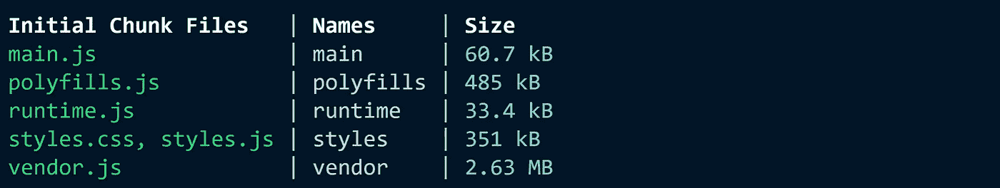

# Angular 11 出来了！快速了解 it 中的新内容

> 原文：<https://levelup.gitconnected.com/angular-11-is-out-a-quick-trip-to-new-things-in-it-fee274dc37c7>

## 关于 Angular 11 你需要知道什么


本文旨在让您快速全面地了解 Angular 11 中的新功能。因此，就你需要知道的重要信息而言，这次旅行将是短暂而丰富的。我们将发现以下新内容:

*   **组件世界**
*   **模块和编译的世界**
*   **CLI 的世界**
*   **已弃用的功能和重大变更**

# 组件的世界

*   调度自定义事件，不能像 change 和 input 一样模拟:`dispatchEvent`方法测试此类事件。
*   通常，右键菜单是打开的，有了 Angular 11，`TestElement`现在可以调度`rightClick`事件。
*   `manualChangeDetection`添加 API，手动禁用自动变更检测。
*   `selectOptions` API 可用于选择本地 select 中的选项。

# 模块和编译的世界

## 惰性装载

在 Angular 11 之前，我们不可能通过模块的出口名来延迟加载模块。现在有了 Angular 11 ( [GitHub](https://github.com/santoshyadavdev/Angular11-demo) ):

## 现在支持 Webpack 5

对于 Webpack 爱好者来说，我们可以使用带*纱*的 Angular 11 中的 Webpack 5。这有点冒险，尤其是在大型企业应用中，因为 Webpack 仍处于试验阶段。

你所需要做的就是配置你的`package.json`并调用:`yarn install`

## Ivy 新功能

如果你一直关注 Angular evolution，你会发现从版本 9 开始，Angular Ivy 就是默认的渲染引擎。

没听说过艾薇？你可以在这里了解更多信息:🔗[棱角分明的常春藤指南](https://angular.io/guide/ivy)。

*   模板内全面的类型检查。详见[模板类型检查](https://angular.io/guide/template-typecheck)。
*   调试相关的小改动，参见 [Ivy 兼容性指南](https://angular.io/guide/ivy-compatibility)。

# CLI 的世界？

## 从库中提取 i18n 令牌的功能

现在可以从 angular 库中提取 i18n 标记。对库使用下面的命令。下面是完成这项工作的命令:

```
***ng xi18n --ivy***
```

## 旋转变压器的发电机

CLI 已经非常有助于提高工作效率和关注代码逻辑。尽管如此，它并不能生成 Angular 应用程序中的所有内容。Angular 11 可以产生旋变保护。这是个好消息。我们只需要使用`***resolver***` 或其快捷键`***r***`就像下面这样:

```
***ng g r/resolver [name]***
```

## 严格模式

Angular 10 有一个标志`--strict`来生成启用了所有严格检查的 Angular 应用程序，现在你会得到一个提示来检查你是否想要启用它。

## 内嵌谷歌字体和图标

谷歌字体和图标将在`index.html`中转换为内嵌。您需要在`build`选项下的`angular.json`中设置如下标志。

这个选项需要互联网。所以，如果你不确定是否有联系。最好考虑通过更改字体标志来禁用此优化:

## HMR(热模块重新加载)

终于到了。此功能现在可用于 Angular 11。热模块更换(或 HMR)是 Webpack 提供的最有用的功能之一。它允许在运行时更新所有类型的模块，而不需要完全刷新。下面是它的使用方法:

```
***ng serve ---hmr***
```

## 漂亮的构建输出

更清晰易读(也更漂亮，我就是喜欢❤.谢谢 Angular 的团队)。



# 弃用的功能和重大变更

## 途径

*   `[routerLink](https://angular.io/api/router/RouterLink)`现在接受`undefined`输入
*   `[NavigationExtras](https://angular.io/api/router/NavigationExtras)#preserveQueryParams`已从`@angular/router`中移除。

## 管道

*   许多角形内置管道的类型已经缩小或扩大，以便更加精确。
*   切片管道现在为未定义的输入值返回 null。
*   `date`和`number`管道的类型是固定的，输入中不再有任何类型。
*   `[DatePipe](https://angular.io/api/common/DatePipe)`不再向上舍入毫秒数。
*   `async`如果您在模板更改为 null 中明确检查未定义的值，pipe 将不再返回 null 作为未定义输入的值。
*   `lowercase`不接受任何虚假值，如 0 或 false。你会得到一个异常。

## 浏览器支持

删除了对 IE 9、10 和 IE mobile 的支持。它们在 Angular 10 版本中已被弃用。

## 形式

`@angular/forms`包中的指令曾经在构造函数中将`any[]`作为验证器和 asyncValidators 参数的类型。现在，这些参数被正确地输入了。因此，改进验证器和异步验证器的类型。

## CollectionChangeRecord 已被否决

如果您正在使用 [CollectionChangeRecord](https://angular.io/api/core/CollectionChangeRecord) ，请开始使用 [IterableChangeRecord](https://angular.io/api/core/IterableChangeRecord) ，因为之前它已被弃用。

## Typescript 3.9

Angular 11 将支持 Typescript 4.0，因此不再支持 3.9 版本。

## 单元测试

*   为了避免与原生 JavaScript `[async](https://angular.io/api/common/AsyncPipe)`语法混淆，来自`@angular/core/testing`的`[async](https://angular.io/api/common/AsyncPipe)`函数被重命名为`[waitForAsync](https://angular.io/api/core/testing/waitForAsync)`。
*   在初始化测试床之前调用`overrideProvider`现在会抛出一个错误。

## 网络工作者

*   `@angular/platform-webworker`已被删除，不再受支持。

# 💼外卖

*   Angular 11 关注的是类型安全
*   改进所有管道的类型以避免运行时的错误
*   如果你因为没有找到期待的特性而感到失望，看看[路线图🔗也许正在进行中😉](https://angular.io/guide/roadmap)

亲爱的读者朋友们，感谢你们的支持和宝贵时间。我希望这对你有用和有帮助。

**关注我上** [**中**](https://medium.com/@famzil/) **，** [**领英**](https://www.linkedin.com/in/fatima-amzil-9031ba95/) **，** [**脸书**](https://www.facebook.com/The-Front-End-World) **，以及** [**推特**](https://twitter.com/FatimaAMZIL9) **获取更多文章。**

**后会有期(ﾉ◕ヮ◕)ﾉ*:･ﾟ✧**

**FAM**