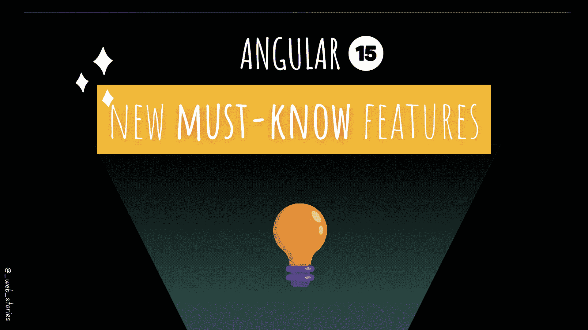
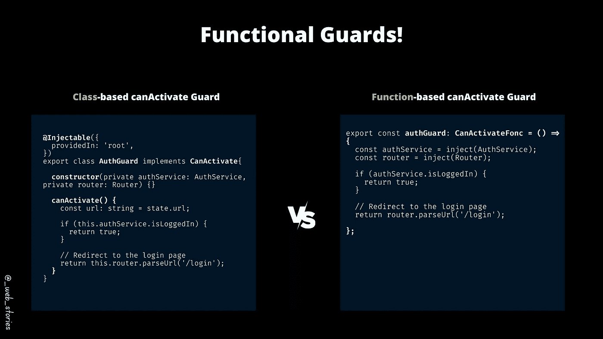
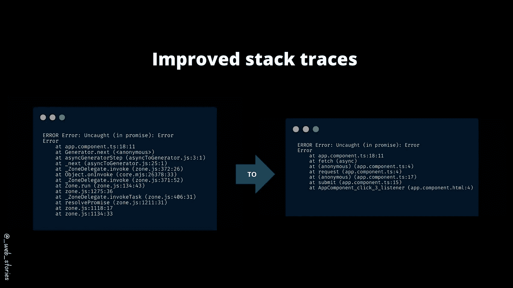
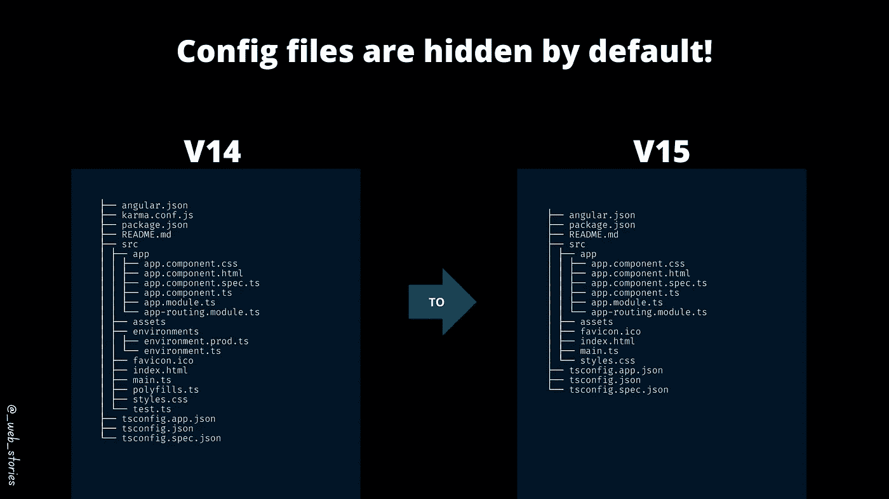

# Angular 15 个新的必备功能！

> 原文：<https://levelup.gitconnected.com/angular-15-new-must-know-features-ae392a2baf2d>

## Angular 15 出了，有什么新的？

作者:FAM

## 你好👋

Angular v15 出来了，这个新版本带来了很棒的功能！以下是我最喜欢的几个。

## 1-功能路由器防护装置

这真是一场革命！相信我，你会喜欢它，我认为这可能会使基于组件的警卫在未来消失。它快速、简单，样板文件较少:

作者:FAM

## 2-改进的堆栈跟踪

我之前也谈到过这个与 Chrome 团队合作开发的非常棒的功能。阅读错误现在容易多了:

作者:FAM

更多信息:

 [## Angular 中的顶级新功能

### [👀VV] —有棱角的开发者不要错过！

levelup.gitconnected.com](/top-new-features-in-angular-f310b7aff36a) 

## 3-独立组件稳定

最后，独立组件特性脱离了“开发者预览”模式！我已经谈到了这个令人兴奋的特性，它将改变我们创建组件的方式，并为新的 Angular 初级开发人员简化它。如果你想读我的文章:

 [## 不使用 AppModule 引导 Angular 应用程序的 3 个步骤

### 引导独立组件

medium.com](https://medium.com/geekculture/3-steps-to-bootstrap-an-angular-app-without-appmodule-4985b49127ef) 

我们还不能用 Angular CLI 创建一个独立的应用程序，但 Angular 团队正在努力，以便在未来通过一个命令`ng new app **--standalone**`就可以实现这一奇迹。

## 4-默认情况下隐藏 CLI 配置文件

最后一个是 CLI 配置文件:

*   。browserslistrc
*   polyfills.ts
*   测试. ts
*   karma.config.js
*   环境. ts
*   环境产品

这些文件不再生成，Angular 让你负责配置它们。例如，如果您需要任何聚合填充，您需要自己添加。

如果你想知道为什么这个决定，那是因为 Angular 发现大多数 Angular 开发者既不打开也不改变这些文件。如果你想知道更多关于这一点的细节，这里是 Angular 团队关于这个问题的回答:[这里](https://youtu.be/j2_NnV7nU6s?t=1667)。

我真的不喜欢这样，因为新的 Angular 开发人员不知道如何配置东西，可能会造成很大的混乱以及不均匀的代码，每个人都会创建 conf 文件，并根据自己的意愿命名它，…但我在本文中添加了这一点，因为了解 Angular v15 是非常重要的信息。

作者:FAM

与 Angular 团队一起参加 18 日星期五的发布活动！

今天到此为止，再见🙋

如果您有任何问题或反馈，请点击评论或通过 LinkedIn 联系我— **我洗耳恭听！**

[**想请我喝杯咖啡吗？☕️**](https://www.buymeacoffee.com/fatimaamzil)

> 让我们为 2022 年打造一个更好的‘我们’！

## 了解有关 2022 年网络快车计划的更多信息:

I- [VI- Web 性能](https://medium.com/geekculture/2022-web-program-chapter-n-1-is-done-499fb0707220#e71b)

[七-工具](https://famzil.medium.com/6-essential-frontend-tools-a95995f85eee?source=your_stories_page-------------------------------------)

## VIII-角形

*   [路线图…](https://famzil.medium.com/angular-stories-the-opening-c44d6341e8f3)

 [## 2022 网络计划启动！

### 改变来自心态和习惯

medium.com](https://medium.com/geekculture/2022-web-program-is-launched-f38a3280af1a) 

与想成为 web 开发人员的人分享该程序！这将有助于保持进步，并在旅途中互相帮助。

*如果你喜欢我的文章，* [***订阅***](https://famzil.medium.com/subscribe) *获取我的最新文章。如果你自己喜欢体验媒介，可以考虑通过**[***报名会员***](https://famzil.medium.com/membership) *来支持我和其他成千上万的作家。它每月只需花费***5 美元，它支持我们，作家，你也有机会用你的作品* *赚钱。当然，你可以随时取消会员资格。通过报名* [*这个环节*](https://famzil.medium.com/membership) *，你直接用你的一部分费用来支持我，不会多花你多少钱。如果你这样做了，万分感谢！***

**让我们在 [**上**取得联系****](https://medium.com/@famzil/)**[**Linkedin**](https://www.linkedin.com/in/fatima-amzil-9031ba95/)**[**脸书**](https://www.facebook.com/The-Front-End-World)**[**insta gram**](https://www.instagram.com/the_frontend_world/)**[**YouTube**](https://www.youtube.com/channel/UCaxr-f9r6P1u7Y7SKFHi12g)**或************

******** [## 通过我的推荐链接——FAM 加入 Medium

### 作为一个媒体会员，你的会员费的一部分会给你阅读的作家，你可以完全接触到每一个故事…

famzil.medium.com](https://famzil.medium.com/membership)********