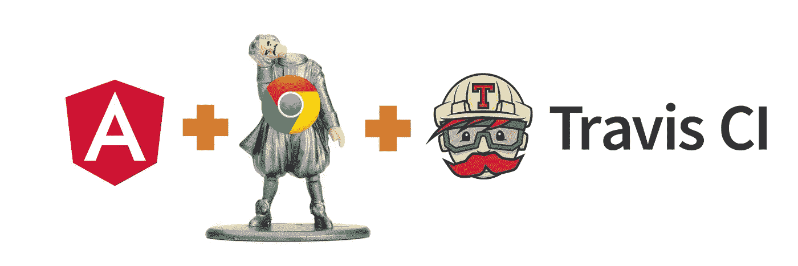

# 棱角分明的 6 + Travis CI，带无头镀铬装饰

> 原文：<https://levelup.gitconnected.com/angular-6-travis-ci-with-headless-chrome-58fab1b394e1>

## 使用 Travis CI 实现 CI/CD 和 Angular 应用的自动化测试



测试在应用程序开发中起着重要的作用，自动化测试使开发人员更有效率，并提供经过测试的功能。

默认情况下，Angular 附带了 [Jasmine 测试框架](https://jasmine.github.io/)，当使用 Angular CLI 生成原理图时，它会自动生成规格文件

```
> ng generate <schematic goes here>
```

一旦我们的代码被推送，建立一个自动化的管道来测试我们的代码，对帮助我们的代码更好地运行大有帮助。在本文中，我将展示如何使用 [Travis](https://travis-ci.org/) 为 angular 应用程序设置 CI/CD 管道。

## 设置您的项目

首先，我们使用 [Angular CLI](https://github.com/angular/angular-cli/wiki) 创建我们的项目

```
ng new angular-with-ci-cd
```

一旦我们使用`angular-cli`生成项目，我们将得到一个默认的`package.json`,其脚本如下所示

现在，您可以在本地运行以下代码:
1。`> ng lint`皮棉格子-
2。单元测试-`> ng test`-
3。端到端测试- `> ng e2e`

## **持续集成(CI)**

现在我们需要使用 [Travis](https://travis-ci.org) 来配置我们的 CI 设置。向根存储库添加一个包含以下内容的`.travis.yml`文件。在大多数情况下，这就是我们[所需要的](https://medium.com/@getprabuk/58fab1b394e1#55d5)。

初始 Travis 配置文件

但是当我们推送我们的代码时，尽管在我们的本地运行相同的测试正确地解决了问题，但是我们的 CI 并不总是很好。

## **定影单元测试**

在 CI 中以这种方式运行单元测试的问题是:

1.  默认情况下，它在[监视模式](https://medium.com/@getprabuk/58fab1b394e1#5a1f)下运行
2.  它使用普通的 chrome 浏览器来运行测试，而不是无头浏览器。

这可以通过在运行单元测试时关闭观察模式并使用无头浏览器作为配置来减轻。我们可以通过将命令行选项传递给 test 来实现这一点

```
 ng test -watch false -browsers ChromeHeadless
```

## **固定 E2E 测试**

当使用`ng e2e`在 CI 中运行 E2E 测试时，我们遇到了一个错误`unknown error: Chrome failed to start: exited abnormally`。这是因为我们再次尝试使用普通浏览器而不是无头浏览器。
这可以通过修改我们的 E2E 测试配置文件`e2e/protractor.conf.js`中的功能选项来配置[量角器](http://www.protractortest.org/#/)使用无头浏览器来解决。

但是这样做会使我们的E2E 测试到 ***总是以无头模式*** 运行，这不是我们想要的。我们只希望我们的配置项在 headless 模式下运行，而不是在本地模式下运行。这有点难以实现，不像[单元测试](https://medium.com/@getprabuk/58fab1b394e1#a5c2)那么简单。为此，不要修改原始的量角器配置文件，而是创建一个副本(我们称之为`e2e/ci.protractor.conf.js`)并修改新创建的文件，使其包含以下内容。

CI 的量角器配置

要在 CI 中运行时使用此配置文件，请使用`ng e2e --protractor-config='e2e/ci.protractor.conf.js'`命令。travis 配置文件中的脚本现在将变成:

一旦我们推动这一变革，我们可以在 Travis 看到一条[绿色管道](https://travis-ci.org/lovubuntu/angular-with-ci-cd/builds/480298158#)。万岁！

## **重构时间**

我们可以将脚本移动到我们的`package.json`,而不是直接通过 travis 配置文件传递上述选项，因为这将保持不变，而不管 CI 提供者是谁。此外，我们还可以包含一个运行所有测试(Lint、单元和 E2E 测试)的脚本`all_tests`，它可以用于预提交/预推送 [hooks⁴](https://medium.com/@getprabuk/58fab1b394e1#5611) 。这确保了进入共享存储库的所有代码都符合标准。

重构的 package.json

重构 Travis 文件的脚本以及新创建的脚本

更新的 travis 脚本

让我们通过将此更改推送到我们的遥控器来确保我们没有破坏构建过程中的任何东西。现在我们等它变绿… tada！！

[](https://travis-ci.org/lovubuntu/angular-with-ci-cd/builds/480302346)

重构配置项配置后构建状态

## **持续部署(CD)**

看到我们所有的测试都通过是一回事，但是当我们看到我们的改变被部署时，我们会得到完全的满足。毕竟，这是我们努力工作的目的。现在我们已经完成了 CI 流程，是时候部署我们的变革了。

我将它部署到 [*github 页面*](https://pages.github.com) ，但是你可以从 Travis 部署到任何[支持的提供商](https://docs.travis-ci.com/user/deployment/)。

一旦上述内容被推送，它会在每次将提交推送到 [master⁵](https://medium.com/@getprabuk/58fab1b394e1#de8e) 时自动部署应用程序。部署的应用程序可以在[这里](https://lovubuntu.github.io/angular-with-ci-cd/)查看。

完整的代码可以在 [github](https://github.com/lovubuntu/angular-with-ci-cd) 中找到。享受编码😌

*脚注:*

1.  如果你想定制你的版本，你最好看看这里。 [[*]](https://medium.com/@getprabuk/58fab1b394e1#e53e)
2.  观察模式将等待并检查任何文件更改，一旦检测到更改，它将重新运行所有测试，并且 ***将再次等待*** 进行下一次更改。它在开发中工作得非常好，但是如果它发生在 CI 中，那么它将认为测试仍然在运行，并且将永远等待。所以那里应该关了。 [[*]](https://medium.com/@getprabuk/58fab1b394e1#8cae)
3.  [量角器](http://www.protractortest.org/#/)和`ng e2e`有一组不同的命令行参数。 [[*]](https://medium.com/@getprabuk/58fab1b394e1#1ca6)
4.  添加一个 git 钩子来运行`all_tests`将防止我们在构建中引入错误的提交。在推送之前手动运行测试是一个好习惯，但是在你养成这个习惯之前 [git 钩子](https://githooks.com)会派上用场😉。 [[*]](https://medium.com/@getprabuk/58fab1b394e1#3dc6)
5.  如果您不想在每次提交时都进行部署，那么创建一个单独的分支(例如`prod`分支)并在 travis 配置中使用它作为您的部署分支。在主分支中开发特性，一旦完成特性，就将其合并到生产分支中。通过这种方式，您可以控制您的特性部署，同时仍然继续测试尚未部署的特性。 [[*]](https://medium.com/@getprabuk/58fab1b394e1#bf29)

[](https://levelup.gitconnected.com)[](https://gitconnected.com/learn/angular) [## 学习角度-最佳角度教程(2019) | gitconnected

### 47 大角度教程。课程由开发人员提交并投票，使您能够找到最佳角度…

gitconnected.com](https://gitconnected.com/learn/angular)