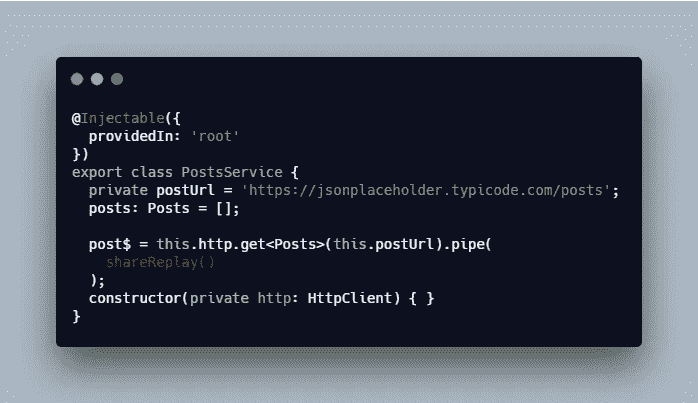

# Angular 和 RxJS 模式—使用反应式编程在 Angular 应用程序中编写和管理数据

> 原文：<https://levelup.gitconnected.com/angular-and-rxjs-patterns-use-reactive-programming-to-compose-and-manage-data-in-angular-apps-2e0c4ce7a39c>

## 有角的

## 使用 RxJS 构建可组合数据流、获取数据、处理用户交互和缓存 API 响应的指南

照片由[卫莱·鲁斯凯尔](https://unsplash.com/@lexir703?utm_source=unsplash&utm_medium=referral&utm_content=creditCopyText)在 [Unsplash](https://unsplash.com/s/photos/coffee?utm_source=unsplash&utm_medium=referral&utm_content=creditCopyText) 上拍摄

在 Angular 应用中，我们经常使用反应式编程，并且我们能够在不需要全局状态管理库的情况下开发应用。以下技术可以扩展到一般的真实使用案例:

1.  [CheckOnce(按需)。](/rxjs-subjects-explained-with-examples-78ae7b9edfc#OnPush</code>将策略设置为<code class=)
2.  [`ChangeDetectionStrategy#Default`将策略设置为`CheckAlways`。](/rxjs-subjects-explained-with-examples-78ae7b9edfc#OnPush</code>将策略设置为<code class=)

[我们使用`OnPush`,因为它通过最小化变更检测周期来提高性能。](/rxjs-subjects-explained-with-examples-78ae7b9edfc#OnPush</code>将策略设置为<code class=)

[使用`OnPush`，仅在以下情况下检查组件的变化:](/rxjs-subjects-explained-with-examples-78ae7b9edfc#OnPush</code>将策略设置为<code class=)

1.  [`@Input`属性发生变化。](/rxjs-subjects-explained-with-examples-78ae7b9edfc#OnPush</code>将策略设置为<code class=)
2.  [发出一个事件](/rxjs-subjects-explained-with-examples-78ae7b9edfc#OnPush</code>将策略设置为<code class=)
3.  [一个可观测的发射](/rxjs-subjects-explained-with-examples-78ae7b9edfc#OnPush</code>将策略设置为<code class=)

[最后我们在模板中使用`async`管道:](/rxjs-subjects-explained-with-examples-78ae7b9edfc#OnPush</code>将策略设置为<code class=)

[AppComponent 模板](/rxjs-subjects-explained-with-examples-78ae7b9edfc#OnPush</code>将策略设置为<code class=)

[注意`async`管道非常强大，因为它会在组件被销毁时自动删除订阅。](/rxjs-subjects-explained-with-examples-78ae7b9edfc#OnPush</code>将策略设置为<code class=)

# [撰写数据](/rxjs-subjects-explained-with-examples-78ae7b9edfc#OnPush</code>将策略设置为<code class=)

[对于反应式编程的初学者来说，这个概念很奇怪。你可以认为这类似于在函数式编程中在 React 或`compose`中组合](/rxjs-subjects-explained-with-examples-78ae7b9edfc#OnPush</code>将策略设置为<code class=)[高阶组件。](/understanding-react-higher-order-components-by-example-95e8c47c8006?source=friends_link&sk=bca6849417321a91c7fa313962b41ad7)

我将把两个流组合在一起获取数据。所以从`/users`我有基本的用户信息，从`/posts`我可以得到所有的帖子。然后根据`userId`我可以确定作者的帖子。

我将创建一个带有用户信息的响应，其属性为`posts`，包含属于该特定用户的所有帖子。

我创建一个`PostsService`。

获取帖子数据的 PostsService

接下来，我将这个服务注入到`UsersService`。

将 PostsService 注入 UsersService

你可以从上面的代码中看到，我使用`combineLatest`将来自`PostsService`的`user$`和`post$`组合在一起。然后我使用`pipe`和`map`将来自两个流的数据合并成一个。

因此，我将拥有用户信息和一个`posts`属性。

最后我把它加到`AppComponent`里。

将 userWithPost$添加到 AppComponent

# 处理用户交互

在这一节中，我将展示如何简单地通过在 Angular 中使用 RxJS 来处理用户交互。

以下是步骤:

1.  创建一个动作流。
2.  组合动作和数据流。
3.  每次动作发生时发出一个值。

将操作流添加到 UsersService

你可以使用`Subject`或`BehaviorSubject`来创建一个动作流。在代码示例中，我使用`Subject`创建`userSelectedAction`，并将其设置为`private`。

然后我通过`combineLatest`将动作流和数据流结合在一起，也就是`selectedUser$`。

最后，我创建了一个名为`changedSelectedUser(id)`的方法，在每次动作发生时发出新的用户 ID。

现在您可以在`AppComponent`上看到新的变化:

AppComponent 的新更新

这里有一个演示:

rxjs 演示处理用户点击

# 缓存来自 API 请求的数据

在这一节中，我将演示一种从 API 缓存数据的简单方法。

这是我见过的许多开发人员用来缓存数据的模式。

将数据存储在公共变量中

这有一个问题，我们会在流中失去。

我更喜欢使用`shareReplay()`:

使用 shareReplay 进行缓存

我使用`shareReplay`有三个原因:

1.  它与所有订户共享一个可观测值。
2.  它在订阅时重放指定数量的条目。
3.  即使当前没有订户，它也会保持活动状态。

注意，当您有副作用或者您不希望在多个订户之间执行的昂贵计算时，您通常希望使用`shareReplay`。

# 摘要

总而言之，在 Angular 中我们可以应用 RxJS 做几乎所有的事情，这些反应式编程技术可以让你的应用更简单。

我们可以在没有`subscribe`的情况下获取数据，生成可组合的流，创建一种有效的方式来处理用户动作，并无缝地缓存我们的 API 响应数据。

我们还了解到，我们可以使用`OnPush`来提升应用程序的性能。

我希望这篇文章对你有用！可以跟着我上[媒](https://medium.com/@transonhoang)。我也在推特上。欢迎在下面的评论中留下任何问题。我很乐意帮忙！

点击此处查看源代码示例:

 [## 数据合成堆栈

### 导出到 Angular CLI 的 Angular 应用程序的启动项目

stackblitz.com](https://stackblitz.com/edit/data-composition?embed=1&file=src/app/services/users.service.ts)  [## 故事-更好的全栈

### 关于 JavaScript、Python 和 Wordpress 的有用文章，有助于开发人员减少开发时间并提高…

betterfullstack.com](https://betterfullstack.com/stories/)