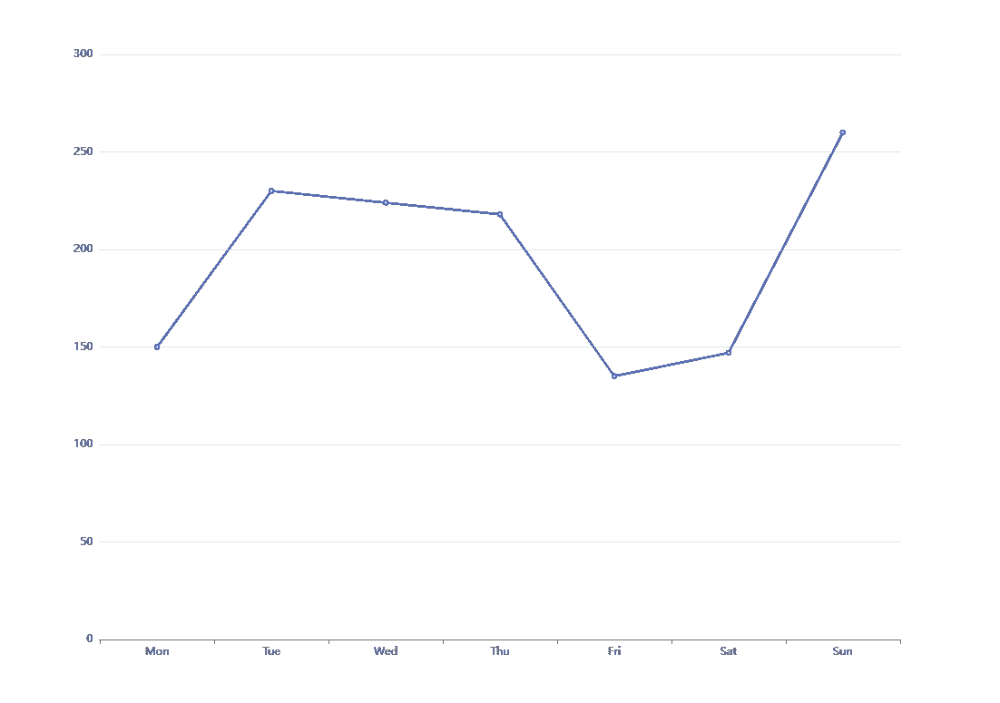

# 角度——制图正确

> 原文：<https://levelup.gitconnected.com/angular-charting-done-right-2564dc52027f>

## 使用可重复使用的图表组件可视化您的数据

当处理大量数据或分析数据时，图表是一种以简单而全面的方式呈现数据的流行技术。在本文中，我将通过一个简单的演示向您展示如何将图表集成到 Angular 应用程序中。对于这个演示，我使用了 [ngx-echarts](https://xieziyu.github.io/ngx-echarts/#/welcome) ，这是一个流行的库，您可以在其中创建各种图表。


照片由 [Olga Tutunaru](https://unsplash.com/@adeolueletu?utm_source=medium&utm_medium=referral) 在 [Unsplash](https://unsplash.com/?utm_source=medium&utm_medium=referral) 上拍摄

让我们开门见山吧。要将 ngx-echarts 添加到您的应用程序中，只需运行以下命令:

```
npm install echarts
npm install ngx-echarts

# or if you use yarn
yarn add echarts
yarn add ngx-echarts
```

将`NgxEchartsModule`导入任何模块(如共享模块)后，您可以开始制图。

因为我们希望有一个可重用的组件来创建我们的图表，所以我们需要设置一个简单的视图组件，它有一些输入来配置图表，如果需要的话，还有一些事件的输出，比如单击图表。

首先，我们通过 Angular [CLI](https://angular.io/cli) 生成一个新组件:

`ng generate component my-chart`

让我们从 HTML 开始。在这里，我们只需将`echarts`指令添加到任何 HTML 元素中，例如一个 div 或一个将作为图表容器的 section。此外，我们还传递了图表选项。

组件也很简单。正如我前面提到的，我们想要一个只有输入和输出的可重用视图组件。

为了简单起见，我们只将`options`作为输入，它保存图表的配置，并通过输出发出点击事件。您可以在本文末尾的 StackBlitz 中找到一个更成熟的例子。

这就是我们的视图组件。但是现在让我们看看如何在我们的应用程序中使用这个组件。为了做到这一点，我们需要通过我们的新组件使用`EChartsOption`来生成所需的图。

选项非常广泛，但最简单的例子可能是这样的:

点击[这里](https://echarts.apache.org/en/option.html#title)可以找到`EChartsOption`的完整文档和大量示例。

接下来，我们需要将选项传递给我们的视图组件，从而创建我们的第一个图:

结果将如下所示:



现在你可以自由设计任何你喜欢的图表。查看 StackBlitz 以获得更多示例。

这是一个如何创建可重用组件的小演示。我总是试图让我的视图组件尽可能的简单，并且最好只能通过输入来配置。这样，组件可以在不同的场景中重用。这里，我们只需要一个简单的组件来显示图表，我们可以在应用程序的任何地方使用它。

可重用和可配置组件的另一个例子可以在这里找到:

[](/how-to-create-a-reusable-dynamic-form-component-in-angular-6d4463d254da) [## 如何在 Angular 中创建可重用的动态表单组件

### 因为我们希望保持代码的干燥(不要重复自己)，所以实现可重用的组件对于公共的…

levelup.gitconnected.com](/how-to-create-a-reusable-dynamic-form-component-in-angular-6d4463d254da) 

在 [Medium](https://saackef.com/) 或 [Twitter](https://twitter.com/sw3eks) 上关注我，阅读更多关于 Angular 的内容！