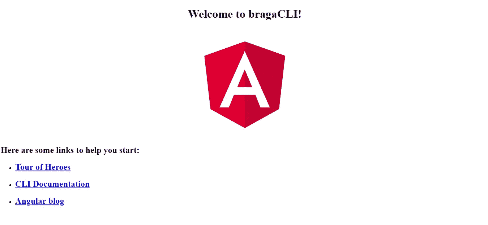

# 角度 CLI —教程

> 原文：<https://levelup.gitconnected.com/angular-cli-tutorial-3bc7ed11fc55>

嘿伙计们。今天，我将向您展示如何使用 Angular CLI 轻松创建新的 Angular 项目。请注意，本文的目的不是教授 Angular，而是通过遵循最佳实践，为您提供一种创建 Angular 项目的简单方法。那么，我们开始吧。😊


首先，我们需要确保我们对 Angular CLI 使用了正确的要求。让我们看看接下来的步骤，以确保我们准备好使用 Angular CLI 创建我们的第一个项目。

# 节点的版本

*   在命令行键入 **node -v** ，您可能会看到类似这样的内容:


*   Angular CLI 目前支持任何版本的 Node 8 或更高版本。如果你的机器上没有节点，你可以在这里安装。

# NPM 版本(节点包管理器)

*   在命令行中键入 **npm -v** ，您可能会看到类似这样的内容:


*   Angular CLI 目前支持任何版本的 npm 5 或更高版本。如果你的机器上没有 npm，你可以在这里安装[或者在命令行输入 **npm install -g npm@latest** 。](https://www.npmjs.com/get-npm)

# **安装角度指示器**

*   **NPM I-g @ angular/CLI****=>**`i`是`install`的别名，`-g`代表全局。这将在您的计算机上全局安装 CLI，这正是我们想要的。该命令将向包管理器发出请求，并在本地下拉 Angular CLI 及其所有依赖项。
*   **ng version = >** 安装成功后，运行此命令。您应该会看到类似如下的响应:


# 生成应用程序

现在我们有了 CLI，让我们生成一个应用程序。创建一个`workspace`文件夹(或任何文件夹名)并使用命令行，`cd`进入该文件夹创建你的应用程序。

```
mkdir workspace && cd workspace
```

*   该命令将创建你的应用程序，其中包含运行 Angular 应用程序所需的一切。我通过调用`ng new bragaCLI`给我的 app 命名为`bragaCLI`。您的项目应该类似于下图:


*   **ng serve -o = >** 构建您的整个项目并自动打开浏览器。这也是我在这篇[文章](https://medium.com/@Braga_28/angular-cli-useful-commands-1023e93b843b)中在 Angular CLI 中介绍的有用命令。使用`ng serve -o` 并在浏览器中打开您的应用程序，您将会看到:



> 请注意，我使用 Visual Studio 代码作为我的文本编辑器，但是您可以选择任何您想要的。就我个人而言，我喜欢 VS 代码😊

**HINT_1:** 如果你想更快地创建你的应用，你可以使用下面的命令:**ng new Braga CLI-skip-install**。这个命令将创建没有`node_modules`的应用程序，这意味着你将跳过`npm install`。

**提示 2:** 我喜欢用一个路由文件来创建我的项目，并为我的 CSS 使用 [SASS](https://sass-lang.com/) 。如果你想在新项目开始时做同样的事情，你可以这样做:**ng new my-app-routing-style scss-dry-run。**

请记住，许多标志可以组合使用。这对于初始化应该存在于整个应用程序中的设置是非常理想的。一些标志改变了`angular.json`文件中的配置。我经常使用的一个命令是`--dry-run`旗。在我生成代码之前，我想确保我首先得到了我想要的东西。所以 **-预演**让你预览你将得到什么，然后一旦我觉得准备好了，我就移除那个标志，这样它就可以实际生成应用程序了。

# 蓝图

我们将生成代码(组件、服务、模块等。)使用这些蓝图。Angular CLI 需要知道我们实际上想要如何创建这些文件。有什么特点，语法是什么样子的？这些是由我们的蓝图定义的。例如:

*   **ng 生成<蓝图>选项>**

我们蓝图的名称，如组件或服务，然后是一些选项，这些选项是可选的，如我们的 **-预演**。例如:

*   **ng 生成组件客户端-模拟运行**或类似我更喜欢的 **ng g c 客户端-d**
*   **ng g s client-data-d****=>***生成服务*

# 成分

是时候用 Angular CLI 创建我们的第一个组件了:

*   **ng g c 客户端风格 scss -d**

注意，我使用了**风格的 scss** 标志，因为我希望我的 css 文件是 [SASS](https://sass-lang.com/) 格式。我还将放置 **-d** 标志(别名为 **-预演**)，这样我们就可以看到它应该为我们做些什么。这将在客户端文件夹中创建 TypeScript、HTML、CSS 和 spec 文件。它更新模块来引用这个新组件。如果您运行此命令，您将看到如下内容:


这就是我们想要的，所以让我们在没有 **-d** 标志的情况下继续进行。运行该命令后，您将在文本编辑器中看到类似如下的内容:


Angular CLI 的另一个优点是，我们可以获得组件所需的所有初始语法。


我们还用这个命令更新了我们的`app.module`。让我们看看`app.module`的内部，看看这是什么意思。


在最后一张图中可以看到， **ClientComponent** 在第 6 行被导入，然后也被声明为第 11 行的一部分。所以这很棒。它不仅引入了组件，而且用 Angular 我们需要在一个`NgModule`中的某个地方声明组件，它为我们做到了。

# 服务

现在让我们生成一个服务。让我们创建一个获取客户信息的服务。因此，我们可以使用我之前向您展示的以下命令:

*   **ng g s 客户端数据**

当我们学习 Angular 时，我们知道必须在应用程序的某个地方提供服务，它正在用**injectible**为我们做这件事。


Angular 6 中较新的特性之一是允许我们用根来指定`providedIn`，所以 Angular 将能够为我们提供这项服务。这意味着你不再需要导入服务并在 **app.module** 中提供它们。

# NgModules

在我谈论 NgModules 之前，我想提醒你，你也可以创建接口、类、指令、管道等等，你可以在这里看到相应的命令。

当我们的应用程序变大时，可能有必要改变我们的架构和思考方式。假设您的应用程序中需要身份验证，这个登录可以是我们应用程序中的一个不同模块。这篇[文章](https://medium.com/@Braga_28/best-practices-in-angular-a8926fa02ae2)展示了一个分离职责的良好实践。也许你需要一个登录界面，组件，服务，这个登录区域可以进入`NgModule`。所以我们可以这样做:

*   **ng g m 登录**

默认情况下，模块将获得它们自己的文件夹，我们可以看到它们都属于登录文件夹。一旦我们创建了模块，我们希望将它导入到`app.module`中，这样它们就可以以一种有意义的方式链接在一起。因此，我们需要添加下面的标志。

*   **ng g m 登录-m 应用模块**

现在我们可以运行它，我们将看到它正在创建登录模块，然后它将更新`app.module`。


我们也可以创建一个类似 **ng g c login/braga** 的组件。现在我们可以在文本编辑器中看到，我们现在有了一个新的`NgModule`，我们的`login.module`。注意，我们在新模块的声明语句中也有我们的`braga`组件，并且该模块也在`app.module`中被导入。


# 结论

希望这篇关于 Angular CLI 的文章能对你有所帮助。请注意，您可以做更多的事情，如创建路线、守卫、构建和服务您的应用程序，甚至使用 CLI 进行测试。我决定让这篇文章专注于设置应用程序的要点，但将来我会发布一些信息，向您展示如何使用 CLI 进行测试和路由，并演示如何生成和发布您自己的库到 [npm](https://www.npmjs.com/) 。敬请期待！

[](https://levelup.gitconnected.com)[](https://gitconnected.com/learn/angular) [## 学习角度-最佳角度教程(2019) | gitconnected

### 前 48 角教程-免费学习角。课程由开发人员提交和投票，使您能够…

gitconnected.com](https://gitconnected.com/learn/angular)