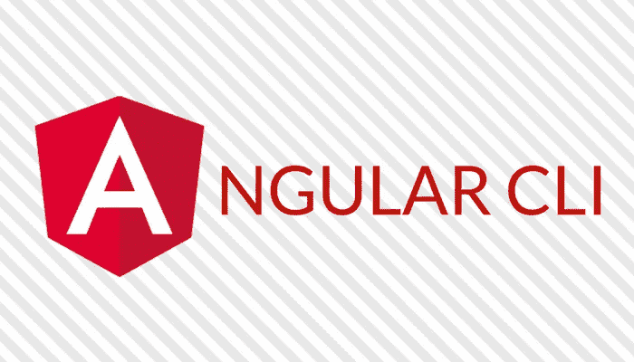

# Angular CLI —有用的命令

> 原文：<https://levelup.gitconnected.com/angular-cli-useful-commands-1023e93b843b>



我今天在这里向你展示一些在使用 [Angular CLI](https://cli.angular.io/) 时有用的命令。我知道你们中的一些人已经熟悉了这些命令中的大部分，但是我认为参考我认为最相关的命令可能是一个好主意，这使您能够在需要时快速找到它们。请注意，本文的目的并不是教授 Angular 或提供关于 Angular CLI 的见解，而是提供一种简单易行的方法来检查您可能需要在项目中使用的命令。那么，我们开始吧。😊

# **创建新项目**

**ng new app-name = >** 生成 angular app 正常运行所需的所有文件。

我们还可以像这样连接命令:

*   **-预演= >** 显示所有可能生成的文件。就当是回滚吧。
*   **- prefix braga = >** 创建带有自定义前缀的项目。例如，通常您的项目在组件级别有别名为 app-component-name 的选择器，对吗？因此，使用这个 CLI 命令，您的选择器将是 braga-component-name。
*   **-routing-style scss =>**将路由文件添加到项目中，并将 css 文件放入 SASS 类型。

# 构建并运行

*   **ng serve = >** 构建您的整个项目。
*   **ng serve-o =>***构建您的整个项目并自动打开浏览器。*
*   ***ng serve -p 666 -o = >** 构建你的整个项目，自动打开浏览器，url 指向端口 666。例如，如果我们需要同时运行两个角度项目，这将非常有用。*
*   ***ng serve - help = >** 给你更多关于 ng serve 的信息。*

# *Tslint*

*   ***ng lint = >** 在项目中运行 tslint 文件，并验证所有代码是否遵守规则。*
*   ***ng lint-format style =>***与 ng lint 相同，但以更整洁的方式格式化输出。**
*   ****ng lint - fix = >** 与 ng lint 相同，但它也试图修复任何错误。**
*   ****ng lint - help = >** 提供更多关于 ng lint 的信息。**

# **创建组件/服务/模型/管道…**

*   ****ng 生成组件 customer = >** 生成“客户”组件，并创建一个名为“客户”的文件夹。**
*   ****ng g c customer = >** 与`ng generate component customer`相同，但使用别名。**
*   ****ng g c customer-flat =>**生成不带文件夹的客户组件。**
*   ****ng g s sales-data = >** 生成服务“销售数据”。**
*   ****ng g cl models/customer =>**在 models 文件夹中生成 customer 类(如果 models 文件夹不存在，CLI 将创建它)。**
*   ****ng g I models/person =>**与`ng g cl models/customer`相同，但用于创建一个`interface`。**
*   ****ng g e models/gender =>**与`ng g cl models/customer`相同，但创建了一个`enumerator`。**
*   ****ng g p shared/init-caps =>**生成共享文件夹内的`pipe`“init-caps”。**
*   ****ng g d 搜索框= >** 生成`directive` *。***

# **降级/升级 CLI**

```
**npm uninstall -g [@angular/cli](http://twitter.com/angular/cli)
npm cache clean
npm install -g [@angular/cli](http://twitter.com/angular/cli)@{*latest or wanted version*}**
```

# **结论**

**我希望这篇关于 CLI 命令的文章对您有所帮助。我经常使用它们，我的想法是分享一些最有用的命令。很快我将创建另一篇文章(初级水平)向你展示如何用所有这些命令创建一个 angular 项目，并且使用你可以在这里找到的最佳实践。**

**提示:默认情况下，使用 CLI 我们会得到所有的规范文件(单元测试)，但是如果出于某种原因，您不希望它们出现在一个或每个文件中，您可以在常规语法后使用以下标志:**

**`ng g c student **--skipTests**`*或* `ng g c student **--spec false**`**

**[](https://levelup.gitconnected.com)****[](https://gitconnected.com/learn/angular) [## 学习角度-最佳角度教程(2019) | gitconnected

### 前 48 角教程-免费学习角。课程由开发人员提交和投票，使您能够…

gitconnected.com](https://gitconnected.com/learn/angular)**