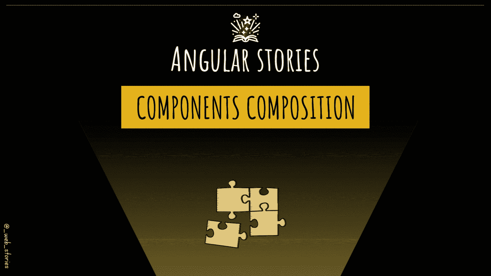
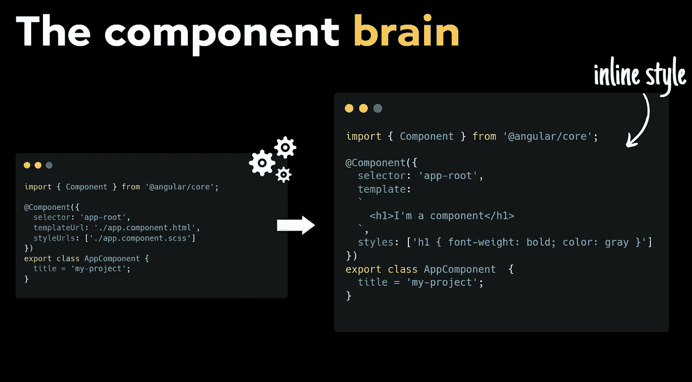
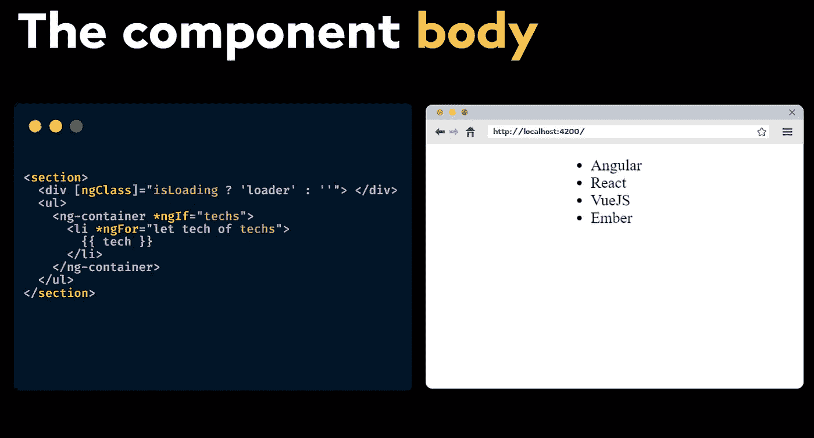
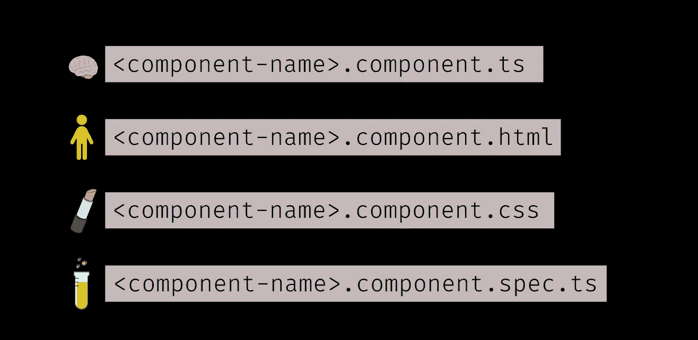

# 角分量成分

> 原文：<https://levelup.gitconnected.com/angular-component-composition-eb292aad1f3d>

[👀VV]—关于任何角度分量的第一个必备知识

作者:FAM

## 你好👋

在开始我们今天的故事之前，我想感谢你成为我新推荐的会员。非常感谢您的信任和支持🙏！

好吧，在最后几集里，我们学到了很多关于 Angular 应用的东西。对于即将播出的剧集，我们将重点关注 Angular app 的最基本组件，即 ***组件*** 。

这一次，我们将学习第一个必须知道的任何角组件，它的组成。

> 如果你是一个视觉型的人，你会在最后找到视频版本👇 😉

# 组件的组成

每个角度分量包括:

*   组成大脑
*   组件主体
*   组件外观(可选)
*   最后，组件测试(可选)

## 1-组成大脑

关于 Angular 中的组件，首先要知道的是，它们只是简单的类，就像您可能在其他语言或框架中创建的任何其他类一样，只是这个类通过添加装饰器 ***@Component*** 和组件配置而成为 Angular 组件。

组件类有两种语法:配置中带有 HTML 和 CSS 文件的标准语法和内联样式语法。

作者:FAM

知道这一点很好。最近 Angular 版本的预览模式中新增了一个语法，就是[**独立组件**](https://angular.io/guide/standalone-components) 。

## 2-组件主体

组件的模板只是组件 HTML，带有 Angular 附带的一些额外功能。例如，使用 Angular 带来的功能，您可以隐藏或显示区块。有条件地显示块，在 HTML 代码中循环列表，转换文本，等等…

作者:FAM

## 3-组件外观

默认情况下，角度仅在构件内部应用构件样式，而不在构件外部应用。您可以使用 Angular[view encapsulation](https://angular.io/api/core/ViewEncapsulation)API 来更改此配置。

您可以用 CSS、 [sass](https://sass-lang.com/) 或 [less](https://lesscss.org/) 编写样式文件，并在@ [Component.styleUrls](https://angular.io/api/core/Component#styleUrls) 元数据中用适当的扩展名指定这些文件。

## 4-组件测试

单元测试在每个 web 应用程序中都是强制性的，因为它们检查你的应用程序是否按预期工作。这里什么也不用做，因为 Angular CLI 已经下载并安装了我们用 **Jasmine** 框架编写测试和用 **Karma** 运行测试所需的一切。

## 命名最佳实践

作者:FAM

# VV 版本😉

作者:FAM

今天到此为止，再见🙋

如果你有任何问题或反馈，请点击评论或通过 LinkedIn 联系我— **我洗耳恭听！**

[**想请我喝杯咖啡吗？☕️**](https://www.buymeacoffee.com/fatimaamzil)

> 让我们为 2022 年打造一个更好的‘我们’！

## 了解有关 2022 年网络快车计划的更多信息:

I- [VI- Web 性能](https://medium.com/geekculture/2022-web-program-chapter-n-1-is-done-499fb0707220#e71b)

[七-工具](https://famzil.medium.com/6-essential-frontend-tools-a95995f85eee?source=your_stories_page-------------------------------------)

## VIII-角形

*   [路线图……](https://famzil.medium.com/angular-stories-the-opening-c44d6341e8f3)

 [## 2022 网络计划启动！

### 改变来自心态和习惯

medium.com](https://medium.com/geekculture/2022-web-program-is-launched-f38a3280af1a) 

与想成为 web 开发人员的人分享该程序！这将有助于保持进步，并在旅途中互相帮助。

*如果你喜欢我的文章，* [***订阅***](https://famzil.medium.com/subscribe) *获取我的最新文章。如果你自己喜欢体验媒介，可以考虑通过**[***报名会员***](https://famzil.medium.com/membership) *来支持我和其他几千个作家。它只花费***每月 5 美元，它支持我们，作家，你也有机会用你的写作* *赚钱* **。当然，你可以随时取消会员资格。通过报名 [*这个链接*](https://famzil.medium.com/membership) *，你直接用你的一部分费用来支持我，不会多花你多少钱。如果你这样做了，万分感谢！*****

**下面我们就**联系一下** [**中**](https://medium.com/@famzil/)**[**Linkedin**](https://www.linkedin.com/in/fatima-amzil-9031ba95/)**[**脸书**](https://www.facebook.com/The-Front-End-World)**[**insta gram**](https://www.instagram.com/the_frontend_world/)**[**YouTube**](https://www.youtube.com/channel/UCaxr-f9r6P1u7Y7SKFHi12g)**********

****** [## 通过我的推荐链接——FAM 加入 Medium

### 作为一个媒体会员，你的会员费的一部分会给你阅读的作家，你可以完全接触到每一个故事…

famzil.medium.com](https://famzil.medium.com/membership)******