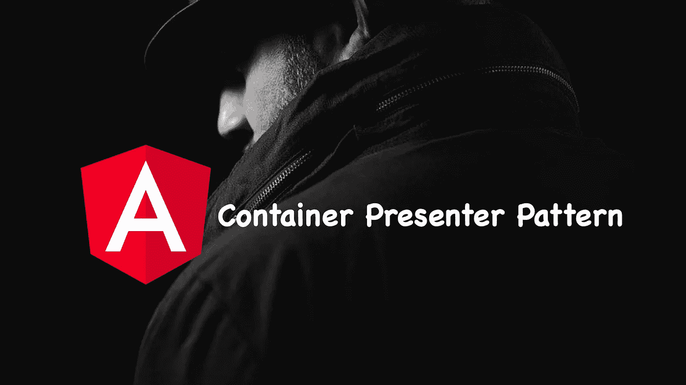
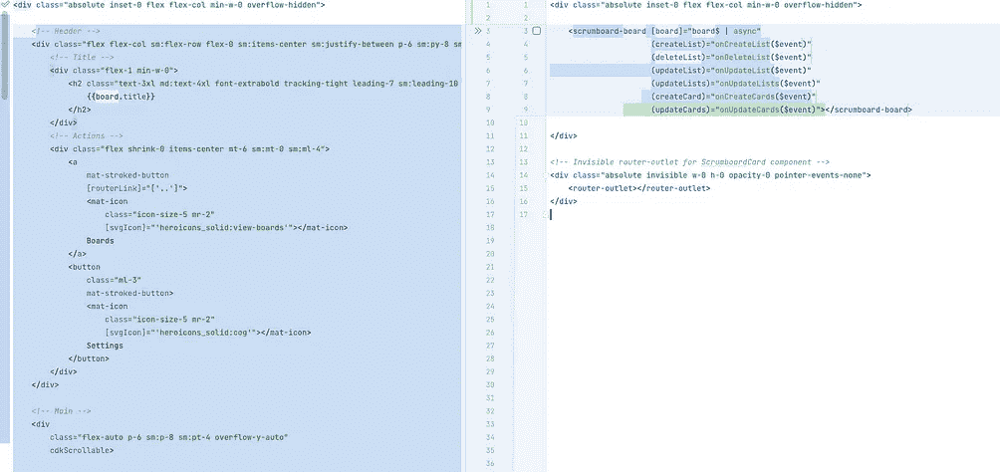
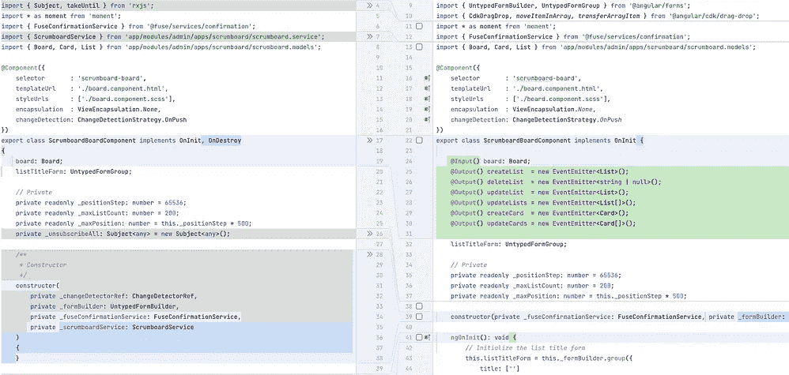
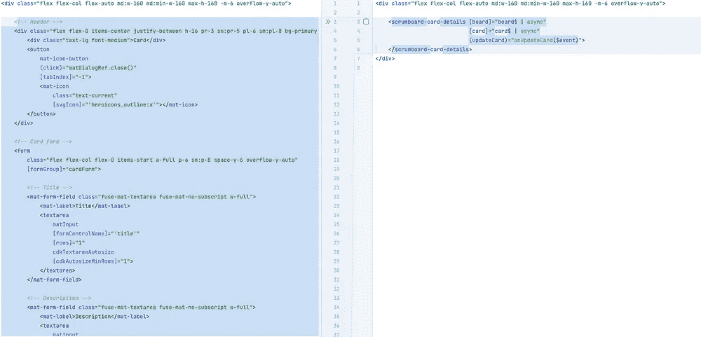
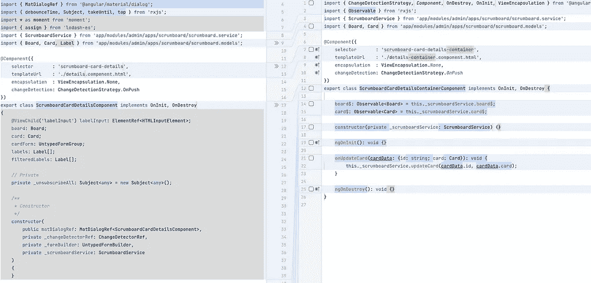

# 角度最佳实践:用案例研究解释容器/演示者模式

> 原文：<https://levelup.gitconnected.com/angular-container-presenter-pattern-a8f27a541802>

## 包含重构技巧的深度指南

图片来自 [Pixabay](https://pixabay.com//?utm_source=link-attribution&utm_medium=referral&utm_campaign=image&utm_content=5821903) (作者编辑)

我是在 2020 年夏天发现并爱上容器/呈现者模式的，然后我开始在我的 Angular 项目中使用它，并获得了非常满意的结果。

我一直在努力克服在我的组件中混合关注的问题，这违反了软件开发的许多原则，并且使得理解和维护源代码变得乏味。

但是使用容器-呈现者模式帮助我通过将组件组织成类别来阐明它们的职责:

*   **容器组件**是智能组件。他们知道如何从政府和服务部门获取数据。它们通过输入和输出与子组件(表示组件)进行通信。
*   **表示组件**负责呈现 UI 并管理与用户的交互。请记住，它们不应该总是被转储。如果您在容器及其子容器之间传递数据时，注意到组件树中有大量的输入&输出，这表明您需要将服务注入到您的叶组件中，以缓解这个被称为*冒泡事件*的问题，并使代码设计更易于维护。

# 赞成的意见

下面是使用该模式的一些好处:

1.  通过将组件拆分成更小的组件来清理代码。
2.  组件之间的职责分离。
3.  更好地理解工作流和组件之间的通信。
4.  您可以使用`async`管道指示 Angular 管理对`Observable`的订阅和取消订阅。
5.  为使用`OnPush`变更检测提供一个更好的基础设施:从 observable 发出并由`async`管道处理的新值将有新的引用→这是处理不变性问题的最佳方式。

# 个案研究

在下面的视频中，我将展示如何通过重构两个组件来应用容器/呈现者模式，这两个组件在开始时都有一些关注点。

*   第一个组件是`ScrumboardCardDetailsComponent`:这是一个在 scrum 板上显示卡片细节的对话框。它还允许更新卡的内容。
*   第二个组件是`ScrumboardBoardComponent`:它代表一个 scrum 板，包含许多列表——像开放列表和进行中列表。每个列表包含一堆卡片。

以下是一些截图，让您对所取得的成果有所了解:

容器/呈现者模式重构之前/之后(作者截图)

[第 1 部分:使用容器呈现模式重构角度组件](https://www.youtube.com/watch?v=9HVGHdEofPI&ab_channel=RakiaBenSassi%7CSoftwareEngineering)

[第 2 部分:使用容器呈现模式重构角度组件](https://www.youtube.com/watch?v=9HVGHdEofPI&ab_channel=RakiaBenSassi%7CSoftwareEngineering)

# 想要更多吗？

*   我为一群聪明、好奇的🧠人写关于工程、技术和领导力的文章💡。[加入我的免费电子邮件简讯，获得独家访问](https://rakiabensassi.substack.com/) 或在此注册 Medium [如果你还没有注册。](https://rakiabensassi.medium.com/membership)
*   **加入 8K+学员**查看我的 Udemy 视频课程:[如何识别、诊断&修复 Web 应用中的内存泄漏](https://www.udemy.com/course/identify-and-fix-javascript-memory-leaks/?couponCode=8F87E5E3936D469E121D)