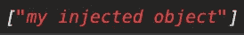

# 角度依赖注入:多提供者

> 原文：<https://levelup.gitconnected.com/angular-dependency-injection-multi-providers-87c55acc4857>


照片由[莎伦·麦卡琴](https://unsplash.com/@sharonmccutcheon?utm_source=unsplash&utm_medium=referral&utm_content=creditCopyText)在 [Unsplash](https://unsplash.com/s/photos/plenty?utm_source=unsplash&utm_medium=referral&utm_content=creditCopyText) 拍摄

Angular 的依赖注入机制使您能够轻松地“插入”外部功能。您不需要自己创建依赖项的实例，而是将这个任务留给依赖项注入机制。在大多数情况下，你不需要考虑太多你的实例以及它们是如何被创建的，Angular 会为我们做好准备。

但是并不是所有的情况都是标准的，Angular 允许您控制何时以及如何实例化和注入您的依赖项。有些选项可能看起来有点神奇和晦涩。在本文中，我们将看到`multi: true`选项。

# 提醒:提供商

如果您熟悉*令牌*和*提供者*的概念，您可以跳过这一节。

当您在一个组件中注入一个依赖项时，您向组件注入器传递一个令牌。当注入一个类(如服务)时，令牌默认为类名:

```
@Component({
  selector: 'app-test', 
  templateUrl: './test.component.html', 
  styleUrls: ['./test.component.scss'],
  providers: [{ provide: TestService, useClass: TestService }],
})
```

provider 对象定义了如何获取与令牌相关联的依赖关系。在上面的例子中，我们告诉 Angular 在请求由令牌`TestService`标识的依赖项时使用类`TestService`。

上面的提供者有点重复，Angular 提供了一个等价的“糖”语法，使它更简洁，您可能更熟悉:

```
@Component({
  selector: 'app-test', 
  templateUrl: './test.component.html', 
  styleUrls: ['./test.component.scss'],
  providers: [TestService]
})
```

> 您可能不会定期在组件中提供服务，前面的两个例子可能对您来说很陌生。在这种情况下，请检查[这篇文章](/angular-interview-question-dependency-injection-3da676906ef9)。

但是依赖注入不限于服务，甚至不限于类。你可以用它来注入任何你喜欢的东西，比如物体。在这种情况下，您必须自己创建令牌。

要了解更多关于注入对象和创建令牌的信息，您可以查看本文。

# 多提供商

当使用提供者时，您可以将可选属性`multi`设置为 true。

这使您可以为单个令牌提供多个值。在前面的例子中，添加`multi: true`选项将改变控制台中记录的内容。我们提供的值是一个字符串，当加载我们的应用程序时，我们只是在控制台中看到一个字符串。使用`multi`选项，我们现在有了一个数组。



我们现在可以为同一个令牌添加第二个提供者。

我们现在可以在控制台的数组中看到两个值`my injected object 1`和`my injected object 2`。从其中一个移除`multi: true`，你会得到一个错误。将它从两者中移除，控制台中就又回到了一个简单的字符串，即您最后提供的值。

# 用例

有一天，您可能会遇到需要对一个令牌使用多个值的情况，但这种情况并不常见。该选项通常与角度内置标记一起使用。

## 挂钩到应用程序的引导

Angular 使您能够在应用程序引导过程的不同步骤之后运行一些代码。为此，您可以使用 Angular 的内置令牌，例如`PLATFORM_INITIALIZER`，并提供您想要运行的代码。您可以使用`multi: true`提供多个 just 初始化器。

## 验证器

这个选项可能最常与`NG_VALIDATOR`标记一起使用。

当你为你的角形创建一个自定义验证器时，你需要注册它，以便能够使用它们。为此，您需要为您的验证器指令提供`NG_VALIDATOR`令牌。您可以定义任意多的定制验证器，因此您需要使用`multi: true`选项。

这个`multi: true`选项非常罕见，因此当它出现在一些有角度的文档中时可能会令人困惑。但是它确实如其名所言:它允许您为一个给定的令牌定义多个值。用例并不明显，您很少需要将它与您自己的令牌一起使用。一般和有角度的内置一起用。