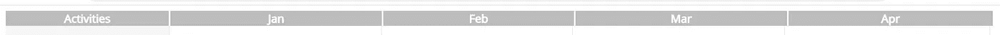

# 使用简单的数学和 CSS 创建甘特图组件

> 原文：<https://levelup.gitconnected.com/angular-gantt-chart-component-using-simple-maths-and-css-1de51fdbaaab>

## 创建一个通用的角度组件，它将事件和里程碑的集合作为输入，并呈现出一个甘特图

在我被设计界诋毁之前，我必须在此声明，我绝不是一名设计师。我也强烈主张使用第三方软件包，只要它们符合要求。

如果你想使用基本的 CSS 原理而不是复杂的 CSS 网格布局或依赖第三方库来生成灵活的甘特图组件，请继续阅读。请记住，本博客中使用的所有代码都是出于演示的目的而从头开始编写的，因此请将此作为指南，而不是在生产代码中逐字使用。Github 资源库的链接可以在本文末尾找到。

因此，警告的方式，让我们进入正题。

# 要求

当我们的团队开发新产品时，出现了一个要求，即构建一个允许用户看到以下内容的功能:

在可预见的未来，重要事件可能会重叠。

每个事件可以跨越几天/几周，也可以是一个时间点(一个里程碑)。

有些事件可能会频繁重复(例如，每月报告义务)。这与标准的甘特图略有不同，因为我们选择在同一行显示这些事件来描述这个场景，如下所示。(不使用第三方软件包的另一个原因。)

所有原始样式和上下文都已更改，删除了任何 IP。

# 概念

# 实施

## 首先，让我们创建一个日期服务来封装我们所有的日期计算。

## 接下来，我们需要一个模型来表示甘特图中的每一行，它将被组件接受为输入。

## 以每月为列构建标题行

创建一个方法，该方法返回包含月份名称和月份持续时间百分比(作为甘特图周期的一部分)的 month 对象模型集合。请注意，在计算两个月之间的天数时，我们需要考虑到周期可能会跨越两年。

**生成月行**

## 生成主事件行

我们只需要两个方法来呈现我们的事件周期——一个用于设置事件元素的宽度，另一个用于在行内正确定位元素。

使用上面的两种方法，我们现在可以迭代甘特图中的每一行，并根据事件持续时间以正确的位置和宽度呈现事件周期。

**创建垂直网格线**

每月创建一个元素，高度设置为甘特图容器的 100%，边框向右。

## 最终视图

# 摘要

如果你能走到这一步，我还没有把你烦死，这是个好消息。希望这对于任何在互联网上寻找创建简单甘特图的方法的人都是有用的，和我的团队有相似的需求。现在，虽然我在这个例子中使用了 angular，但是没有什么可以阻止你用普通的 Javascript 和 HTML 来实现它。

如果你在寻找更复杂的东西，比如不同事件或分组事件之间的依赖线，我推荐使用第三方库，比如 Kendo UI，它也是一个很棒的库，可以用于各种很棒的组件(需要许可证)。

这篇博文的所有代码都可以在下面找到。我期待听到您对此实现的反馈/改进。

 [## 简单甘特图

### 此项目是使用 Angular CLI 版本 10.2.0 生成的。允许您显示甘特图的角度控件…

github.com](https://github.com/amay5027/simple-gantt-chart)