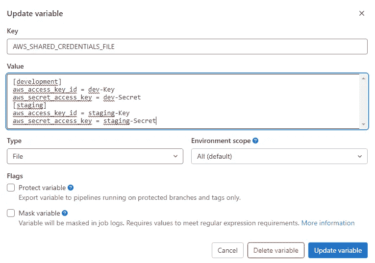

# Angular —带 AWS S3 的 GitLab 管道

> 原文：<https://levelup.gitconnected.com/angular-gitlab-pipeline-with-aws-s3-9e4ae887ff2b>

## 设计您自己的管道，将工件直接交付到您的 AWS 环境中。

在 [Unsplash](https://unsplash.com/?utm_source=medium&utm_medium=referral) 上由 [Selim Arda](https://unsplash.com/@selimarda?utm_source=medium&utm_medium=referral) 拍摄的照片

使用像 Git 这样的版本控制被认为是一种很好的实践。Git 存储库有助于将代码保存在一个中心位置，并有助于在同一个代码库上与多个开发人员合作。此外，它使您能够为提交到存储库中的变更建立一个自动化的部署。在本文中，我将简要解释持续集成和部署(CI/CD)的概念，并通过展示如何使用 GitLab 管道将 Angular 应用程序部署到亚马逊 S3 来演示这一过程。

## 连续累计

当使用 Git 存储库(例如 GitLab)时，您可以设置脚本，在每次有人向存储库推送更改时自动构建和测试您的应用程序。这有助于确保高质量并避免应用程序中的错误。

这种实践被称为[持续集成](https://en.wikipedia.org/wiki/Continuous_integration)。提交给应用程序的每个变更都是自动地、持续地构建和测试的。该过程验证所有测试是否成功完成，并确保遵守您为应用程序设置的任何策略和标准。

## 持续部署

[持续部署](https://en.wikipedia.org/wiki/Continuous_deployment)扩展持续集成。使用这种方法，应用程序将在成功集成后自动部署，无需人工干预。

## GitLab CI/CD

在本文中，我们将使用 GitLab 创建一个 CI/CD 管道，Git lab 是一个流行的 Git 存储库，它提供了很好的工具来将管道完全集成到您的项目中，而不需要外部服务。

要为 GitLab 项目定义管道，您需要做的就是创建一个 [gitlab-ci.yml](https://docs.gitlab.com/ee/ci/yaml/) 文件。在这个文件中，定义了管道的各个步骤。但是，在我们深入讨论这个细节之前，让我们先来看看我们将在本文中创建的最终管道:

该示例将包括以下四个阶段，

*   **依赖关系** —在此阶段，管道将运行 npm install 并缓存 node_modules 以在阶段之间共享。
*   **质量** — 覆盖单元测试和此阶段角度应用的皮棉。
*   **组装** —构建用于生产的 angular 应用程序，并将 dist/folder 内容标记为最终发布的工件。
*   **部署**——将最终的神器转移到 AWS S3

*当然，这只是一个基本的例子，您应该根据自己的需求改进您的管道。*

# 管道

让我们开始创建新的渠道。我们将经历上面提到的四个阶段。要定义阶段，只需将以下内容添加到 gitlab-ci.yml 文件中:

每个阶段可以包含任意数量的作业来执行命令。

## 依赖阶段

好的，因为我们没有将 node_modules 文件夹提交到我们的 git 存储库，所以我们使用第一个阶段通过 npm install 来安装模块。我们可以为该阶段定义一个作业，如下所示:

首先，我们设置想要使用的**图像**。在这种情况下，我们需要 [Node.js](https://nodejs.org/en/) 来运行 npm 命令。只需从 [Docker Hub](https://hub.docker.com/_/node) 中选择一个，它将从 gitlab runner 机器中动态分配。我们以**节点:18-阿尔卑斯山**图像为例。

接下来，我们指定应该执行该步骤的**阶段**。

之后，我们使用**脚本**来指定跑步者要执行的命令。这是每个工作的必需关键字。这个任务的命令是`npm ci`，它类似于`npm install`，除了它意味着在自动化环境中使用，比如测试平台、持续集成和部署，在这些环境中，您想要确保您正在对您的依赖项进行干净的安装。

最后，我们添加了**缓存**关键字来将 node_modules 保存在缓存中，然后只在 package-lock.json 文件发生变化时重新创建它。

## 质量阶段

接下来是分析代码库的阶段。这里，我们将为此定义两个作业。一方面，执行应用程序的单元测试，另一方面，检查林挺规则。此外，还可以在此添加 SonarQube 扫描作业。

让我们首先看看单元测试的工作:

我们使用与之前相同的**图像**并再次定义**阶段**。然后，我们有了这个作业的新关键字— **需求**，我们可以用它来表达依赖关系。在这种情况下，该作业应该在成功的**安装**作业之后运行。

之后，我们指定运行测试所需的命令。

为了共享前期设置的缓存 node_modules，我们再次添加了**缓存**关键字。但是，这一次将策略设置为“拉”，因为我们只想下载缓存的文件。

现在我们来看看棉绒。在这里，我们可以验证为我们的项目定义的林挺规则。作业的设置与测试基本相同:

## 组装阶段

在这个阶段，我们构建我们的应用程序并生成/dist 文件夹。将以下内容添加到 gitlab-ci.yml 中:

同样，这个任务与前面的任务非常相似，我们只是运行一个不同的命令。这次是`npm run build`，它执行 package.json 中定义的构建脚本。

然而，最后阶段更有趣一些。

## 部署阶段

正如开始提到的，我们希望将应用程序部署到 AWS。但是，本文并不涉及配置 AWS 服务(如 S3 ),而是只关注现有 AWS 基础设施的部署。

在开始管道作业之前，我们需要将 AWS 访问键存储在 GitLab CI/CD 变量中。在 GitLab 项目中打开“设置”>“CI/CD”>“变量”,并添加以下变量:

*   AWS_ACCESS_KEY_ID:添加 IAM 用户的访问密钥 ID
*   AWS_SECRET_ACCESS_KEY:添加 IAM 用户的秘密访问密钥

你可以在这里阅读更多信息[。](https://docs.gitlab.com/ee/ci/cloud_deployment/#authenticate-gitlab-with-aws)

现在，我们可以按如下方式定义部署作业:

这次我们需要一个安装 [AWS CLI](https://aws.amazon.com/de/cli/) 的映像。这里，我们利用 python 映像并使用 **before_script** 关键字在运行我们的命令之前安装 cli。

对于**脚本**,我们只需要`aws s3 sync`命令，它执行源文件和目标文件之间的同步。AWS CLI 将使用 GitLab CI/CD 变量中存储的凭证，并复制**。/dist** 文件夹到给定的桶中。使用`--delete`选项，该命令还会删除目标中存在但不在源文件中的文件。

## 改进部署阶段

在我以前的一篇文章中，我演示了一种在运行时将环境变量注入 Angular 应用程序的方法。我们可以在这里找到这篇文章，并为管道中的各个环境注入不同的配置文件。

 [## 角度—运行时的环境配置

### 构建一次应用程序，并在运行时为任何阶段注入环境配置

levelup.gitconnected.com](/angular-environment-configuration-at-runtime-b44e230da585) 

因此，最后一步，让我们扩展管道以支持多种环境的部署。对于这个展示，我们只需添加一个额外的任务:

让我们简单讨论一下不同之处:

我们有**。部署**任务来设置各种部署所需的一切。在这里，您还可以添加 **only** 关键字来告诉管道这个作业应该在特定的分支上执行。

接下来，我们现在有两个作业，这两个作业都扩展了常规作业。

对于 AWS 凭证，我们使用另一个 GitLab 变量。为了方便地为多个环境添加凭据，我们可以利用以下变量:

*   AWS_SHARED_CREDENTIALS_FILE

为了选择作业要使用的凭证，我们使用带有相应值的`AWS_PROFILE`变量。

最后，我们再次使用我们的 **script** 关键字，正如前面提到的，用相应环境的配置文件覆盖配置文件。多次部署的最终结果是:

完整的 **gitlab-ci.yaml** 文件现在看起来像这样:

现在我们已经完成了我们的管道，每次我们提交到存储库的时候都会触发一个新的构建。当然，这个基本的例子现在可能被进一步开发和改进。

在 [Medium](https://saackef.com/) 或 [Twitter](https://twitter.com/sw3eks) 上关注我，阅读更多关于 Angular 的内容！