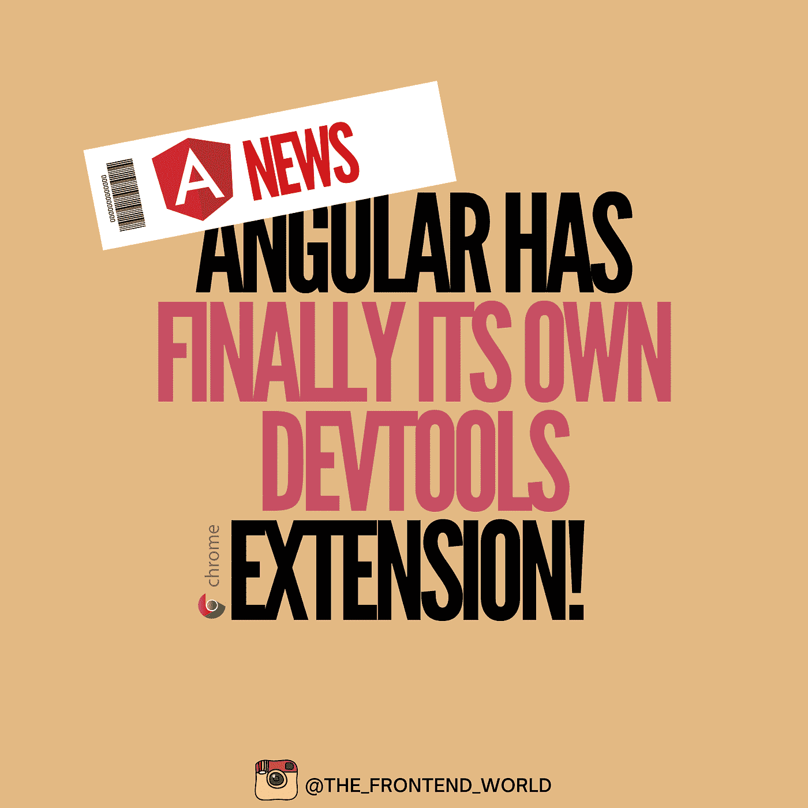
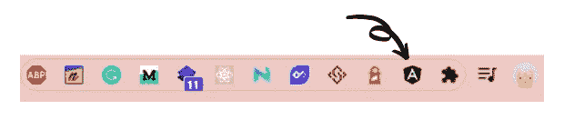
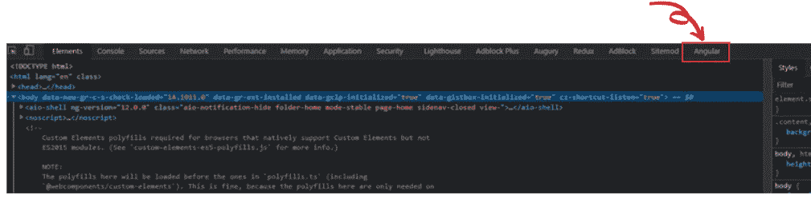
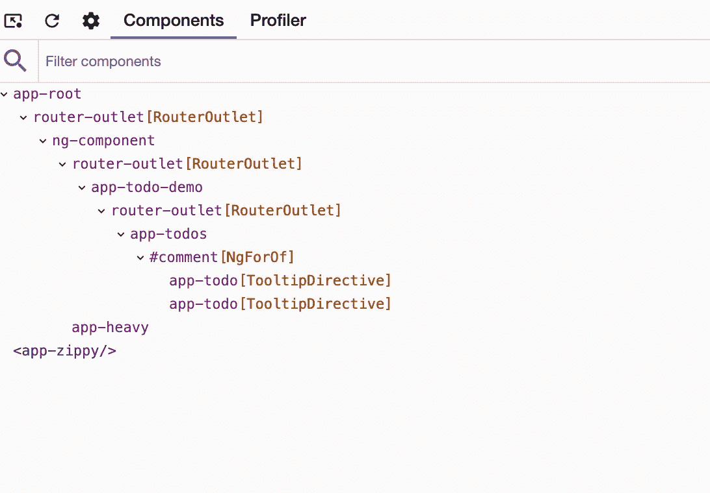
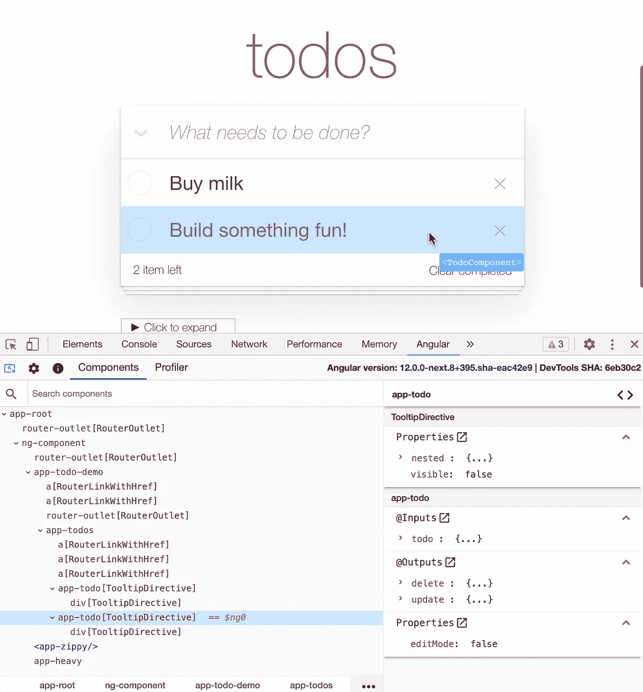
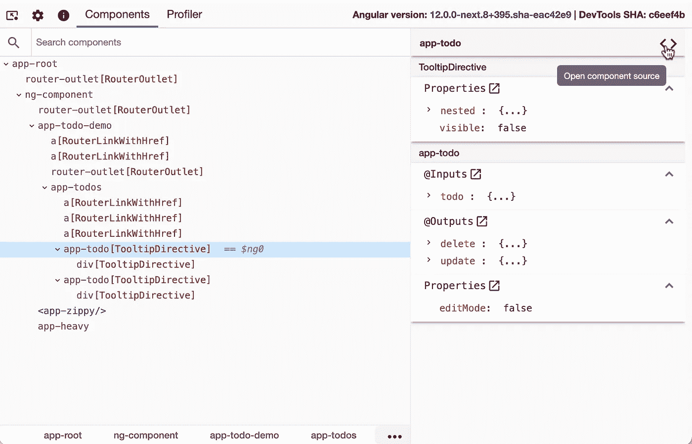
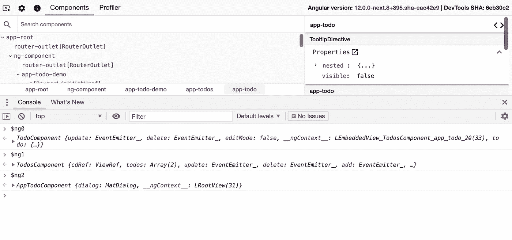
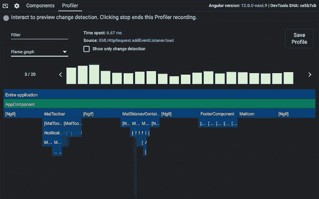

# Angular 终于有了自己的 devTools 扩展！

> 原文：<https://levelup.gitconnected.com/angular-has-finally-its-own-devtools-extension-d382af9cd60c>

## 看看你可以用这个了不起的工具做什么！

作者:FAM

我今天很兴奋，因为我发现 Angular 现在有了一个 devTools 扩展。对于 React 开发者来说，已经有一个专门针对 React 应用的扩展。以前 Angular 开发者不是这样。Angular 开发者可以将这个强大的 devTools 扩展用于 Angular 应用程序。

> ***【顺便说一下】*** —本文由斗牛犬 job 翻译发布—IT 人的空间:)

 [## angular ma swoje was ne dev tools。Odkryj 5 funkcji narzę dzia

### 杰斯特姆·吉萨伊·巴尔佐·波德克斯基托瓦纳，ponieważ·奥德里姆，że·安格拉·马·泰雷兹·罗兹泽尼·德夫图尔斯。米雅杰·już…的反应

bulldogjob.pl](https://bulldogjob.pl/news/1721-angular-ma-swoje-wlasne-devtools-odkryj-5-funkcji-narzedzia) 

让我们来发现它吧！

# 要安装扩展

 [## 角度开发工具

### Angular DevTools 扩展了 Chrome DevTools，增加了 Angular 特定的调试和分析功能。

chrome.google.com](https://chrome.google.com/webstore/detail/angular-devtools/ienfalfjdbdpebioblfackkekamfmbnh) 

你可以检查你的 Chrome 安装的扩展并锁定 Angular devTools 扩展:

Angular devTools Chrome 扩展

当它是黑色的，这意味着你不是在一个有角度的应用程序上。否则，图标将是红色的。

# 你能用这个扩展做什么？

首先，你需要用`F12`切换到 Chrome dev 模式。然后，您可以单击角度选项卡:

角度开发工具选项卡

## Angular devTools 的强大功能:

**#1-探索应用结构一览**

下面你可以看到一个应用程序的组件树。当您选择一个实例时(这可以是一个组件，一个指令…等等。)，Angular devTools 为您提供了更多的细节，如实例属性、输入、输出等等。

[角度开发工具](https://angular.io/guide/devtools)

**#2-选择一个实例了解更多详情**

单击组件资源管理器选项卡中的组件或指令。您可以看到所选实例属性的预览。Angular DevTools 在组件树的右侧显示它们的属性和元数据。

[角度开发工具](https://angular.io/guide/devtools)

**#3-点击打开源代码**

在应用程序中找到您要找的组件后，您可以点击一下跳转到源代码:

[角度开发工具](https://angular.io/guide/devtools)

这一点超级重要。Angular apps 通常是大型企业 app。当你第一次与一个新团队开始合作时，这个工具会让你赢得很多时间，在你还不熟悉项目的时候让你变得高效。

**#4-通过在控制台中访问实例来有效地调试实例**

当您选择一个实例时，Angular devTools 允许您在控制台中访问该实例。

*   键入`$ng0`以获取对当前所选组件或指令实例的引用。
*   为先前选择的实例键入`$ng1`。

[角度开发工具](https://angular.io/guide/devtools)

**#5-剖面仪**

您也可以通过单击 profiler 选项卡启动 Profiler 来优化您的应用程序:

Angular devTools Chrome 扩展

每个条形对应于一个单独的变化检测周期。你可以看看花了你多少时间，要么是有不正常的事情需要你去调查。

我们可以使用其他预览模式来了解更多关于应用程序的性能和隐藏的错误。在上图中，我们处于`Frame graph`模式。

分析器将帮助您:

*   **了解应用程序的执行**
*   **了解组件的执行**
*   **调试 OnPush 变化检测策略(很难调试)**

# 最后的话…

这个工具肯定会在我们如何构建 Angular 应用程序、我们调试它的方式以及这样做所需的时间方面产生巨大的变化。所以我很高兴拥有它，你呢？你会在 Angular apps 上用吗？你最喜欢它的什么？请和我们分享你的宝贵想法。

要了解更多信息，这里有[文档](https://angular.io/guide/devtools)。

**永远享受！**

亲爱的读者，我希望这是明确和有用的。我希望你和你的家人无论在哪里都平安无事！坚持住。明天会更好！

**让我们联系上** [**中**](https://medium.com/@famzil/)**[**Linkedin**](https://www.linkedin.com/in/fatima-amzil-9031ba95/)**[**脸书**](https://www.facebook.com/The-Front-End-World)**[**insta gram**](https://www.instagram.com/the_frontend_world/)**，或者**[**Twitter**](https://twitter.com/FatimaAMZIL9)**。********

****[www.fam-front.com](http://www.fam-front.com/)****