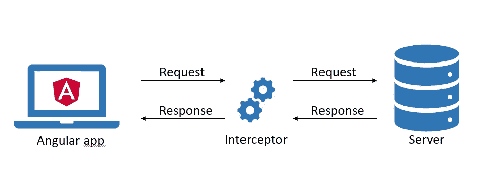
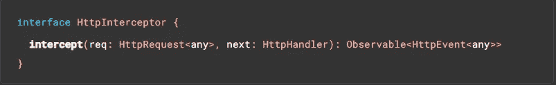

# Angular 拦截您的 http 错误

> 原文：<https://levelup.gitconnected.com/angular-intercept-your-http-errors-10d9c95133ec>

## 干净简洁的 http 错误管理

Http 拦截器基本流程

由于在任何应用程序中都会不时出现错误，因此应该实现一个合适的错误处理系统。在本文中，我们将关注不同类型的 http 错误以及如何相应地处理它们。

## Http 错误类型

http 请求失败的原因有很多。糟糕的网络连接、不正确的 url 或请求的服务器当前不可用，等等。一般来说，错误可以分为两种类型:服务器端和客户端错误。

这两种类型需要不同的处理，因为我们，客户，对后者负责，我们可以用不同于前者的方式处理它们。对于服务器端错误，我们只能传递从服务器收到的相应错误消息或尝试重试，因为服务器可能只是暂时不可用。
然而，在客户端，我们可能使用了错误的 URL 或缺少参数，我们需要修复它。

在这两种情况下，为用户提供一致的错误消息同样重要，为此全局处理也是合适的。

## Http 拦截器

通过所谓的`HttpInterceptor`，Angular 为我们提供了一种转换 http 请求和响应的方法。

通过该接口，我们可以实现`intercept`方法，该方法会在通过我们的应用程序发出的每个 HTTP 请求上自动调用。这使我们能够用拦截器实现中央错误处理。

拦截器有以下参数:

*   *req* —要处理的传出请求对象。
*   *下一个* —链中的下一个拦截器，如果链中没有拦截器，则为后端。
*   返回:事件流的可观察值。

让我们看一个例子:

## Http 错误处理程序

我们可以使用 Angular [CLI](https://angular.io/cli) 和以下命令创建一个新的拦截器:

`ng generate interceptor http-error`

我通常将拦截器放在一个包含全局功能的核心模块中，并在应用程序启动时立即加载。拦截器必须在模块中注册。我们可以通过将它添加到 providers 数组来实现:

属性`multi`必须设置为`true`，因为可以有多个拦截器使用`HTTP_INTERCEPTORS`注入令牌。您也可以在下面的 StackBlitz 示例中找到所有这些内容。

接下来，我们实现`intercept`方法，将 RxJS `catchError`操作符添加到请求中，用于我们的错误处理逻辑。

在`catchError`中，我们检查错误是否是`ErrorEvent`的一个实例，在这种情况下，类型是未知的，我们的代码可能有问题。否则，我们可以评估来自服务器的响应并相应地处理它。

如前所述，无论错误类型如何，向用户显示有意义的消息是很重要的。为此，我们可以为所有错误消息定义一个具有一致结构的接口，例如如下所示:

我们有一个可选的**标题**，我们可以用它来显示祝酒辞。然后是**错误消息**本身、不同的**严重级别**和 **http 响应代码**。现在让我们将接口添加到我们的拦截器中:

我们转换这两种类型的错误，然后重新抛出错误，以便它可以由最初触发请求的相应服务来处理。

接下来，我们可以为上面提到的特定响应代码集成重试逻辑。使用 RxJS 可以非常简单地实现 http 请求的重试。这里有两个操作符:`retry`和`retryWhen`。
它们中的任何一个都可以用来重试一个可观察的序列给定的次数。在这种情况下，`retryWhen`操作符更合适，因为我们可以处理任意条件，而不仅仅是重试次数。

对于我们的重试策略，我们可以创建一个自定义操作符:

可定制的增加持续时间的重试(来源: [learnrxjs](https://www.learnrxjs.io/learn-rxjs/operators/error_handling/retrywhen)

我们可以使用三个参数来配置我们的操作符。首先，根据尝试次数，其次，我们可以使用`scalingDuration`来创建尝试之间的延迟，第三，可以排除任何 http 代码，例如 404，因为重试“404-未找到”毫无意义。

新的操作符现在可以简单地与`retryWhen`一起插入到我们的拦截器的管道中:

查看 StackBlitz 上的完整示例:

## 下一步是什么

以下是进一步改进的一些想法:

*   为您的错误消息添加国际化(i18n)以支持多种语言，例如通过使用 [ngx-translate](http://www.ngx-translate.com/)
*   通过向用户显示是否要重试请求的提示来改进重试逻辑

在[媒体](https://saackef.com/)或[推特](https://twitter.com/sw3eks)上关注我，阅读更多关于 Angular 的内容！