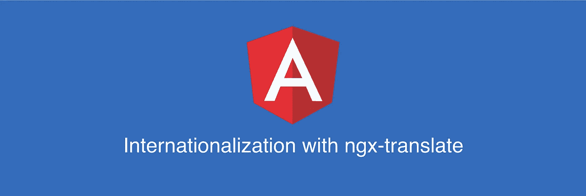
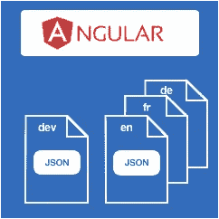
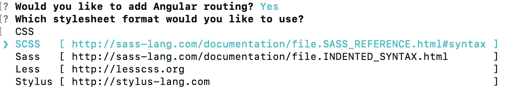
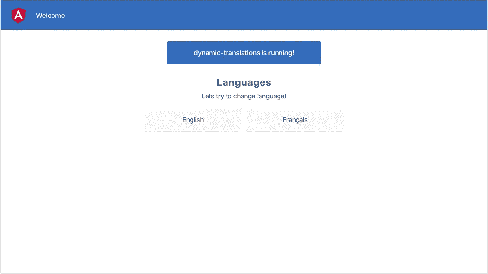
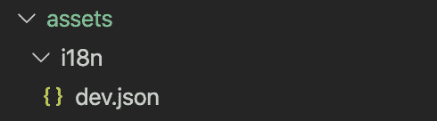
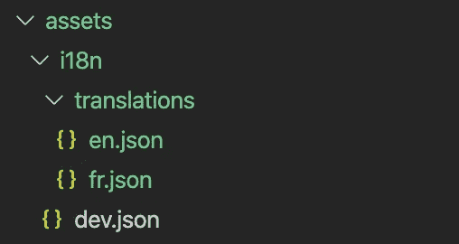
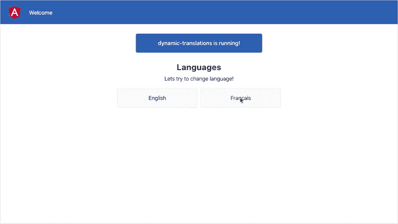
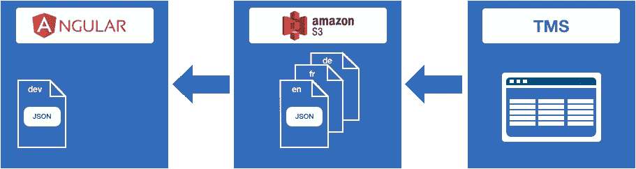

# 了解如何使用 ngx-translate 国际化(i18n) Angular

> 原文：<https://levelup.gitconnected.com/angular-internationalization-i18n-with-ngx-translate-8f89005cb337>



构建广泛使用的应用程序的主要问题之一是应对国际化(i18n)。这是一个设计和构建软件应用程序的过程，以便它可以适应各种语言和地区，而无需进行显著的工程更改。正如任何其他软件技术或框架一样，Angular 在这个问题上也没有什么不同，每个国际化过程的核心都有一个翻译机制。

翻译机制不仅负责更改或添加新语言，还需要帮助您轻松开发新功能、修复错误或推出新市场。



在本文中，我们将学习如何:

*   创建角度应用程序
*   安装和配置 ngx-translate
*   加载开发转换密钥(dev.json)
*   添加新语言(英语、法语……)
*   改变语言

# 创建角度应用程序

为了初始化、开发、搭建和维护 Angular 应用程序，我们将使用 Angular CLI。

使用 npm 程序包管理器安装 CLI:

```
npm install -g @angular/cli
```

要在开发服务器上创建、构建和服务一个新的基本 Angular 项目，请转到新工作区的父目录，并使用以下命令:

```
ng new dynamic-translations
cd dynamic-translations
ng serve
```

当要求选择选项时，您可以使用默认参数或选择下图所示的选项:



首先，您需要修改几个文件。为此，您必须打开*，并用以下内容替换:*

*然后，打开***app . component . scss***或***app . component . CSS***取决于您之前在创建应用程序时选择的类型，并添加以下代码:*

*最后，您的***app . component . ts***应该是这样的:*

*保存所有更改后，假设您的应用程序正在使用 **ng serve** 命令，转到您的浏览器，打开 [localhost:4200](http://localhost:4200/) ，您应该会看到这个网页:*

**

# *安装和配置 ngx-translate*

*为了帮助我们国际化，我们将使用 [ngx-translate](http://www.ngx-translate.com/) Angular 国际化(i18n)库。*

*要安装库，请在您的工作区内运行以下命令:*

```
*npm install @ngx-translate/core --save*
```

*然后在***app . module . ts***中导入 *TranslateModule* :*

> *请注意，对于有多个模块的更复杂的项目，通常有共享模块，我们建议您阅读[ngx-translate shared module setup](https://github.com/ngx-translate/core#sharedmodule)的文档。*

# *加载开发转换密钥(dev.json)*

*拥有一个开发翻译文件( **dev.json** )有助于开发新特性、修复错误等。该文件主要在开发应用程序时使用，但也可以用作应用程序的默认后备语言。*

*在您项目的 *src/assets* 文件夹中创建另一个文件夹 i18n 并添加文件 **dev.json** :*

**

*为了确保 **dev.json** 在任何其他语言文件之前被加载，我们将使用 Angular 的*APP _ INITIALIZER**injection token*提供的函数。例如，当您希望在呈现任何模板之前加载必要的语言文件，或者您希望解析提供应用程序运行环境信息的远程 API 时，可以使用此标记。*

*在我们的例子中，我们将创建 *appInit()* 函数，它将在 **dev.json** 被加载时进行解析。*

> *只有在 appInit 函数内部解析了 promise 之后，应用程序引导过程才会继续。*

*在***app . module . ts***中创建一个 *initApp* 函数，并如下例所示“提供”它:*

*在 dev.json 中创建新的键/值对:*

*我们将在 HTML 中使用翻译管道。用新创建的键替换***app.component.html***中的所有静态值:*

# *添加新语言(英语、法语……)*

*我们将使用 assets 文件夹来提供语言文件( **en.json** ， **fr.json** )。*

*在 *assets/i18n* 文件夹中新建文件夹 *translations* 并新建两个名为 **en.json** 和 **fr.json** 的文件。*

**

*我们现在将更新 *initApp()* 函数，以支持拉取新创建的语言文件:*

*我们首先加载我们的 **dev.json** 文件和基于本地存储中设置的区域设置值的特定语言文件。*

*我们正在使用 TranslateService 的 *setTranslation()* 方法，因为我们比使用简单的 ngx-translate httpLoader 有更多的控制。 *setTranslation()* 中的最后一个参数将新添加的翻译与现有的合并，而不是覆盖它们。*

# *改变语言*

*为了能够改变语言，我们需要添加一个函数来处理它。*

*在***app . component . ts***中创建一个类方法来更改单击按钮时调用的语言:*

*现在，在***【app.component.html】***中，我们将添加*英语*和*法语*按钮的点击事件以及与之关联的***app . component . ts***中的 *changeLanguage()* 函数:*

*正如您所注意到的，我们使用了一种技术来设置 localStorage 中的变量并重新加载应用程序。我们在***app . module . ts***中的 *appInit* 函数会使用这个参数来决定加载哪个语言文件。*

*有多种技术可以使用，如翻译的实时重新加载，重新加载页面和重定向到不同的网址，如 somesite.com/fr/等。改变语言的最好方法可能是使用重新加载应用程序并重新引导的方法。这种方法尤其适用于更复杂的应用程序，在这些应用程序中，需要在引导过程中进行更多配置，例如:*

*   *从 CMS 中为新的语言环境提取新的内容*
*   *加载和注册用于以本地格式显示日期、数字和百分比的角度区域设置数据*
*   *基于区域设置从 API 获取新数据*

# *试试看！*

*修改 **fr.json** 文件以覆盖某些关键字的翻译，以测试翻译更改是否有效:*

*保存文件，改变语言，看看会发生什么！*

**

> *你可以看到我们没有翻译 **fr.json** 中的所有键。如前所述， **dev.json** 是默认的后备，这意味着不在 **fr.json** 中的所有键都将从 **dev.json** 中使用，如果它们在那里的话。*

# *结论*

*在本文中，我们讨论了如何在 ngx-translate 库的帮助下设置和翻译 Angular 应用程序。*

*下一次，我们将讨论 Angular 中的**动态翻译，重点关注**从 Angular 解耦**语言文件，并使用 AWS S3 和翻译管理系统(TMS)管理、翻译和发布语言文件到 AWS S3。通过这样做，我们将能够改变和发布任何翻译，而无需重建和重新部署 Angular 应用程序。***

**

*使用 AWS S3 和 TMS 进行动态翻译*

**样例代码可以在*[***GitHub***](https://github.com/ivanmiletic/angular-dynamic-translations)***上找到。****