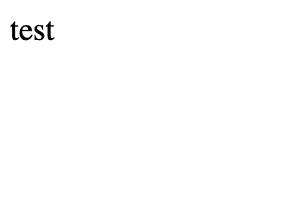
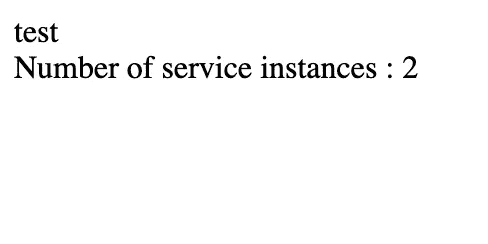
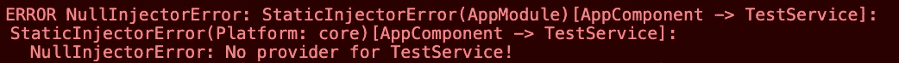

# 角度面试问题:服务的依赖注入

> 原文：<https://levelup.gitconnected.com/angular-interview-question-dependency-injection-3da676906ef9>


[达乌德·阿比斯梅尔](https://unsplash.com/@daoud_absml?utm_source=unsplash&utm_medium=referral&utm_content=creditCopyText)在 [Unsplash](https://unsplash.com/s/photos/technical-interview?utm_source=unsplash&utm_medium=referral&utm_content=creditCopyText) 上的照片

角度组件只是用户界面，仅此而已。它们显示数据并支持用户交互，对用户点击和输入做出反应。应用程序逻辑应该在服务中完成。当您需要一个组件中的服务时，您通常不会使用`new`自己创建一个实例。您将服务标记为`injectable` 和您将它作为参数添加到组件的构造函数中。角度依赖注入(DI)将负责创建一个实例，并为您注入它。

一般不会过多考虑这个过程。当您创建一个从服务器获取数据的服务时，您只需要它的一个实例，它在哪里并不重要。但是有时您需要服务只能在一个模块中可用，甚至是一个组件及其子组件。您可能需要在不同的组件中注入不同的服务实例。这就是为什么对 Angular DI 如何工作的良好理解对于 Angular 开发者来说是一个重要的素质。

# 注射器

注入器负责创建服务类的实例，并将它们注入到请求它们的组件中。服务是注入器范围内的单例，一个服务最多只能有一个实例。

喷射器由角度创建。在引导过程中创建了一个*根*注入器。Angular 还将为组件、管道或指令创建注入器，但是它们保持为空，除非您在它们的 decorators 中声明一个 *providers* 数组。每个延迟加载的模块也有自己的注入器。

注射器是遗传的。当你在一个组件中请求一个服务时，Angular 会在组件的注入器中查找，然后在它的父组件的注入器中查找，然后在它的父组件的父组件的注入器中查找，等等，直到它找到它或者用完祖先。如果它没有在元素注入器中找到它，Angular 开始在模块注入器中寻找，直到它找到一个提供者(或者耗尽注入器)。

# 提供者

注入器创建实例并注入它们，但是您需要告诉它们**如何**创建这些实例。当您在组件中注入服务时，您给最近的注入器一个 *DI 令牌*。默认情况下，令牌是服务类，在下面的示例中是 TestService。注入器有一个地图*令牌提供者*，令牌就是密钥。服务的提供者通常是类本身:

在这个例子中，服务只在 TestComponent 中提供，我们告诉 Angular 在注入 TestService 时使用 TestService 类来创建一个实例。这是一种非常常见的行为，Angular 为您提供了一种快捷方式:

```
providers: [TestService]
```

这也意味着我们可以告诉注入器在注入 TestService 时使用其他类。在下面的例子中，当请求 TestService 时，我们告诉注入器返回 HelloWorldService 的一个实例。

结果将是:


# 注射器等级

## 根部注射器

您可能不会定期在组件中提供服务。默认情况下，当您使用 Angular cli 创建服务时，服务是在*根*注入器中提供的。

在这种情况下，我们不需要在组件的注入器中提供服务。服务的实例将在*根*注入器中创建，并注入到我们的组件中。该实例在应用程序中随处可见。



我们不需要在其他地方提供服务，但是我们可以。

## 元素喷射器

尽管服务可以由根注入器注入，但这并不是必须的。我们可以决定为这个组件(及其子组件)创建一个服务实例。为此，我们需要像前面一样定义一个提供者。

我们在 TestComponent 中提供了服务 TestService。为组件创建了一个注入器，当服务被注入时，它将创建 TestService 的一个实例。

在 AppComponent 中，我们也注入了服务。我们没有在这个组件中声明任何提供者，所以实例将由*根*注入器创建和注入。因此，我们在应用程序中有两个服务实例。在示例中，我们创建了一个静态变量来存储实例的数量:



注射器层次结构的一个结果是，如果您在父组件中提供服务，那么相同的实例将在每个子组件中使用。

在这个例子中，我们将再次看到:


另一件需要注意的重要事情是，服务实例的寿命并不比创建它们的注入器长。这意味着，如果您在一个组件中提供服务，该组件正在使用的服务实例将随该组件一起消亡。当数据需要持久化时，您可能需要考虑这一点。

## 模块注射器

应用程序通常被组织在不同的模块中。由于默认情况下服务是在*根*注入器中提供的，因此可以从应用程序中的任何地方访问它们，甚至是在其他模块中。例如，如果您在模块 1 中定义了一个在*根*中提供的服务 TestService，那么您可以在模块 2 中使用这个服务。因为服务是由*根*注入器注入的，所以只有一个实例。

如果您在模块 Module1 中而不是在*根*中提供服务，那么该服务在模块 2 中仍然可用。这可能令人惊讶，但是如果 Module1 是预先加载的，它将被导入到 AppModule 中。模块注入器展平了所有导入的提供者，因此 TestService 将在 AppModule 中提供。

另一方面，如果 Module1 是延迟加载的，则它不会被导入到 AppModule 中。在模块中提供服务将使它只在内部可用。

如果只在 Module1 中的组件中提供服务，那么该服务将只在组件的注入器中提供，既不在 Module1 中，也不在*根*中。在最后两种情况下，试图在 Module2 的组件中注入服务将导致 *No provider* 错误:



您必须显式地提供服务，无论是在模块 2 中，还是在您试图注入它的组件中，或者直接在*根*注入器中。

Angular DI 通常允许您保留少量的服务实例，而不必过多关注它。在大多数情况下，你不必担心。但是，当您使用许多模块(延迟加载的模块)时，或者当您需要组件中服务的不同实例时，有必要更深入地理解这种机制。

Angular 为更大的灵活性提供了更多的工具。您可能需要检查修饰符(@Optional、@SkipSelf、@Self。…)了解更多信息。

在本文中，我们只讨论了服务案例。DI 能做的不止这些。例如，您可以提供值而不是类。您还可以创建自己的 DI 令牌，并使用@Inject 注释手动注入元素。关于这些或者依赖注入的更多细节，我建议您阅读 Angular 文档。