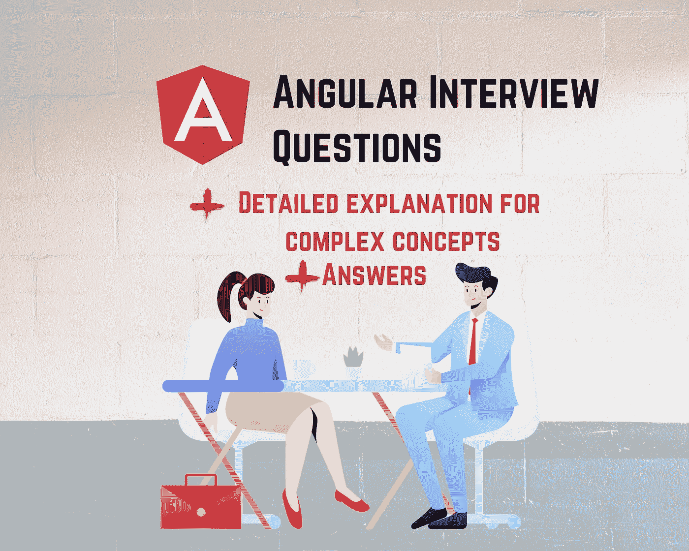

# 有角度的面试问题

> 原文：<https://levelup.gitconnected.com/angular-interview-questions-78de06e5311f>

## 你需要为一次完美的面试做的所有准备



在这篇文章中，我涵盖了有角度的面试问题。因为 Angular 是一个框架，它有很多概念和架构模式需要学习。作为一个棱角分明的前沿领导，我根据自己的经验为你分组了这些问题。

你会注意到，我根据关于角度的常识对问题进行了分组。其次是技术问题。不过，你也需要为一些编码做好准备。所以练吧！

准备好了，我们走！

# 关于角度的一般知识

## 什么是有角？

**回答:** Angular 是 Google 开发并支持的基于 TypeScript 的开源前端 web 开发框架。

## 什么是 TypeScript？

**回答:** Typescript 是一种基于 javascript 的语言。Angular 基于 TypeScript 语言和 HTML。HTML 用于模板，TypeScript(JavaScript 的超集)用于组件。

## 为什么在 Angular 中优先考虑 TypeScript 而不是 JavaScript？

**回答:**创建 typescript 是为了克服 Javascript 的缺点，如变量、类、装饰符、变量范围的类型转换，以及更多的特性和功能。

TypeScript 真的很强大。要发现它的一些威力，我推荐如下:

[](/how-to-avoid-using-the-any-type-in-typescript-14c0a0805473) [## 如何避免在 TypeScript 中使用 any 类型？

### 避免在代码中键入 any 的 3 个技巧

levelup.gitconnected.com](/how-to-avoid-using-the-any-type-in-typescript-14c0a0805473) [](/how-to-get-the-most-from-the-typescript-compiler-angular-aae7fb53e0cf) [## 如何充分利用 TypeScript 编译器— Angular

### 让 TypeScript 编译器为您服务

levelup.gitconnected.com](/how-to-get-the-most-from-the-typescript-compiler-angular-aae7fb53e0cf) [](https://famzil.medium.com/typescript-vs-javascript-a1d24810dd6b) [## 类型脚本与 JavaScript

### TypeScript 和 JavaScript 有什么区别？Typescript 和 JavaScript 哪个更好？

famzil.medium.com](https://famzil.medium.com/typescript-vs-javascript-a1d24810dd6b) [](/get-equipped-with-the-right-typescript-tooling-angular-6f789e222b30) [## 在 Angular 中配备正确的打字工具

### 通过丰富您的工具箱来改善您的开发体验

levelup.gitconnected.com](/get-equipped-with-the-right-typescript-tooling-angular-6f789e222b30) 

## 为什么要引入 Angular 这样的客户端框架？

**回答:**以前 web 开发者习惯用普通 Javascript 结合 jQuery 开发动态网站。这种方法的问题是，随着应用程序的增长，其代码将变得更加繁琐和复杂，难以维护。因此，需要创建一些方便和有助于维护，同时，一个动态的网站代码。

## 角度应用程序是如何工作的？

**答:**入口点是在`angular.json`中配置的 main.ts 文件。从那时起，AppModule 就被引导了。然后，该模块将使用`index.html`文件呈现 AppComponent。

[](https://famzil.medium.com/how-does-an-angular-application-work-8c4fac523a02) [## 角度应用程序是如何工作的？

### 你有没有好奇过一个有角 app 的幕后发生了什么？

famzil.medium.com](https://famzil.medium.com/how-does-an-angular-application-work-8c4fac523a02) 

## 你能描述一下使用 Angular 的一些优点吗？

**回答:** Angular 使用具有分层依赖注入结构的组件和模块，帮助轻松创建快速、动态和可伸缩的 web 应用程序。它通过其核心模块促进了 RESTful 服务和客户端-服务器通信。另一个优点是它提供了测试系统(带有 Jasmine 和 Karma)和已经设置好的环境。

要了解如何快速轻松地创建 Angular 应用程序，我建议查看这篇文章，这篇文章将带您通过两步创建一个完整的 Angular 应用程序:

[](https://famzil.medium.com/2-steps-to-create-launch-test-discover-angular-application-713387952e69) [## 创建、启动、测试和发现角度应用的 2 个步骤

### 发现角度应用的快速简单步骤

famzil.medium.com](https://famzil.medium.com/2-steps-to-create-launch-test-discover-angular-application-713387952e69) 

## 有角的主要特征是什么？

*   基于组件的架构——应用程序是作为一组独立的组件编写的。因此，应用程序将由一组组件(如拼图)构建而成
*   每一个难题都可以使用 Angular CLI 独立创建、测试和集成。
*   通过使用角度动画，无需编写太多代码就能很好地支持复杂动画。
*   多亏了惰性加载特性，Angular 支持自动代码分割。因此，只加载呈现特定视图所需的代码。
*   跨平台应用程序开发。它可以用于所有平台，甚至移动应用程序。

## 什么是单页应用程序？与传统 Web 技术有何不同？

**回答:**棱角分明让我们可以打造 SPA。在单页面应用程序(SPA)中，即使 URL 不断变化，也只有主页(index.html)会始终保持不变。与传统的 web 技术相比，它更快、更容易实现。在传统技术中，每次用户请求时，请求都被传递给服务器。这需要更多的时间。

## Angular 中的指令是什么？描述 Angular 中指令的类型？

**答:**指令是 Angular 的核心特性之一。它们允许 Angular 开发人员编写新的特定于应用程序的 HTML 语法。事实上，指令是 Angular 编译器在 DOM 中找到它们时执行的函数。指令有三种类型:

*   属性指令
*   组件指令
*   结构指令

## [什么是自举模块？](https://github.com/sudheerj/angular-interview-questions#what-is-a-bootstrapping-module)

**回答:**你引导启动应用的根模块叫做引导模块。每个 Angular 应用程序都有一个引导模块。它也被称为 AppModule。AppModule 类中提到了自举模块。

## Angular 中的注释和装饰器有什么区别？

angular 中的注释是使用反射元数据库的类的“唯一”元数据集。它们用于创建一个“注释”数组。另一方面，decorators 是用于分离类的修饰或修改的设计模式，实际上并不改变源代码。

## Angular 中的模板是什么？

模板是呈现在 index.html 文件主体中的 HTML 代码。HTML 代码是来自控制器或组件的数据和模型的组合，最终向用户提供动态视图。

注意，传统的 HTML 代码和 Angular 应用程序中使用的代码的区别在于，我们可以使用一些 Angular 特定的特殊元素和功能(如`*ngIf`、`ng-template`、`*ngFor`……)，这些元素和功能不能在 Angular 应用程序之外的常规 HTML 文件中使用。

## 用 Angular 解释数据绑定？在 Angular 中，什么是字符串插值？什么是插值？

在 Angular 中，数据绑定是最强大和最重要的特性之一，它允许您定义组件和 DOM(文档对象模型)之间的通信。

这简化了模板(HTML)和控制器(组件的类)之间的通信。

在 Angular 中，有四种形式的数据绑定:

1.  使用{{ variable }}进行字符串插值

```
<li>Name: {{ user.name }}</li>
<li>Address: {{ user.address }}</li>
```

1.  与[property]="value "的属性绑定

```
<input type="email" [value]="user.email">
```

1.  与(click)="functionName($event)"的事件绑定

```
<button (click)="logout()"></button>
```

1.  与[(ngModel)]="variablename "的双向数据绑定

```
<input type="email" [(ngModel)]="user.email">
```

注意`[()]`叫香蕉盒。(使用这个众所周知的关键字，你可能会得到同样的问题；))

[](/whats-data-binding-in-angular-faddb0f64e89) [## Angular 中的数据绑定是什么？

### 什么是插值？什么是属性绑定？什么是双向数据绑定？

levelup.gitconnected.com](/whats-data-binding-in-angular-faddb0f64e89) 

## 用 Angular 解释组件、模块和服务？

**组件:**组件是 Angular app 最基本的 UI 积木，形成了 Angular 组件树。这些组件是指令的子集。与指令不同，组件总是有一个模板，模板中的每个元素只能实例化一个组件。

**模块:**模块是你的应用程序中的逻辑边界，应用程序被划分成单独的模块来分隔你的应用程序的功能。

**服务:**当需要向各种模块提供公共功能时，使用服务。通过允许您从组件中提取公共功能，服务允许您更好地分离应用程序的关注点和更好的模块化。

## Angular 中有哪些类型的编译？

**答:**两种编译方式——AOT(提前)和 JIT(准时)。

使用 JIT，编译发生在浏览器的运行时。这是 Angular 使用的默认方式。用于 JIT 编译的命令有

`ng build ng serve`

在 AOT 编译中，编译器在构建过程中编译代码。用于 AOT 编译的 CLI 命令是-

`ng build --aot ng server –aot`

AOT 更适合生产环境，而 JIT 更适合本地开发。

## Angular 中的生命周期钩子是什么？解释几个生命周期挂钩。

**答:**角形部件从被创建到被销毁，进入其生命周期。角度挂钩提供了进入这些阶段的方法，并在生命周期的特定阶段触发变更。

**ngOnChanges( ):** 每当组件的一个或多个输入属性发生变化时，就会调用该方法。钩子接收一个 SimpleChanges 对象，该对象包含属性的以前和当前值。

**ngOnInit( ):** 这个钩子在 ngOnChanges 钩子之后被调用一次。

它初始化组件并设置组件的输入属性。

**ngDoCheck( ):** 它在 ngOnChanges 和 ngOnInit 之后被调用，用于检测和处理 Angular 无法检测到的变化。

我们可以在这个钩子中实现我们的变化检测算法。

**ngAfterContentInit( ):** 它在第一个 ngDoCheck 钩子之后被调用。这个钩子在内容被投射到组件内部后做出响应。

**ngAfterContentChecked():**在 ngAfterContentInit 和每个后续 ngDoCheck 之后调用它。它会在检查投影内容后做出响应。

**ngafterviewit()**:组件视图或子组件视图初始化后响应。

**ngAfterViewChecked( ):** 在 ngAfterViewInit 之后调用，在组件的视图或者子组件的视图被检查之后响应。

**ngOnDestroy( ):** 它在 Angular 销毁组件之前被调用。这个钩子可以用来清理代码和分离事件处理程序。

## 什么是管道？

**答:**管道(|)是用来把输入的数据转换成想要的格式。举个例子，

`<p>Price is {{ price | currency }}</p>`

带参数:

```
<p>Price is {{ price | currency : “USD$” : 0.00 }}</p>
```

## 什么是角路由器？什么是通配符路由？

**答:** Angular Router 是一种机制，当用户执行应用任务时，它会从一个视图导航到下一个视图。它借用了浏览器应用程序导航的概念或模型。

通配符路由有一个由两个星号(**)组成的路径，可以匹配任何 URL。当 URL 与任何预定义的路由都不匹配时，这很有帮助。我们可以使用通配符路由并为其定义一个组件，而不是抛出错误。

## 路由模块对于应用程序是强制性的吗？

**回答:**不需要，如果配置简单，路由模块完全可以跳过。

## 解释 Angular 中模板驱动表单和反应式表单之间的区别。

**模板驱动的表单:**这些是模型驱动的表单，你可以在其中编写逻辑、验证、控制等等。，在代码的模板部分使用指令。它们适用于简单的场景，并使用带有[(ngModel)]语法的双向绑定。

**反应式表单:**是一种模型驱动的方法，用于以反应式风格创建表单(表单输入随时间变化)。这些是围绕可观察的流构建的，其中表单输入和值作为输入值流提供。

同样，如果你需要一个大脑图像来帮助你对两种形式类型之间的区别有一个清晰的概念:

[](https://medium.com/swlh/have-you-ever-been-confused-between-using-a-template-driven-or-reactive-form-angular-87673cf5b417) [## 您是否曾经困惑于使用模板驱动的表单还是反应式表单？—角度

### 棱角星球的形式世界之旅

medium.com](https://medium.com/swlh/have-you-ever-been-confused-between-using-a-template-driven-or-reactive-form-angular-87673cf5b417) 

## 什么是 Angular CLI？你如何使用它？

Angular CLI(命令行界面)是一个用于搭建和构建 Angular 应用程序的命令行界面。您需要使用下面的 npm 命令进行安装:

```
npm install @angular/cli@latest
```

下面我列出了一些命令，它们在创建角度项目时非常有用

创建新项目:

`ng new`

生成组件、指令和服务:

`ng generate/g`

不同类型的命令包括:

*   ng 生成类 my-new-class:向您的应用程序添加一个类
*   ng 生成组件 my-new-component:向应用程序添加一个组件
*   ng 生成指令 my-new-directive:向您的应用程序添加一个指令
*   ng 生成枚举 my-new-enum:向应用程序添加一个枚举
*   ng 生成模块 my-new-module:向您的应用程序添加一个模块
*   ng 生成管道 my-new-pipe:向您的应用程序添加管道
*   ng 生成服务 my-new-service:向您的应用程序添加服务

运行项目:ng serve

## Angular 的最新版本是什么？其中有哪些新的特点？

在我写这篇文章的时候，Angular 已经到了它的第 11 个版本。这个问题通常是问在 Angular 方面有一些经验的人或者是 Angular 专家，以表明你紧跟新闻和技术。

要了解更多新功能，这里有一篇文章总结了 Angular 最新版本中最重要的功能:

[](/angular-11-is-out-a-quick-trip-to-new-things-in-it-fee274dc37c7) [## Angular 11 出来了！快速了解新事物吧？

### 关于 Angular 11 你需要知道什么

levelup.gitconnected.com](/angular-11-is-out-a-quick-trip-to-new-things-in-it-fee274dc37c7) 

# 角度技术问题

## 什么是 AOT 汇编？

*   **AOT(提前)编译:**应用程序在构建期间进行编译。

## AOT 编译有哪些**优势？**

*   **快速渲染:**浏览器加载可执行代码，并在应用程序在浏览器内部运行之前被编译时立即渲染。
*   更少的 AJAX 请求:编译器将外部 HTML 和 CSS 文件与应用程序一起发送，消除了对这些源文件的 Ajax 请求。
*   **最小化错误:**在构建阶段易于检测和处理错误。
*   **更好的安全性:**应用程序在浏览器内部运行之前，AOT 编译器会在 JS 文件中添加 HTML 和模板，这样就没有多余的 HTML 文件需要读取，从而为应用程序提供了更好的安全性。

## 为什么我们需要一个编译过程？

浏览器只能读取和解释 3 样东西:CSS、HTML 和 Javascript。这就是为什么生成可以被浏览器解释的 js 和 HTML 文件很重要。

## 表示[()]是什么意思？

**答:**这是用于双向数据绑定的 ngModel 的表示。它被写成[(ngModel)] = "propertyvalue "。

它也被称为 bananabox =双向数据绑定。

## 你对 NPM 套餐了解多少？

**答:**Angular 应用使用的组件、框架、CLI 都打包成 npm 包。可以使用 npm CLI 客户端下载 Npm 软件包。为了能够使用 npm，您需要安装 NodeJs。

要了解更多细节，我推荐这篇文章，因为它也谈到了 Y *arn，*它甚至比 NPM 更好:

[](/whats-a-package-manager-in-angular-and-how-it-works-58c4aedc58e8) [## Angular 中的包管理器是什么，它是如何工作的？

### NPM 和纱，选哪一个？

levelup.gitconnected.com](/whats-a-package-manager-in-angular-and-how-it-works-58c4aedc58e8) 

## 有角度的动画是怎么做的？

**答:**要使用动画模块，必须启用。为此，必须导入 BrowserAnimationModule。

```
import { BrowserAnimationsModule } from '@angular/platform-browser/animations'; // After this, import the required animation functions into the // component files. Example: 
import { state, animate, transition, // ... } from '@angular/animations';
```

接下来，在组件文件的@Component()装饰器中添加动画元数据属性。

```
@Component({ selector: 'app-root', templateUrl: 'app.component.html', animations: [ // animation triggers go here ] })
```

有关更多详细信息:

[](https://famzil.medium.com/angular-animations-c0275959667b) [## 角度动画

### 制作角度路线动画需要遵循的 4 个步骤

famzil.medium.com](https://famzil.medium.com/angular-animations-c0275959667b) 

## Package.json 是什么？package.json 和 package-lock.json 有什么区别？

**回答:**有了`package.json`文件，管理项目依赖关系就变得容易了。我们可以提及版本、语言等细节。…在`package.json`中。例如，如果在我们的项目中使用 bootstrap，我们可以提到 ng-bootstrap 包及其在`package.json`中的版本。

如果你对`package.json`不熟悉，我真的推荐这篇文章，它将帮助你在脑海中建立一幅关于什么是`package.json`在 dept 中的文件以及`package-lock.json`和基于我的经验的一些提示之间有什么不同的画面。

[](https://medium.com/swlh/package-json-package-lock-json-angular-e50fd3eb624f) [## 包裹。JSON & Package-lock。JSON-角度

### 处理依赖性问题需要了解的事情

medium.com](https://medium.com/swlh/package-json-package-lock-json-angular-e50fd3eb624f) 

## constructor 和 ngOnInit 有什么区别？

TypeScript 类有一个称为构造函数的默认方法，通常用于构造目的。它的用途和 Java 中的标准类一样，比如构建一个对象并初始化它。构造函数也用于在组件中注入我们需要的依赖关系。

另一方面，ngOnInit 方法是特定于 Angular 的，尤其是用于定义角度绑定。构造函数总是在 ngOninit 之前调用。

。为了使用 ngOnInit，您需要如下实现 OnInit 接口:

## 什么是角区？

区域是跨异步任务持续存在的执行上下文。当本地 JavaScript 操作引发事件时，Angular 依赖 zone.js 来运行 Angular 的变化检测过程。

## 异步管道的目的是什么？

**回答:**异步管道订阅一个承诺或一个可观察值，并返回最新值。如果发出一个新值，管道会标记需要检查是否有任何更改的组件。

`<code>observable|async</code>`

## 解释一下你是如何连接管道的？

**回答:**我们可以使用管道添加任意数量的过滤器-

`<p>Average is {{ average | uppercase | number}}</p>`

## 可以创建自定义管道吗？如果是，如何实现？

**回答:**是的，我们可以创建自定义管道。

*   首先，我们需要从核心 Angular 库中导入@Pipe decorator。
*   Pipe 是用上述元数据(@Pipe({name: 'myCustomPipe'}))修饰的类
*   下一步是定义转换。为此，pipe 类应该实现 PipeTransform 类的方法 transform()。
*   在模板中指定管道名称来调用它。

`<p>Size: {{number | myCustomPipe: 'Error'}}</p>`

## 你如何在 Angular 中创建一个服务？

服务示例:

正如我们之前看到的，可以使用 CLI 命令生成服务。

如果您已经手动创建了服务，您将需要在将使用它的模块中提供服务，并将其注入将使用它的组件的构造函数中。

## 什么是 HttpClient 及其好处？

大多数前端应用程序使用 XMLHttpRequest 接口或 fetch() API 通过 HTTP 协议与后端服务通信。Angular 基于 XMLHttpRequest 接口提供了一个简化的客户端 HTTP API，称为 HttpClient。这个客户端可以从`@angular/common/http`包中导入。

```
import { HttpClientModule } from '@angular/common/http';
```

HttpClient 的主要优点可以列举如下，

1.  包含可测试性特性
2.  提供类型化的请求和响应对象
3.  拦截请求和响应
4.  支持 Observalbe APIs
5.  支持简化的错误处理

## 什么是**依赖注入(DI)**

依赖注入(DI)是一种重要的应用程序设计模式，在这种模式下，类从外部源请求依赖，而不是自己创建依赖。

Angular 自带依赖注入框架来解决依赖关系。这是 Angular 的一个重要核心概念。我建议阅读下面的文章，以便对依赖注入有一个清晰的认识。

[](/dependency-injection-di-angular-21172d932f4f) [## 依赖注入(DI) —角度

### 它是什么，它是如何工作的？+具体例子

levelup.gitconnected.com](/dependency-injection-di-angular-21172d932f4f) 

## 什么是 codelyzer？

Codelyzer 为 Angular TypeScript 项目的静态代码分析提供了一组 tslint 规则。要分析角度应用，只需运行以下命令:

```
ng new codelyzer
ng lint
```

## 你用过 Angular 的 UI 库有哪些？

仅告知您使用的 UI 库:

示例:

*   引导程序
*   PrimeNG
*   材料…等

一些有用的链接，如果你想了解更多的细节:

[](/all-about-angular-material-3e0b86e9e195) [## 所有关于有角的材料

### 关于这个 Angular UI 库你需要知道的事情

levelup.gitconnected.com](/all-about-angular-material-3e0b86e9e195) [](https://famzil.medium.com/how-to-use-primeng-angular-9-c70b023a3633) [## 如何使用 PrimeNG — Angular 9

### 快速教程:在您的 Web 应用程序中设置 PrimeNG 的步骤

famzil.medium.com](https://famzil.medium.com/how-to-use-primeng-angular-9-c70b023a3633) 

## 角度语言服务

Angular 语言服务是一种在 Angular 模板中获得完成、错误、提示和导航的方法，无论它们是在 HTML 文件中的外部还是嵌入在字符串中的注释/装饰符中。它能够自动检测到你正在打开一个 Angular 文件，读取你的`tsconfig.json`文件，找到你的应用程序中的所有模板，然后提供所有的语言服务。

如果你还没有使用 Angular CLI，我推荐你去发现它。这是必须知道的事情之一。这里有一篇简短的文章，让你对 Angular CLI 有一个大概的了解:

[](https://famzil.medium.com/2-steps-to-create-launch-test-discover-angular-application-713387952e69) [## 创建、启动、测试和发现角度应用的 2 个步骤

### 发现角度应用的快速简单步骤

famzil.medium.com](https://famzil.medium.com/2-steps-to-create-launch-test-discover-angular-application-713387952e69) 

顺便说一下，这里有另一篇关于扩展的有趣文章，您绝对需要知道:

[](/get-equipped-with-the-right-typescript-tooling-angular-6f789e222b30) [## 在 Angular 中配备正确的打字工具

### 通过丰富您的工具箱来改善您的开发体验

levelup.gitconnected.com](/get-equipped-with-the-right-typescript-tooling-angular-6f789e222b30) 

## RxJs 是什么？

RxJS 是一个库，用于使用 Observables 以函数式、反应式的方式编写异步和基于回调的代码。许多 API(如 HttpClient)生成并使用 RxJS 观察值，也使用操作符来处理观察值。

RxJS 库还提供了下面的实用函数，用于创建和处理观察值。

1.  将异步操作的现有代码转换为可观察代码
2.  遍历流中的值
3.  将值映射到不同的类型
4.  过滤流
5.  构成多个流

## 在 Angular app 里用什么做单元测试？

*   Jasmine(用于编写测试)
*   Karma 或/ Jest(用于运行测试)

如果你已经使用它们，否则，不要提及它们，因为你可能会得到一个问题，例如，因果报应和笑话之间有什么区别，或者你更喜欢使用 Karama 或 Jest。

如果你想让我解释卡拉姆和 Jest 的区别以及哪个更好，请在评论区告诉我。

## 在 Angular 应用程序中，你用什么来进行 E2E 测试？

到目前为止，我个人用的是柏树。但是，如果你没有 E2E 测试中的棱角。不，是担心。要诚实。对于好奇的灵魂:

[](/e2e-testing-with-cypress-angular-219eaa3926c) [## 用柏树进行 E2E 试验——有棱角

### 如何在有角度的应用中使用 Cypress？

levelup.gitconnected.com](/e2e-testing-with-cypress-angular-219eaa3926c) 

## stub 和 Mock 有什么区别？

存根提供测试过程中的电话录音回答。*它们*是专门为测试场景设计的非常简化的对象或数据结构。这些可以在测试开始时或每次测试时构建。

**模仿**被预先编程了预期，这些预期形成了它们预期接收的呼叫的规范。模拟对象是模拟现有类的类实例，提供相同的方法接口，并在方法调用发生时返回特定的值。

## 什么是可观察的？

可观察对象是一个独特的对象，类似于可以帮助管理异步代码的承诺。Observable 不是 JavaScript 语言的一部分，所以我们需要依赖一个流行的叫做 RxJS 的 Observable 库。可观测量是使用新的关键字创建的。

```
import { Observable } from 'rxjs';

const observable = new Observable(observer => {
  setTimeout(() => {
    observer.next('Hello from a Observable!');
  }, 2000);
});
```

## 可观察到的和承诺之间有什么区别

**承诺:**

*   创建后立即执行
*   仅提供一次
*   把错误推给孩子的承诺
*   仅限使用。then()子句

**可观察:**

*   声明性的:计算直到订阅后才开始，以便在需要结果时运行
*   随着时间的推移提供多个值
*   Subscribe 方法用于错误处理，这使得错误处理集中化且可预测
*   提供链接和订阅来处理复杂的应用程序

## 什么是元数据？元数据是如何用 Angular 表示的？

**答:**元数据是用来修饰一个类，让它可以配置类的预期行为。元数据由 decorators 表示。

元数据是用类装饰器、属性装饰器、方法装饰器这样的装饰器来表示的。

Angular 中的装饰者示例

*   类装饰者:@Component 和@NgModule
*   属性装饰器:@Input 和@Output
*   方法装饰者:@HostListener
*   参数装饰者:@Inject，可选

## Angular 中的类装饰者有哪些？

**答:**类装饰器包含合适类类型的元数据。它出现在类定义的前面，声明该类是某种类型的。一些类装饰者是:

*   @组件
*   @NgModule
*   @管道
*   @指令
*   @可注射。

# 我可以去哪里问更多问题？

*   [此处](https://github.com/sudheerj/angular-interview-questions)

我希望这篇文章对你有所帮助。如果你想让我写一篇关于 Angular 中一些特定主题和概念的更详细的文章，请在评论部分告诉我。

# 最后…

记住，面试的关键词是你的态度。要微笑，要自在，要敢说我不知道，是什么，没有人知道一切。软件工程师或开发人员是一个不断学习和努力获取知识的人。我们都是学习者。没有人生来就有先验知识。

如果这有助于更多的文章，请让我鼓掌或反馈。如果您希望我在以后的文章中涉及 Angular 中的某个特定概念，请告诉我。我会用爱来写。❤


亲爱的读者朋友们，感谢你们的支持和宝贵时间。我希望这对你有用和有帮助。

**关注我上** [**中**](https://medium.com/@famzil/) **，**[**Linkedin**](https://www.linkedin.com/in/fatima-amzil-9031ba95/)**，** [**【脸书**](https://www.facebook.com/The-Front-End-World) **，**[**Twitter**](https://twitter.com/FatimaAMZIL9)**查看更多文章。**

回头见(ﾉ◕ヮ◕)ﾉ*:･ﾟ✧)

**FAM**

# 分级编码

感谢您成为我们社区的一员！ [**订阅我们的 YouTube 频道**](https://www.youtube.com/channel/UC3v9kBR_ab4UHXXdknz8Fbg?sub_confirmation=1) 或者加入 [**Skilled.dev 编码面试课程**](https://skilled.dev/) 。

[](https://skilled.dev) [## 编写面试问题+获得开发工作

### 掌握编码面试的过程

技术开发](https://skilled.dev)