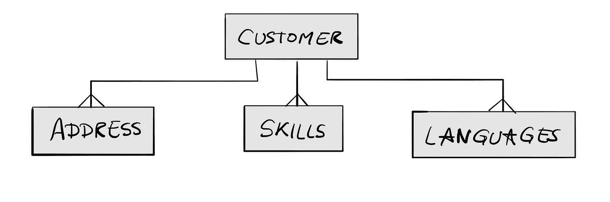
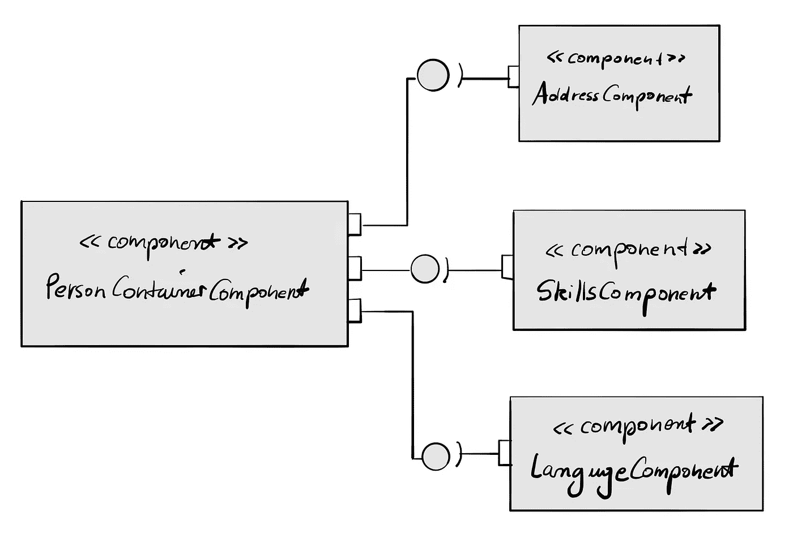

# 用于角度嵌套形式的模型驱动的数据聚集

> 原文：<https://levelup.gitconnected.com/angular-model-driven-component-data-communication-82737d58c581>

每当你开发 angular web 应用程序来允许用户向表单输入数据时，你的主要目标将集中在创建表单组，添加一些表单控件，并用数据修补它们，例如使用反应式表单。到目前为止一切顺利。然而，在单独的组件中实现关系数据时，会遇到一些恼人的事实:

*   表单可能很复杂，数据模型也可能很复杂。这通常会导致嵌套表单。
*   数据聚合通常是丑陋的，因为它不符合组件的松散耦合；例如，为什么父容器需要知道其子容器的表单控件属性名称来聚集数据？
*   是的，测试。为复杂的大数据编写单元测试真的很痛苦。

本文旨在展示一种可能的解决方案，使实现具有可伸缩性、可测试性、类型安全性和可维护性。让我们后退一步，看看这个 ER 数据模型。

在典型的用例中，数据模型将作为 DTO 传输到后端服务。然而，在这一步之前，您必须在前端采取一些预防措施来聚合数据。

关于上面显示的 ER 数据模型，应该首先澄清如何以及在哪里聚集数据的问题。如果为每个图元实现一个单独的角度分量，效果最好。组件之间的关系如下所示。

这些组件满足两个重要的方面。首先，他们负责接收数据，也负责共享数据。

*   通信流是双向的:数据由父节点读取，也发送给子节点。
*   数据模型是类型安全的:父容器确切地知道它从子容器获得的数据，而不需要从子容器的表单组中获取数据。
*   因为主窗体主要用于验证，所以它将作为一个 FormArray 来实现。子组件将在初始化时集成它们的表单组。
*   是的，通过使用 NGXS，子数据是有状态的——当没有后端服务交互来持久化数据时也是如此。一旦子窗体被初始化，状态数据就被用来设置窗体控件的值。

在下文中，我将包括 Angular、NGXS 和 RxJS 来解释一个实际的实现。不幸的是，我不能详细介绍 NGXS 和 RxJS，因为这超出了本文的范围。如果你不熟悉 NGXS 和 RxJS，那么你应该使用你熟悉的库。架构最终还是一样的。

# 父组件

让我们首先创建两个组件来演示概念验证。首先，我们将创建主容器，命名为*parent-container . component . ts*。

父容器.组件. ts

*   *addFormGroup* 将在带有初始化的嵌套表单组的子组件中发出。
*   *@SelectSnapshot* 获取子组件的状态数据，用最后编辑的数据填充嵌套表单。数据( *addressFormData* )将被输入到子组件的 *@Input initialFormData* 中。
*   *addressFormData* 中的数据对象只在最初修补嵌套表单时需要。通过发出函数 *updateAddressFormData* 将嵌套表单的未来更改发送给父组件。

这是父 HTML 模板:

parent-container.component.html

# 子组件

让我们继续处理子组件*地址。*

地址.组件. ts

如前所述， *dataChangedTrigger* 在表单值改变时被调用，数据对象映射在 *formValueChanges* 中。该函数有双重作用:它触发表单数据对象向父对象的导出，并将其保存在 NGXS 存储中供以后使用。

所有子组件必须实现接口 *DataIOComponent* 。这定义了子类必须实现的基本功能，以支持基于模型的通信。

[data-io.component.ts](https://gist.github.com/eltonmrk/7b89d3af46aae75ed21ba82621faef7e#file-data-io-component-ts)

最后是数据模型， *address.dto.ts* 。

address.dto.ts

就是这样。主要概念也可以用于其他组件和模型。欢迎你和我分享你的想法、建议或者一句简单的“你好”。

☕️，祝你试用愉快