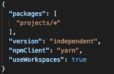
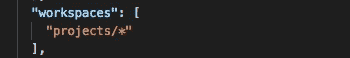
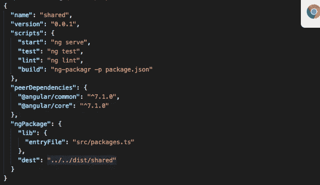
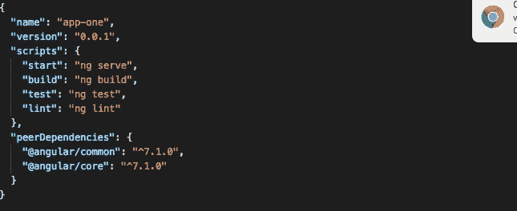
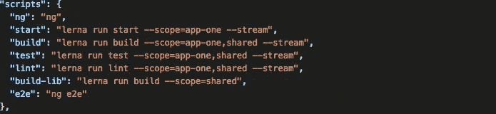
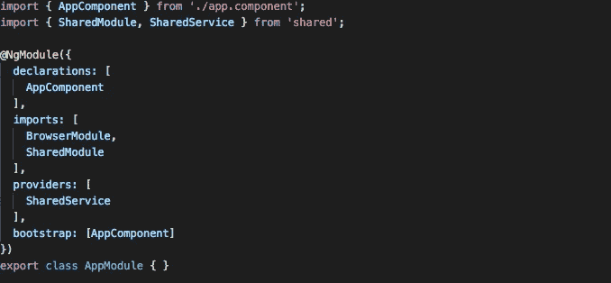

# 使用 Lerna 和 Yarn 工作空间的角度单报告(可重复使用)

> 原文：<https://levelup.gitconnected.com/angular-mono-repo-using-lerna-and-yarn-workspaces-for-reusability-5aafff9ab5f2>

> 伟大的程序员 **是那些相信重用而不是重写**的人。因此，让我们看看，为什么以及如何通过创建 mono-repo(mono-repo)和专门为 Angular 应用程序创建它来使用可重用代码。

**什么是单一回购？**

Mono-Repos 是我们将许多不同应用程序的相似存储库放在一起并从单一来源管理它的地方或方式。这样，我们可以实现可重用性、代码共享、代码重构。它还提供了跨团队的良好协作。

**何时使用单一回购？**

在大型企业项目中，我们有不同的应用程序，在组件方面有很多共同点，那么我们可以使用这种方法。例如，有一个应用程序项目，如客户门户和供应商门户，其中 UX 是相似的，只是在组件方面有一些小的变化，在访问方面有很大的变化。

**谁使用单一回购？**

很多公司和开源项目。最有趣的:

*   [巴别塔](https://github.com/babel/babel)【社区驱动】
*   [创建-反应-应用](https://github.com/facebook/create-react-app)【脸书】
*   [msal.js](https://github.com/AzureAD/microsoft-authentication-library-for-js)

**为 Angular 应用程序创建单一回购需要什么？**

1.  Yarn workspaces:它用于跨应用程序更好地管理节点模块。
2.  Lerna:用于创建不同的应用程序、库并管理它们，以及在彼此之间共享资源
3.  Angular CLI:创建角度项目和应用程序

创建单一回购的步骤

**如何为 Angular 应用创建这个单一存储库**？

**1。启用纱线工作区:**

> 纱线配置设置工作区-真实实验

**2。创建一个角度项目**

> ng new lerna-demo-create-application = false

**3。删除包锁文件(由 angular CLI 创建),因为我们将使用 yarn 而不是 npm**

**4。添加 Lerna 作为一个开发依赖项并初始化它**

> 纱线添加 lerna —保存-开发
> 
> lerna 初始化—独立

**5。将项目的 lerna.json 修改如下:**

这里，

> **项目**是包文件夹，我们将在其中添加所有的应用程序或库
> 
> **版本**保持独立，因为我们可以独立管理软件包并发布它

**6。将软件包安装程序添加到开发依赖项中，如果你想使用这个库，你可以跳过这一步**

> 纱线安装 ng-pack gr t sickle-保存-开发

7 .**。更新 package.json 并在文件中添加以下键，以便定义 workspace。**

**8。在库中添加库，并在添加打包配置的同时修改其包文件**

> ng g 库共享

**9。现在让我们在存储库中创建一个应用程序。**在 app 文件夹中添加 package.json，添加 serve、test、lint、build 的脚本

> ng g app app-one

package.json(用于 app-one)

10。在根包 JSON 文件中添加以下脚本。这样根文件可以控制所有其他项目

Root package.json(脚本)

**11。现在你需要构建 angular 库**，这样你就可以把它作为一个依赖项添加到你的应用程序中

> 纱线运行构建库
> 
> lerna 添加共享

**12。您需要使用以下语句安装应用程序和库**所需的所有依赖项:

> 勒纳自举

**13。在项目**的 app 中使用库。从打开 app.module.ts 文件。app-one，

并添加导入语句

并声明该模块

将库的模块和服务导入到应用程序中

现在最后一步已经完成。您可以创建和使用组件、服务、指令、管道、拦截器或库的任何其他特性，就像您在任何应用程序中导入的任何其他模块一样。

**优点:**

1.  多个应用程序中需要的类似包可以一起存储在根 node_modules 中
2.  所有应用程序的所有依赖项都可以使用一个命令进行安装或更新
3.  它允许您使用一个命令在所有应用程序上运行构建或测试
4.  使用该库可以分离和共享公共功能
5.  成熟和丰富的网络教程。
6.  单独或在一行中对所有包进行版本控制。
7.  用 Lerna bootstrap 链接项目中的依赖项。
8.  repo 中所有包的任务执行自动化。
9.  Lerna publish 发布 NPM 的所有更新。

**CONS:**

1.  每次进行更改时，您都需要重建库
2.  对存储库进行大量重构。大量的初始开销。
3.  维护开销随着每个包的不同 package.json 和环境而增加。
4.  包的可发现性依赖于 NPM/图书馆的文档。
5.  PRs 只能在回购中制定，并且很难让新的开发人员加入回购，这反过来又会损害包的采用

你可以在[https://github.com/MayuriRathod/Angular-MonoRepo](https://github.com/MayuriRathod/Angular-MonoRepo)找到这个单一回购的例子

**有关 Lerna 或单一回购的更多信息，您可以参考以下链接:**

[https://medium . com/naresh-bhat ia/sharing-ui-components-with-lerna-and-yarn-work spaces-be 1 ebca 06 EFE](https://medium.com/naresh-bhatia/sharing-ui-components-with-lerna-and-yarn-workspaces-be1ebca06efe)

[https://medium . com/mitte Rio/multi repo-to-lerna-js-mono repo-80f 6657 CB 443](https://medium.com/mitterio/multirepo-to-lerna-js-monorepo-80f6657cb443)