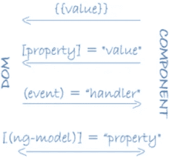

# 我见过的新开发人员犯的 8 个最常见的错误

> 原文：<https://levelup.gitconnected.com/angular-most-common-pitfalls-78a2baf860f5>

## [有角度的](https://rakiabensassi.medium.com/list/software-engineering-7a179a23ebfd)

## 以及如何避免它们

照片由 [krakenimages](https://unsplash.com/@krakenimages?utm_source=medium&utm_medium=referral) 在 [Unsplash](https://unsplash.com?utm_source=medium&utm_medium=referral) 上拍摄

在我最近的一次技术访谈中，我被问及我从开发人员那里听到的关于 Angular 的常见问题，以及他们所面临的问题。事实上，我的采访者的目标是收集关于框架的反馈，并检查如何优化它以满足受众的需求，并提供良好的开发人员体验。

经过思考和提炼我的答案，我想在这篇文章中与你分享，并打破我见过的有棱角的新人最常见的不良做法——包括我以前的自我行为。

这些错误的原因通常是“没有意识到它们”，因为缺乏关于框架如何工作的培训和指导。

因此，我写这篇文章是为了帮助你构建更强大的 Angular 应用程序，并为你省去很多麻烦，比如体验性能下降。

*如果你更喜欢看，这里有个视频:*

# 1.忘记退订了

当您订阅一个可观察对象时，将会产生一个订阅对象，如果处理不当，可能会在运行时导致内存泄漏。

要在您的组件被 Angular 破坏时删除此订阅对象，您需要取消订阅。您可以按如下方式操作:

*   向组件添加主题变量:`_unsubscribe: Subject<any> = new Subject()`
*   从`pipe()`方法内的`rxjs/operators`库中调用`takeUntil()`。
*   然后在组件的`ngOnDestroy()`方法中调用`_unsubscribe.next()`和`_unsubscribe.complete()`。

角度:订阅和取消订阅可观察对象的示例

# 2.不使用 OnPush 更改检测

为了保持 HTML 模板和内部模型状态同步，Angular 提出了两种变化检测(CD)策略:Default 和 OnPush。

与默认(或`CheckAlways`)策略不同，OnPush(或`CheckOnce`)策略不会自动检测变化，而是只在必要时检测。这大大减少了 CD 周期和计算量，从而提高了性能。

在我第一次试用 Angular 时，我没有足够的关于 OnPush 方法的知识，也不知道为了正确使用它我应该做什么。只是在目睹了一些[性能问题](https://betterprogramming.pub/build-me-an-angular-app-with-memory-leaks-please-36302184e658)并开始寻找补救措施后，我才更加意识到这一点。

使用 ChangeDetectionStrategy 的角度容器组件。OnPush

# 3.在代码设计中没有考虑不变性

使用角度`OnPush`变化检测策略至关重要。但更重要的是，在设计代码和组件之间的交互时，通过考虑不变性，让您的应用程序为此做好准备。

否则，当你在没有做好准备的情况下改变你的 CD 策略时，你的应用程序功能中的一些错误和倒退就会开始悄悄出现。

您将在“[Angular Performance:5 OnPush Change Detection Case Studies](https://betterprogramming.pub/angular-onpush-change-detection-f629cbce0bfa)”一文中找到答案，这是五个分析不同组件并通过考虑不变性来调整它们的数据结构的真实例子，以便平稳地迁移到 OnPush，而不会使应用程序容易出错。

# 4.没有正确使用数据绑定

数据绑定允许我们定义 DOM 和组件之间的通信。它负责组件和模板之间数据的自动拉和推。

Angular 中有 4 种数据绑定类型:

1.  **事件绑定**:使用()
2.  **属性绑定**:使用[]
3.  **字符串插值**(或 mustache 语法):使用{{}}显示组件数据。
4.  **双向数据绑定**:使用[()]确保数据模型在视图中自动同步。

[角度数据绑定](https://angular.io/guide/architecture-components)

在开始使用 Angular 时，一些开发人员可能没有正确理解绑定语法，而是使用()而不是[]或者在不需要的地方使用[()]。

你应该小心双向数据绑定，因为随着时间的推移，它可能会导致糟糕的 web 性能。

Angular 4 数据绑定类型

# 5.字符串插值中的调用方法

字符串插值是一种特殊的语法，它允许我们在双花括号{{}}内编写一些 JavaScript 表达式，以便向网页添加动态内容。

如果数据必须在视图上显示之前进行转换，您需要小心，避免通过调用花括号内的方法进行转换，如下例所示，因为这将损害您的应用程序性能和用户体验:

角度:在视图上显示数据之前转换数据的错误方式

在这种情况下，转换数据的更好方法是使用[角管道](https://betterprogramming.pub/build-me-an-angular-app-with-memory-leaks-please-36302184e658#1bf1)。您可以定义一个自定义管道`GetTotalPipe`，而不是在组件中定义`getTotal()`方法，并在 HTML 页面中使用`data`和`col.key`作为参数来调用它:

计算表格中一列总和的角形管道

并如下使用它:

角度:在视图上显示数据之前转换数据的正确方式

# 6.混合组件和服务职责

Angular 框架为开发人员提供了定义组件和服务的可能性，这些组件和服务负责不同的逻辑。然而，一些开发人员通过在组件中注入`HttpClient`来混合这种逻辑，而不是在 HttpService 中这样做，只是在组件中使用这个服务。

这是一个混合责任和违反[干净代码](/clean-code-in-an-agile-team-79ed5fe3ed5d)规则的简单场景，但是有更多的情况没有这个明显，例如在一个组件中实现一个特性，我们可以通过应用[容器-呈现者模式](https://betterprogramming.pub/frontend-architecture-376e6323ef9b#f398)创建两个或更多具有不同角色的组件:

*   **容器组件:**负责从服务获取数据，并使用输入和输出将其传递给其子组件(表示组件)。
*   **表示组件:**负责呈现 UI 并处理与用户的交互。它还可以注入一个服务，以减少组件树中在容器和其子节点之间传递数据的输入数量。

拥有独立组件的相同概念也适用于服务。例如，在 Angular 应用程序中，您可以定义:

*   一个 **HttpService** 与 REST API 通信:

Angular: BaseHttpService

*   一个 [**可观察的数据服务**](https://betterprogramming.pub/frontend-architecture-376e6323ef9b#2e84) :它是一个基于`BehaviorSubject`的服务，可以在你的应用程序中扮演一个商店的角色。它允许您通过避免集成 NgRx 和 NgXs 等第三方库来管理应用程序状态，从而降低代码复杂性。

Angular: BaseStoreService

*   一个**表单服务**，如果你的应用程序需要动态表单，这个服务非常有用。它可以负责所有表单字段的创建、它们的验证逻辑、用正确的值填充它们、添加它们的事件侦听器等等。

Angular: FormGroupService

# 7.生命周期挂钩的错误用法

像`ngOnInit()`、`ngOnDestroy()`和`ngOnAfterViewInit()`这样的方法在 Angular 中被称为生命周期挂钩，因为它们在一些特定的事件中被框架**自动**调用:

*   当组件被初始化时，
*   视图显示在屏幕上，
*   视图正在从屏幕上移除，
*   诸如此类。

这意味着您不需要像对自己定义的方法那样在代码中手动调用这些方法。

关于生命周期挂钩，您需要记住的另一点是，为了使用它们，您的组件必须实现它们适当的接口，否则它们将是普通的方法，并且不会像预期的那样工作:

*   `ngOnInit()`来自界面`OnInit`
*   `ngOnDestroy()`来自接口`OnDestroy`
*   `ngOnChanges()`来自接口`OnChanges`
*   `ngOnAfterViewInit()`来自接口`AfterViewInit`

有角度的生命周期挂钩

# 8.不是为生产而建

尽管我们使用`--prod`参数(或为生产而构建)来生成一个可以部署在服务器上的包，但是在本地机器上运行`ng build --prod`可以让我们看到应用程序中的一些错误，而这些错误在我们仅仅使用`ng build`构建时是看不到的。

也就是说，我和我的一些同事忘记用`--prod`参数来构建我们的应用程序，以便定期检查它们。只有当我们在服务器上进行新的部署后面临令人不快的意外，并且我们试图在本地重现它时，我们才记得我们已经忘记了什么。

我看到的另一个关于`--prod`标志的问题是根本没有使用它，而是在服务器上部署了一个不是为生产而构建的包，它只是用`ng build`生成的。当然，这阻碍了应用程序的一些性能优势。

## 注意

从 Angular 版本 12 开始，您不再需要在`ng build`和`yarn build`中指定`--prod`标志，因为默认情况下会启用生产构建。

默认情况下，Angular 12 启用生产版本

# 最终想法

希望这些技巧能够帮助您更好地理解 Angular 及其各种特性和功能。

如果你觉得他们激起了你学习更多关于框架的兴趣，或者让你想起了你所面临的其他陷阱或挑战，不要犹豫，点击回复按钮，告诉我们。我很想收到你的来信。

# 想要更多吗？

我为一群聪明、好奇的🧠人写关于工程、技术和领导力的文章💡。 [**加入我的电子邮件简讯，获得独家访问**](https://rakiabensassi.substack.com/) 或在此[注册 Medium](https://rakiabensassi.medium.com/membership)(如果你还没有注册)。

你可以在 Udemy 上查看我的**视频课程**:[如何识别、诊断、修复 Web 应用中的内存泄漏](https://www.udemy.com/course/identify-and-fix-javascript-memory-leaks/)。

 [## Angular 13 的新功能

### 100% Ivy，更好的组件 API，不支持 IE11，等等

better 编程. pub](https://betterprogramming.pub/angular-13-features-ef528a9ae16f)  [## 2022 年你不应错过的 4 种数据收集工具

### 信息是生存和发展的关键。这里有一些市场上最好的工具来获得它。

levelup.gitconnected.com](/top-data-collection-tools-a18fe72c16f7)