# Angular: NGRX 一个干净清晰的介绍

> 原文：<https://levelup.gitconnected.com/angular-ngrx-a-clean-and-clear-introduction-4ed61c89c1fc>

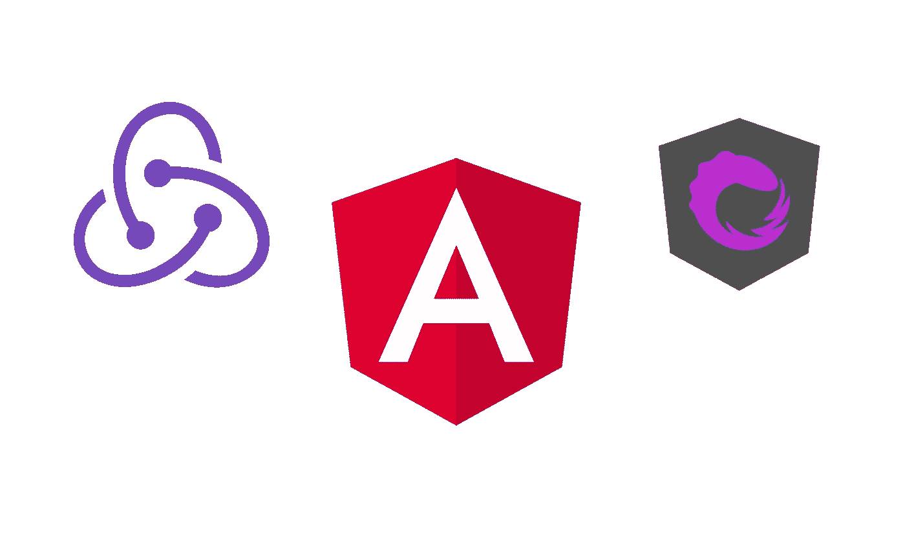

本文的目的是为 [ngrx](https://github.com/ngrx/platform) 提供一个清晰明了的介绍。为了做到这一点，我将解释你需要知道和理解的关于 ngrx 的事情，然后我们将通过一些简单易懂的代码示例来看它的实际应用。

最后，我将提供包含示例的 GitHub repo 的链接，这样您就可以摆弄代码了。

这是我们将在本文中讨论的主题列表:

*   什么是 ngrx
*   使用 ngrx 的好处
*   使用 ngrx 的缺点
*   何时使用 ngrx
*   动作、缩减器、选择器、存储和效果
*   NGRX 示例

# 什么是 NGRX

NGRX 是一组受 Redux 模式“启发”的库，而 Redux 模式又受 Flux 模式“启发”。更简洁地说，这意味着 redux 模式是 Flux 模式的简化版本，NGRX 是 redux 模式的 angular/rxjs 版本。

> 我说的 redux 的“angular/rxjs”版本是什么意思…“angular”部分是因为 ngrx 是一个在 angular 应用程序中使用的库。“rxjs”部分是因为 ngrx 的实现围绕着一个 [rxjs](https://rxjs-dev.firebaseapp.com/guide/overview) 流工作。这意味着它使用可观测量和“rxjs”提供的不同可观测量算子工作。

**该模式的主要目的是提供一个可预测的状态容器，基于三个主要原则**。

让我们看看 Redux 模式的三个原则，并指出它们提供的最重要的好处。

## 真理的单一来源

在 redux/ngrx 架构的情况下，这意味着整个应用程序的状态存储在单个存储中的对象树中。

> 在一家店内？我们稍后将讨论商店，但是在一般的定义中，当他们被告知这样做时，他们有责任保持状态并对其应用更改(当一个动作被分派时，我们稍后也将讨论它们)。

拥有单一真实来源的好处有很多，但对我来说，最有趣的一个(因为它将影响任何 angular 应用程序)如下:

*   当你在构建一个 Angular 应用程序时，通常你会将状态拆分并在多个服务中处理。随着应用程序的增长，跟踪状态变化开始变得混乱，难以调试和维护。拥有单一的真实来源解决了这个问题，因为状态只在一个对象和一个地方处理，所以调试或添加更改变得更加容易。

## 状态为只读

你永远不会直接改变状态，而是调度动作。这些动作描述了正在发生的事情(可以是获取、添加、删除、更新状态)。

> 派遣一个行动？…我们稍后将讨论操作，但一般来说，它们是应用程序上操作的标识符，可以被触发(或调度)来告诉应用程序执行该操作所代表的操作。

通过避免从不同的地方更新状态，并有一个集中的地方进行更改，以响应特定的操作，您可以获得很多好处。仅举几个最重要的例子:

*   你知道任何状态的改变只会发生在一个地方。这对调试和测试有很大的影响。
*   您知道，如果某个动作被分派，状态中的操作总是相同的。这同样会直接影响调试和测试。

## 变化是由纯函数产生的

通过分派一个动作触发的操作将是一个纯粹的函数，在 redux 架构中称为 reducers。

这些 reducers(记住它们只是纯函数)接收一个动作和状态，根据调度的动作(通常使用 switch 语句)，它们执行一个操作并返回一个新的状态对象。

> redux 应用程序中的状态是不可变的！所以当一个 reducer 改变了状态中的一些东西时，它会返回一个新的状态对象。

使用纯函数的好处是众所周知的，比如，如果你传递相同的参数，你会得到相同的结果，它们是可以立即测试的。

这种方法还允许我们使用 Redux/ngrx dev 工具在我们状态的不同实例之间导航，并查看实例之间发生了什么变化以及谁改变了它，等等。所以使用纯函数并返回状态的新实例对调试也有很大的影响。

在我看来，主要的好处是，通过将我们所有的组件输入(T2)绑定到状态属性，我们可以将变更检测策略更改为推送，这将提升应用程序的性能。

# 太好了…那么使用 NGRX 有什么好处呢

在讨论 redux 模式原则时，我们已经提到了其中的大部分。但是让我们指出在应用程序中使用 redux 模式最重要的好处(在我看来):

*   因为我们只有一个真实的来源，而且你不能直接改变状态，所以应用程序的行为会更加一致。
*   使用 redux 模式为我们提供了许多很酷的特性，使调试变得更加容易。
*   应用程序变得更容易测试，因为我们引入了纯函数来处理状态变化，还因为 ngrx 和 rxjs 都有很多很好的测试特性。
*   一旦您对使用 ngrx 感到满意，理解应用程序中的数据流就变得非常容易和可预测。

# …缺点是

*   当然，NGRX 有一个学习曲线。它不是很大，但也不是很小，我认为它需要一些经验或对一些程序模式的深刻理解。任何中等资历的开发人员都应该可以，但对于初级人员来说，一开始可能会有点困惑。
*   对我来说，感觉有点啰嗦。所以每次你添加一些属性到状态，你需要添加动作，调度程序，你可能需要更新或添加选择器，效果，如果有的话，更新存储。你也开始到处管道化(连接)rxjs 操作符和观察值。
*   ngrx 不是 angular 核心库的一部分，也不受 Google 的支持，至少不是直接支持，因为 Angular 团队中有 NGRX 贡献者。只是一些需要考虑的事情，因为你正在添加一个库，它将成为你的应用程序的一个很大的依赖。

# 何时使用 NGRX

因此，一般来说，ngrx 应该用在管理状态开始变得难以维护和难以应付的中/大型项目中。其他一些对这种模式更狂热的人会说“如果你有一个州，你就有 NGRX”。

我同意，当你有一个相当大的状态和一堆使用这个状态的组件时，应该考虑在中型或大型项目中使用它，但是你必须考虑 angular 本身提供了大量管理状态的解决方案，如果你有一个强大的前端 Angular 团队，那么也许你不需要为 ngrx 而烦恼。

也就是说，我认为一个强大的 Angular 团队也可能决定将 ngrx 包括到解决方案中，因为他们知道 redux 模式的所有功能，也知道 rxjs 操作符增加的功能，并且他们对这两者都感到满意…

> 如果你期待一个简单的答案来决定何时使用 ngrx，你不会得到它，也不要相信任何来自你的组织或团队之外的人给你这个答案。这个决定取决于研究利弊，理解你的团队并考虑他们的意见。

# NGRX 动作、缩减器、选择器、存储和效果

这些是 ngrx 流程的核心构建单元。它们中的每一个都负责从开始操作到改变我们的状态和检索数据的过程的一部分。

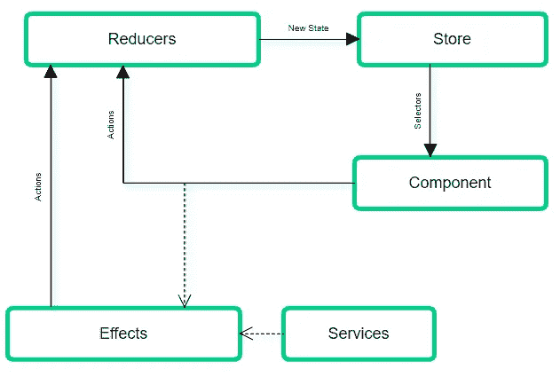

在图像中，我们可以看到 ngrx 流。我们来解释一下…

**1。**在最常见的场景中，一切都从组件视图开始。用户进行的一些交互可能会导致组件**发出一个动作**。

> **行动…**
> 
> 在 store 对象中，有一个分派(触发)动作的函数。动作是实现 NGRX 动作接口的类。这些操作类有两个属性(让我们以名为 GetUserName 的操作类为例):
> 
> type :这是一个只读的字符串，描述动作代表什么。例如:“[用户]获取用户名”
> 
> **payload** :这个属性的类型取决于这个动作需要向 reducer 发送什么类型的数据。在前面的例子中，将是一个包含用户名的字符串。并非所有动作都需要有效载荷。

**2.1。**如果这个动作没有触发效果，那么**一个 reducer 将分析动作**(通常使用一个 switch 语句)并返回一个新状态，这个新状态将是旧状态与通过调用动作而改变的值合并的结果。

> **减速器…**
> 
> Reducers 是接受两个参数的纯函数，前一个状态和一个动作。当一个动作被调度时，ngrx 会按照还原器被创建的顺序，遍历所有将先前状态和动作作为参数传递的还原器，直到找到该动作的实例。

**2.2。** **如果一个效果被调度一个动作触发，是因为在调用 reducer 之前，一些副作用将要发生。**这可能类似于调用 HTTP 服务来获取数据。

> **效果…**
> 
> ngrx 库生态系统上的效果，允许我们处理在 angular 组件或 ngrx 存储之外分派动作所引起的副作用。
> 
> 效果监听是否有任何动作被分派，然后，类似于 reducers 所做的，它检查该动作是否是它有案例的动作类型之一。
> 然后将执行一个副作用，通常是获取或发送数据到一个 API。
> 最后将发出另一个动作，通常是指副作用(成功、错误等)的结果状态的动作，然后一个 reducer 将进入场景，正如我们在 ngrx 流中已经提到的。

**2.2.1。** **效果完成后(副作用完成)一个新的“状态-结果”动作被效果**触发(可以是副作用成功也可以是失败)，我们又回到了 2.1 点。

**3。**现在商店有了新的状态。状态可以是一棵大的对象树，所以 **ngrx 引入了选择器，以便能够只使用我们在特定组件**中需要的对象片段。

> **选择器…**
> 
> 正如我们之前提到的，状态树可能会变成一个很大的对象，把所有的对象放在我们只需要其中一部分的地方是没有意义的。
> 
> NGRX store 为我们提供了函数“select”来获取我们的存储切片。但是，如果在使用组件中的数据之前，我们需要对该切片应用一些逻辑，该怎么办呢？
> 
> 那里是选择器采取行动的地方。它们允许我们将任何状态切片数据转换从组件中分离出来。store "select "函数接受一个纯函数的参数，这个纯函数就是我们的选择器。
> 
> **商店…**
> 
> 存储是一个对象(ngrx Store 类的一个实例),它将我们之前提到的东西(动作、减少器、选择器)集合在一起。例如，当一个动作被分派(使用存储对象分派函数)时，存储就是查找和执行适当的缩减器的那个。
> 
> 它也是保存应用程序状态的文件。

# NGRX 示例

太好了…那么我们已经完成了什么，为什么，什么时候，并介绍了 ngrx 的流程和参与者，现在是时候看看它的运行了。这很容易成为另一篇文章，但是在我看来，如果没有一个代码示例来解释我们已经解释过的所有内容是没有意义的，在这个示例中，我们可以看到所有正在运行的内容，并且您可以下载来使用它。

我们的例子将有一个用户列表，用户详细信息页面和一些初始配置信息，您需要在应用程序启动时获取。我们将能够实现一些重要的 ngrx 流。

这些是我们将要做的事情:

*   图书馆的安装
*   商店的文件夹结构
*   创建状态和初始值
*   创建操作
*   创建减速器
*   创造效果
*   创建选择器
*   设置好一切
*   在一些组件中使用存储

所以让我们开始吧…

## 图书馆的安装

我们将使用 angular cli 来创建项目，然后我们将添加 ngrx 库。

让我们创建一个项目:

```
ng new angular-ngrx --style=scss
```

让我们添加将要使用的 ngrx 库:

```
npm install @ngrx/core @ngrx/store @ngrx/effects @ngrx/store-devtools @ngrx/router-store --save
```

我们正在安装 ngrx 生态系统的几乎所有库。他们中的大多数都非常清楚他们的目的，比如核心、存储、效果，但是有几个你可能会想知道他们是干什么的。

*   store-dev tools。一些强大的调试工具。
*   **路由器商店。**保持存储中角度路由器的状态。

## 商店的文件夹结构

我们先从讨论存储的文件结构开始。该文件结构和所有商店配置应该存在于应用程序的核心模块中，但是在我们的示例中，我们没有这样的文件结构和商店配置，所以商店将存在于我们的应用程序模块中(如果您在核心模块中进行，步骤基本相同)。

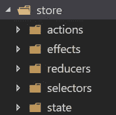

文件夹结构是实际存储组成的表示。您将有一个名为“商店”的主文件夹和五个子文件夹，分别代表商店的关键角色:“动作”、“效果”、“减少器”、“选择器”和“状态”。

## 创建状态和初始值

正如我们之前提到的，我们的应用程序将有两个主要部分，用户和配置。对于这两者，我们需要创建状态和初始状态，我们还需要对应用程序状态进行同样的操作。

我们创建了两个接口来定义用户和配置。我们也有一个用户 HTTP 响应，这只是一个 IUser 数组。

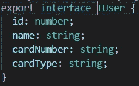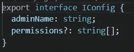

先说用户的状态(store/state/user.state.ts):

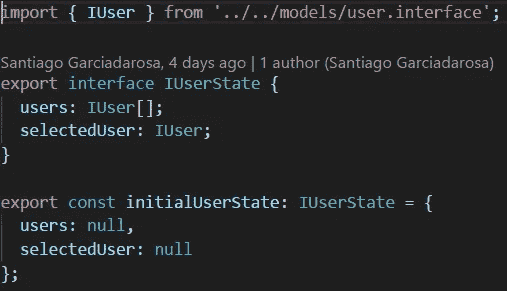

很清楚我们在这里做什么。

1.  我们用用户状态结构创建并导出一个接口。
2.  我们对实现最近创建的接口的初始用户状态做同样的事情。

对于配置状态，我们做同样的事情(store/states/config.state.ts):

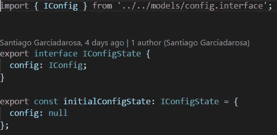

最后，我们需要生成应用程序状态(store/states/app.state.ts):

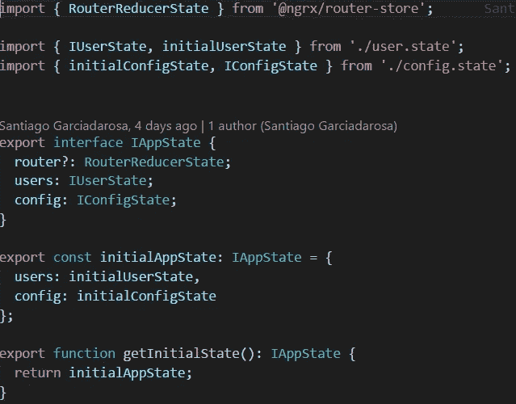

1.  应用程序状态包含用户和配置状态，还包含路由器状态。
2.  那么它有一个初始应用程序状态。
3.  最后，导出一个函数来获取初始状态(我们稍后会用到它)。

## 创建操作

> 请务必阅读我们在本文中讨论的动作定义。

我们需要为用户和配置创建动作。先说用户的动作(store/actions/user.actions.ts):

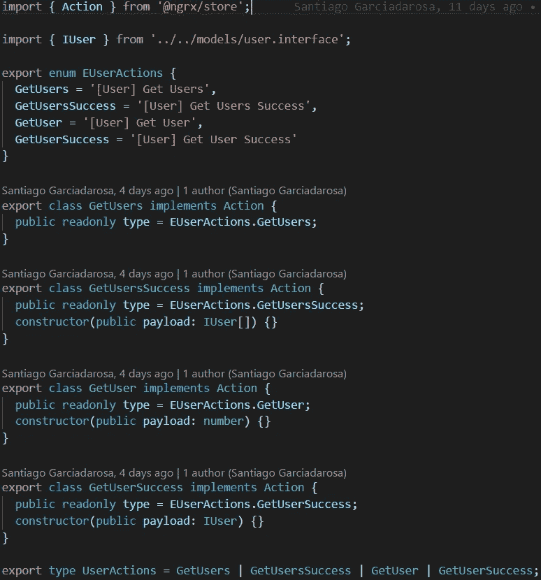

因此，这是一个为我们的应用程序中的特性或实体创建动作的好例子。让我们稍微浏览一下代码:

1.  我们导出一个包含动作类型定义的枚举。这样，我们避免了使用和重复字符串来使用动作类型，这是一个很容易出错的过程。
2.  我们为您的每个动作创建并导出一个类。它们都必须实现来自 ngrx 的动作接口。最后，我们将类型设置为一个枚举值，如果你需要一个有效负载，你可以将它添加到类的构造函数中。
3.  最后，我们导出一个包含动作类的类型。这将为我们提供类型检查，我们可以在我们的减速器中使用。

就是这样…创建动作很简单。让我们看看配置操作是什么样子的(store/actions/config . actions . ts):

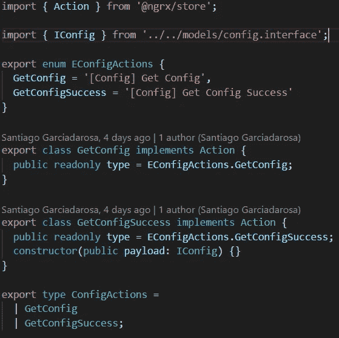

这里没有什么新的东西，你现在可能对这个文件上的一切都感到满意了。

太好了，我们已经定义了状态和动作…让我们创建减速器吧！

## 创建减速器

> 请务必阅读我们在本文中讨论的 Reducers 定义。

我们将让 reducers 响应一些动作，因为其他动作将由我们稍后实现的效果来处理。

我们将需要一个用于用户和其他配置的 reducer，但我们还需要生成应用程序 reducer，让我们开始查看用户 reducer(store/reducers/user . reducers . ts):

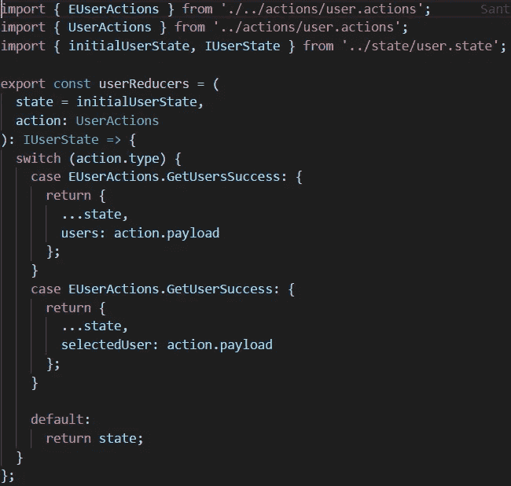

让我们来讨论一下实现:

1.  reducer 的声明接收状态，在这种情况下，用户操作并返回 IUserState。
2.  使用 switch 语句，我们为每个可能的动作类型生成案例。
3.  每种情况都返回一个新对象，它是旧状态和新值合并的结果。
4.  所有的 reducers 都有一个默认的结果，它只是返回状态而没有任何改变。

这就是了。你在减速器里找不到任何不同的东西。我们来看看配置还原器(state/reducers/config . reducers . ts):

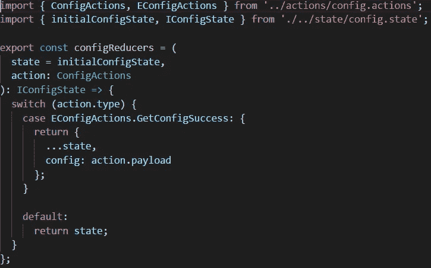

看着这些代码，你可能已经对你所看到的感到满意了，我们已经讨论了文件中的所有内容。

最后，我们来看看 app reducers (store):

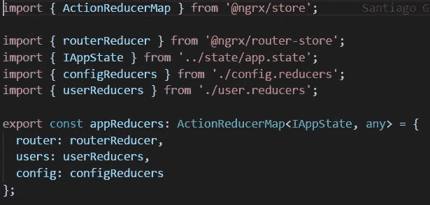

在这里，我们将所有缩减器添加到一个应用程序操作缩减器映射中。我们使用 action reducer 映射来检查添加的类型。稍后，我们将为商店模块提供此应用程序缩减器。

太好了！…现在我们有了我们的状态、我们的行动、我们的减少者，我们仍然需要效果和选择器。让我们添加我们的效果…

## 创造效果

> 请务必阅读我们在本文中讨论的效果定义。

您可能已经注意到，在 reducers 中，我们并没有处理我们已经创建的所有动作。这是因为我们要处理效果中缺失的动作，因为这些动作有副作用。

先说用户效果(store/effects/user.effects.ts):

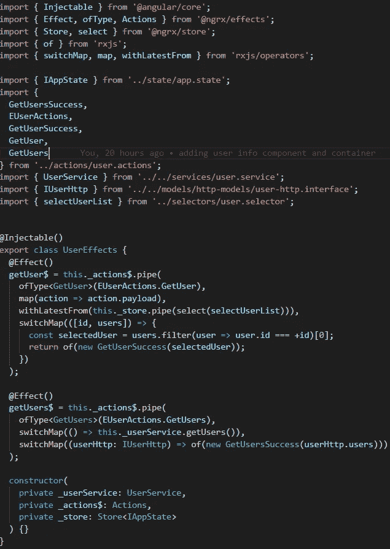

在这个文件中我们有很多事情发生。让我们试着解释一下:

1.  我们使用可注入的装饰器来声明我们的用户效果。
2.  我们使用 ngrx/effects 提供的效果装饰器来声明我们的效果。
3.  使用 ngrx/effects 提供的动作，我们将开始为这个效果设置我们操作者的管道。
4.  接下来是使用 ofType 操作符设置效果动作类型。
5.  下面的部分是 rxjs 操作符，我们使用它们来得到我们需要的东西(在本文中我们已经有了到 rxjs 文档的链接)。
6.  最后，在最后一个操作符中，效果是要分派另一个动作
7.  在构造函数中，我们注入我们将要使用的服务、ngrx/effects 的动作，在本例中还注入了 store(考虑到这是一个演示，我们正在从 store 的用户列表中获取选定的用户)

这和你将要看到的任何效果都是差不多的结构。在这种情况下，我们只调度一个成功的动作，但是我们也可以调度错误或任何其他类型的状态，我们希望在应用程序缩减器中处理这些状态。

我们来看看配置效果(store/effects/config . effects . ts):

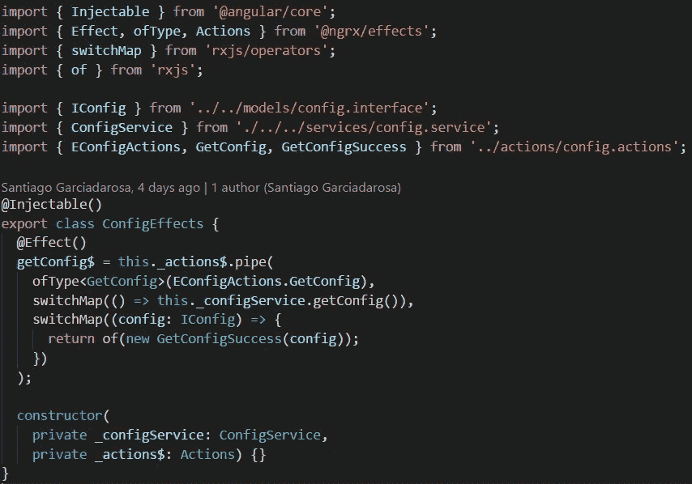

同样，您现在可能已经对上面的代码感到满意了。

现在是时候讨论选择器了…

## 创建选择器

> 请务必阅读我们在本文中讨论的选择器定义。

到处重复选择我们的状态片段是没有意义的，所以让我们创建一些可以重用的选择器。

像往常一样，让我们先看看用户选择器(store/selectors/user . selectors . ts):

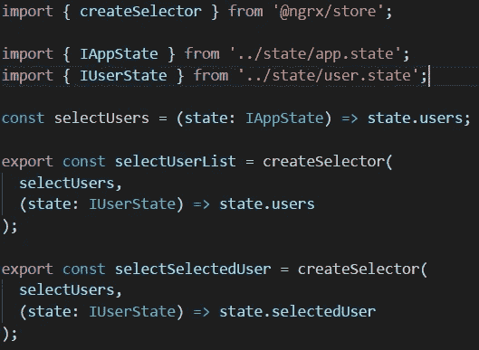

这非常清楚，因为我们没有在选择器中进行任何数据转换，相反，我们只是使用 ngrx/store 的 createSelector 函数返回选择器引用的存储片。

第一个参数是用来获取数据的存储部分(它可以是一个包含多个状态部分的数组)，第二个参数是匿名函数，用来解析选择器将要返回的内容。

这就是创建选择器的方法。让我们来看看配置选择器(store/selectors/config . selectors . ts):

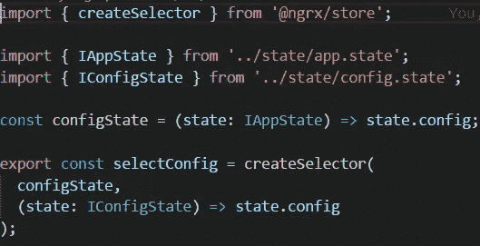

就像以前发生的一样，您已经对这些代码感到很舒服了。

我们已经创建了商店所需的所有东西，但我们需要将所有这些放在一起。为此，让我们看看下一部分。

## 设置好一切

太好了，我们创造了商店需要的所有东西，但我们还缺少一样东西，那就是把所有东西放在一起。我将在应用程序模块中完成它，但您可以在应用程序的核心模块中应用相同的内容。

让我们看看应用程序模块:

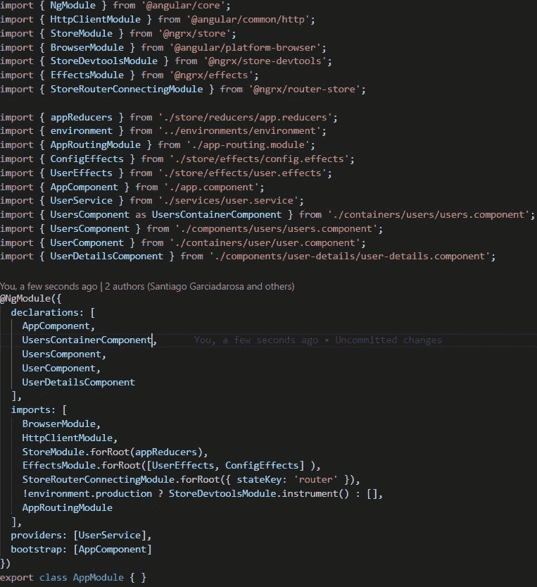

让我们提一下与我们商场环境相关的事情:

1.  我们导入我们的减速器，并将它们提供给 store 模块的根。
2.  我们导入我们的效果，并在一个数组中提供给效果模块的根。
3.  我们为提供 stateKey 路由器的路由器状态模块设置配置。
4.  如果环境不是生产环境，我们会添加商店开发工具。

前两步是必要的，而第 3 步和第 4 步我强烈推荐，但它们不是强制性的。

现在我们终于完成了…我们可以在我们的组件中使用我们的存储！

## 在一些组件中使用存储

也许现在，你在想:

> 伟大的 Santi，我花了 20 分钟读了你的文章，我知道了我需要知道的关于 ngrx 的事情:它是什么，什么时候使用它，如何设置它…这太棒了，但是你现在能告诉我我如何使用它吗！

是的，我可以！请不要失去它，我们就要结束了！让我们看看如何使用我们的商店…

**首先，我们来获取应用启动时的配置:**

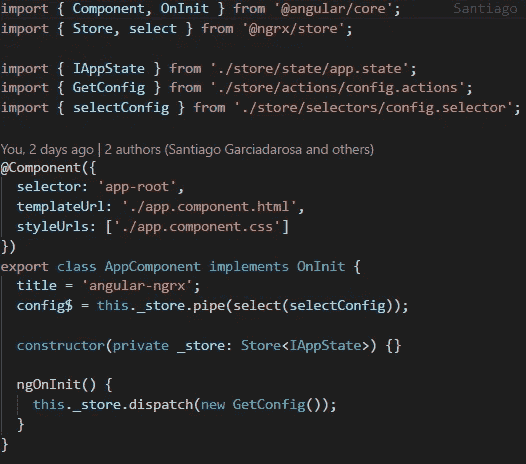

1.  我们将商店注入我们的 app.component。
2.  我们将组件属性设置为配置的选择器值，因为我们希望在 HTML 中显示一些信息。
3.  在 onInit 上，我们分派动作来获取配置。

就是这样…我们已经编码了将要处理那个动作的效果和将要处理那个效果的成功的缩减器。一旦商店有了新的状态，选择器就会改变我们属性的值。太神奇了！

我们是这样绑定 HTML 的:

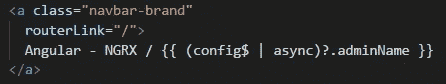

一旦 config$有了值，我们就会在 HTML 中看到它。

**现在让我们看看用户列表(containers/users/users . component . ts):**

> 我使用了容器组件和表示组件的概念。如果你不熟悉这种方法，看看这里的。

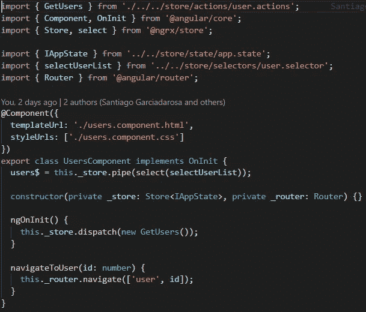

1.  类似于我们管理配置的方式，我们将获得用户列表。首先，我们将商店注入到用户组件中。
2.  在 onInit 上，我们分派动作来获取用户。
3.  我们在组件上创建一个属性，并使用用户列表选择器将它分配给用户列表。

HTML 看起来像这样:

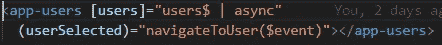

我们在表示组件中呈现用户列表，发送列表并将选择的用户绑定到导航功能，我们可以在上面的用户容器组件中看到该导航功能。

太好了…我们如何显示选中的用户？…

**让我们来看看用户容器组件:**

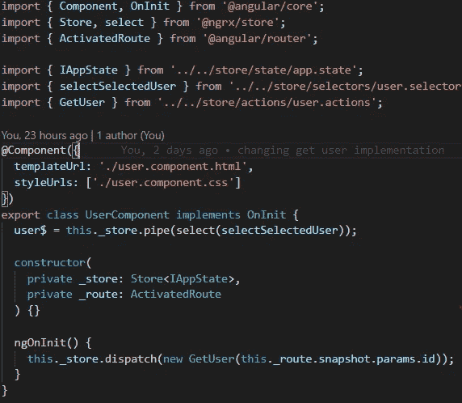

该组件从激活的路由中获取参数 id，对于其余的，您可能已经熟悉了，调度发送 id 作为参数，选择选定的用户…

如果你想看到所有的代码，只需进入 GitHub repo。

如果您调试应用程序，您可以看到开发人员的工具，这些工具使用起来非常简单……但是我们在本文中已经介绍了足够多的内容，我相信您会毫无问题地熟悉这些工具。

# 结论

在本文中，我试图通过向您提供进入这个世界所需要知道的一切来提供一个清晰明了的 ngrx 介绍。

我们开始解释概念，理解它是如何工作的，为什么要使用它，最后，我们完成了一个完整的基本例子。

[这里是 GitHub 回购…](https://github.com/SantiagoGdaR/angular-ngrx)

我建议您下载它，并稍微使用一下代码。

我真的希望这篇文章能帮助你理解这个模式。

## 一些感谢…

感谢 [Leosvel Pérez Espinosa](https://medium.com/u/b3a9a2b97723?source=post_page-----4ed61c89c1fc--------------------------------) 花时间与我讨论 ngrx 的一些特性，并感谢 [Felipe Almeida](https://medium.com/u/da23192257f6?source=post_page-----4ed61c89c1fc--------------------------------) 提供这个令人难以置信的横幅！