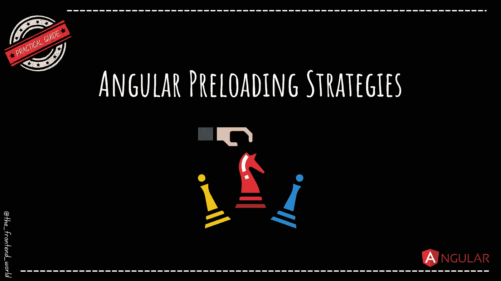

# 角度预加载策略

> 原文：<https://levelup.gitconnected.com/angular-preloading-strategies-3bc977ca3c7e>

## 快速浏览这些策略及其用法！



作者:FAM

如今，延迟加载是应用程序的基本技术。它还优化了它的负载和大小。这是一种智能的方式，只加载和渲染我们需要的东西。

如果您感兴趣，我在本文中详细介绍了延迟加载:

[](https://medium.com/swlh/optimize-the-app-startup-time-with-lazy-loading-part-1-69be2a27322e) [## 利用延迟加载优化应用启动时间—第 1 部分

### angular 中的懒装是什么？懒惰装载是如何工作的？

medium.com](https://medium.com/swlh/optimize-the-app-startup-time-with-lazy-loading-part-1-69be2a27322e) 

延迟加载需要基于上下文和您的用户故事需求来实现。这就是为什么用不同的策略有不同的实现方式。

# 角度预加载策略

*   **无预加载(默认)=延迟加载**
*   **预载全部(我们刚刚看到的)**
*   **定制策略**

这些策略的主要目的是防止在不需要的时候愚蠢地预加载整个应用程序。

想想吧。您可能希望预加载所有最常用的模块，并且仅延迟加载管理模块，因为并非所有用户都是管理用户。我们可以建立自己的战略。这允许我们预加载一些惰性加载的模块，而不是全部。

# 如何在你的应用中创建预加载策略？

## **1-构建预加载策略服务**

策略服务是带有类和可注入注释的经典服务。如果您需要了解更多关于服务和依赖注入的知识，这里有一篇大图文章，其中包含代码示例，可以帮助您理解下面的示例:

[](https://famzil.medium.com/dependency-injection-di-angular-21172d932f4f) [## 依赖注入(DI) —角度

### 它是什么，它是如何工作的？+具体例子

famzil.medium.com](https://famzil.medium.com/dependency-injection-di-angular-21172d932f4f) 

**这里是我们的策略服务:**

## **2-设置预加载策略选项**

现在，我们的定制策略创建完毕。我们准备在 app 路由模块中使用它(与之前的方式相同，只是策略类型发生了变化):

很好，我们的预加载策略设置为自定义策略。但是等等，我们如何选择要应用这个策略的模块呢？

在自定义策略中，我们只激活 preload 设置为 true 的模块:

```
if(***route.data && route.data['preload']***){
      return load();
}
```

因此，在我们的例子中，我们只有一个延迟加载的模块，我们想在其上应用这个策略。然后，我们需要将预加载标志设置为真:

```
...RouterModule.forRoot([
    ...
    {
      path: 'customers',
      canActivate:[AuthGard],
      **data: {preload: true},**
      loadChildren: () =>
          import('./cutomers/cutomers.module').then(m => m.CustomersModule)
    }
    ], { preloadingStrategy: CustomStrategy })
],
...
```

对于管理模块，我们可以通过将标志设置为 false 来延迟加载它，而无需预加载: ***数据:{preload: fale}。*** 就是这样！

# **最后但同样重要的是**

有些包可以做到这一点，或者更好的是，你可以使用机器学习来预测用户更有可能在你的网站上访问什么数据。让我们来发现这些包。

## ngx-快速链接

如果我问你，用户需要在页面上立即访问什么？整页？还不够，对吧？用户还需要能够在点击页面上的任何链接时快速加载，对吗？

这就是 Angular 的[快速链接](https://github.com/GoogleChromeLabs/quicklink)实现的工作。它提供了一个路由器预加载策略，可以自动下载与屏幕可见链接相关联的延迟加载模块。很聪明，不是吗？

*快速链接*试图使后续页面的导航加载更快。它:

*   **检测视口**内的 `**routerLink**` **(使用[交叉点观察器](https://developer.mozilla.org/en-US/docs/Web/API/Intersection_Observer_API)**
*   **等待，直到浏览器空闲**(使用 [requestIdleCallback](https://developer.mozilla.org/en-US/docs/Web/API/Window/requestIdleCallback) )
*   **检查用户是否不在慢速连接**(使用`navigator.connection.effectiveType`)或是否启用了数据保护(使用`navigator.connection.saveData`)
*   **使用 Angular 的预取策略预取懒惰加载的模块**

## 想试试吗？

要安装该软件包，您可以使用 npm:

```
npm i ngx-quicklink --save
```

将`QuicklinkModule`导入到`AppModule`

如果你有例外怎么办？一些你想忽略的模块？

以下是要添加到路由配置中的内容:

```
{
  path: 'contact',
  loadChildren: import(() => './contact/contact.module').then(m =>    m.ContactModule),
  **data: { preload: false}**
}
```

如果你想知道更多，还有另一个包可以分析你的数据，并预测机器学习要加载什么:

[](https://medium.com/datadriveninvestor/enhance-your-user-experience-with-machine-learning-9aae6e30b761) [## 通过机器学习增强您的用户体验

### 通过预测预取为您的访客提供最佳用户体验

medium.com](https://medium.com/datadriveninvestor/enhance-your-user-experience-with-machine-learning-9aae6e30b761) 

> *当* [*有新的热门文章出来的时候第一个被通知*](https://famzil.medium.com/subscribe) *！*

如果你有兴趣成为付费会员，你可以使用我的推荐链接。下次见

亲爱的读者，感谢你在我生命中的存在。

**让我们在** [**上取得联系**](https://medium.com/@famzil/)**[**Linkedin**](https://www.linkedin.com/in/fatima-amzil-9031ba95/)**[**脸书**](https://www.facebook.com/The-Front-End-World)**[**insta gram**](https://www.instagram.com/the_frontend_world/)**[**Youtube**](https://www.youtube.com/channel/UCaxr-f9r6P1u7Y7SKFHi12g)**或**[](https://twitter.com/FatimaAMZIL9)********

******参见我的关于网络要素和一般文化的电子书。******