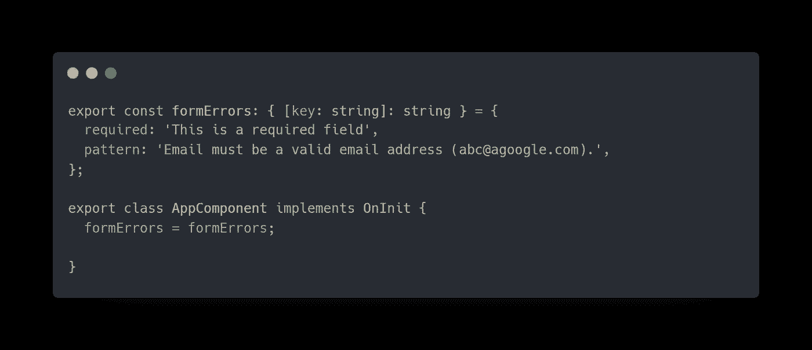

# 带自定义验证的角反应式表单

> 原文：<https://levelup.gitconnected.com/angular-reactive-forms-with-custom-validation-703cc6eddeb5>

由[萨法尔·萨法罗夫](https://unsplash.com/@codestorm?utm_source=medium&utm_medium=referral)在 [Unsplash](https://unsplash.com?utm_source=medium&utm_medium=referral) 上拍摄的照片

形式是每个角度项目的主要部分。反应式和模板驱动是 Angular 提供的通过表单处理用户输入的两种主要方法。模板驱动的表单更适合那些需求非常基本，并且具有可以在模板中单独管理的逻辑的表单。乍一看，反应式表单似乎很复杂，但是它们更具可伸缩性、可重用性和可测试性。在这篇文章中，我将实现一个带有动态和自定义验证器的角度反应式表单。造型是使用有棱角的材料完成的。

## 设置角度项目

首先，我们必须初始化我们的角度项目，并添加角度材料。您可以通过在`Angular-CLI.`中运行以下命令来轻松完成

项目初始化成功后，我们可以将应用中将要用到的物料模块导入到`app.module.ts`中

应用程序模块

## 开始使用反应式表单

要开始使用反应式表单，首先，我们必须在`app.module.ts`中导入`**Reactive Forms Modules**`而不是`**FormsModule**`。

应用程序模块

现在让我们继续讨论`app.component.ts`文件。在这里，我们需要从`**@angular/forms**` 导入两个模块来构建和验证表单。

应用程序组件

是时候开始创造我们的角形了。首先，让我们创建一个带有内置验证的基本表单。

## **1。创建反应式表单**

作为第一步，我们必须创建一个类型为`**FormGroup**`的属性，它也需要从`**@angular/forms**` **中导入。**然后在这个 FormGroup 的对象中，我们需要为我们的每个输入创建单独的`**FormControl’s**`属性。

代码应该如下所示:

应用程序组件

有一些要点需要注意。这里我在`**ngOnInit()**`方法中包含了 formGroup，因为我们需要这个表单在页面加载时出现。我还添加了一个名为`**onSubmit()**`的方法，这个方法将在表单提交时被调用。

接下来，我们必须将这个表单绑定到我们的 HTML。`**formGroup**`将表单绑定到我们创建的 FormGroup 对象，每个表单域应该有`**formControlName,**`，它与`component.ts file`中给出的名称相同。HTML 表单应该如下所示:

app.component.html

这里你可以注意到**角色**输入从一组选项中选择一个值。要了解更多关于`mat-select`的工作原理，您可以参考 [*角度材料选择。*](https://material.angular.io/components/select/overview)

## 2.添加内置验证

Validator 类中有几个内置的验证函数可供使用。让我们给表单域添加一些内置的验证。

添加验证表单后，一个组如下所示。

应用程序组件

## 添加自定义验证

下一步是添加定制的验证器函数，它动态地工作到我们的组件中。考虑一种情况，当用户选择角色为**卖方**时，联系号码是必需的，但是如果用户的角色为**买方**联系号码是可选的。在这种情况下，我们需要在表单中添加自定义验证器。

应用程序组件

> *请记住，*`***setValidators()***`**方法会清除所有之前的验证器，因此，如果您需要向 phone form-field 添加任何其他验证器，请确保在*`***setPhoneValidation()***`**方法中声明它们。***

**此外，为了确保`**setPhoneValidation()**` 方法正常工作，请在`ngOnInit()`中调用它。**

## **显示错误消息**

**好了，已经应用了验证，现在让我们看看如何显示错误消息。因此，我们带有验证的整个表单应该如下所示:**

****

**应用程序组件**

****

**app.component.html**

**另外，如果整个表单无效，确保禁用**提交**按钮。**

****

**app.component.html**

**运行应用程序的时间到了！这是我们最终输出的图片:**

****

**最终输出**

**你可以在这里找到这个项目的最终代码。**

**感谢您的阅读。**

**编码快乐！**

## **参考**

 **[## 有角的

### Angular 是一个构建移动和桌面 web 应用程序的平台。加入数百万开发者的社区…

angular.io](https://angular.io/guide/reactive-forms)**  **[## 在 Angular 中构建自定义验证器

### Gaurav Singhal 语言框架和工具大多数 web、桌面和移动应用程序都包含各种形式的…

www.pluralsight.com](https://www.pluralsight.com/guides/building-custom-validators-in-angular)**