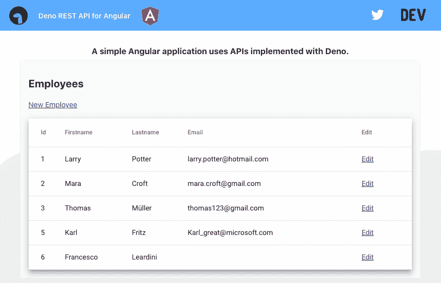
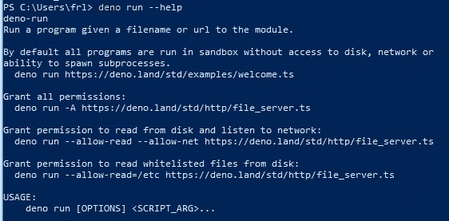
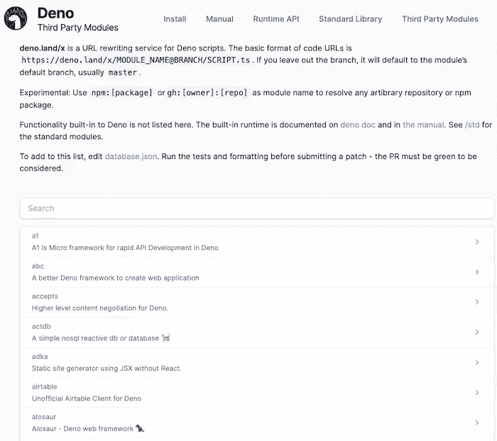
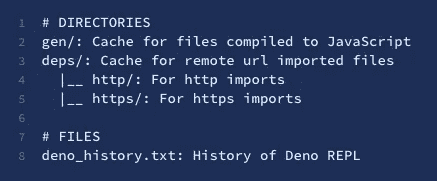

# 带 Deno 的角度静止 API 模拟

> 原文：<https://levelup.gitconnected.com/angular-rest-api-mock-with-deno-36ce91bcb8bf>

## 如何将你的客户端应用从模拟网络响应中分离出来？


在我们的一门 Angular 课程中，我们目前正在使用 Node Express 服务器向 Angular 应用程序提供模拟数据。

由于 Deno 已经发布了正式版 1.0(2020 年 5 月中旬)，我决定用它做实验，并为课程编写一个新的 web 服务器。最终的布局看起来像下面的截图(从布局的角度来看，你看不到任何花哨的东西):



本文是一个循序渐进的实用指南，重点是为 Angular 应用程序创建一个具有完整 CRUD 操作的 Rest API。不过我不会涉及太多关于 Deno 的细节，因为这会让帖子太长，而且已经有很多关于 Deno 的好介绍了。

# 什么是 Deno

[Deno](https://deno.land) 由 Ryan Dahl 创建，他也是 Node.js 的创始人

> Deno 是一个简单、现代和安全的 JavaScript 和 TypeScript 运行时，使用 V8 并内置于 Rust 中。

如果您已经熟悉 Node，那么 Deno 可以做完全相同的事情，但是速度更快。Deno 可以看做是 *rewamp* Node.js 的一种方式，解决同一个 Ryan 认为他“遗憾”的不同方面。
以下是他在 JSConf EU 2018 上的发言，他在发言中阐述了这些观点:

“Node.js 让我后悔的 10 件事——Ryan Dahl”

# 安装 Deno

我们可以选择使用包管理器或直接在 shell 中执行命令。

## 通过命令安装

**带外壳(Mac):**

```
curl -fsSL https://deno.land/x/install/install.sh | sh
```

**使用 PowerShell (Windows):**

```
iwr https://deno.land/x/install/install.ps1 -useb | iex
```

## 通过软件包管理器安装

**同** [**自制**](https://formulae.brew.sh/formula/deno) **(Mac):**

```
brew install deno
```

**同** [**巧克力**](https://chocolatey.org/packages/deno) **(Windows):**

```
choco install deno
```

Deno 下载并在本地安装后，在 shell 中运行`deno --version`来验证安装。我们应该得到类似的输出:

```
$ deno --version
deno 1.0.3
v8 8.4.300
typescript 3.9.2
```

如果我们想要一个可用命令的概览，我们可以调用指令`deno --help`，显示所有可用的子命令。
我们甚至可以获得每个命令的更多细节，只需像`deno run --help`一样添加标志`--help`



# 可用模块

Deno 提供了一个**标准模块**的列表，由核心团队审查，并保证与特定的 Deno 版本一起工作。这些标准模块位于 https://deno.land/std，为大多数基本任务提供功能，例如:uuid 生成、http 调用和文件系统访问。

除此之外，deno.land 网站还为在[deno.land/x](https://deno.land/x)兼容 deno 的**第三方模块**提供公共托管服务。
我们可以搜索模块的详尽集合。

现在一切就绪，让我们开始写一些代码。为您的服务器定义根文件夹:



# 创建服务器

现在一切就绪，让我们开始写一些代码。为您的服务器定义根文件夹:

```
mkdir webServer && cd webServer
```

## Server.ts

创建一个`server.ts`文件。

> *💡* ***注意:*** *我们可以使用普通的 JavaScript 来代替 typescript，但是我们会失去 typescript 提供的许多好处。此外，由于 Deno 是在 Rust 和 Typescript 之上编写的，它可以直接编译。ts 文件给我们。*

## 使用标准的 http 模块

要创建 HTTP 服务器，我们可以从`http`标准模块导入`server.ts`文件:

> *💡* ***注意:*** *您可能已经注意到，我们在这里是从 url 导入，而不是从本地路径。这是 Deno 中的一个新概念，我们不需要在本地安装软件包。我们可以导入他们的最新版本并缓存，即使离线也可以使用。Deno 使用 es 模块导入包，而 from Node 使用 npm。这是在没有* `*node_modules*` *文件夹和* `*package.json*` *文件的情况下翻译的(在我们的 webServer 文件夹中没有它们的任何踪迹)。使用 Deno，我们可以通过它的 url 直接导入我们想要的包。*

## 使用第三方模块

或者，我们可以为 Deno 的 http 服务器选择一个中间件框架，包括一个路由器中间件。这个中间件框架受 Koa 的启发，因此已经为许多 Node.js 开发人员所熟悉。对于我们的模拟服务器，我决定使用 oak。

如果你已经使用过 Express 上面的代码应该已经很熟悉了。在创建了一个`Application`类的实例后，我们可以使用`use()`方法堆叠多个中间件，然后激活服务器(`listen()`方法)，等待传入的请求。

## 克-奥二氏分级量表

我们可以为我们的应用程序定义 CORS，否则我们每次试图从 Angular 应用程序访问服务器时都会收到客户端错误。Deno 提供了一个 cors 模块(`https://deno.land/x/cors/mod.ts`)，其默认设置已经捕获了许多常见情况。我们可以通过以下调用启用 CORS:

```
app.use(oakCors());
```

默认配置，因此没有上面代码片段中的参数，转换为下面的选项集:

```
{
  "origin": "*",
  "methods": "GET,HEAD,PUT,PATCH,POST,DELETE",
  "preflightContinue": false,
  "optionsSuccessStatus": 204
}
```

## Routes.ts

由于我们的模拟服务器非常简单，我决定只创建一个文件夹`src`来存放所有的业务逻辑，并将其与`server.ts`文件分开。

routes 文件包含了我们希望向 Angular 客户端公开的所有端点，在我们的例子中实现了经典的 CRUD 操作。

```
import { Router } from "https://deno.land/x/oak/mod.ts";
import {
    getAllEmployees,
    getEmployeeById,
    updateEmployee, 
    addEmployee,
    deleteEmployee
} from "./employeeApis.ts";

const router = new Router();

router.get("/employees", getAllEmployees)
    .get("/employees/:id", getEmployeeById)
    .put("/employees/:id", updateEmployee)
    .post("/employees", addEmployee)
    .delete("/employees/:id", deleteEmployee);

export default router;
```

## 员工. ts

我们需要为我们的领域定义一个通用模型。这里我们设计了一个`Employee`对象，有一些静态数据，没有数据库存储，因为这超出了课程范围，只关注角度和客户端开发。

```
export interface Employee {
    id: number;
    firstname: string;
    lastname: string;
    email?: string;
}

export const EmployeeData: Employee[] = [
    { id: 1, firstname: 'Larry', lastname: 'Potter', email: 'larry.potter@hotmail.com' },
    { id: 2, firstname: 'Mara', lastname: 'Croft', email: 'mara.croft@gmail.com' },
    { id: 3, firstname: 'Thomas', lastname: 'Müller', email: 'thomas123@gmail.com' },
    { id: 5, firstname: 'Karl', lastname: 'Fritz', email: 'Karl_great@microsoft.com' },
    { id: 6, firstname: 'Paolo', lastname: 'Rossi' }
];
```

## EmployeeApis.ts

在这个文件中，我们实现了每个端点背后的真正逻辑。任何数据突变都会影响本地数据结构 *EmployeeData* ，如上所述。
代码非常简单，不言自明，因此我不会详细讲述。

```
import { EmployeeData, Employee } from './employee.ts';

// Returns all available employees
export const getAllEmployees = ({ response }: { response: any }) => {
    response.body = EmployeeData;
};

// Returns one employee by its Id or 404 if not found
export const getEmployeeById = ({ params, response }: { params: { id: string }; response: any }) => {
    const selectedEmployee: Employee | undefined = EmployeeData.find((employee) =>
        employee.id === +params.id
    );
    if (selectedEmployee) {
        response.status = 200;
        response.body = selectedEmployee;
    }
    else {
        response.status = 404;
        response.body = [];
    }
};

// Add a new employee to the list
export const addEmployee = async (
    { request, response }: { request: any; response: any },
) => {
    if (!request.hasBody) {
        response.status = 400;
    } else {
        const newEmployee: Employee = await request.body();

        newEmployee.id = getNextEmployeeId();
        EmployeeData.push(newEmployee);
        response.status = 201;
    }
};

//Provides the next number to be used as employee Id
function getNextEmployeeId(): number {
    let maxId = 1;
    EmployeeData.forEach(p => {
        maxId = Math.max(p.id, maxId);
    });
    return maxId + 1;
}

// Removes an employee by its Id or 404 if not found
export const deleteEmployee = (
    { params, response }: { params: { id: string }; response: any },
) => {
    const targetId = +params.id;
    const newEmployeeList = EmployeeData.filter(x => x.id !== targetId);
    if (newEmployeeList.length < EmployeeData.length) {
        replaceCollection(EmployeeData, newEmployeeList);
        response.status = 200;
    } else {
        response.status = 404;
    }
};

// Updates en existing employee
export const updateEmployee = async (
    { params, request, response }: {
        params: { id: string };
        request: any;
        response: any;
    },
) => {
    const targetId = +params.id;
    let employeeToUpdate: Employee | undefined = EmployeeData.find((employee) =>
        employee.id === targetId
    );
    if (employeeToUpdate) {
        const body = await request.body();
        const newEmployeeData: Employee = body.value;

        let updatedData = EmployeeData.map((e: Employee) => {
            return e.id === targetId ? { ...e, ...newEmployeeData } : e;
        });

        replaceCollection(EmployeeData, updatedData);
        response.status = 200;
    } else {
        response.status = 404;
    }
};

// Replaces the employee data structure with a new collection
function replaceCollection(originalData: Employee[], newData: Employee[]) {
    originalData.splice(0, originalData.length);
    originalData.push(...newData);
}
```

# 启动服务器

现在我们已经创建了所有需要的文件，是时候启动服务器了。从托管服务器文件的路径在 shell 中执行以下命令:

```
deno run --allow-net server.ts
```

> *⚠️* ***注意:*** *如果没有添加 Deno 安装根($HOME/)。deno/bin)添加到您的环境变量中，那么您可能需要将文件路径添加到 server.ts*

通过运行该命令，不同的模块被下载，但是我们的解决方案中没有为它们创建文件夹。

```
Compile file:///.../server.ts Download https://deno.land/x/oak/mod.ts Download https://deno.land/x/oak/application.ts Download https://deno.land/x/oak/context.ts Download https://deno.land/x/oak/cookies.ts Download https://deno.land/x/oak/httpError.ts Download https://deno.land/x/oak/middleware.ts Download https://deno.land/x/oak/request.ts Download https://deno.land/x/oak/response.ts Download https://deno.land/x/oak/router.ts Download https://deno.land/x/oak/send.ts Download https://deno.land/x/oak/types.ts Download https://deno.land/x/oak/deps.ts Download https://deno.land/x/oak/keyStack.ts Download https://deno.land/x/oak/tssCompare.ts Download https://deno.land/std@v1.0.0-rc1/http/server.ts 
...
```

这些模块从现在开始被缓存，我们不需要再次下载它们，除非我们明确地想要，例如使用`--reload`选项。默认情况下，缓存的模块存储在 Deno 的基目录中:$HOME/。deno (DENO_DIR)，但是如果需要，我们可以更改这个位置，通常是在生产环境中。

`DENO_DIR`包含以下文件和目录:



> *💡* ***注意:*** *在 Deno 中，需要在运行一个程序之前给出明确的权限。在上面的命令中，我们必须使用选项* `*--allow-net*`授予网络访问权限

如果我们忽略此选项，在下载完所有模块后，我们会得到以下错误:

```
error: Uncaught PermissionDenied: network access to "127.0.0.1:8280", run again with the --allow-net flag
    at unwrapResponse ($deno$/ops/dispatch_json.ts:43:11)
    at Object.sendSync ($deno$/ops/dispatch_json.ts:72:10)
    at Object.listen ($deno$/ops/net.ts:51:10)
    at listen ($deno$/net.ts:164:18)
    at Application.serve (server.ts:261:20)
    at Application.listen (application.ts:106:31)
    at server.ts:18:11
```

这就是我们创建一个简单的 http 服务器来模拟客户端应用程序所需的全部内容。现在让我们创建一个使用 REST APIs 的 Angular 项目。

# 排除故障

Deno 支持 V8 Inspector 协议。我们可以用 Chrome DevTools 或其他支持该协议的客户端来调试 Deno 程序。

因为我们很可能使用可视化代码来实现我们的 Angular 应用程序，所以让我们看看如何从我们的 IDE 中直接调试 Deno 服务器。一个官方插件目前正在建设中，但目前我们可以创建一个`launch.json`文件:

```
{
  "version": "0.2.0",
  "configurations": [
    {
      "name": "Deno",
      "type": "node",
      "request": "launch",
      "cwd": "${workspaceFolder}",
      "runtimeExecutable": "deno",
      "runtimeArgs": ["run", "--inspect-brk", "-A", "server.ts"],
      "port": 9229
    }
  ]
}
```

> *💡* ***注意:*** *如果你给你的脚本文件命名与* `*server.ts*` *不同，你必须相应地修改“运行时间参数”的最后一项。*

有了上面的配置，VS 代码调试器将在:`127.0.0.1:9229`运行，并拦截我们设置的所有断点。

# 更多关于 Deno 的信息

如果你有兴趣了解更多关于 Deno 的知识，我推荐关于 v 1.0 版本的官方[博文](https://deno.land/v1)。

还要留意 Deno 备忘单，因为它是一个很好的资源，可以让你对所有可用的命令有一个总的了解。

# 创建有角度的服务

对于角度部分，我将只描述调用我们的 REST 服务器的 http 服务。所有的代码都可以在 Github repo 上找到，你可以下载整个项目。

如果你还没有一个现成的 Angular 应用程序，并且你需要如何创建一个的指导，看看我关于它的帖子。

## 员工服务. ts

多亏了 schematics，在 Angular 中生成文件非常容易:

```
ng g service employee
```

这个命令创建了`EmployeeService.ts`及其单元测试文件。在服务中，我们定义了实现 CRUD 操作的方法，这些方法将调用我们之前实现的 Deno 服务器的端点。

```
import { Employee } from './../model/employee.model';
import { Injectable } from '@angular/core';
import { HttpClient } from '@angular/common/http';

import { Observable ,  of ,  throwError as _throw } from 'rxjs';
import { catchError, delay, map } from 'rxjs/operators';
import { environment } from '../../../environments/environment';

@Injectable()
export class EmployeeService {

    constructor(private http: HttpClient) { }

    getEmployees(): Observable<Employee[]> {
        return this.http
          .get<Employee[]>(`${environment.apiBaseUrl}/employees`)
          .pipe(catchError((error: any) => _throw(error)));
      }

    getEmployee(id: number): Observable<Employee> {
      return this.http
        .get<Employee>(`${environment.apiBaseUrl}/employees/${id}`)
        .pipe(catchError((error: any) => _throw(error)));
    }

      createEmployee(payload: Employee): Observable<Employee> {
        return this.http
          .post<Employee>(`${environment.apiBaseUrl}/employees`, payload)
          .pipe(catchError((error: any) => _throw(error)));
      }

      updateEmployee(payload: Employee): Observable<Employee> {
        return this.http
          .put<Employee>(`${environment.apiBaseUrl}/employees/${payload.id}`, payload)
          .pipe(catchError((error: any) => _throw(error)));
      }

      removeEmployee(payload: Employee): Observable<any> {
        return this.http
          .delete<any>(`${environment.apiBaseUrl}/employees/${payload.id}`)
          .pipe(catchError((error: any) => _throw(error)));
      }
}
```

## 环境. ts

在文件`environment.ts`中，我们可以保存服务器的基本 url，并最终保存其他配置密钥。`environment.prod.ts`保留用于生产构建，通常具有不同值的键，以生产服务器为目标，而不是临时服务器。

```
export const environment = {
  production: false,
  apiBaseUrl: 'http://localhost:8280'
};
```

# 结论

正如我们所看到的，用 Deno 创建一个 web 服务器并将其用作我们的客户端应用程序的模拟是非常容易的。

这种架构非常方便，因为它允许我们将 web 应用程序从服务器模拟中分离出来。我们可以从客户端执行真正的网络调用，而无需在将 Angular 应用程序部署到生产环境之前对其进行任何更改。

# Github 回购

示例代码(Angular 和 Deno 服务器)可在 Github:【https://github.com/pacoita/deno-api-mock 获得

*原载于 2020 年 6 月 9 日*[*https://dev . to*](https://dev.to/paco_ita/create-an-angular-rest-api-mock-with-deno-598b)*。*