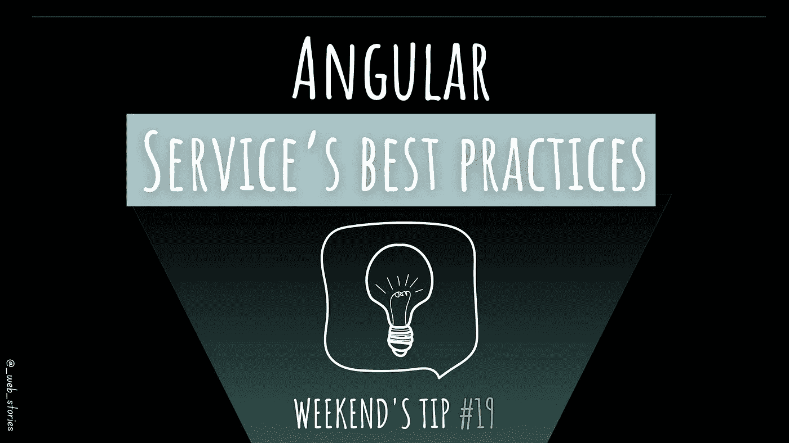
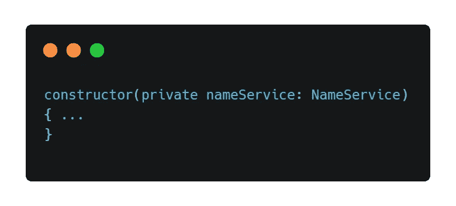
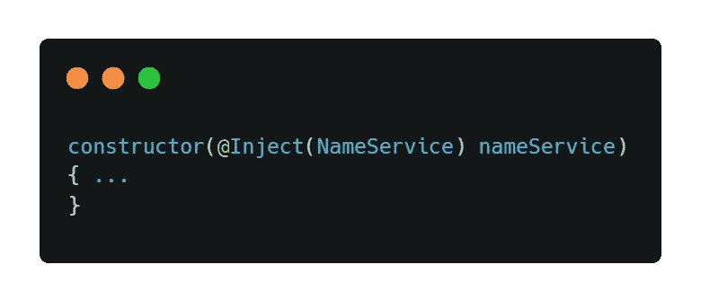

# Angular Service 的最佳实践

> 原文：<https://levelup.gitconnected.com/angular-services-best-practices-f3d26ddaeedb>

作者:FAM

## 你好👋

这个周末的小贴士是关于角度服务的。我希望你会喜欢，让我们开始吧！

# 命名

在你的团队中设定一个命名策略，并尊重它。尽管 Angular 风格指南并不建议系统地给所有的 Angular 服务加上后缀，因为有些名字已经不言自明了，比如“Logger”。我更喜欢给所有服务加上后缀，这样当你阅读 LoggerService 时，你就知道它是一个服务，毫无疑问！

文件名也应该通过添加一个点服务`.service.ts`来表达自己。

# 服务角色

*   **单一责任原则**

一旦记住服务应该遵守单一责任原则，服务就必须服务于一个单一的目的。你会有一个更干净的应用，容易被其他开发者阅读，也容易维护(认证有问题=检查认证服务)。你很快就能发现问题所在，**识别代码一目了然原理**。测试也是如此。

*   **复杂逻辑**

容器组件或父组件拥有最少的逻辑，它管理并最终将数据/信息发送给它的子组件，这些子组件只是表示性的组件，也称为虚拟组件(尽管我不喜欢这个术语！).尽管如此，组件不应该有复杂的逻辑，因为它已经有了责任:它呈现给用户的内容，它分派给子组件的数据，它的简单逻辑等等。已经够了。组件中需要避免的一个例子是 HTTP 调用，这更像是一项服务工作。组件不应该获取数据或者知道数据来自哪里。

*   **服务功能**

对单一责任原则有不同的理解。对于一些开发人员来说，服务应该只包含其职责/功能的功能，所以他们不会将其他服务注入服务本身。我不这么认为。例如，如果我需要从 ProductService 获取一些数据，以便在 OrderService 中使用。我会将产品服务注入到我的订单服务中。与订单相关的任何逻辑仍在 OrderService 中。产品数据来自已经被隔离的 ProductService，在这里仅用于获取在 OrderService 功能中使用的输入数据。所以我们在这里没有混淆，ProductService 的工作是围绕产品的，而 OrderService 管理与订单相关的事情。

# 注射

一个有角度的服务必须注入到你想用的地方。所以你需要:

*   通过向类中添加装饰器`***@Injectable***`来使服务可注入。这里的`***providedIn***`告诉 Angular 把这个服务注入到 app 根注入器。根注入器的工作是在需要的时候注入服务。

*   然后你把它注入一个组件。建议使用以下语法:

而不是这个:

如果您注入的服务不使用服务数据类型作为服务的令牌，那么第二个选项更合适。

你觉得这些建议怎么样？你同意还是不同意？我很想听听你的观点，^^

今天到此为止，再见🙋

如果你有任何问题或反馈，请点击评论或通过 LinkedIn 联系我— **我洗耳恭听！**

[**想请我喝杯咖啡吗？☕️**](https://www.buymeacoffee.com/fatimaamzil)

> 让我们为 2022 年打造一个更好的‘我们’！

> 如果你喜欢我的文章， [**订阅**](https://famzil.medium.com/subscribe) 获取我的最新。如果你自己喜欢体验媒介，可以考虑通过[**注册会员**](https://famzil.medium.com/membership) 来支持我和其他成千上万的作家。它每月仅花费 5 美元，它支持我们，作家，你也有机会通过你的写作赚钱。当然，你可以随时取消会员资格。通过注册[这个链接](https://famzil.medium.com/membership)，你将直接用你的一部分费用来支持我，不会花你更多的钱。如果你这样做了，万分感谢！

让我们在 [**上**取得联系****](https://medium.com/@famzil/)**[**Linkedin**](https://www.linkedin.com/in/fatima-amzil-9031ba95/)**[**脸书**](https://www.facebook.com/The-Front-End-World)**[**insta gram**](https://www.instagram.com/the_frontend_world/)**[**YouTube**](https://www.youtube.com/channel/UCaxr-f9r6P1u7Y7SKFHi12g)**或**********

****** [## 通过我的推荐链接——FAM 加入 Medium

### 作为一个媒体会员，你的会员费的一部分会给你阅读的作家，你可以完全接触到每一个故事…

famzil.medium.com](https://famzil.medium.com/membership)******