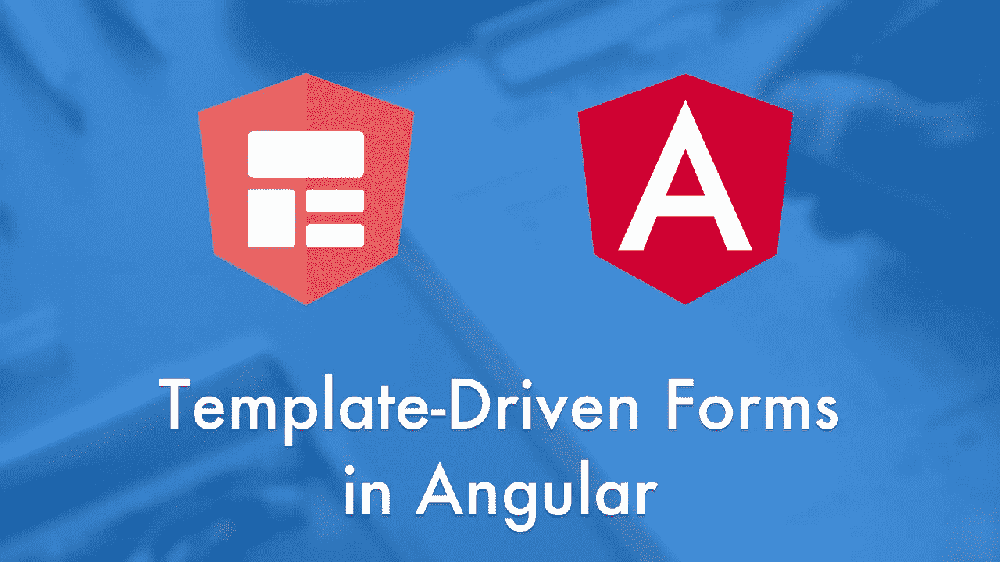

# 面向初学者的简单动态模板驱动窗体

> 原文：<https://levelup.gitconnected.com/angular-simple-dynamic-template-driven-form-for-beginners-ee230a76ef77>

在这篇博客中，你将学习如何使用角度模板驱动表单。角形表单帮助您创建自定义表单控件和验证。表单控件可以保存数据值和表单验证数据。angular 中的窗体有两种处理用户输入的方式。这些是反应式表单和模板驱动表单。这两种类型的表单都从视图中捕捉用户事件。

模板驱动表单是由模板中的指令驱动的模型驱动表单。angular JS 用户使用模板驱动表单，但有时模板驱动表单会用于复杂系统。例如，如果您想动态设置验证特定的表单域，您可以使用模板驱动的表单。在模板驱动的表单中使用双向数据绑定，尽管 formControl 和 fromGroups 都使用 ngModel。

# **表格结构**

我将创建一个简单的表单，能够创建新的表单字段。表单域的数量取决于用户。它可以在运行时更改。
然而，每个表单条目都需要一个名字，比如反应式表单中的 formControlName，以及作为单个表单字段集合的整个表单的状态。每个表单域都被分配了一个唯一的 id 属性。因此，模板驱动的表单控件需要唯一命名。我们可以使用唯一的控件名来生成表单域。在这种动态形式中，它使用当前的时间戳作为唯一的 id，或者您可以创建一个方法来获取随机数以分配给这个唯一的 id。这样它就可以通过父 NgForm。

首先，将 formsModule 导入主模块 ex:- app.module.ts，然后创建一个接口来描述一个对象。你必须为这个接口设置一些你想要的属性。

如您所见，您可以通过单击 addForm 按钮生成许多表单。所以这个模板驱动的表单使用 ngFor 指令来循环每个实例，分配一组 ngModel 驱动的输入。最初，表单只有一个实例。每个表单应该有一个唯一的 id 来设置模板驱动表单的事实。该窗体使用 ngModel 指令，而不是使用 form-control。

# **NgModel 验证**

我添加了简单的验证来教我们如何在 html 上添加验证。所以你可以添加 HTML 5 验证，如 minlength 验证，maxlength，模式验证，电子邮件验证等。

Angular 总是监听表单的有效性，这个功能对于反应式表单和模板驱动表单都是通用的。角度形式中有 3 种类型的验证，

*   *触摸或未触摸*
*   *有效或无效*
*   *原始或肮脏*

我还没有提到自定义验证，它不是 HTML 5 形式的验证。如果你想自定义验证，看看这篇文章。

 [## 如何使用模板驱动表单验证角度表单

### Angular 是一个用于构建应用程序的综合框架。使用 Angular 的一个好处是它有形式…

medium.com](https://medium.com/swlh/how-to-validate-angular-forms-with-template-driven-forms-8b7357b67cea) 

# **总结**

角度模板驱动形式是基于模型的，与角度反应形式相比，它是简单的。角度标识了形状标记，然后将形状更改为角度形状。每个表单元素和 ngModels 都分配了唯一的 id。ngModel 将每个表单元素转换为 formControls，就像在反应式表单中一样。

多看一些关于角形的文章。请继续关注更多文章😉。

【https://angular.io/guide/forms】参考——[T5](https://angular.io/guide/forms)