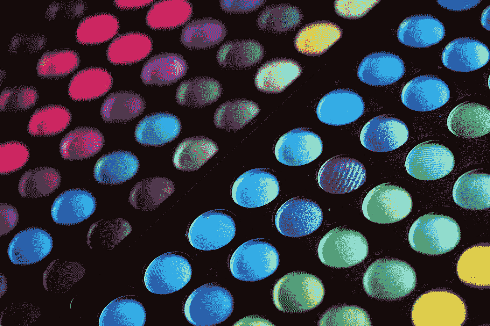
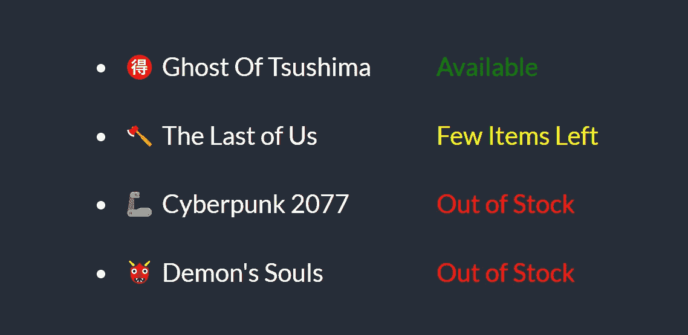
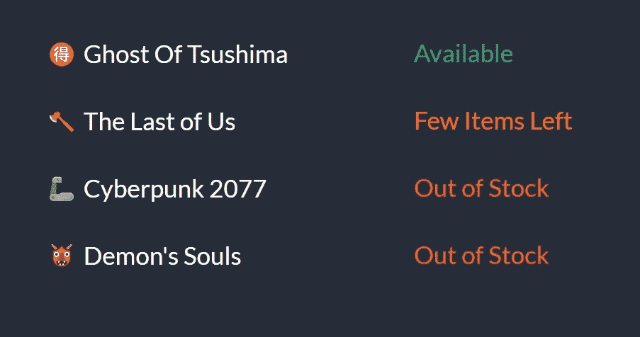

# 带有内置指令的角度动态样式

> 原文：<https://levelup.gitconnected.com/angular-styling-with-ngstyle-ngclass-334ecfef120b>



使用 NgStyle 和 NgClass 的角度样式

## 控制你的应用用户界面行为

如果你使用普通的 JavaScript，在 web 应用程序中创建动态样式会是一个真正的挑战。
幸好有了 have 框架，而且我们还有 Angular，这给了我们多种方式 ***处理动态 CSS 和 CSS 类*** 。

在本文中，你将学习如何通过使用 *@angular/core* 的`ngStyle`和`ngClass`、**两个内置指令**，轻松管理你的 *HTML* 元素的样式。使用直观的语法，你可以制定复杂的逻辑，管理涉及应用程序操作的各种情况，让我们来看看这两条指令的细节。

# NgStyle

> `NgStyle`指令允许你对给定的 DOM 元素应用样式属性。

设置样式的一种方法是使用`NgStyle`指令，并给它分配一个*对象文字*，如下所示:

```
<p [ngStyle]="{'color':'red'}"></<p>
```

> 这只是将`p`元素的字体颜色设置为红色。

`ngStyle`在你想添加*动态值*的时候非常有用。我们分配给`ngStyle`的对象文字中的*值*可以是被求值的 JavaScript 表达式，该表达式的结果被用作 CSS 属性的值，如下所示:

如果单位不等于零，上面的代码使用三元运算符将`*p*`元素的颜色设置为绿色，否则设置为红色。

## 替代语法

除了使用`ngStyle`指令，我们还可以使用`[style.<property>]`语法设置单独的样式属性，例如`[style.color]="getColor(person.country)"`



NgStyle 示例结果

## 点数和像素

假设我们想将字体大小设置为 18，我们可以使用:

```
[ngStyle]="{'font-size':18}"
```

但是这样不行，仅仅设置字体大小为 18 是无效的 CSS，我们必须指定一个*单元*比如 *px* 或者 *em* 。

Angular 用一个特殊的语法`<property>.<unit>`来拯救我们。因此，对于上面的例子，如果我们希望尺寸为 18 像素，我们可以写`[ngStyle]="{'font-size.px':18}"`

后缀`.px`表示我们正在以像素为单位设置字体大小。
你可以`.em`使用`.%`用 ems 甚至百分比来表示字体大小

让我们看一个例子:

# NgClass

指令语法简洁，支持更复杂的逻辑，允许我们更好地控制我们的类名。

## 不带角的类名

在 HTML 中，我们可以通过`class`属性声明一个类:

```
<span class="availability">
   {{ product.status }}
</span>
```

如果我们想给它添加一个类，我们可以使用存在于*元素对象*上的`className`属性来设置或获取一个类:

```
const el = document.querySelector('.availability');
el.className += ' available';
console.log(el.className); // 'availability text-available'
```

## Angular 中的 NgClass 指令

> `NgClass`指令允许你为一个 *DOM 元素*动态设置 CSS 类。

有两种方法可以使用这个指令，第一种是通过传递一个*对象文字*给这个指令，就像这样:

```
[ngClass]="{'text-available':true}"
```

当使用一个对象文字时，*键*是当键值评估为 true 时添加到元素中的类。

所以在上面的例子中，由于值是`true`，这将把类`text-available`设置到指令附加到的元素上。

该值也可以是一个*表达式*，因此我们可以将上面的内容改写为:

```
[ngClass]="{'text-success':person.country === 'UK'}"
```

让我们来看一个例子，通过改进我们之前用`ngStyle`指令做的例子，我们可以创建设置比我们之前使用的基本颜色如红色、黄色和绿色更好的颜色的类:

> 因为对象文字可以包含许多键，所以我们也可以设置许多类名。

如果我们运行上面的代码，我们会看到:



使用 ngStyle 的角度样式示例

## 替代语法

我们也可以通过绑定到名为`class`的输入属性绑定来在元素上设置一个类，就像这样`[class]="'text-available'"`

> `'text-available'`用单引号括起来，所以当它被当作 JavaScript 计算时，它不会试图把`text-available`当作一个变量。

上面的语法删除了该元素的所有现有类，并用`'text-available'`替换它们。

如果我们只想将`text-available`添加到已经在元素上设置的类列表中，我们可以使用扩展语法`[class.<class-name>]='truthy expression'`

例如，要将`text-available`添加到元素的类列表中，我们可以使用:

```
[class.text-available]="true"
```

我们实际上可以一次指定多个值:


ngClass 的角度样式示例

# 结论

Angular 为样式化 **DOM 元素**提供了广泛的解决方案，并通过`ngStyle`和`ngClass`指令使之变得简单。

多亏了这些指令，**你可以通过编辑简单的变量或使用更复杂的函数来控制你的应用程序 UI** 的行为。

*感谢阅读！*