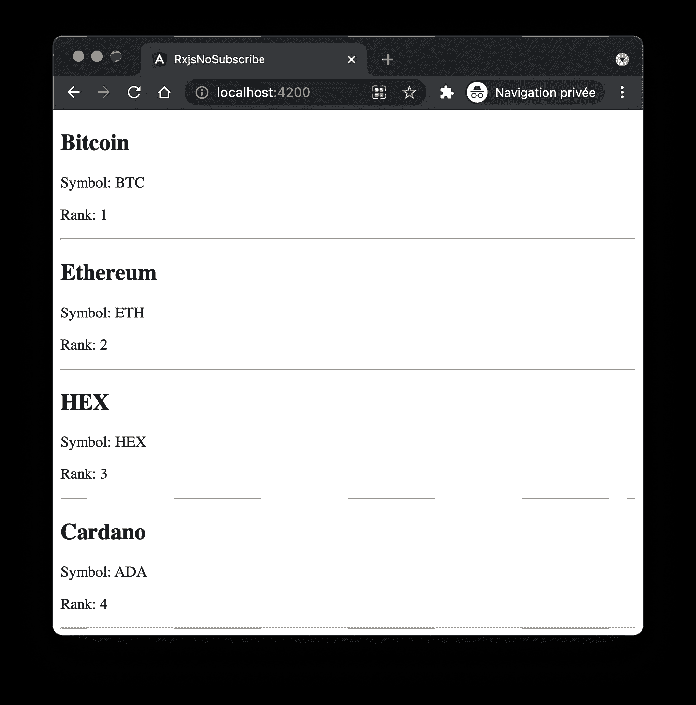
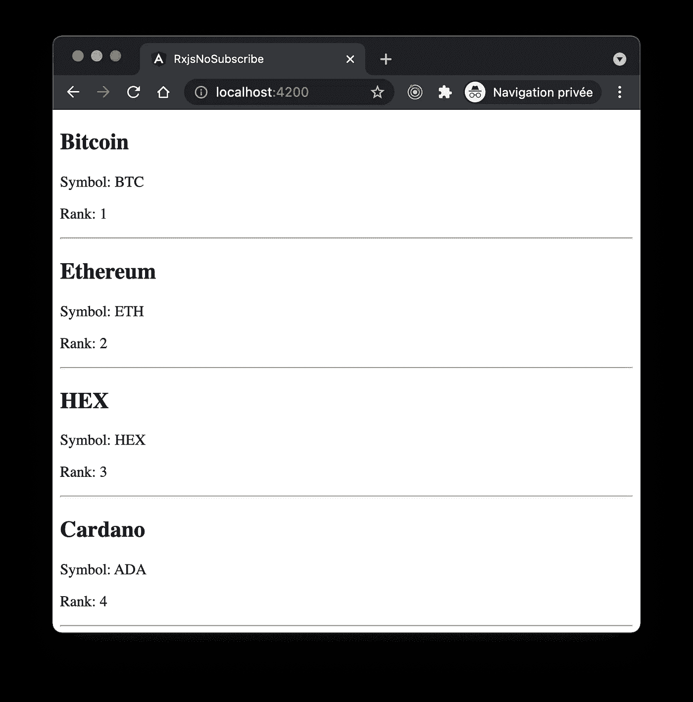

# 角度:在 RxJS 上变得更好的唯一规则

> 原文：<https://levelup.gitconnected.com/angular-the-single-rule-to-get-better-at-rxjs-6bd9f9786429>

## 帮助用 RxJS 以反应式编程方式开发 angle 应用程序和库的指南。


尽管没有严格的规则，但是将命令式和声明式编程概念与 [RxJS](https://rxjs.dev/) 结合起来可能会使开发更加困难，代码更加不干净。

将思维从(通常)默认的编程方式(即命令式)转变为反应式(即声明式)方法需要时间。

但是，有一个规则可以帮助您进行转换:

⚠️做**不**亡国，期⚠️

> 对命令式和陈述式的区别感到困惑吗？看看比较两者的[乔希莫罗尼](https://twitter.com/joshuamorony)的优秀[篇](https://eliteionic.com/tutorials/imperative-vs-declarative-programming-with-rxjs-search-filter/)。

# 为什么？

这个规则并不严格，它是一个准则，就像《加勒比海盗🏴‍☠️.守则》一样


这并不意味着你永远不应该订阅流，而是说，你应该尽量避免它。以这种方式，根据我的经验，你将慢慢地把命令式的编程方式转变成更多的声明式概念。

具体来说，在开发组件中的特性时，尽量使用在组件被破坏时自动取消订阅的 [Angular](https://angular.io/) `| async`管道，除了可以避免内存泄漏之外，还有助于改进编码风格。

为了探索这种操作方式，让我们重构一个混合了命令式和声明式编程概念的 Angular 应用程序。

# 出发点

下面的演示使用 [coinpaprika API](https://api.coinpaprika.com) 向用户显示加密货币列表。

代码源可在 [GitHub](https://github.com/peterpeterparker/rxjs-no-subscribe) 上获得。以下各章节(步骤 [1](https://github.com/peterpeterparker/rxjs-no-subscribe/tree/step_1) 、 [2](https://github.com/peterpeterparker/rxjs-no-subscribe/tree/step_2) 、 [3](https://github.com/peterpeterparker/rxjs-no-subscribe/tree/step_3) 和 [4](https://github.com/peterpeterparker/rxjs-no-subscribe/tree/step_4) )是独立的分支。



它将 HTTP 查询委托给一个`coins.service`并在一个`coins.component`中呈现结果。

## 服务

提供者充当存储。它查询密码列表，过滤结果并保存在内存中。

函数`list()`既是反应性的，通过告诉它想要什么(`httpClient.get`)，也是命令性的，通过检查和过滤结果。

```
import { Injectable, OnDestroy } from '@angular/core';
import { HttpClient } from '@angular/common/http';

import { Subject } from 'rxjs';
import { takeUntil } from 'rxjs/operators';

export type Coin = Record<string, string | number | boolean>;

@Injectable({
  providedIn: 'root'
})
export class CoinsService implements OnDestroy {
  constructor(private httpClient: HttpClient) {}

  private coins: Coin[] = [];

  private destroy$: Subject<void> = new Subject();

  list() {
    this.httpClient
      .get<Coin[]>(`https://api.coinpaprika.com/v1/coins`)
      .pipe(takeUntil(this.destroy$))
      .subscribe((allCoins: Coin[]) => {
        if (allCoins.length > 10) {
          this.coins = allCoins.filter(
            (coin: Coin) =>
              !coin.is_new && coin.rank > 0 && coin.rank < 100
          );
        }
      });
  }

  getCoins(): Coin[] {
    return this.coins;
  }

  ngOnDestroy() {
    this.destroy$.next();
    this.destroy$.complete();
  }
}
```

## 成分

该组件初始化服务，并公开一个 getter 绑定来将结果解析到 UI。

```
import { Component, OnInit } from '@angular/core';import { CoinsService } from '../coins.service';

@Component({
  selector: 'app-coins',
  templateUrl: './coins.component.html',
  styleUrls: ['./coins.component.css']
})
export class CoinsComponent implements OnInit {
  constructor(private readonly coinsService: CoinsService) {}

  ngOnInit(): void {
    this.coinsService.list();
  }

  get coins() {
    return this.coinsService.getCoins();
  }
}
```

## 模板

HTML 列出了硬币。

```
<article *ngFor="let coin of coins">
  <h1>{{ coin.name }}</h1>
  <p>Symbol: {{ coin.symbol }}</p>
  <p>Rank: {{ coin.rank }}</p>
  <hr />
</article>
```

# 步骤 1:(更多)声明性

尽管我在上面说过这条规则实际上是一条指导原则，但我还是建议**永远不要**订阅服务，分别对其在提供者中的应用比对在组件中的应用更严格，从而实际上避免内存泄漏。

由于我们不想订阅，我们必须首先转换组件调用的方法，以返回一个`Observable`。

```
list(): Observable<Coin[]> {
  return this.httpClient
    .get<Coin[]>(`https://api.coinpaprika.com/v1/coins`)
    ...
}
```

在没有任何其他改变的情况下，编译器会警告您返回值不匹配(因为我们仍在订阅流，因此实际上返回了一个`Subscription`)。这就是为什么我们用 RxJS 操作符替换了`subscribe`。在特殊情况下，我们使用 [tap](https://rxjs.dev/api/operators/tap) ，因为我们仍然希望将结果分配给商店。

```
list(): Observable<Coin[]> {
  return this.httpClient
    .get<Coin[]>(`https://api.coinpaprika.com/v1/coins`)
    .pipe(
      tap((allCoins: Coin[]) => {
        if (allCoins.length > 10) {
          this.coins = allCoins.filter(
            (coin: Coin) =>
              !coin.is_new && coin.rank > 0 && coin.rank < 100
          );
        }
      }),
      takeUntil(this.destroy$))
}
```

因为我们现在不再订阅了，所以我们可以移除`takeUntil`并让调用者处理它传输数据的方式。

```
import { Injectable} from '@angular/core';
import { HttpClient } from '@angular/common/http';

import { Observable } from 'rxjs';
import { tap } from 'rxjs/operators';

export type Coin = Record<string, string | number | boolean>;

@Injectable({
  providedIn: 'root'
})
export class CoinsService {
  constructor(private httpClient: HttpClient) {}

  private coins: Coin[] = [];

  list(): Observable<Coin[]> {
    return this.httpClient
      .get<Coin[]>(`https://api.coinpaprika.com/v1/coins`)
      .pipe(
        tap((allCoins: Coin[]) => {
          if (allCoins.length > 10) {
            this.coins = allCoins.filter(
              (coin: Coin) =>
                !coin.is_new && coin.rank > 0 && coin.rank < 100
            );
          }
        })
      );
  }

  getCoins(): Coin[] {
    return this.coins;
  }
}
```

代码已经变得更干净，不再有订阅和销毁生命周期，但是代码仍然混合了不同的方法。这就是为什么我们利用 RxJS [过滤器](https://rxjs.dev/api/operators/filter)和[映射](https://rxjs.dev/api/operators/map)操作符使其更具反应性。

```
list(): Observable<Coin[]> {
  return this.httpClient
    .get<Coin[]>(`https://api.coinpaprika.com/v1/coins`)
    .pipe(
      filter((allCoins: Coin[]) => allCoins.length > 10),
      map((allCoins: Coin[]) =>
        allCoins.filter(
          (coin: Coin) =>
            !coin.is_new && coin.rank > 0 && coin.rank < 100
        )
      ),
      tap((topCoins: Coin[]) => (this.coins = topCoins))
    );
}
```

命令式`if`变成了反应式`filter`并且`array.filter`被移动到了`map`变压器。由于这些最后的修改，数据源流过描述我们想要的结果的流。

# 步骤 2:订阅组件

尽管代码仍在编译，但此时不再显示货币，因为没有调用者使用、订阅流。


随着我们的迭代进行，我们基本上复制了我们之前在服务中移除的内容，我们在组件中订阅。

```
import { Component, OnDestroy, OnInit } from '@angular/core';

import { Subject } from 'rxjs';
import { takeUntil } from 'rxjs/operators';import { CoinsService } from '../coins.service';@Component({
  selector: 'app-coins',
  templateUrl: './coins.component.html',
  styleUrls: ['./coins.component.css']
})
export class CoinsComponent implements OnInit, OnDestroy {
  constructor(private readonly coinsService: CoinsService) {}

  private destroy$: Subject<void> = new Subject<void>();

  ngOnInit(): void {
    this.coinsService
      .list()
      .pipe(takeUntil(this.destroy$))
      .subscribe(() => {});
  }

  ngOnDestroy() {
    this.destroy$.next();
    this.destroy$.complete();
  }

  get coins() {
    return this.coinsService.getCoins();
  }
}
```

我知道，我说过“永远不要订阅”，这不是结束😉。然而，我们注意到密码再次被列出。



# 步骤 3:异步管道

为了达到我们的最终目标，我们想要移除组件中的订阅，以便利用`| async`管道。因此，我们必须改进我们的服务。另一方面，我们还是想让它充当商店的角色。

这就是为什么，作为一个中间步骤，我们用一个[行为主体](https://rxjs.dev/api/index/class/BehaviorSubject)替换服务的命令状态`coins`，这是一种特殊类型的可观察对象，允许将值多播给许多观察者([源](https://rxjs.dev/guide/subject))，并将其作为`readonly Observable`变量公开公开。

```
import { Injectable} from '@angular/core';
import { HttpClient } from '@angular/common/http';

import { BehaviorSubject, Observable } from 'rxjs';
import { filter, map, tap } from 'rxjs/operators';

export type Coin = Record<string, string | number | boolean>;

@Injectable({
  providedIn: 'root'
})
export class CoinsService {
  constructor(private httpClient: HttpClient) {}

  private coins: BehaviorSubject<Coin[]> = new BehaviorSubject<
    Coin[]
  >([]);

  readonly coins$: Observable<Coin[]> = this.coins.asObservable();

  list(): Observable<Coin[]> {
    return this.httpClient
      .get<Coin[]>(`https://api.coinpaprika.com/v1/coins`)
      .pipe(
        filter((allCoins: Coin[]) => allCoins.length > 10),
        map((allCoins: Coin[]) =>
          allCoins.filter(
            (coin: Coin) =>
              !coin.is_new && coin.rank > 0 && coin.rank < 100
          )
        ),
        tap((topCoins: Coin[]) => this.coins.next(topCoins))
      );
  }
}
```

与我们以前的变化相比，这是突破性的。这就是为什么我们必须修改组件来删除`getter`，并用一个我们最终可以在模板中使用的可观察对象来替换它。

```
import { Component, OnDestroy, OnInit } from '@angular/core';

import { Observable, Subject } from 'rxjs';
import { takeUntil } from 'rxjs/operators';

import { Coin, CoinsService } from '../coins.service';

@Component({
  selector: 'app-coins',
  templateUrl: './coins.component.html',
  styleUrls: ['./coins.component.css']
})
export class CoinsComponent implements OnInit, OnDestroy {
  constructor(private readonly coinsService: CoinsService) {}

  private destroy$: Subject<void> = new Subject<void>();

  coins$: Observable<Coin[]> = this.coinsService.coins$;

  ngOnInit(): void {
    this.coinsService
      .list()
      .pipe(takeUntil(this.destroy$))
      .subscribe(() => {});
  }

  ngOnDestroy() {
    this.destroy$.next();
    this.destroy$.complete();
  }
}
```

最后，我们介绍一下著名的`async`烟斗。

```
<article ***ngFor="let coinof coins$ | async">
```

# 步骤 4:没有订阅和反应

我们当前的解决方案非常接近目标，我们使用流来获取数据并显示结果，但是我们仍然需要订阅来触发货币加载。

这就是为什么我们试图删除主题。

```
import { Injectable} from '@angular/core';
import { HttpClient } from '@angular/common/http';

import { Observable } from 'rxjs';
import { filter, map } from 'rxjs/operators';

export type Coin = Record<string, string | number | boolean>;

@Injectable({
  providedIn: 'root'
})
export class CoinsService {
  constructor(private httpClient: HttpClient) {}

  readonly coins$: Observable<Coin[]> = ... // <- TODO

  list(): Observable<Coin[]> {
    return this.httpClient
      .get<Coin[]>(`https://api.coinpaprika.com/v1/coins`)
      .pipe(
        filter((allCoins: Coin[]) => allCoins.length > 10),
        map((allCoins: Coin[]) =>
          allCoins.filter(
            (coin: Coin) =>
              !coin.is_new && coin.rank > 0 && coin.rank < 100
          )
        )
      );
  }
}
```

我们注意到暴露的可观察对象`coins$`，现在缺少了一个来源。

另一方面，我们仍然有处理数据流的流。

是的，没错，我们把两者联系起来。

```
readonly coins$: Observable<Coin[]> = this.httpClient
  .get<Coin[]>(`https://api.coinpaprika.com/v1/coins`)
  .pipe(
    filter((allCoins: Coin[]) => allCoins.length > 10),
    map((allCoins: Coin[]) =>
      allCoins.filter(
        (coin: Coin) =>
          !coin.is_new && coin.rank > 0 && coin.rank < 100
      )
    )
  );
```

然而，这样做的话，由于使用了 BehaviorSubject，我们确实失去了原有的状态管理特性。这就是为什么我们引入了一个 [shareReplay](https://rxjs.dev/api/operators/shareReplay) ，它也将重放值，这也将使我们的服务充当一个商店。

```
import { Injectable} from '@angular/core';
import { HttpClient } from '@angular/common/http';

import { Observable } from 'rxjs';
import {filter, map, shareReplay} from 'rxjs/operators';

export type Coin = Record<string, string | number | boolean>;

@Injectable({
  providedIn: 'root'
})
export class CoinsService {
  constructor(private httpClient: HttpClient) {}

  readonly coins$: Observable<Coin[]> = this.httpClient
    .get<Coin[]>(`https://api.coinpaprika.com/v1/coins`)
    .pipe(
      filter((allCoins: Coin[]) => allCoins.length > 10),
      map((allCoins: Coin[]) =>
        allCoins.filter(
          (coin: Coin) =>
            !coin.is_new && coin.rank > 0 && coin.rank < 100
        )
      ),
      shareReplay({ bufferSize: 1, refCount: true })
    );
}
```

> 如果您以前从未使用过 shareReplay，请在使用时小心。在[kwi ten Pisman](http://kwintenp)的[博客文章](https://blog.strongbrew.io/share-replay-issue/)中阅读更多信息。

最后，我们可以删除组件中的最后一个订阅，以及所有链接到目标的代码，以处理取消订阅。

```
import { Component} from '@angular/core';

import { Observable } from 'rxjs';

import { Coin, CoinsService } from '../coins.service';

@Component({
  selector: 'app-coins',
  templateUrl: './coins.component.html',
  styleUrls: ['./coins.component.css']
})
export class CoinsComponent {
  constructor(private readonly coinsService: CoinsService) {}

  readonly coins$: Observable<Coin[]> = this.coinsService.coins$;
}
```

如果与它的原始版本相比，组件不是变得非常简洁和易于理解了吗？

对 GUI 的最后一次检查。


所有的密码仍然列出，代码是反应性的，我们不再使用任何“订阅”了🥳.

# 摘要

在 Angular 中尝试不使用 RxJS 并不是最终的结果，也不是一个严格的规则，但是，当作为一个指南应用时，可以帮助使代码更干净和更具反应性，可以帮助在 RxJS 中获得更好的体验和时间。

到无限和更远的地方！

大卫

你可以通过推特或我的[网站](https://daviddalbusco.com/)联系我。

尝试一下 [DeckDeckGo](https://deckdeckgo.com/) ，为你的下一个演示做准备。

[](https://deckdeckgo.com)