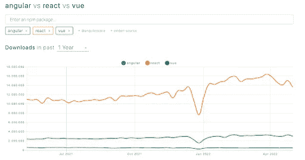

# Angular vs React vs Vue.js:一项比较研究— 2022

> 原文：<https://levelup.gitconnected.com/angular-vs-react-vs-vue-js-a-comparative-study-2022-57a33277278>

前端开发人员在开始一个新项目时首先要回答的问题是: ***我应该选择哪个框架？*** ***哪个框架更符合我的需求？***

在本文中，我们将向您简要介绍目前最常用的前端框架，目的是帮助您选择最能满足您需求的框架。这些框架分别是[角度](https://angular.io/)、[反应](https://reactjs.org/)和 [Vue.js](https://vuejs.org/) 。

# 快速概述:

**Angular** 是一个前端框架，有很多组件、服务和工具。在 Angular 的网站上，你可以看到他们对 Angular 的定义是:

***【现代 web 开发者的平台】***

它是由谷歌的开发者开发和维护的，但奇怪的是，它并没有被用来实现他们最常见的产品，比如 or。

—

**React** 被认为是 UI 库。他们把自己定义为:

***“用于构建用户界面的 JavaScript 库”***

脸书开发者是这个库的开发和维护的幕后推手。而且，在这种情况下，脸书的大部分产品都是用 React 制造的。

—

最后但同样重要的是， **Vue.js** 根据其网站:

***【一个渐进式的 JavaScript 框架】***

Vue.js 由**尤雨溪**开发和领导，但它也依赖于一个巨大的[开源社区](https://github.com/vuejs/vue#contribution)。

这三个框架有几个共同点，比如每个都遵循基于组件的架构，并允许快速创建 UI 特性。React 和 Vue.js 主要是**声明性的**，而 Angular 也可能是声明性的，它实际上更多的是 [**命令性的**](https://en.wikipedia.org/wiki/Imperative_programming) **。尽管如此，根据它们的结构、架构和工作方式，它们呈现出更多的不同，所以让我们深入了解所有这些特征。**

# 结构

## 角度:

Angular 完全构建在[类型脚本](https://www.typescriptlang.org/)中，Angular 上的每个项目都构建在[模块](https://angular.io/guide/architecture-modules)、[组件](https://angular.io/guide/architecture-components)和[服务](https://angular.io/guide/architecture-services)中。每个模块至少要有一个**根模块**和一个**根组件**。

## 角度模块

根据 Angular 的网站，Angular 应用程序是**模块化**的，并且有自己的模块化系统，称为 ***NgModules*** 。

是专用于应用程序域、工作流或密切相关的功能集的内聚代码块的容器。

它们可以包含组件、服务和其他代码文件，这些文件的范围由包含它们的 NgModule 定义。他们可以导入从其他人导出的功能，反之亦然。

## 角度分量

在 Angular 中，**组件**是代码的基本 **UI 构建块。它们都有这样的结构:**

*   一个**类型脚本类**，其中实现了组件的逻辑
*   一个 **HTML 模板**来呈现组件(包括[角度模板语法](https://angular.io/guide/template-syntax)
*   在 **CSS** 或 **SCSS** 中的样式表

## 角度服务

服务是实现业务逻辑的**类**。服务旨在提取组件之外的所有复杂且可重用的逻辑。例如，像从服务器获取数据这样的操作必须在服务上完成。为了使这些服务对任何组件可用，Angular 使用 [***注入依赖关系***](https://angular.io/guide/architecture-services#dependency-injection-di) 。

这是在角度应用中可以识别的主要结构。但是，这里还涉及到很多其他的部分，比如[指令](https://angular.io/guide/architecture-components#directives)、[管道](https://angular.io/guide/architecture-components#pipes)等。

## 反应:

React 并没有提出一个具体的结构来遵循，只需要几行代码，你就可以拥有一个简单的 React 应用程序。最小的 React 示例如下:

然而，我们可以在 React 项目中识别两种类型的块:[元素](https://reactjs.org/docs/rendering-elements.html)和[组件](https://reactjs.org/docs/components-and-props.html)。它们是用 [JSX](https://reactjs.org/docs/introducing-jsx.html) 编写的，这是一种语法扩展，允许你创建同时包含 HTML 和 JavaScript 的元素。JSX 的例子可能是这样的:

## 反应元素

元素是 React 应用程序的**最小构建块**。元素的一个示例可能是:

## 反应组分

组件是 React 应用程序的**更大的构建块**。它们允许你将用户界面分割成独立的、可重用的部分。

从概念上讲，组件就像 JavaScript 函数一样。它们接受任意输入，称为 *props* ，并返回描述屏幕上应该出现什么的 React 元素。为了能够处理这些函数中的状态和生命周期特性，它们包含了一系列名为[钩子](https://reactjs.org/docs/hooks-intro.html)的函数。

定义组件的最简单方法的一个例子是 JavaScript 函数，如下所示:

React 调用这些代码段 ***函数组件*** ，因为它们实际上是 JavaScript 函数。

如您所见，在 React 中开发非常简单。当然，还有更多的事情需要考虑，但是我们可以总结说 **React 应用程序是元素和组件的组合**。

## Vue.js:

Vue.js 中的结构非常简单。所有部件都是独立的、可重复使用的组件。

Vue.js 应用程序的一个简单示例如下:

Vue.js 中的组件以扩展名写在 [**单文件组件**](https://v3.vuejs.org/guide/single-file-component.html) (SFC)中。在这些文件中，有:

*   **JavaScript** 逻辑
*   HTML 模板 (Vue.js 有自己的[模板](https://v3.vuejs.org/guide/template-syntax.html))
*   **CSS** 或 **SCSS** 中的样式表

# 比较的其他特征

除了结构，其他特点也可以突出。例如:应用程序的**状态是如何管理的**？

他们三个的灵感来自 [Redux](https://redux.js.org/) ，但每个人都有不同的方法:

*   **Angular** 有自己的库， [**NgRx**](https://ngrx.io/) ，一个受 Redux 启发，用 [RxJS](https://rxjs.dev/) 实现的状态管理项目。
*   **React** 使用 [**React Redux**](https://react-redux.js.org/) ，Redux 团队维护的项目。
*   **Vue.js** 有自己的库，叫做 [**Vuex**](https://vuex.vuejs.org/) 。

另一个需要考虑的有趣的事情是:**框架提供了多少现成的组件？**

Angular 有很多官方的现成组件。在[**Angular Material**](https://material.angular.io/)项目中，您可以找到大量可以在自己的项目中使用的组件。对于 React 和 Vue.js，你可以在 **Github** 或者 **Google** 上找到很多。

关于移动应用的开发，可以开发**跨平台移动应用**:[Native script](https://nativescript.org/)(Angular)[React Native](https://github.com/facebook/react-native)(React)[Weex](http://emas.weex.io/guide/use-vue-in-weex.html)(vue . js)。NativeScript 和 React Native 都有大量的信息和支持，但 Weex 却没有，它主要在中国使用。

# 学习曲线:

在讨论了这些框架的结构之后，你会想到每个框架的学习曲线是怎样的，对吗？让我们更深入地探讨一下这个话题。

对他们所有人来说，我们必须学习新的东西。例如，在 Angular 和 Vue.js 中，我们必须熟悉类似 HTML 的语法，而在 React 中，你必须了解 JSX。

在 Vue.js 中，你必须与 SFC 合作，但除此之外，我没有想到更多的困难。

在 React 的例子中，一旦你正确理解了 JSX 是如何工作的，剩下的就很简单了。没有你必须遵循的结构或者你需要知道的特定模板。如果你熟悉开发概念和 JavaScript，HTML 和 CSS，你就拥有了一切！唯一有点挑战性的是学习[钩子](https://reactjs.org/docs/hooks-intro.html)是如何工作的。

最难学的框架是有角的。为了使用这个框架进行适当的开发，除了要很好地理解 TypeScript 之外，您还需要记住 Angular 项目有一个强大的结构。这有助于您在项目扩大时保持更好的可维护性，但在开始时，可能会有点困难。

综上所述，根据经验，Vue.js 的**学习曲线比较软，其次是 React，最难的是 Angular** 。但是不要担心，最终，有了适当的文档和良好的概念基础，我们能够处理一切！

# 人气:

有几种方法可以检查技术或框架的受欢迎程度。为了这篇文章，我们咨询了不同的来源，根据这些事情来看看每个人有多受欢迎:**谷歌搜索**， **npm 下载**， **Github 明星**，**用每个框架实现的** **应用**，以及**最需要的技术。**

## 谷歌搜索:

如果我们去 [Google trends](https://trends.google.com/trends/explore?q=%2Fg%2F11c6w0ddw9,%2Fm%2F012l1vxv,%2Fg%2F11c0vmgx5d) 查看搜索结果并比较三个框架，我们会得到这个图表:

我们可以看到 React 是搜索最多的，而 Vue.js 是搜索最少的。

如前所述，Vue.js 主要在中国使用，如果我们按地区比较结果，就可以验证这一点。此外，我们可以看到，在西班牙、德国和意大利，搜索最多的是棱角分明。

## npm 下载:

如果我们在 [**npm trends**](https://www.npmtrends.com/angular-vs-react-vs-vue) 上查看每个框架在过去一年的下载次数，我们可以看到下载最多的是 React。

# Github stars:

下图我们可以看到 Github 上星星比较多的框架是 [Vue.js](https://github.com/vuejs/vue) ，其次是 [React](https://github.com/facebook/react) ，最后是 [Angular](https://github.com/angular/angular) 。为了公平起见，我们将 Angular.js 中的星星添加到 Angular 的星星中，因为当他们从 Angular.js 迁移到 Angular 时，他们开始了一个新的存储库，所以他们开始时拥有的所有星星都丢失了。

## 用每个框架构建的应用程序:

衡量一个框架受欢迎程度的另一种方法是咨询每个框架构建了多少个应用程序。为此，我们检查了用构建的站点[，发现](https://builtwith.com/) [React](https://trends.builtwith.com/javascript/React) 是目前使用最多的！

最后但同样重要的是，让我们突出每个框架的需求。为了获得信息，我们在 LinkedIn**上做了一些搜索，考虑了在欧盟和美国搜索工作的结果。**

**正如我们在这张图中看到的，需求最多的框架是 React，其次是 Angular，最后是 Vue.js。**

****

# **表演**

**当开发一个项目时，考虑应用程序的性能是很重要的。因此，了解一下这三种框架的性能是有意义的。**

**我们想要强调的是，检查哪一个更快并不是我们的性能问题的唯一解决方案。事实上，保持良好的开发质量并遵循良好的实践更重要。**

**说了这么多，让我们看看每一个的行为是什么。**

## **JS 框架基准:**

**根据 [JS 框架基准](https://krausest.github.io/js-framework-benchmark/current.html)给我们展示的结果，我们可以看到，总的来说， **Vue.js 是最快的框架**。尽管如此，差别并不是很大。**

**最相关的是 ***选择一行*** 的动作，其中**比其他**反应稍慢； ***交换行*** 其中**角度和反应都比 Vue.js** 慢很多，而 ***清除行*** 其中**角度最慢**。**

****

## **性能轨道:**

**[Perf Track](https://perf-track.web.app/) 根据来自成千上万个网站的不同度量生成一堆图形，但这里让我们专注于其中的几个(你可以在这里查阅全部结果: [Angular](https://perf-track.web.app/angular) 、 [React](https://perf-track.web.app/react) 和 [Vue.js](https://perf-track.web.app/vue) )。**

****

**在上图中，我们可以看到 **React 和 Vue.js** 在加载和向用户呈现第一个内容( **FCP** )和最大内容( **LCP** )时明显比 Angular 快。**

**说起**累计布局移位** (CLS)，**反应**是 CSL 低于 0.1 的**站点** **多的那个。然而，Angular 和 Vue.js 的结果更差，但还不算太差。****

**关于从用户第一次与一个站点交互所花费的时间，所有的框架都呈现出好的结果。**

**最后但同样重要的是，浏览器请求页面和从服务器收到信息的第一个字节之间的时间( **TTFB** )在 **Angular** 中比 React 和 Vue.js 中的**低，React 是最慢的框架。****

# **结论**

**总之，**所有这些框架完全可以用在前端**应用中。的确，对于大型项目来说，Angular 可能是最好的选择，因为它给你一个可靠的结构来遵循，这可以帮助我们有一个有组织的和可维护的基础代码。然而，有了适当的架构和 web 开发概念的知识，我们就可以用这些框架来组织代码。**

**此外，这三个框架都有一个活跃的社区，提供了大量的文档、支持和课程。关于性能，它们都非常相似。**

**希望本文能帮助您选择最符合您需求的框架，或者最能引起您注意的框架。**

**最后，为了让您能够轻松地比较这三个框架，这里有一个使用每个框架的小应用程序示例，一个简单的“搜索器”。它向用户显示一个搜索框，并通过调用 [*Google 自定义搜索 API*](https://programmablesearchengine.google.com/about/) 获得与用户查询相关的结果。返回的结果以列表形式显示给用户。以下是链接:**

*   **[棱角分明](https://codesandbox.io/s/searcher-in-angular-wy6dhf?file=/src/index.html)**
*   **[做出反应](https://codesandbox.io/s/searcher-in-react-7hbcyb?file=/src/index.js)**
*   **[Vue.js](https://codesandbox.io/s/searcher-in-vue-js-cxt31e?file=/src/main.js)**

**如果您对本文有任何疑问，或者需要关于该主题的更多信息，请随时联系[联系](https://www.zartis.com/contact)！**

**-**

# **作者:**

** [## 萨拉·萨皮科——高级软件开发人员

### 查看萨拉·萨皮科在世界最大的职业社区 LinkedIn 上的个人资料。萨拉有 7 份工作列在他们的…

www.linkedin.com](https://www.linkedin.com/in/sara-zapico-fernandez/?originalSubdomain=es) 

萨拉·萨皮科·费尔南德斯是 Zartis 公司的高级 Fullstack 软件工程师，在后端和前端都有十多年的经验。在前端方面，她有使用 Angular、React 和 Vue.js 的经验，目前她最关注 Angular。在后端，她专门研究 Spring 和 Java。** 

# **分级编码**

**感谢您成为我们社区的一员！在你离开之前:**

*   **👏为故事鼓掌，跟着作者走👉**
*   **📰查看[级别提升编码](https://levelup.gitconnected.com/)中的更多内容**
*   **🔔关注我们:[Twitter](https://twitter.com/gitconnected)|[LinkedIn](https://www.linkedin.com/company/gitconnected)|[时事通讯](https://newsletter.levelup.dev)**
*   **🚀👉 [**软件工程师的顶级工作**](https://jobs.levelup.dev/)**