# angular vs React vs Vue:2021 年选择哪个最好？—(最新更新)

> 原文：<https://levelup.gitconnected.com/angular-vs-react-vs-vue-which-is-the-best-choice-for-2020-81f577697c7e>

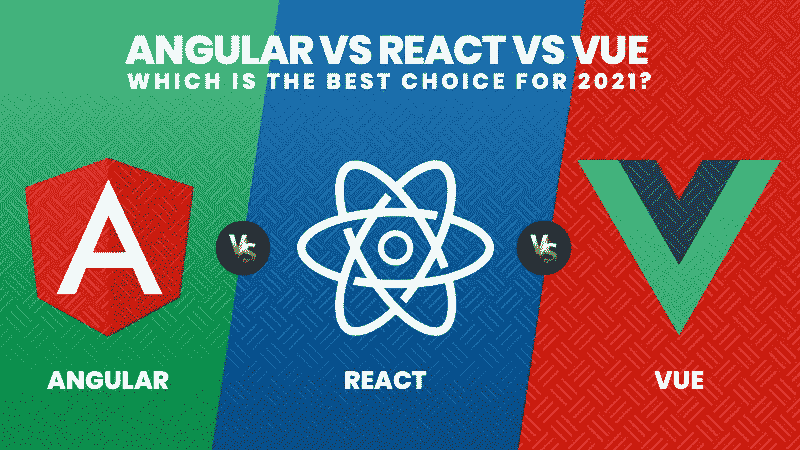

当开始一个新的 web 开发项目时，前端框架和库的选择变得非常强大。

JavaScript 是 web 应用的支柱，但大多数软件开发人员仍然进退两难，不知道哪个 JavaScript 前端框架最适合他们的下一个大项目。如果你还在争论 React，Vue 或 Angular 是不是最好的选择，那么是时候了解统计数据和 2021 年的情况了。

> **在这篇博客中，我们已经为软件开发人员关于**的常见问题找到了最相关的答案

> **2021 年 Angular、React、Vue 哪个 Javascript 框架领先？**
> 
> **他们接下来需要学习 Javascript 的什么？**
> 
> **哪种框架被小型企业和中小型企业广泛使用？**
> 
> **对于你的下一个 Web 开发项目**，哪个是性能最好的 Javascript 框架？

 [## 编写面试问题

### 一个完整的平台，在这里我会教你找到下一份工作所需的一切，以及…

技术开发](https://skilled.dev) 

根据 Javascript Survey 2019 的[状态，我们发现 React 是 Javascript 框架的首选之一，并收到了开发者的热烈响应。](https://2019.stateofjs.com/front-end-frameworks/)

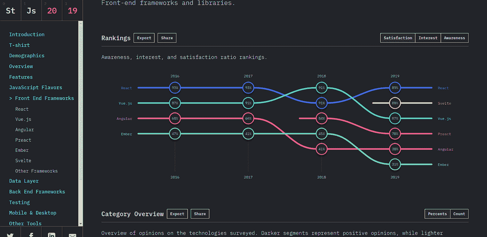

**(图片来源:**https://2019.stateofjs.com/front-end-frameworks/**)**

与[之前的调查](https://2018.stateofjs.com/front-end-frameworks/overview/)相比，Vue 出人意料地赶上了第二名，将 Angular 甩在第三名之后。

每个软件开发人员都有不同的知识和技能水平、独特的项目需求、期限、复杂性等等。因此，如果 React 是 20，000 名开发者的首选，那么它也将符合您的项目需求，这不是强制性的。

> **让我们深入探讨这些趋势，并详细比较这三个顶级的 Javascript 编程库，以做出最佳的框架选择。**

# **1。React、Angular 和 Vue** 背景概述

为了对您的下一个 web 开发项目做出明智的决定，我们将比较这三个顶级框架的特性。但在此之前，你需要深入挖掘每个框架的背景，知道基线。

## **概述**

由脸书开发的 React 是一个流行的框架，用于创建和操作网页的动态用户界面。另一方面，Angular 是 Google 最强大、最高效、最开源的 Javascript 框架，用于开发单页面应用程序(SPA)。然而，在大量社区成员和开发者的支持下，尤雨溪创建了 Vue 来支持帮助你解决大型单页应用程序复杂性的库。说 Vue 具备 React 和 Angular 的所有伦理方面不会错。由于这个原因，Vue 在很短的时间内就获得了人气，而没有显示出任何下降的信号。

## ***反应过来的历史，棱角分明的历史，还有*的 Vue**

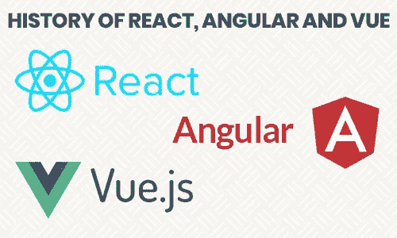

## **反应过来**

React 于 2013 年推出，其目标很简单，就是将 UI 分成一系列组件，以简化可视化界面的开发流程。React 通过实现一个新的非凡特性——虚拟 DOM，用于构建单页面应用程序。

脸书在 2010 年以语法的形式推出了 React 的第一个标志，这也是开源的。然而，当脸书的广告变得难以用简单的 HTML 代码管理时，他们开始寻找正确的解决方案，Jordan Walke 致力于其原型，并在 2012 年推出了 React。

在 2013 年，React 不仅开源，而且被大约 300 万前端开发人员采用。之后，编码问题逐渐得到解决，React 在 2014 年获得了很好的声誉。脸书和 Instagram 是使用这个框架的大公司。

## **有角度:**

让我们把 Angular 的历史倒回到 AngularJS。AngularJS 的第一个版本于 2010 年作为前端应用程序推出。但快进到 2016 年，谷歌的核心团队已经提出了 Angular，它完全基于三大支柱——TypeScript、RxJS 和 Zone.js。

> **今天，Angular 在 2019 年 5 月 28 日最后一次发布 Angular 2+之后，去掉了 JS 这个后缀。谷歌和 Wix 是目前使用 Angular 最受欢迎的两家公司。**

## **Vue:**

Vue 是由前谷歌工程师尤雨溪发布的 Javascript 框架社区中最年轻也是最有影响力的成员。

2019 年 3 月，Vue 推出了 2.6.10 版本，几乎消除了其他框架的所有缺点，并为您提供了创建下一级 web 应用的灵活性，没有任何麻烦。

> **如今，GitLab 和阿里巴巴是 Vue 最重要的用户。**

# **2。angular vs React vs Vue:2021 年人气**

> **(考虑 NPM 趋势、栈溢出趋势、GitHub 定位各框架市场地位)**

***a) NPM 趋势:React 最讨喜，下载量框架其次是 Vue。***

根据 NPM 趋势，React 是下载量最大的框架。然而，这并不意味着他们是最好的。为了得出最佳选择，您需要进一步了解更多调查。

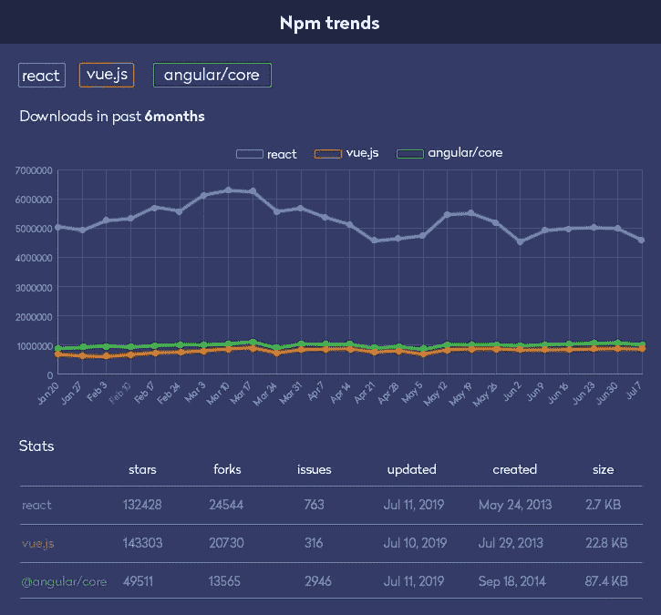

(图片来源:https://gist . github . com/tkrotoff/B1 ca a4 C3 a 185629299 EC 234d 2314 e 190)

***b)堆栈溢出趋势:React 在顶部，将 Angular 留在第二个位置。***

当我们比较 Angular 与 React 和 Vue 在 2020 年的受欢迎程度时，堆栈溢出趋势显示 React 获得的百分比最大，其次是 Angular。但是，Vue 的受欢迎程度在过去几年里持续增长。

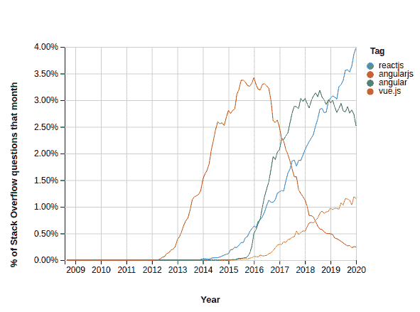

(图片来源:https://insights.stackoverflow.com/trends?tags = react js % 2c vue . js % 2c angular % 2c angular js)

***c) GitHub 趋势:Vue 是评价很高的框架，其次是 React***

Github 仓库有一些令人惊讶但令人兴奋的统计数据。一方面，React 的分叉率和观看率最多，但 Vue 的星数最多。

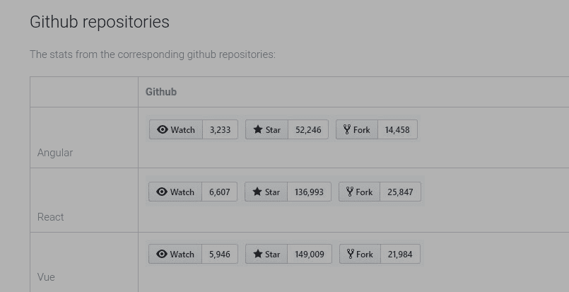

(图片来源:https://learning actors . com/angular-vs-react-vs-vue-stats-about-the-battle-of-JavaScript-technologies/)

# **3。角度对比反应对比 Vue:性能**

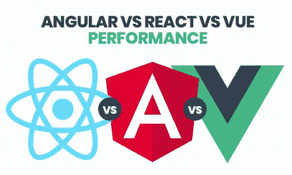

## **概述**

性能是前端应用需要考虑的最重要的方面之一。在评估 Angular、React 和 Vue 的性能时，请记住，DOM 被视为任何应用程序的 UI。React 和 Angular 采用不同的方法来更新 HTML 文件，但是 Vue 拥有 React 和 Angular 框架的优点。让我们深入探讨一下 Angular vs React vs Vue 对比:

## **有角度的**

Angular 是流行的 Javascript 框架，它使用 real DOM，最适合内容偶尔更新的单页面应用程序。

其次，Angular 使用双向数据绑定过程，以安全、高效和直观的方式将模型中的所有更改复制到视图中。

> **缺点:**由于这个框架的许多特性，在将你的项目转化为繁重的应用程序时，与 React 和 Vue 相比，它会降低性能。

## **反应过来**

React 是一个前端库，它使用虚拟 DOM 并增强需要定期内容更新的任何规模的应用程序的性能。比如 Instagram。

React 基于单向数据流。这将对整个项目提供更好的控制。

> 缺点:随着 React 的不断变化，使用 React 的开发人员需要定期更新他们的技能，以便完美地适应新事物。一切都在不断发展，所以有时科技巨头们会发现自己并不适合与它合作。

## **Vue**

Vue 是最年轻的 JS 框架，开发了令人难以置信的功能，以克服开发人员面临的 Angular 和 React 障碍。它由所有有反应和有棱角的好东西组成；因此，它利用虚拟 DOM 来提供高性能和内存分配。

> **不利因素:**作为一个家庭的新成员，与 React 和 Angular 相比，Vue 获得的社区支持最少。

> **注意:**与其他 Javascript 框架相比，Angular、React 和 Vue 是构建 web 应用程序最快的三个框架。

# **4。角度对比反应对比 Vue:迁移**

## 概观

有时从一个版本迁移到另一个版本对开发人员来说可能是个麻烦。如果对比 2021 年 Angular vs React vs Vue 的迁移过程，你会惊讶的发现，Vue 对于升级来说是最直接最快的。让我们了解一下它们有多复杂和耗时。

## **有角度的**

Angular 通常每六个月发布一次重大更新。此外，在任何主要的 API 被弃用之前还有六个月的时间。这最终意味着，开发者有两个六个月的发布周期来进行必要的修改。

## **反应**

说到 2021 年的 Vue vs Angular vs React，通过版本升级一般远比 Angular 和 Vue 容易实现。像 React codemod 这样的脚本可以确保从一个版本无缝迁移到另一个版本，并提供稳定性。

此外，脸书还认为稳定性是最大的问题，因为一些知名公司如 Twitter 和 Airbnb 都在使用 React。

## **Vue:**

Vue 为开发人员提供了最智能的迁移选项。如果你雇佣 web 开发人员，那么他们只需要使用一个迁移助手工具在站点中进行更改，因为如果你选择从 1.x 迁移到 2，90%的 API 保持不变。

# **5。角度对比反应对比 Vue:学习曲线**

那么哪个框架有适度的学习曲线呢？根据下面提到的图表，很明显，最大部分的开发人员“听说过 Vue 并想学习它”,而 React 是开发人员的首选，Angular 的受欢迎程度有所下降。

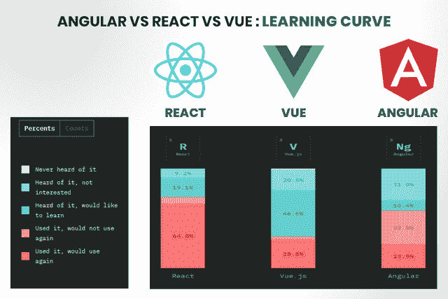

(图片来源:https://2019.stateofjs.com/front-end-frameworks/)

任何框架的学习曲线都不仅仅局限于编码。事实上，调试和测试有多容易也是一个现实问题，尤其是当 web 应用程序开发公司正在处理庞大的项目并涉及大量代码时。

一方面，Angular 和 React 需要深厚的 Javascript 知识和经验，才能做出关于第三方库的决策。另一方面，许多公司正在迅速转向 Vue，因为与 Angular 和 React 相比，它具有最直接的学习曲线。

尽管如此，大部分开发人员还是喜欢 React，因为它使您能够以最新的现代方式构建应用程序，而不像 Vue 仍然遵循老式的 JavaScript web 应用程序开发风格。

尽管 Angular 的受欢迎程度有所下降，但它仍然位于 JS 框架的前三位，因为它为开发人员提供了一个清晰、信息丰富的消息，可以快速修复应用程序开发中的问题。

# **6。角度 Vs 反应 Vs Vue:框架尺寸**

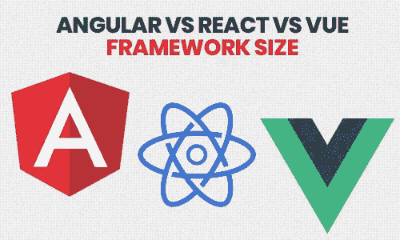

## **结论:**

考虑到下面提到的每个框架和库的大小，Vue 和 React 适合轻量级应用程序，而 Angular 非常适合复杂和重量级应用程序。

*   ***(大小约为 500 KB)***
*   ***React(大约 100 KB 大小)***
*   ***Vue(大约 80 Kb 大小)***

> 让我们来看看这些规模如何影响您企业的软件开发项目。

## **有角度的**

Angular 具有广泛的特性，从模板到测试工具都赋予了开发人员强大的能力。如果您正在考虑开发一个大规模的功能丰富的应用程序，那么 Angular 是您下一个项目的理想选择。

## **反应**

React 不像 Angular 那样是一个框架，也不像 Angular 那样提供大量的库。因此，React 是一个适合现代 web 开发的框架。

## **Vue**

如上所述，Vue 是其他框架和库中最小的，是轻量级 web 开发和单页面应用程序的理想选择。如果你想选择一个易于访问且体积较小的库，那么 Vue 是最好的选择。

# 7.**角度 Vs 反应 Vs Vue:展开速度**

## 概观

配置的速度完全取决于开发者可访问的库的数量。因此，也可以得出结论，在 Angular 中开发 web 应用程序比 React 更快更容易，而 React 的架构比 Angular 更容易扩展。

## **有角度的**

因为 Angular 是一个处理从项目创建到代码优化的广泛框架，所以它是整个部署中最具挑战性的框架。然而，由于 Angular 为您提供了广泛的功能选择，开发人员可以通过使用一个命令获得完全优化的捆绑应用程序，以部署到任何静态主机。

## **做出反应**

虽然 React 没有与 Angular 或 Vue 相同的工具，但它在灵活性方面做出了权衡。你可以用 React 混合搭配任何你想要的库。随着生态系统的增长，我们现在有了 Create React App 和 Next.js 等 CLI 工具。

## **Vue**

与 Angular 和 React 相比，Vue 的预编码结构使您能够快速部署应用程序，而不会影响应用程序的性能。只需一个简单的命令，您就可以准确地使用开发中所需的内容。使用 Vue 开发应用程序既快速又简单；所以是创业公司的理想选择。

# **8。Angular vs React vs Vue:社区支持**

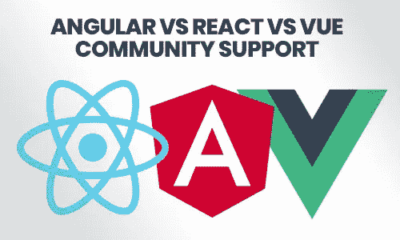

## 概观

我们现在已经熟悉了这三大 JS 框架的背景，Angular 和 React 拥有像谷歌和脸书这样的大公司的强大社区支持，而 Vue 仍然处于开源社区中。由于 React 多年来一直是最受欢迎的，它已经获得了开发人员的支持，您的大多数问题都可以通过 Stackoverflow 轻松解决。

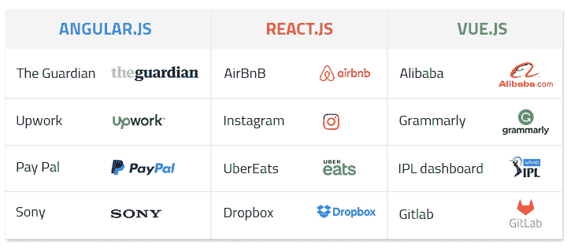

图片来源:https://dzone . com/articles/react-vs-angular-vs-vue-the-complete-comparison-to

## **棱角分明**

自 2010 年 Angular 推出以来，它一直得到谷歌的持续维护和支持，并每六个月进行一次频繁的更新。此外，根据媒体的报道，Angular 是一些知名公司使用的框架，包括微软、Autodesk、苹果、Adobe、Freelancer、Upwork、Telegram 等等。

## **反应过来**

它是由脸书在 2013 年作为一个 Javascript 库推出的，为您提供了丰富的框架功能。使用 React 的主要公司有 Instagram、网飞、纽约时报、雅虎、Whatsapp、微软、Airbnb、Dropbox 等等。

## **Vue**

它可能是一个新成员，没有 Angular 和 React 这样活跃的社区，但仍然被领先的公司使用，包括欧洲新闻、阿里巴巴、WizzAir、小米、Gitlab、Grammarly 等。

# **9。角度 Vs 反应 Vs Vue:选择技巧**

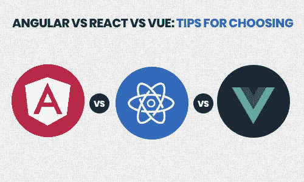

## 概观

Angular 是一个完整的包，在开发 web 应用程序时，它为您提供了从开发到测试的所有工具，而 React 是一个灵活的库，需要其他库的支持才能进行开发。Vue 是 Angular 和 React 的混合包，它提高了 web 应用程序开发的速度、效率和简单性。

## **需要时选择有角度:**

*   开发一个大规模的功能丰富的应用程序。
*   可靠且可扩展的框架。
*   开发实时应用程序，如聊天应用程序或消息应用程序。
*   开发本地应用程序、混合应用程序或 web 应用程序，这些都是长期的实质性投资项目。
*   用 TypeScript 编码。
*   面向对象编程。

## **需要时选择 React:**

*   在短时间内开发轻量级企业级现代应用程序。
*   一个灵活的框架，确保您有一个安全的网站开发解决方案**。**
*   开发跨平台应用程序或单页面应用程序。
*   扩展现有应用程序的功能。
*   强大的社区支持和解决方案。

## **需要时选择 Vue:**

*   智能、快速、高性能的应用程序。
*   选择一个框架，确保尽早进入市场。
*   开发一个像 Grammarly 这样的小型轻量级应用。
*   从现有项目迁移到现代框架，但资源有限。
*   用一个社区支持的来代替一个公司。

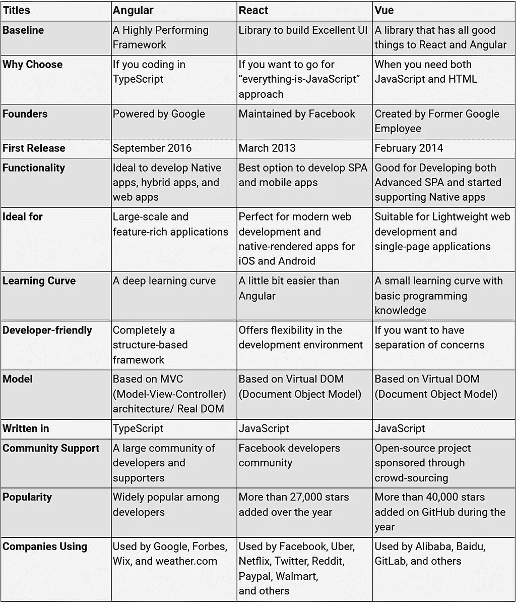

(图片来源:https://dzone . com/articles/react-vs-angular-vs-vue js-a-complete-comparison-gu)

# **带走**

众所周知，JavaScript 有很多框架，包括 Ember、Node、Polymer、Meteor 等等，但是 Angular、React 和 Vue 才是快速发展的生态系统中真正的巨人。我们试图不带偏见地比较每个框架的不同参数。唯一的目的是提供这个比较指南来帮助你理解这些框架的背景和功能，这样你就可以为你的下一个 [web 开发项目**t**选择合适的框架。](https://www.xicom.biz/offerings/web-development/)

这些比较是基于领先组织的事实、调查和案例研究。尽管如此，我们建议你在做任何决定之前做好你的研究，当你要做一个商业项目的时候。