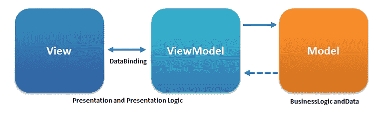
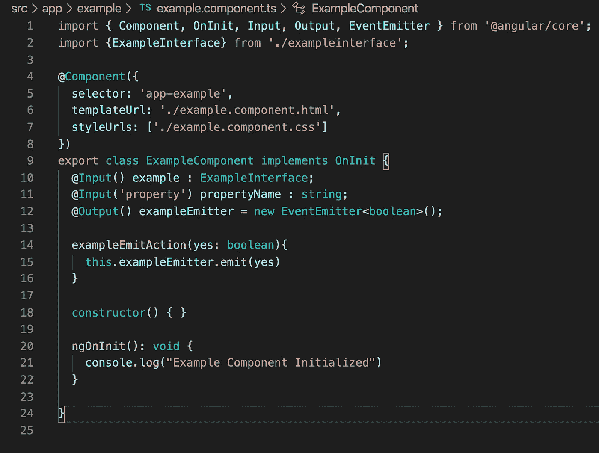
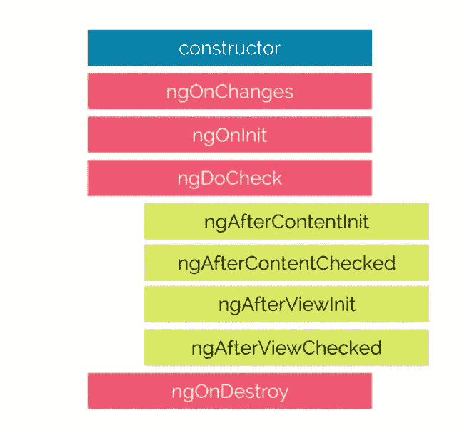
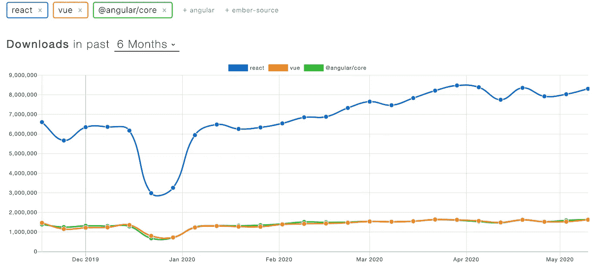

# Angular vs 竞争对手

> 原文：<https://levelup.gitconnected.com/angular-vs-the-competition-e02410b4014a>

Angular 是 Google 流行的前端框架。但是与竞争对手相比，它有什么不同/独特之处呢？

卡斯帕·卡米尔·鲁宾在 [Unsplash](https://unsplash.com?utm_source=medium&utm_medium=referral) 上的照片

Angular 是 Google 驱动的 Javascript 框架，用于构建和管理用户界面和单页应用程序。它附带了一整套内置控件和验证，这些控件和验证通常是其他框架中的额外功能，正如我们将探讨的那样，这可能是一件好事，也可能是一个负担。它与 React、Vue、Svelte、Meteor 等有什么区别？希望这篇文章将触及一些核心概念，使 Angular 独一无二。如果你想与其他高端框架进行比较，请查看 React 和 Vue。

1.  **棱角分明的历史**
2.  **安格尔的 MVW 图案**
3.  **打字稿**
4.  **角度分量**
5.  **Angular 的结构**

# **Angular 的历史**

Angular 1.0 通常被称为 AngularJS，创建于 2010 年 10 月。它的主要目的是通过分离 DOM 操作和应用程序逻辑、分离客户端和服务器端来重新设计 web 应用程序的创建，并为大型应用程序的创建提供结构和指导。

它通过创建模型-视图-视图模型框架取得了很大的成功。Angular 在幕后创建了一个数据模型，它计算进入模型的新数据和当前模型数据之间的差异，并更改客户端上的 HTML 以反映新数据。

AngularJS 在 2016 年被 Angular 2.0 继承，升级了语法，实现了 TypeScript，并将核心功能分解成模块。Angular 由谷歌的一个团队维护，但也是开源的，可以在多个分发平台上找到。考虑到它的高质量支持，Angular 现在和将来都将是开发 web 应用程序的强大动力。

# **安格尔的 MVW 图案**

Angular 采用模型-视图-视图模型模式，有时也称为模型-视图-无论什么模式。这种模式通过一个名为 ViewModel 的结构建立了视图(浏览器呈现的 HTML 表示)和模型(数据和数据逻辑)的分离。Angular ViewModel 获取数据并对其进行解释以构建视图，然后适当地更改视图。它还监听来自 DOM 的命令或事件，并使用它们来触发模型中的变化。

MVVM 可视化。信用 ugaya 40/维基百科

ViewModel 是角度引擎，解释视图中的命令和绑定来调整模型，解释逻辑和数据来改变视图中的表示。通过 HTML 模板创建视图，通过 TypeScript 类创建模型。角引擎将两者联系起来。

# **打字稿和角度**

Angular 2.0 使用 TypeScript。TypeScript 是 Javascript 的语法强制扩展，在许多方面类似于 Java 或 C#。它是由微软开发的，旨在给 Javascript 的混乱带来秩序。

为什么打字稿？ [Victor Savkin 在这里给出了最好的答案](https://vsavkin.com/writing-angular-2-in-typescript-1fa77c78d8e8)，但简短的回答是，切换到 TypeScript 的决定是基于让 Angular 2.0 能够访问优秀的开发人员工具并改进大规模应用程序的可访问性。

如果您已经熟悉 Javascript、Java 或两者，那么进入 TypeScript 应该不会太难。您会发现接口、强类型声明和非常类似 Java 的面向类/对象的结构，同时仍然使用 Javascript 的内置函数和松散定义的数组、对象、原型链和数据结构。

# **角形组件**

使用输入和输出的角度分量示例

Angular 采用了一种定义良好的严格的文件结构，其中模板、CSS 和名称都是在一个 TypeScript 文件中的 decorators 中定义的，并且为 TypeScript、HTML 模板和 CSS 定义了单独的文件。辅助文件，如助手函数、接口和数据文件，被鼓励在一个新文件中创建，以分离关注点。给定组件的所有文件通常保存在以该组件命名的同一文件夹中。Angular CLI 实际上使用 **ng generate component** 命令为您构建这些文件，并在定义装饰器中将它们联系在一起。它甚至为您启动了一个测试文件，并在其中建立了一个测试函数。Angular 的开发人员以如此严格的方式构建工具，以提高构建大规模应用程序的体验，代价是使系统更难为更简单的组件起步。

一旦您获得了一个新的组件，您就可以开始在组件中定义数据，设置生命周期挂钩，确定输入和输出，并安装模块来扩展功能。Angular 是高度定义的，所以如果你想增加功能，有一个模块，以及如何使用它们的教程。

输入和输出，如示例文件中所示，是组件在 Angular 中相互通信的方式。输入从父组件传递到子组件，输出是事件发射器，当事件通过树向上传播时，父组件可以捕捉到它。

有角度的生命周期挂钩。红色的钩子在组件上调用，绿色的钩子在它的子组件上调用。

Angular 的生命周期挂钩与其他生命周期并没有太大的不同，但是它们的列表中确实包含了触发组件子级的挂钩。这是独一无二的，因为它意味着父母正在监听其子女正在采取的行动，这是一条通信线路，增加了应用程序如何工作的一些开销，但它让父母能够访问子女的生命周期，这可能是强大的。

对于生命周期挂钩的完整概要以及它们何时运行，[你可以查看文档](https://angular.io/guide/lifecycle-hooks)。

除了组件，Angular 还可以有单独的文件，称为指令。指令是特殊的 HTML 标记，根据参数或参数的存在提供条件格式。有一些内置的指令，比如 ngIf，它使 DOM 元素的呈现有条件，或者 ngFor，它为集合中的每个元素重复标记的元素。您可以为您的应用程序定义和使用自己的指令来确定功能、给出条件格式，或者将它们与其他模块一起使用来为您的应用程序构建自定义事件。

# **棱角分明的结构**

向 Angular 2.0 过渡的一部分是将框架的功能分解成模块，这些模块可以根据需要包含在项目中。Angular 的内置模块有@angular/router 或@angular/forms。或者你可以引入 npm 模块。一些常见的是 RxJS，这是一个处理承诺的流行库，或者 NgRx，这是 Angular 的一个状态管理工具。

Angular 被设计为通过大量的检查和测试来支持大规模的应用程序、团队和集成。这使得 Angular 的学习曲线变得有点陡峭，但是当回顾您的或其他人的代码时，回报是更多的信息，以及更容易的故障排除和用于实施良好代码模式和行为的工具。使用 Angular 有时可能感觉像用大锤来构建玩具模型，但是使用 Angular 的已定义结构将使您的编程更具可读性，并加强良好的习惯。

2020 年初热门 Javascript 框架的 npm 下载趋势

Angular 在企业应用程序中有很多用途，并广泛用于许多大规模的商业应用程序中。在 Google 和微软的支持下，Angular 成为了 Javascript 前端环境中的一个重要框架。

如果您对学习 Angular 感兴趣，但想从更简单的地方开始，您可以考虑学习 Vue.js 的基础知识，这主要是受 Angular 的模型的启发，但不采用严格的协议，而是使用普通的 Javascript。

[反应过来的文章](https://medium.com/@aptricou/react-vs-the-competition-d8cbb09baf9a)

[视图 Article](https://medium.com/@aptricou/vue-vs-the-competition-bea57a45a117)