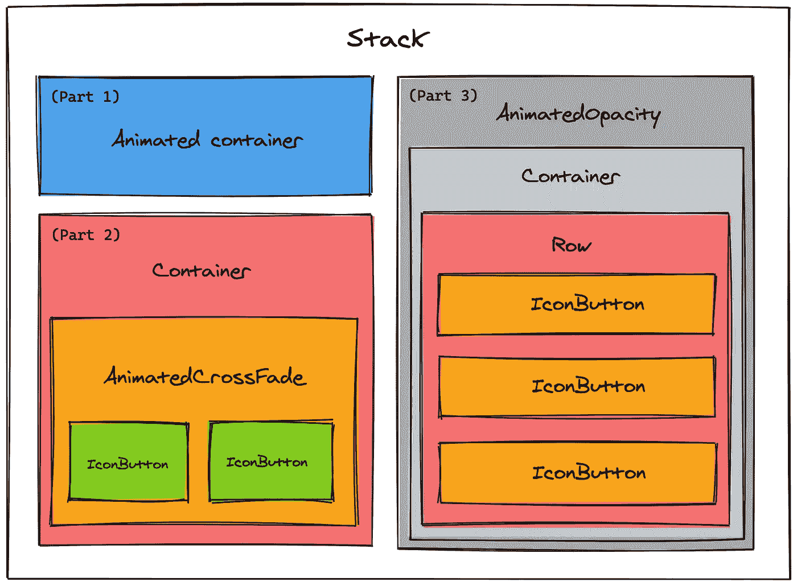
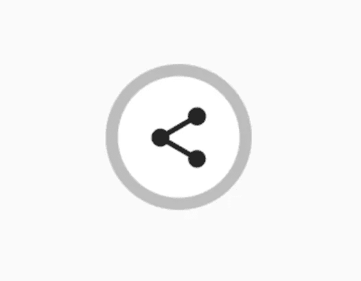

# 在 Flutter 中使用隐式动画制作社交分享按钮的动画

> 原文：<https://levelup.gitconnected.com/animate-a-social-share-button-using-implicit-animations-in-flutter-9b2b86dd6594>


好的动画使界面友好且富有创造性。用 Flutter 添加动画是一种福气！在 Flutter 中，有两种方法可以添加动画:

1.  隐式动画
2.  明确的动画

**隐式动画**隐藏内部复杂性，替你管理动画。另一方面，**显式动画**提供了更多的控制和定制，但有一个学习曲线。

这篇文章是关于利用隐式动画和创建如下所示的社交分享按钮动画


# 控制隐式动画:

为了控制你的动画，`ImplicitlyAnimatedWidget`为你提供了 3 个属性:

1.  `duration` -动画的长度
2.  `curve` -给定持续时间内动画的变化率([曲线列表](https://api.flutter.dev/flutter/animation/Curves-class.html))
3.  `onEnd` -动画完成后调用的回调函数(可用于触发不同的动画或动画完成后移动到不同的路线)

# 让我们编码吧！

考虑下面的代码片段:

分享 _ 按钮.镖

势不可挡？不要担心，让我们试着用一个部件图来可视化上面的代码



小部件图

Flutter 的美妙之处在于一切都可以分解成小部件。让我们将整个小部件图分成 3 个部分，逐一研究每个小部件。

## 堆

> 相对于其盒子的边缘定位其子部件的小部件。

`Stack`在我们的例子中充当父部件。

如果您想以简单的方式重叠几个子元素，那么 Stack 非常有用。我们已经堆叠了`AnimatedContainer`(第 1 部分)`Container`(第 2 部分)和`AnimatedOpacity`(第 3 部分)，我们将在接下来讨论。

# 第一部分


第一部分。

## 动画容器

`AnimatedContainer`顾名思义就是动画版的[容器](https://api.flutter.dev/flutter/widgets/Container-class.html)在一段时间内逐渐改变其值。

[AnimatedContainer](https://api.flutter.dev/flutter/widgets/AnimatedContainer-class.html) 将使用提供的`curve`和`duration`在属性的新旧值之间自动动画。

```
AnimatedContainer(
          duration: const Duration(milliseconds: 350),
          curve: Curves.fastOutSlowIn,
          width: isOpen ? 240 : 48,
          height: 48,
          decoration: ShapeDecoration(
            color: Colors.grey[400],
            shape: StadiumBorder(),
          ),
        )
```

你看，在我们的例子中，我们有一个灰色的盒子，里面装着 Twitter、脸书和 Instagram 的股票期权。根据它的打开或关闭状态，我们使用曲线`fastOutSlowIn`将宽度更改为`240`或`48`，并在`350`毫秒的时间内将它动画化。

# 第二部分



第二部分

## 容器

> 一个方便的小部件，结合了常见的绘画、定位和大小调整小部件。

我们使用`Container`小部件来添加一个白色的圆形容器，它包装了我们接下来要讨论的`AnimatedCrossFade`小部件。

```
Container(
  width: 40,
  margin: *const* EdgeInsets.only(left: 4),
  decoration: BoxDecoration(
    color: Colors.*white*,
    shape: BoxShape.circle,
  ),
  child: AnimatedCrossFade(
  ...
```

## 动画交叉渐变

> 一个小部件，在两个给定的孩子之间交叉淡入淡出，并在他们的大小之间自动显示。

对于我们的社交共享小部件的打开和关闭状态，我们需要显示一个共享图标或跨图标按钮。为了实现切换过渡，我们使用了`AnimatedCrossFade`小部件。

```
AnimatedCrossFade(
  duration: *const* Duration(milliseconds: 450),
  firstChild: IconButton(
    icon: Icon(Icons.*share*),
    onPressed: () => _toggleShare(),
  ),
  secondChild: IconButton(
    icon: Icon(Icons.*close*),
    onPressed: () => _toggleShare(),
  ),
  crossFadeState: !isOpen
      ? CrossFadeState.showFirst
      : CrossFadeState.showSecond,
),
```

## 图标按钮

因为我们需要在点击时切换打开和关闭状态，所以我们使用了`IconButton`小部件。在`onPressed`回调时，我们通过将`isOpen`的值更改为`true`或`setState`内的`false`来切换打开和关闭状态

# 第三部分


第三部分

## 动态容量

> `AnimatedOpacity`每当给定的不透明度改变时，在给定的持续时间内自动过渡子对象的不透明度。

如果你仔细观察我们的例子，你会发现我们的分享项目(Twitter、脸书和 Instagram)已经不透明了

我们通过使用`AnimatedOpacity`小部件并根据打开或关闭状态将不透明度更改为`1`或`0`来实现这一点。

```
AnimatedOpacity(
  duration: *const* Duration(milliseconds: 450),
  opacity: isOpen ? 1 : 0,
  child: Container(
  ...
```

## 容器

为了布局 3 个分享选项——Twitter、脸书和 Instagram，我们使用了另一个`Container`小工具。

```
Container(
  width: 240,
  padding: *const* EdgeInsets.only(left: 40),
  child: Row(
  ...
```

## 排

> 以水平数组显示其子级的小部件。

为了调整我们的 3 个股票期权，我们使用了`Row`小部件，为了平均分配空间，我们将`mainAxisAlignment`设置为`MainAxisAlignment.spaceAround`

```
Row(
  mainAxisAlignment: MainAxisAlignment.spaceAround,
  children: [
    IconButton(
      icon: Icon(AntDesign.*twitter*),
      onPressed: () {},
    ),
    IconButton(
      icon:Icon(AntDesign.*facebook_square*),
      onPressed: () {},
    ),
    IconButton(
      icon: Icon(AntDesign.*instagram*),
      onPressed: () {},
    ),
  ],
),
```

## 图标按钮

我们的每一份个人股票期权都是一个`IconButton`部件。您可以处理`onPressed`回调来触发应用程序中的共享功能。

瞧啊。您已经有了一个漂亮的动画共享按钮部件！


谢谢你花时间滚动到最后😊

关注我，了解更多精彩内容。让我们连线一下- [Twitter](https://twitter.com/satyam_saluja) 、 [LinkedIn](https://www.linkedin.com/in/satyam04/) 或 [Github](https://github.com/satyam-dev)

## 参考资料:

[](https://www.raywenderlich.com/) [## raywenderlich.com |高质量编程教程:iOS，Android，Swift，Kotlin，Flutter…

### 了解 iOS 和 Swift、Android 和 Kotlin & Dart 和 Flutter 开发，以及最大和最高质量的……

www.raywenderlich.com](https://www.raywenderlich.com/)  [## Flutter - Dart API 文档

### Flutter API 文档，用于 Dart 编程语言。

api.flutter.dev](https://api.flutter.dev/)