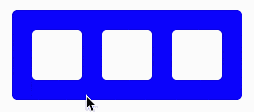
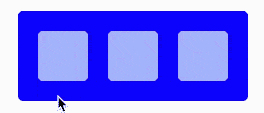
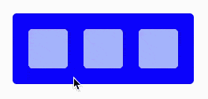
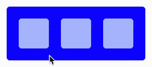

# 动画反应与帧运动

> 原文：<https://levelup.gitconnected.com/animate-react-with-framer-motion-c761a7ad1c22>

## 从基础到复杂的配合动画

[Framer-motion](https://www.framer.com/motion/) 是一个为 [Framer](https://www.framer.com/) 中的动画提供动力的库，它现在是一个独立的包，我们可以在 React 应用程序中使用。它有一个非常简单的声明式 API，使得用最少的代码创建和编排复杂的动画变得容易。在这篇文章中，我们将从非常基础的动画开始，逐渐过渡到更高级的。

*注意:由于 GIF 图像的帧速率较低，文章中的动画示例可能看起来不流畅。放心，真正的动画都是* ***油滑*** *。你可以在* [*沙盒这里*](https://codesandbox.io/s/framer-motion-intro-96bu3) *和他们一起玩。*

# 设置

我们可以用`yarn add framer-motion`命令安装 framer-motion。

为了动画元素，我们需要抛弃原始的 HTML 元素(`div`、`span`、`path`等)。)而支持他们的“注入运动”的同行——`motion.div`、`motion.span`、`motion.path`等。这些元素暴露了我们添加动画所需的属性。

# 让事情动起来

为了创建最简单的动画，我们可以指定`animate`属性，该属性接受一个具有我们想要制作动画的 CSS 属性的对象。这就是我们如何制作`div`的不透明度和背景颜色的动画:

演示 1:在装载时制作动画

我们传递给`animate`的属性表示动画的最终状态**。Framer-motion 将根据指定的 CSS 属性或其默认值来推断初始状态。例如，CSS 元素的默认不透明度是`1`(即使我们没有明确设置它)，所以 framer-motion 知道如何将它动画到`0.5`。**

我们也可以使用`initial` prop 来设置动画 CSS 属性的初始值。它还接受一个带有 CSS 属性的对象，告诉 framer-motion 初始值应该是什么样的。在下面的例子中，我们通过动画`y`和`opacity`属性淡入矩形:

演示 2:使用初始状态制作动画

值得一提的是，属性`y`很特殊——它不是真正的 CSS 属性，但 framer-motion 理解它。有一堆与 CSS `transform`相关的属性在 framer-motion 中有快捷方式，所以当我们更改`y`属性时，我们实际上是将动画应用于`transform: translateY()`属性。同样，还有`scale`、`rotate`、`scaleX`、`scaleY`等一些属性，你可以在这里找到完整的列表[。](https://www.framer.com/api/motion/component/#transform)

# 动画状态变化

到目前为止，我们所做的动画只在组件挂载时运行。现在让我们来看看当一些内部状态改变时，我们如何使元素动画化。

我们可以根据内部状态将`animation`属性设置为不同的值，当状态改变时，framer-motion 将在这些值之间制作动画:

演示 3:点击时动画 div

请注意，组件仅在状态改变时重新渲染，而不是在每个动画帧上重新渲染，这使得动画非常高效。

# 变体

成帧器运动的真正力量来自于使用**变体**。让我们从探索如何重写前面的例子来使用变体开始。

我们将开始从`animate` prop 提取动画属性的内联定义到一个单独的对象中。这个对象将包含键-值对，其中键是一些有意义的名称，我们给我们的动画属性，值是属性本身。然后我们可以将这个变体对象传递给`variants` prop，在`animation`中，我们可以根据我们给它们的字符串名称来切换动画:

演示 4:点击时制作 div 动画(同样，但是使用变体)

这个例子可行，但不是很有用。变体的强大之处在于在整个组件树中编排复杂的动画，为了看到这一点，我们需要一个稍微大一点的例子。

在下面的组件中，我们有一个容器`div`，里面有三个子容器`div`。容器`div`使用了我们之前见过的相同的`onClick`动画:

演示 5:动画 div

现在，我们可以通过设置子元素自己的 variants 对象，使子元素与父元素同时具有动画效果。当子动画的描述性名称与父动画的描述性名称匹配时，子动画将与父动画同时被触发。

请注意`container`和`box`变体如何拥有相同的键`active`和`disabled`:

演示 6:用子元素制作 div 动画

# 配置变体

变体还允许我们编排子动画。我们可以通过在动画对象中提供`transition`属性来实现。

例如，我们可以设置`staggerChildren` children 属性，该属性指定子动画之间的延迟秒数:

演示 7:交错子元素

请注意，仅当我们将**转换为给定的变量**时，才应用转换。由于我们在`active`变量中定义了`transition`属性，所以交错动画仅在我们从`disabled` **过渡到** `active`时应用，而在我们从`active`过渡到`disabled`时不应用。

默认情况下，变体同时开始为父元素及其子元素设置动画。我们可以使用`when`属性来控制这种行为。我们可以将其设置为`beforeChildren`以使父元素首先动画化，或者设置为`afterChildren`以使父元素在其子元素之后动画化:

演示 8:在子对象之前激活父对象

使用这种配置，父元素`div`首先改变背景颜色，然后子元素以交错的延迟旋转。

我们可以控制更多的变量属性——动画延迟、交错方向等。你可以在 framer-motion [文档](https://www.framer.com/api/motion/animation/#variants)中找到更多信息。

# 包扎

在本文中，我们看到了使用 framer-motion 提供的声明性 API 来激活 React 组件是多么容易。然而，我们只是触及了表面，因为 framer-motion 还有很多功能——手势、拖动、使用 SVG 路径等等。如果您有兴趣了解更多信息，请查看我的新课程，它涵盖了 framer-motion 提供的所有强大功能:

*最初发表于*[*https://konstantinlebedev.com*](https://konstantinlebedev.com/framer-motion-intro/)*。*

 [## 学习 React -最佳 React 教程(2019) | gitconnected

### 前 57 名 React 教程-免费学习 React。课程由开发人员提交并投票，使您能够…

gitconnected.com](https://gitconnected.com/learn/react)