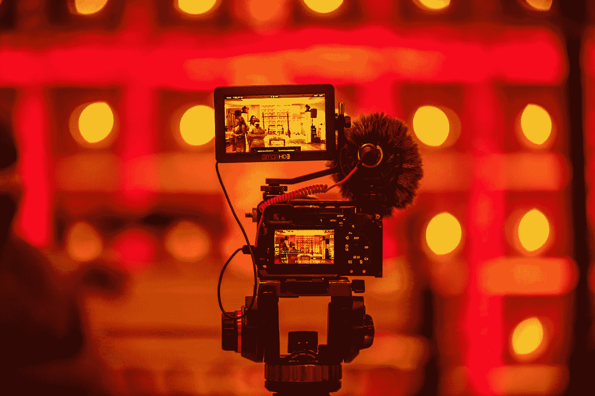

# 用视频背景制作 SVG 文本动画

> 原文：<https://levelup.gitconnected.com/animate-svg-text-with-a-video-background-bf1d03e47600>

如何给 SVG 文本添加视频背景

照片由 [Kushagra Kevat](https://unsplash.com/@kushagrakevat?utm_source=medium&utm_medium=referral) 在 [Unsplash](https://unsplash.com?utm_source=medium&utm_medium=referral) 拍摄

需要一些灵感来为你的网站创建引人注目的英雄形象或标题吗？您可以使用 SVG 将视频背景合并到文本中！

# HTML 页面

首先，让我们设置 HTML。在正文中，我们将有我们的 header 标签。在 header 标签中，有视频源和 SVG。

`Video`标签有多种属性:

1.  自动播放→
    表示视频准备就绪后将立即开始播放
2.  静音→
    表示视频音频静音
3.  循环→表示视频将继续回放
4.  预加载→指定在页面加载时是否以及如何加载视频
5.  Playsinline →这是针对移动浏览器的，用于指示视频将在它所在的位置正确播放，而不是默认方式，即视频以全屏方式打开。

`Source`将包含视频/mp4 文件。

`Video`只能带这些文件:MP4、WebM 和 OGG。

要找到免费的 MP4 视频文件，谷歌“免费股票视频”或“免费视频剪辑”。Pexels 有一系列不错的视频。

`SVG`标签具有属性:

1.  `viewBox`定义了视口的位置和尺寸。四个数值分别表示`min-x`、`min-y`、`width`和`height`。
2.  `preserveAspectRatio`定义具有给定纵横比的视图框的 SVG 必须如何适应具有不同纵横比的视图。接受两个参数:1) `align` →指示是否强制统一缩放，如果是，在`viewBox`的纵横比与 SVG 视口的纵横比不匹配时使用的对齐方法。2)相交或切片→ `meet`缩放图形，使整个`viewBox`在视窗中可见，而`viewBox`尽可能放大。`slice`缩放图形，使整个视窗被`viewBox`覆盖，`viewBox`被缩小。

这里，我们的 SVG 的`preserveAspectRatio`强制统一缩放，这将元素的中点 X 和 Y 值与视口的中点 X 和 Y 值对齐。

SVG 标签中还有其他几个标签:

1.  defs →用于存储图形对象。
2.  遮罩→定义 alpha 遮罩，用于将当前对象合成到背景中。遮罩决定了 SVG 的哪些部分是可见的，并且具有一定的透明度。
3.  矩形→用于创建矩形
4.  文本→用于定义文本。

# CSS 页面

# 最终产品

玩得开心&下次见！💙