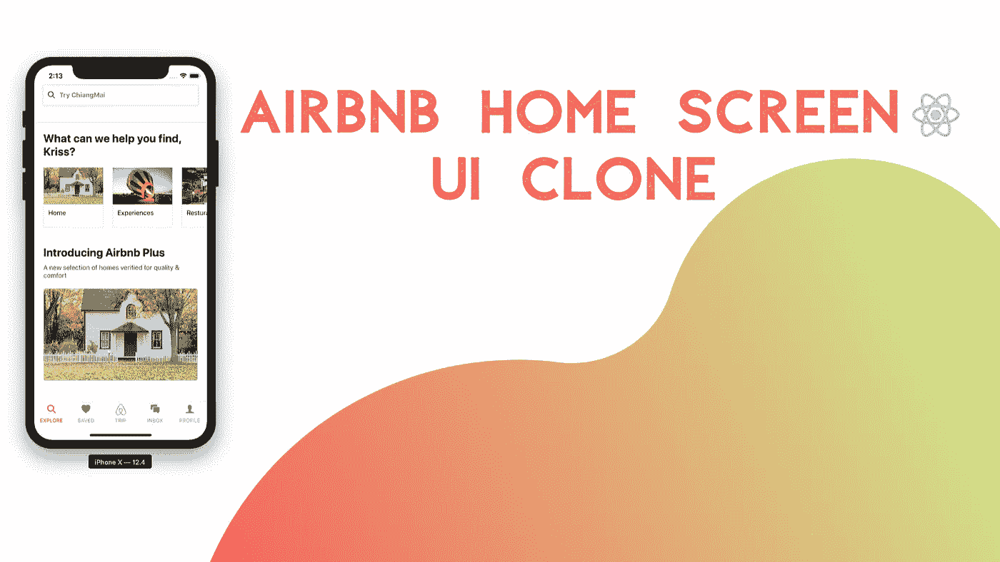
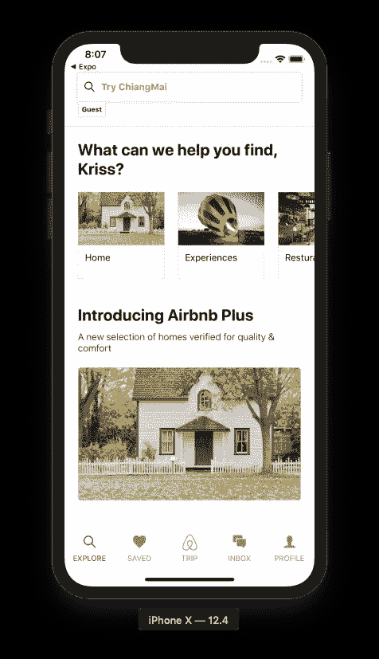
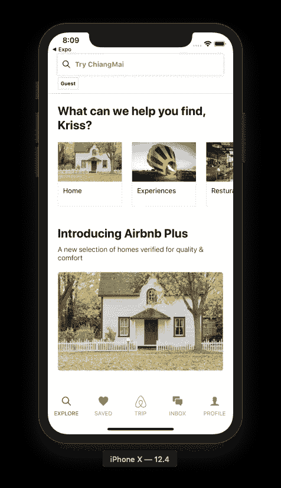
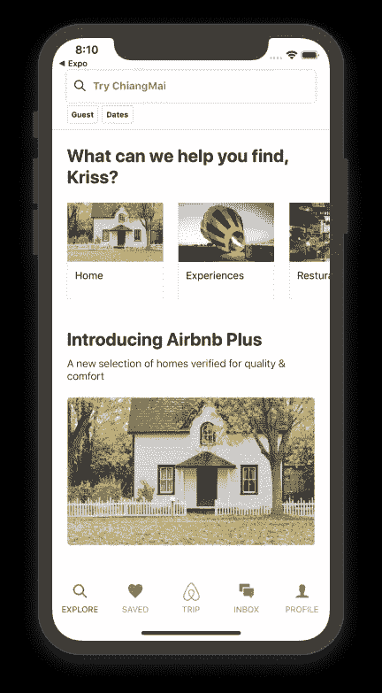
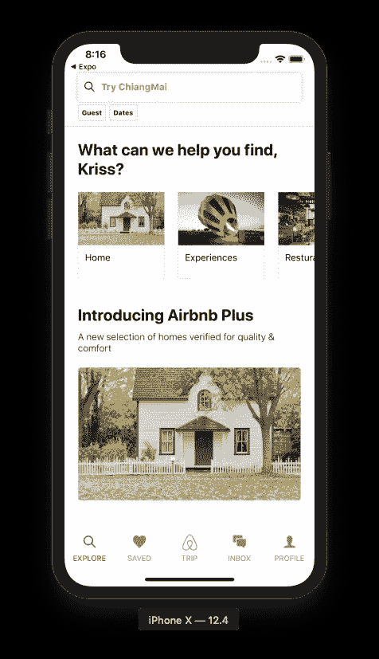
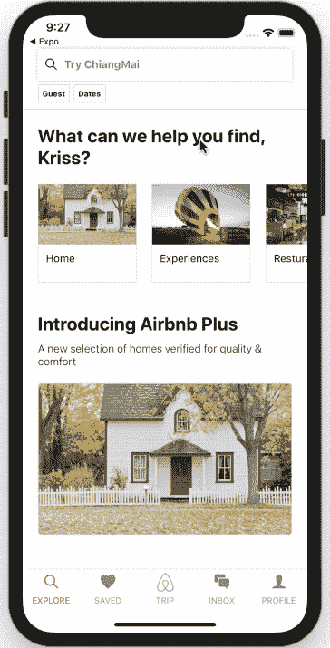
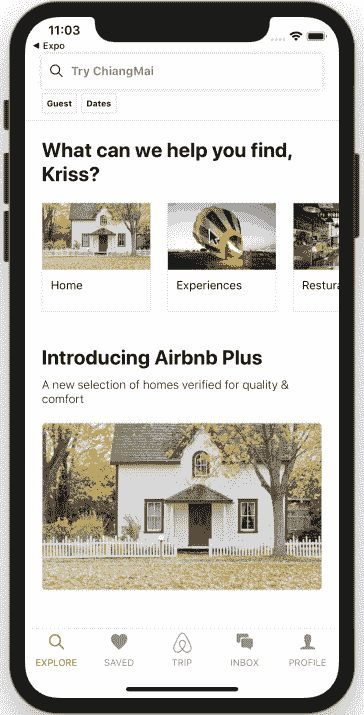

# 动画顶部标签部分 Airbnb 主屏幕 UI 克隆与 React Native #4

> 原文：<https://levelup.gitconnected.com/animate-top-tag-section-airbnb-home-screen-ui-clone-with-react-native-4-986228ad76bb>



本教程是我们使用 React Native 克隆 Airbnb 主屏幕 UI 的第四部分。在上一部分中，我们成功地实现了 Home World wide 部分的 Home 包。本教程是我们上一部分停止的同一教程的继续。建议仔细阅读前面的部分，以便更好地了解整个项目。

如前所述，本教程系列的灵感来自于[React native real estate template](https://www.instamobile.io/app-templates/real-estate-app-template-react-native/)，它使我们能够开发一些令人惊叹的随时可部署的应用程序，任何人都可以使用它们来创建创业公司或销售应用程序模板。这第四部分也是 Youtube 视频教程中由不确定的程序员为 Airbnb 克隆的编码实现和设计的延续。

在这一部分，我们将使用 react Native 实现 React 动画。这个想法是实现标签部分，就像最初的 Airbnb 应用程序的主屏幕搜索栏底部一样。当我们从上到下滚动主屏幕时，动画开始播放，反之亦然。在从上到下的滚动阶段，我们将隐藏带动画的标签部分，当我们滚动回顶部时，它将带动画出现。

*那么，我们开始吧！*

# 实现标记部分

在这一步中，我们将首先用任何动画实现整体标签部分。这个想法是在 Explore.js 屏幕文件中实现 tags 部分，然后将它移动到一个单独的组件中，以便可以重用。

## 导入所需组件

首先，我们将为整个教程导入必要的组件。这里需要导入的组件是为 react-native 应用提供动画属性的`Animated`组件。因此，让我们从 react-native 包中导入`Animated`组件，如下面的代码片段所示:

```
import {
    View,
    Text,
    StyleSheet,
    SafeAreaView,
    TextInput,
    Platform,
    StatusBar,
    ScrollView,
    Image,
    Dimensions,
    Animated
} from "react-native";
```

## 添加标记包装

在 Explore.js 文件中，我们将添加一个包装器元素来封装搜索栏部分下面的选项卡部分。对于包装元素。我们将使用的是`Animated View`组件，它使我们能够将动画属性集成到`View`组件中。除了`Animated View`包装器，我们还将添加一些内联样式，如下面的代码片段所示:

```
<Animated.View
    style={{ flexDirection: 'row', marginHorizontal: 20, position: 'relative' }}
    >

</Animated.View>
```

## 添加标签

我们将在上一步创建的`Animated View`包装器中创建一个实际的标签。对于标记部分，我们将使用由`View`元素包围的`Text`组件。`Text`组件将用一些字体样式保存提及标签名称的文本，而`View`组件将用样式包装`Text`组件，以使标签区域看起来合适且有吸引力。下面的代码片段提供了实现这一点的代码:

```
<View
  style={{
    minHeight: 20,
    minWidth: 40,
    padding: 5,
    backgroundColor: "white",
    borderColor: "#dddddd",
    borderWidth: 1,
    borderRadius: 2,
    marginRight: 5
  }}
>
  <Text style={{ fontWeight: "700", fontSize: 10 }}>Guest</Text>
</View>
```

我们将在模拟器屏幕中得到以下结果:



正如我们所看到的，我们的标签就在搜索栏的下面，但是标签粘在搜索栏的底部。为了解决这个问题，我们将添加一些样式来将标签放到正确的位置。一些包含 top 和 margin 属性的样式将被添加到`Animated View`组件中，如下面的代码片段所示:

```
</View>
           <Animated.View
             style={{
               flexDirection: "row",
               marginHorizontal: 20,
               position: "relative",
               top: 5
             }}
           >
```

我们将在模拟器屏幕上得到以下结果:



我们将通过复制标签的`Animated View`组件中的相同代码来创建第二个标签，并将其粘贴到包含不同名称的第一个标签的视图元素下面。然后，我们将在模拟器屏幕上获得以下带有两个标记的结果:



我们已经成功地创建了标记部分。通过一次又一次地为标记部分复制相同的全部代码来显示多个标记似乎不合逻辑。我们将把 tags 部分的整体编码实现转移到一个新的组件中，以使其可重用。

## 为标记部分创建新组件

在这一步中，我们将在中创建一个新组件。/components '目录。让我们在'中创建一个名为 Tag.js 的新文件。/components '目录。然后，在 Tag.js 组件文件中，我们需要导入之前在 Explore.js 屏幕中导入的 tags 部分所需的所有必要组件。之后，我们需要创建一个名为`Tag`的`class`，它扩展到`Component`模块。在`Tag`类`render()`方法中，我们需要包含 Explore.js 文件中单个标签所需的代码模板。

实际上，我们需要复制 Explore.js 屏幕的`Animated View`组件中包含的代码，然后将其粘贴到这里的`render()`函数中。我们需要将`Text`组件中的标签名替换为一个名为`name`的属性值，该属性值将从父组件传递下来。下面的代码片段提供了标记组件所需的所有编码实现:

```
import React, { Component } from "react";
import { View, Text, Image } from "react-native";

class Tag extends Component {
  render() {
    return (
      <View
        style={{
          minHeight: 20,
          minWidth: 40,
          padding: 5,
          backgroundColor: "white",
          borderColor: "#dddddd",
          borderWidth: 1,
          borderRadius: 2,
          marginRight: 5
        }}
      >
        <Text style={{ fontWeight: "700", fontSize: 10 }}>
          {this.props.name}
        </Text>
      </View>
    );
  }
}
export default Tag;
```

我们需要从'导入我们的`Tag`组件。/components '目录放到 Explore.js 屏幕文件中，如下面的代码片段所示:

```
import Tag from "../components/Tag";
```

我们需要在我们的`Animated View`组件中包含`Tag`组件，并使用正确的标记名定义一个名为`prop`的`name`。如下面的代码片段所示，`name`属性被传递给`Tag`组件:

```
<Animated.View
    style={{
      flexDirection: "row",
      marginHorizontal: 20,
      position: "relative",
      top: 5
    }}
  >
    <Tag name={"Guest"} />
    <Tag name={"Dates"} />
  </Animated.View>
</View>
```

我们得到了与之前相同的结果，但是使用了下面模拟器截图中所示的组件:



我们已经通过创建单独的标记组件成功地实现了标记部分。现在是时候做动画了。

## 动画的实现

在本节中，我们将实现标签部分的动画。想法是当从上到下滚动时隐藏标签部分，当滚动回到顶部时使标签部分重新出现。

## 配置垂直动画

我们将向 Explore.js 屏幕文件中的`ScrollView`组件添加动画配置。为此，我们需要将`Animated`组件提供的`event`方法配置包含在`ScrollView`组件的`onScroll`事件中，以将 Y 轴上的偏移量提取到一个变量中，如下面的代码片段所示:

```
<ScrollView
         scrollEventThrottle={16}
         onScroll={Animated.event(
             [
                 { nativeEvent: { contentOffset: { y: this.scrollY } } }
             ]
         )}
     >
```

我们需要定义一个名为`scrollY`的动画变量，将其初始化为值 0。我们还需要将选项卡部分的起始高度定义为初始化为值 0 的`startHeaderHeight`。同样，选项卡部分的结束高度作为`endHeaderHeight`初始化为 50，如下面的代码片段所示:

```
constructor(props) {
    super(props);
    this.scrollY = new Animated.Value(0);
    this.startHeaderHeight = 80;
    this.endHeaderHeight = 50;
}
```

我们准备将动画添加到选项卡部分。

## 添加滚动动画

我们将使用`scrollY`动画变量向`animatedHeaderHeight`变量添加垂直动画。动画的想法是当向下滚动时降低 `Animated View`包装器的高度，当向后滚动时增加高度回到正常。被初始化为动画值的`scrollY`变量提供了一个`interpolate()`方法，该方法将参数作为`inputRange`和`outputRange`配置以及`extrapolate`选项。`outputRange`配置为使用`extrapolate`选项作为`clamp`的选项卡部分的起始高度和结束高度，如下面的代码片段所示:

```
this.animatedHeaderHeight = this.scrollY.interpolate({
     inputRange: [0, 50],
     outputRange: [this.startHeaderHeight, this.endHeaderHeight],
     extrapolate: "clamp"
 });
```

我们需要在主搜索栏触发动画。为此，我们需要添加一个`Animated View`的包装器。然后，我们需要将之前配置的`animatedHeaderHeight`变量添加到`Animated View`的`height`属性的 style 属性中，如下面的代码片段所示:

```
<Animated.View
   style={{
     backgroundColor: "white",
     height: this.animatedHeaderHeight,
     borderBottomWidth: 1,
     borderBottomColor: "#dddddd"
   }}
 >
```

我们在下面的模拟器模拟中得到以下结果:



正如您所看到的，当我们向下滚动时，选项卡部分消失了，当我们滚动到顶部时，它又重新出现了。但是，动画还不流畅。所以我们需要添加一些额外的动画属性和样式来使其平滑过渡。

## 向动画添加不透明度属性

我们将把不透明度属性添加到标签部分的`Animated View`包装器中。为此，我们需要定义一个名为`animatedOpacity`的变量。然后将其初始化为`interpolate()`方法，如下面的代码片段所示:

```
this.animatedOpacity = this.scrollY.interpolate({
    inputRange: [this.endHeaderHeight, this.startHeaderHeight],
    outputRange: [0, 1],
    extrapolate: "clamp"
  });
```

我们将`animatedOpacity`变量添加到`Animated View`组件的不透明度样式属性中，如下面的代码片段所示:

```
<Animated.View
     style={{
       flexDirection: "row",
       marginHorizontal: 20,
       position: "relative",
       top: 5,
       opacity: this.animatedOpacity
     }}
   >
     <Tag name={"Guest"} />
     <Tag name={"Dates"} />
</Animated.View>
```

我们得到了选项卡部分的平滑动画，如下面的模拟器模拟所示:



我们已经成功实现了标记部分模板，并且还配置了动画来显示和隐藏标记部分。

## 结论

本教程是 Airbnb 主屏幕 UI 克隆教程系列的第四部分。在这一部分中，我们从本系列教程的第三部分中停止的地方继续。在这里，我们学习了如何将 tags 部分实现为一个可重用的组件，并在多个地方使用它，从而得到一个 tags 部分。我们还学习了如何利用`Animated`组件及其属性来添加垂直动画样式。然后，我们最终使用 React Native 在滚动到我们的主屏幕 UI 克隆时显示了隐藏和显示动画的选项卡部分。

## 回顾系列

到目前为止，在这个系列教程中，我们学习了如何引导布局，就像在 React native 中的 Airbnb 一样。我们还学习了如何用组件创建不同的部分，以及添加动画。在接下来的部分中，我们将介绍如何设置 react 本地导航。

*最初发表于* [*克里斯*](https://kriss.io/airbnb-home-screen-ui-clone-with-react-native-4-animate-top-tag-section/) *。*