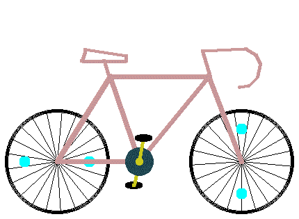
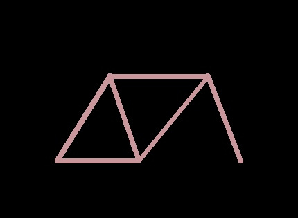
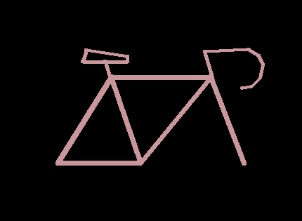
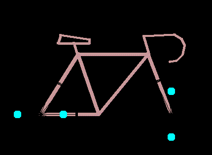

# 用 Python 制作的动画 GIF

> 原文：<https://levelup.gitconnected.com/animated-gif-with-python-1fd881abafd1>

使用 Python 和 Pillow 生成动画自行车

在这个简短的教程中，我们将使用 Python 和 Pillow 库绘制一辆自行车。



预期结果:动画自行车与蟒蛇和枕头

早在 1987 年学习 Basic 编程语言时，我就喜欢用坐标画图像。我在纸上画图像，然后把一切翻译成代码。我真的很年轻，对我来说，这是一个火箭科学:)

后来，有了数学，我学会了如何逐点画圆以及更多。

现在，是你给[装枕头](https://pypi.org/project/Pillow/2.2.1/)的时候了，欢迎和我一起抽奖！

## 框架

我们从一些你可以尝试的变量开始:

```
**import** math
**from** PIL **import** Image, ImageDraw

images = []

zoom = 0.5
width = int(860 * zoom)
height = int(630 * zoom)
```

让我们介绍一个绘制框架的函数:

```
**def** draw_frame(draw):
    points = [(165,465),(317,220),(400,465),(600,220),(695,465)]
    line_fill = (200,150,155)
    line_width = int(15*zoom)
    draw.line(xy=(points[0][0]*zoom, points[0][1]*zoom, points[1][0]*zoom, points[1][1]*zoom), fill=line_fill, width=line_width)
    draw.line(xy=(points[0][0]*zoom, points[0][1]*zoom, points[2][0]*zoom, points[2][1]*zoom), fill=line_fill, width=line_width)
    draw.line(xy=(points[1][0]*zoom, points[1][1]*zoom, points[2][0]*zoom, points[2][1]*zoom), fill=line_fill, width=line_width)
    draw.line(xy=(points[1][0]*zoom, points[1][1]*zoom, points[3][0]*zoom, points[3][1]*zoom), fill=line_fill, width=line_width)
    draw.line(xy=(points[2][0]*zoom, points[2][1]*zoom, points[3][0]*zoom, points[3][1]*zoom), fill=line_fill, width=line_width)
    draw.line(xy=(points[3][0]*zoom, points[3][1]*zoom, points[4][0]*zoom, points[4][1]*zoom), fill=line_fill, width=line_width)
    **for** p **in** points:
        draw.ellipse((p[0]*zoom-line_width/2, p[1]*zoom-line_width/2,
                      p[0]*zoom+line_width/2, p[1]*zoom+line_width/2),fill=line_fill)
```

是的，这里很乱，很多奇怪的东西被放大了。它可以变得更短，但是代码可读性更差。尝试简单地逐行阅读代码，并理解如何画线，简而言之:

```
draw.line(xy=(x1,y1,x2,y2),fill=color,with=line_width)
```

在这里我们传递直线上两点的坐标。这与椭圆函数非常相似。

现在，要真正绘制它，请添加以下代码:

```
**for** i **in** range(314):
    im = Image.new(**'RGB'**, (width, height), (0,0,0))
    draw = ImageDraw.Draw(im)
    draw_frame(draw)
    images.append(im)

images[0].save(**'bicycle.gif'**,
               save_all=**True**, append_images=images[1:],
               optimize=**False**, duration=20, loop=0)
```

让我们来看看。

在一个循环中，我们创建一个具有相同宽度和高度的 RGB 颜色的新图像。

我们添加了 314 个相同图像的副本，但这是生成动画 gif 文件的核心代码。所有这 314 个副本将被一个接一个地设定成一部动画电影。所以，现在它将是静态的，看起来像这样:



框架

现在让我们添加一个鞍座和一个车把:

```
**def** draw_saddle(draw):
    line_fill = (200,150,155)
    line_width = int(10*zoom)
    points = [(315,225),(300,176),(236,176),(246,143),(363,161),(363,176),(300,176)]
    **for** i **in** range(len(points)-1):
        draw.line(xy=(points[i][0]*zoom, points[i][1]*zoom,
                      points[i+1][0]*zoom, points[i+1][1]*zoom), fill=line_fill, width=line_width)
    **for** p **in** points:
        draw.ellipse((p[0]*zoom-line_width/2, p[1]*zoom-line_width/2,
                      p[0]*zoom+line_width/2, p[1]*zoom+line_width/2),fill=line_fill, width=1)

**def** draw_handlebar(draw):
    line_fill = (200,150,155)
    line_width = int(10*zoom)
    points = [(605,220),
              (582,147),
              (707,140),
              (737,158),
              (749,185),
              (741,222),
              (717,246),
              (689,251)]
    **for** i **in** range(len(points) - 1):
        draw.line(xy=(points[i][0] * zoom, points[i][1] * zoom,
                      points[i + 1][0] * zoom, points[i + 1][1] * zoom), fill=line_fill, width=line_width)
    **for** p **in** points:
        draw.ellipse((p[0]*zoom-line_width/3, p[1]*zoom-line_width/3,
                      p[0]*zoom+line_width/3, p[1]*zoom+line_width/3),fill=line_fill, width=1)
```

当然，我们需要更新循环:

```
**for** i **in** range(314):
    im = Image.new(**'RGB'**, (width, height), (0,0,0))
    draw = ImageDraw.Draw(im)
    draw_frame(draw)
 **draw_saddle(draw)
    draw_handlebar(draw)**
    images.append(im)
```

这是我们得到的结果:



这里仍然缺少一些东西

## 车轮

现在，轮子！它们不会是静态的，我们每次画的时候都会把角度传递给函数，这个角度会传递给对应的 sin 和 cos 函数:

```
**def** draw_wheels(draw, offset):
    line_fill = (0,0,0)
    line_width = int(10*zoom)
    points = [(165,465),(695,465)]
    r = 150*zoom
    **for** i **in** range(len(points)):
        x, y = points[i][0]*zoom, points[i][1]*zoom
        draw.ellipse(((x-r, y-r,
                       x+r, y+r)),
                     outline=line_fill, width=line_width)
        draw.ellipse(((x-r, y-r,
                       x+r, y+r)),
                     outline=line_fill, width=line_width)
        **for** k **in** range(0,int(math.pi*2*100),30):
            draw.line((x,y,
                       x+math.cos(k/100+offset)*r,
                       y+math.sin(k/100+offset)*r), fill=line_fill)

        x1 = x+math.cos(offset)*r*5/8
        y1 = y+math.sin(offset)*r*5/8
        r1 = 15*zoom
        draw.ellipse(((x1-r1, y1-r1,
                       x1+r1, y1+r1)),
                     fill=(0,255,255))

        x1 = x+math.cos(offset+math.pi)*r*5/8
        y1 = y+math.sin(offset+math.pi)*r*5/8
        draw.ellipse(((x1-r1, y1-r1,
                       x1+r1, y1+r1)),
                     fill=(0,255,255))

        offset += math.pi/2
```

把它们加到马鞍前的环里，否则，它们看起来会很奇怪:

```
**for** i **in** range(314):
    im = Image.new(**'RGB'**, (width, height), (0,0,0))
    draw = ImageDraw.Draw(im)
    draw_frame(draw)
    **draw_wheels(draw,i/8)**
    draw_saddle(draw)
    draw_handlebar(draw)
    images.append(im)
```

现在，它应该是这样的:



黑色背景上的黑色车轮

让我们来解决这个问题:

```
**for** i **in** range(314):
    im = Image.new(**'RGB'**, (width, height), **(255,255,255)**)
    draw = ImageDraw.Draw(im)
    draw_frame(draw)
    draw_wheels(draw,i/8)
    draw_saddle(draw)
    draw_handlebar(draw)
    images.append(im)
```

好吧！现在最后一步是添加踏板:

```
**def** draw_pedal(draw, offset, back=**False**):
    x,y = 400*zoom,465*zoom
    r = 70*zoom
    x1 = x + math.cos(offset)*r
    y1 = y + math.sin(offset)*r
    line_fill = (200,200,25)
    line_width = int(10*zoom)
    draw.ellipse((x-40*zoom,y-40*zoom,x+40*zoom,y+40*zoom),
                 fill=(30,70,80), width=1)
    draw.ellipse((x-10*zoom,y-10*zoom,x+10*zoom,y+10*zoom),
                 fill=line_fill, width=1)
    **if** back:
        draw.ellipse((x1-25*zoom, y1-10*zoom, x1+25*zoom, y1+10*zoom), fill=(0,0,0))
        draw.line((x,y,
                   x1,y1),
                  fill=line_fill, width=line_width)
        draw.ellipse((x1 - line_width/2,y1 - line_width/2, x1 +  line_width/2, y1 + line_width/2), fill=line_fill)
    **else**:
        draw.line((x, y,
                   x1, y1),
                  fill=line_fill, width=line_width)
        draw.ellipse((x1 - line_width / 2, y1 - line_width / 2, x1 + line_width / 2, y1 + line_width / 2),
                     fill=line_fill, width=1)
        draw.ellipse((x1 - 25 * zoom, y1 - 10 * zoom, x1 + 25 * zoom, y1 + 10 * zoom), fill=(0, 0, 0))
```

由于前后踏板的绘制略有不同，我们将变量`back`传递给我们的函数。

保持正确的绘制顺序很重要:从后向前。因此，首先是后退，然后是框架，然后是前踏板:

```
pedal_angle = math.pi/2
**for** i **in** range(314):
    im = Image.new(**'RGB'**, (width, height), (255,255,255))
    **if** i < 314/4 **or** 314/2 < i < 314*3/4:
        pedal_angle += 1/5
    draw = ImageDraw.Draw(im)
    draw.rectangle((0,0,width,height),fill=(255,255,255))
    draw_wheels(draw, i/8)
    **draw_pedal(draw, pedal_angle, back=True)**
    draw_saddle(draw)
    draw_frame(draw)
    **draw_pedal(draw, pedal_angle+math.pi)**
    draw_handlebar(draw)
    images.append(im)
```

而且，如你所见，前踏板有一个`math.pi`的旋转差，否则，自行车不舒服。

所以，完整的代码是这样的:

我希望你喜欢它！老实说，我原以为这会简单得多，但是代码随着细节的增加而增长，我不能停下来。我感到羞耻。