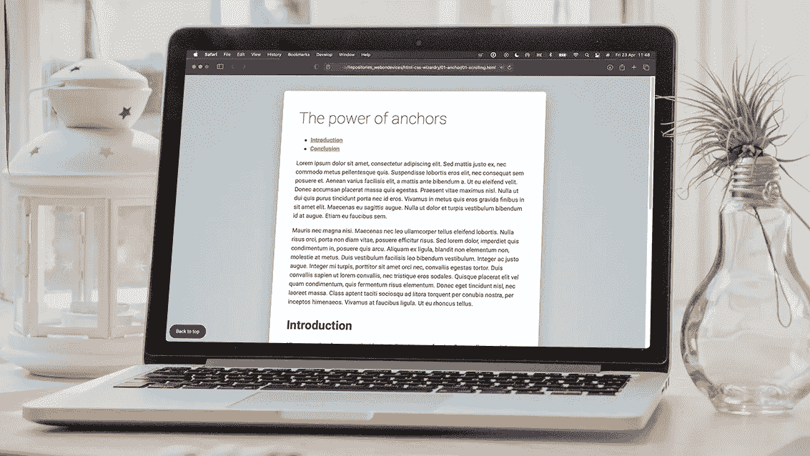
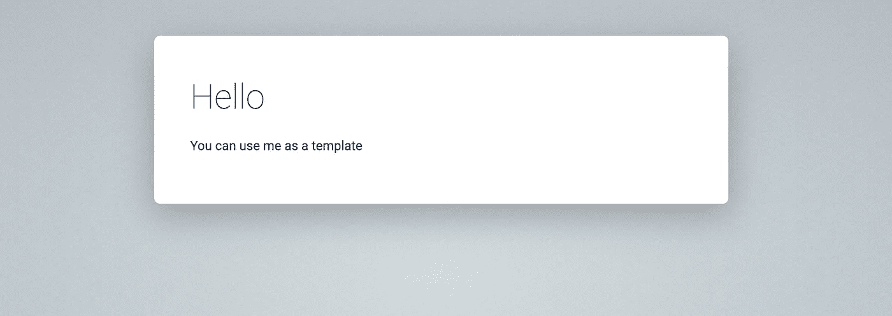
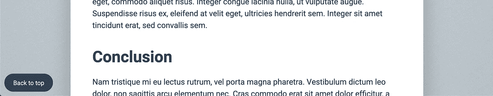

# 动画页面滚动和链接只与 HTML 和 CSS

> 原文：<https://levelup.gitconnected.com/animated-page-scroll-with-html-and-css-only-3788c4e2b853>

使用动画页面滚动链接和跳转到网页的不同部分，无需使用任何 JavaScript 代码！



# 你需要的只是 HTML 和 CSS

这是我书中的第一个示例项目，*你所需要的只是 HTML 和 CSS:*

[https://www.amazon.co.uk/dp/B08ZQ3NSYF/ref=sr_1_1](https://www.amazon.co.uk/dp/B08ZQ3NSYF/ref=sr_1_1)
[https://www . Amazon . com/All-you-need-HTML-CSS/DP/b 08 zq 3 nsyf/ref = Sr _ 1 _ 2](https://www.amazon.com/All-you-need-HTML-CSS/dp/B08ZQ3NSYF/ref=sr_1_2)

书中还有许多其他例子挑战 HTML 和 CSS 的极限，包括交互式旋转木马、手风琴、计算、计数、高级输入验证、状态管理、可忽略的模态窗口以及对鼠标和键盘输入的反应。甚至有一个动画纯 CSS 时钟(模拟和数字)和一个完全工作的星级小工具！

# 不起眼的锚元素

让我们从值得信赖的老锚元素开始我们的旅程。当涉及到只与 HTML 交互时，我们不能再简单了！

示例项目的演示

在 HTML 页面的上下文中，锚点是可以将您带到外部网站或文件，或者活动文档中某个位置的链接。下面是链接“Google”文本到 google.com 的最基本形式的锚元素:

```
<a href="http://www.google.com">Google</a>
```

单击包裹在`<a>`标签内的文本将把我们带到在`href`属性中指定的 URL。目前没有意外。

您可能在过去也使用过`target`属性来控制我们希望链接的 URL 在哪里打开。

```
<a href="http://www.google.com" target="_blank">Google</a>
```

# 在页面内导航

锚元素的另一个有用的特性是能够链接到同一页面中的特定元素。通过 IDs 告诉浏览器我们想要链接到哪个元素。

首先，将 ID 添加到要链接的元素中:

```
<h2 id="intro">Intro title</h2>
```

然后在锚元素的`href`属性中引用 ID(前缀为 hash ):

```
<a href="#intro">Go to intro title</a>
```

这种格式的`#intro`称为 URL 片段，它是一个名称，前面有一个散列符号(`#`)。这个 URL 片段指定了当前文档中的一个内部目标位置(HTML 元素的 ID)。

> 你知道吗？`href`代表超文本参考。

**当您点击链接时，浏览器会将页面滚动到文档中带有 intro ID 的元素可见的位置。**

如果你有一篇较长的文章，想在页面顶部创建一个目录部分，你可以设置一堆链接到各个标题的锚点。

# 构建交互式目录

让我们在一个简单的页面上看看这一点。继续，复制项目的模板文件夹，重命名文件并打开 HTML。

您可以在这里找到示例的模板和源代码:

[](https://github.com/webondevices/html-css-wizardry) [## webon devices/html-CSS-wizardy

### 这个库包含了我的书中的示例项目:你所需要的只是 HTML 和 CSS:构建交互式 Web…

github.com](https://github.com/webondevices/html-css-wizardry) 

我将在页面顶部主标题下的目录部分添加两个链接。在页面的更下方，我们有二级标题和锚将链接到的匹配 id:

```
<main>
  <h1>The power of anchors</h1> <ul>
    <li>**<a href="#introduction">Introduction</a>**</li>
    <li>**<a href="#conclusion">Conclusion</a>**</li>
  </ul>

  <p>Lorem ipsum dolor sit amet...</p>
  <p>Mauris nec magna nisi...</p>

  **<h2 id="introduction">Introduction</h2>**
  <p>Aliquam pretium lacus a ex...</p>
  <p>Curabitur aliquet leo mi...</p> **<h2 id="conclusion">Conclusion</h2>**
  <p>Nam tristique mi eu lectus rutrum...</p>
 </main>
```

你现在可以点击顶部的链接，如果标题 id 与锚中的 URL 片段匹配，浏览器将滚动到正确的位置。

# 添加“返回顶部”按钮

现在你已经给了用户一个简单的方法来立即跳转到某些部分，你可能还想添加一个浮动的“返回顶部”按钮来立即返回，而不必向上滚动。



诀窍是在`href`属性中添加一个散列标记。这将只是链接到文档本身，因此浏览器将返回到页面顶部:

```
<body>
  <!-- table of contents -->
  <!-- page content -->
  **<a id="to-top" href="#">Back to top</a>**
</body>
```

点击这个新按钮会把你带回到顶部，但是，链接在页面的最底部，所以你不能从页面的中间向下滚动。我认为最好把它固定在页面的左下角，当你滚动的时候跟着你。要实现这一点，我们需要做的就是将定位设置为固定，并从页面边缘添加一些偏移量:

```
#to-top {
  position: fixed;
  bottom: 10px;
  left: 10px;
}
```

默认情况下，锚元素呈现为简单的带下划线的文本，但是如果我们的“返回顶部”链接看起来像一个合适的按钮，效果会更好。

要赋予按钮这种样式，需要在 CSS 中添加一些东西:

```
#top {
  position: fixed;
  bottom: 10px;
  left: 10px;
  padding: 10px 20px;
  background-color: var(--dark-blue);
  color: white;
  font-size: 14px;
  font-weight: normal;
  text-decoration: none;
  border-radius: 20px;
}
```

# 添加平滑和动画页面滚动

现在导航只是直接跳转到相关部分，所以这可能是你或你团队中的其他人想出通过动画滚动来改善用户体验的好主意的时候。

您立即想到的可能是从 JavaScript 获得一些帮助，并用一些代码实现平滑滚动过渡。当你这么做的时候，你也可能想抛弃整个 HTML 锚定逻辑，用 JavaScript 重新构建它。

**嗯，不要再往那个方向看了，因为我们可以用一个 CSS 声明来解决所有的问题:**

```
html {
  scroll-behavior: smooth;
}
```

这一小段 CSS 现在将使我们的页面平滑滚动！

这里只有两种设置:`smooth`或`auto`，我们不想要`auto`，因为那只是我们之前拥有的浏览器默认行为。

保留锚点而不用 JavaScript(或者 jQuery)实现这个逻辑给了我们很多好处:

*   代码非常简单，甚至平滑滚动也只是一个 CSS 声明。
*   用锚代替 JavaScript 实现页面导航使得我们的页面易于访问，经得起未来考验，并且对 SEO 友好。
*   不需要下载 jQuery 或任何额外的 JavaScript 就可以保持页面的轻量级，这给了我们超快的页面加载速度。
*   通过走简单的 HTML 和 CSS 路线，我们节省了大量的开发时间和精力。

但这还不是一切的终点。这个不起眼的锚元素有更多有趣的特性，这是我们在下一篇文章中要揭示的。

敬请期待！