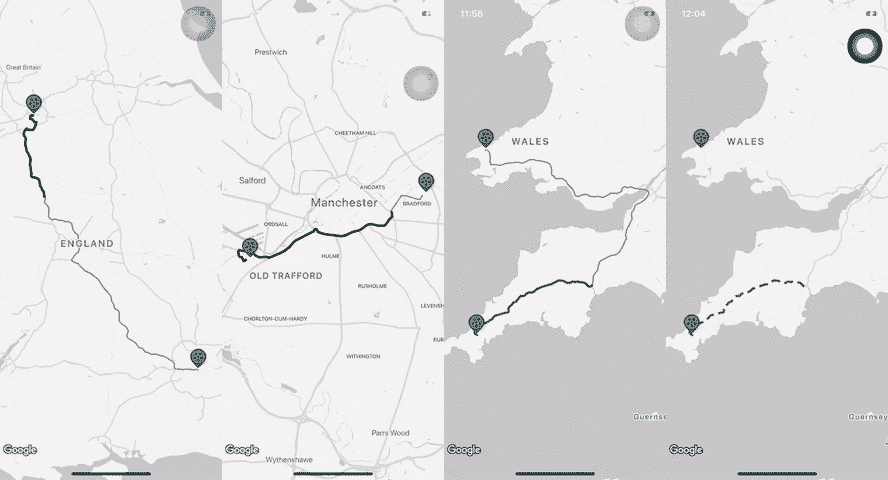
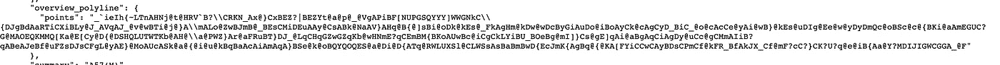
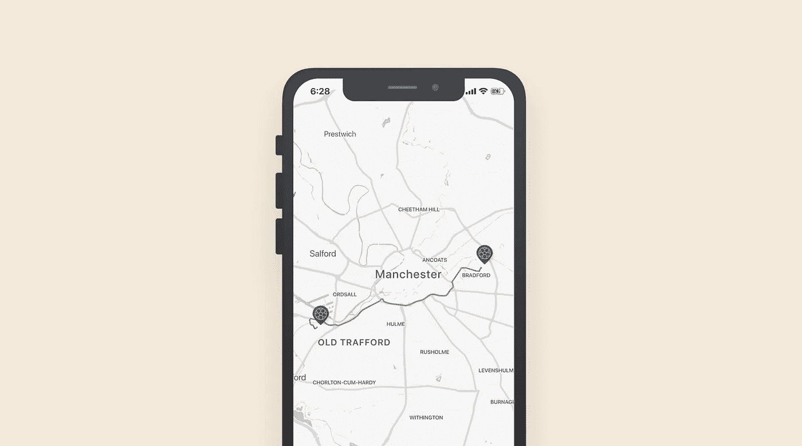
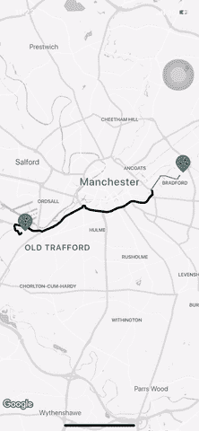
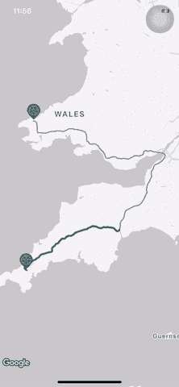
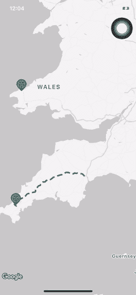

# 谷歌地图上的动画路线

> 原文：<https://levelup.gitconnected.com/animated-routes-on-google-maps-5de4f32261d7>

## 使用动画增强地图上的路线

# 主要思想

首先，在弄脏你的手之前，我们有两件事需要澄清。

> **GMS path**:cllocationcoordinate 2d 的不可变数组
> 
> GMSPolyline :在地图视图上绘制并显示的路线

因此，我们将迭代一个 **GMSPath** 上的每个位置，然后用新的颜色创建一个 **new** **GMSPath** 和**new****GMSPolyline**，使其看起来像一个动画

# 实施

## 获取路线

这不是本文的主要部分，所以我们将快速进行。

Google 支持美国 Google Direction [API](https://developers.google.com/maps/documentation/directions/intro) 获取经过有效坐标的路线。调用完 API 后，你会得到一个路由数组，你可以选择一个，然后找到参数是`overview_polyline`，你可以看到编码的路由，这就是它的样子。

请求 google 方向 API 时的编码路线

下面的例子让你对这一步有个大概的了解，完整的回购例子附在本文的底部

## 在地图上画一条路线

现在，你得到了你的编码路线，让我们把它画在地图上。

通过以下方法创建路径(包含有效坐标的数组)

> `GMSPath(fromEncodedPath: route)`

并通过 GMSPolyline 创建一个 UI 路径

> `GMSPolyline(path: path)`

完成这一步后，你就可以得到并在地图上正确显示路线了。下面的例子让你对这个步骤有一个大概的了解

现在，你的地图看起来就像一条普通的路线，没有动画

## 动画显示路线

创建一个计时器，在 x 秒后更新一条新路线

用下面这条线，我们将每 0.01 秒遍历路径上的每个坐标，并调用这个函数`animatePolylinePath`

> timer = Timer.scheduledTimer(时间间隔:0.01，目标:**自身**，选择器:**#选择器** ( **自身**)。animatePolylinePath)，userInfo: **nil** ，repeats: **true**

如上所述，我们将创建一条**新路径**和一条**新折线**，然后将**路径**上的每个坐标添加到**新路径**中，并为**新折线创建一种新样式或新颜色。**完成迭代后，你可以再次重启定时器，让它无限动画化

耶，现在我们有了一条从 ***老特拉福德*** **球场**到 ***阿提哈德球场*** 的动画路线，就像这样

让我们通过使用两种颜色的[**GMSStyleSpan**](https://developers.google.com/maps/documentation/ios-sdk/reference/interface_g_m_s_style_span?hl=vi)**来尝试渐变路径和动画**

**这是结果**

****

****破折号动画****

**创建**彩色虚线**和**透明虚线**(每个虚线长度根据地图视图和缩放级别计算)**

**这是结果**

****

**完整的代码供您尝试**

** [## ryanisnhp/AnimatedRoute

### 使用动画增强地图上的路线。通过在…上创建帐户，为 ryanisnhp/AnimatedRoute 开发做出贡献

github.com](https://github.com/ryanisnhp/AnimatedRoute)**