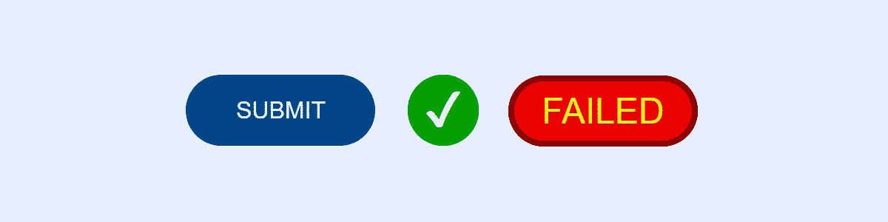

# 带有最小标记的动画提交/加载按钮

> 原文：<https://levelup.gitconnected.com/animated-submit-loading-buttons-with-minimal-markup-3f7d4f255527>



最近我们在网站上看到的一个更吸引人和有用的效果是当你点击提交按钮时会有一个动画。一个告诉你— *或者至少假装告诉你* —提交正在进行。然后这个动画会变成一个复选框，告诉你事情什么时候完成。

然而—*—不幸的是，这几天经常出现这种情况,* —大部分实现都充满了确实应该解决的问题。

# 那么，目前的做法有什么问题呢？

1.  大多数时候，没有为表单提供优雅的降级计划。该功能被编码为 100%基于 JavaScript，没有“如果关闭 JavaScript 会怎样？”的计划。你会看到人们将“onclick”附加到 DIV 上，而不是使用按钮，或者只是假设每个人都将在启用脚本的情况下浏览。虽然在 WCAG 没有被点名，但根据美国 ADA 和英国 EQA 法律的“可操作”条款，缺少脚本的优雅降级被视为[违规——至少在法律界是这样。*因为控件对任何输入设备脚本关闭都不起作用。那在那一点上是不“可操作”的！就像没有内容脚本一样，页面是不可“感知”的。我并不是说动画必须触发或关闭脚本，但它也不应该破坏表单或成为使用表单的唯一方式——至少当在浏览器中进行 web facing 时。*由于没有 JS ==没有 app，所以这在全栈应用中是可以接受的做法，例如那些内置在电子设备中的应用。只是不要在网站上做！**](https://www.w3.org/TR/WCAG21/#operable)
2.  同样，使用 DIV 或其他标签意味着您不能通过键盘导航到它，这是另一个易访问性冲突。
3.  大多数动画和代码都是用像素度量而不是 EM 来完成的，这是可用性和可访问性的另一个巨大的中指。
4.  标记通常是半打或更多标记的臃肿残骸，通常在标记中内嵌静态图像或 SVG。由于标记比外部文件更不可能被缓存，这是一个错过的缓存机会！它也违反了关注点的分离。
5.  SVG 和脚本通常处理所有繁重的工作，而 CSS 可以更干净、更流畅、更简单地完成这些工作。
6.  它们中的大多数都没有错误处理状态。随着“承诺”和残缺的“获取”例程的无用使用，这种情况越来越普遍，在这种情况下，准确地获取错误/状态代码并不容易。即便如此，还是有错误处理的可能性，那么为什么没有人编写代码来告诉用户事情是上下颠倒的呢？

# 那么我们如何做得更好呢？

好吧，对于初学者来说，如果我们所有花哨的脚本、CSS 和动画都不可用，让 HTML 尽可能简单和实用。

## HTML，亲亲！

```
<button class="animateSubmit"><span>SUBMIT</span></button>
```

这应该是我们需要做的所有标记。在生成的内容和脚本中一些简单的类交换之间，这是需要完成的全部工作。跨度是这样的，我们可以在动画和显示结果时隐藏文本。

## JavaScript，保持优雅

为了触发和控制我们的动画，我们不应该为脚本要做的事情而疯狂。要开始加载过程，我们需要做的就是在按钮上添加一个类似“loading”的类。假设我们在一个按钮变量中引用了 DOM 上的按钮，那就是:

```
// change button to loading state
button.classList.add('loading');
```

当它成功完成时，我们只需删除“加载”并添加“已加载”

```
// change button to success state
button.classList.remove(‘loading’);
button.classList.add('loaded');
```

如果失败，我们删除“加载”并添加“失败”。

```
// change button to failure state
button.classList.remove('loading');
button.classList.add('failed');
```

现在，当在提交时捕获 click 事件时，您可能希望阻止默认行为，并且如果正在发生，就不要执行您的操作。一般如果是`.loading`，就不要让点击通过。因此，您的事件处理程序可能如下所示:

```
button.addEventListener('click', submitButtonClick, false);function submitButtonClick(event) {
  event.preventDefault();
  if (
    event.currentTarget.classList.contains('loading') ||
    event.currentTarget.classList.contains('loaded') ||
    event.currentTarget.classList.contains('failed')
  ) return;
  event.currentTarget.classList.add('loading');
  /* do your AJAX or whatever here */
}
```

您实际的提交处理程序只需要删除加载类并适当地设置“失败”或“已加载”。在部署中，您可能还希望捕获 onsubmit 以确保设置了“loading ”,以防键盘提交绕过实际的提交按钮。*对，就是这个东西！*

## CSS，真正的魔法！

**注意*所有 CSS 都假设使用了“reset ”,将空白、填充、字段集和按钮的边框设置为“none”。最重要的是，框大小:边框；应该设置。*

我在这里做的第一件事是设置我想要的所有按钮的外观。

```
:root {
  --submit-width:8em;
}button {
  display:inline-block;
  cursor:pointer;
  padding:0.75em 1.5em;
  min-width:var(--submit-width);
  line-height:1.5em;
  background:#048;
  color:#FFF;
  border:none;
  border-radius:0.5em;
}button:focus,
button:hover {
  outline:none;
  background:#06C;
}
```

CSS 变量允许我们在一个地方设置期望的最大宽度，一旦动画开始，它将被用作实际宽度两次。

内嵌块在让它服从动画方面修复了一些跨浏览器的问题。

将光标设置为指针修复了 CSS 中一个明显的遗漏，即标签和按钮都没有“手”形指针光标，而是默认的，这是错误的，因为它们是可点击的元素。*基本上，HTML 中这些元素的默认行为实际上是对可访问性的侵犯！*

从那里它只是正常的大小，颜色和悬停状态。注意边框:浏览器默认情况下不需要去掉元素中多余的格式，就像我们在这里不想要的焦点轮廓，可以用背景颜色的变化来代替。*只要有效果，而且是基于亮度的变化，就不会违反可访问性规范。*

下一步，我们想采取默认状态，并为我们的动画容器修改它。

```
.animateSubmit {
  position:relative;
  width:var(--submit-width);
  min-width:0;
  transition:background 0.5s, border 0.5s, width 0.5s;
}
```

相对定位，以便我们可以为动画和结果绝对定位生成的内容；固定宽度，以便我们可以用过渡来制作宽度变化的动画；降低最小宽度，以便我们可以实际收缩这些内容。

接下来，对于所有三种加载状态，我们对它们的选择器进行分组，因为它们都有一些变化。

```
.animateSubmit.loading,
.animateSubmit.loaded,
.animateSubmit.failed {
  cursor:default;
  width:0;
  background:#0CF;
  border-radius:1.5em;
}
```

我们将光标切换到“默认”,因为我们禁止在脚本中点击它们。宽度减少到零，以隐藏内容(*由于我们添加到所有按钮的填充，一些宽度被保留)，*我们改变背景颜色到我们想要的动画下，我们设置边界半径，使一个圆。

然后，我们为每个人设置不同之处:

```
.animateSubmit.loaded {
 background:#0A0;
}.animateSubmit.failed {
 width:var(--submit-width);
 background:#E00;
}
```

也就是宽度和背景颜色。

对于 span，首先我们要为它们设置动画，当然如果需要的话，将它们的文本内容居中。

```
.animateSubmit span {
  display:block;
  text-align:center;
  transition:transform 0.5s, color 0.5s;
}
```

每个加载状态跨度还共享一些不同于默认状态的值:

```
.animateSubmit.loading span,
.animateSubmit.loaded span,
.animateSubmit.failed span {
  transform:scale(0);
  color:transparent;
}
```

我们基本上通过收缩和透明将按钮内的文本转换到视图之外。不要太花哨或太难。

对于我们的动画，我们将在一个`:before`生成的内容元素上使用一个旋转边框，并且我们将使用`:after`生成的内容作为我们的结果消息，或者是一个 utf-8 复选框，或者是单词“FAILED”。

首先，默认情况下，两个生成的内容共享一些值。

```
.animateSubmit:before,
.animateSubmit:after {
  position:absolute;
  top:0;
  left:0;
  text-align:center;
  background:transparent;
}
```

定位和没有背景，因为默认情况下它们是隐藏的。

用`:before`旋转边框:

```
.animateSubmit:before {
  content:"";
  height:3em;
  width:3em;
  border:0 solid;
  border-color:#00F #08F;
  border-radius:1.5em;
  transition:border 0.5s;
}.animateSubmit.loading:before {
  border-width:0.75em;
  transition:border 0.5s 0.5s;
  animation:spin 1s linear infinite;
}[@keyframes](http://twitter.com/keyframes) spin {
  0% { transform:rotate(0deg); }
  100% { transform:rotate(360deg); }
}.animateSubmit.failed:before {
  width:100%;
  border:0.25em solid #800;
}
```

生成的内容，所以我们至少需要为它设置空内容，甚至显示，固定宽度和高度的旋转，零宽度的边界隐藏它，不同的颜色对双方，边界半径使其成为一个圆形，零秒过渡作为默认。

当它。加载我们拓宽了边界，使它不仅显示，但动画。我们在这个阶段的边界转换上设置了一个延迟，所以直到父按钮的文本*(在跨度内)*缩小到看不见的时候，旋转的边界才会显示。然后，我们使用一个简单的关键帧动画设置它旋转。

对于失败的状态，我们增加宽度以匹配父状态，并设置一个红色的实心边框来一直显示。这将创建该状态的平滑动画。

对于消息——复选框或“失败”测试——我们再次开始制作容器并准备好动画就位。在这两种生成内容的情况下，如果我们没有将它们放在适当的位置并准备好开始，就没有任何东西可以让它们“动起来”。

```
.animateSubmit:after {
  width:100%;
  text-align:center;
  transform:scale(0);
  transition:transform 0.5s;
}
```

全角，文本对齐，收缩不可见，带转换。

对于每个州:

```
.animateSubmit.loaded:after {
  content:"\2714";
  font-size:2em;
  line-height:1.5em;
  color:#FFF;
  transform:scale(1);
}.animateSubmit.failed:after {
  content:"FAILED";
  font-weight:bold;
  font-size:1.25em;
  line-height:2.4em;
  letter-spacing:0.05em;
  color:#FF0;
  transform:scale(1);
}
```

我们只需设置适当的内容，设置适当的字体大小、粗细、行高和颜色，然后将它们转换成视图。

如果你想知道这些行高，我们开始在按钮上用 0.75em 填充 1.5 行高。如果你把行高加上填充顶部/底部，我们得到 3em。与其玩填充来将文本从上到下居中，或者添加可能与动画不一致的变换，不如计算出您想要的大小来创建 3em 行高。在加载状态下，3em 外行高除以 2em 字体大小为 1.5em。对于后者，3em 外行高除以 1.25em 字体大小为我们提供 2.4em 作为我们的期望值。

我把失败的状态加粗了一点字母间距，只是为了让它更突出一点。

…简而言之，这就是你如何做到这一切的。

## 进一步的考虑

这些按钮的行为和普通按钮一样，但是在动态调整大小时，您可能希望让它们的父容器将它们对齐到动画的中心。这取决于你，虽然有些人喜欢他们左对齐。你的电话。

# 现场演示

你可以在我的标准演示模板中找到一个现场演示:

 [## 动画提交按钮

### 单击下面的按钮将运行加载动画。这将/可以用于 AJAX 提交或其他…

cutcodedown.com](https://cutcodedown.com/for_others/medium_articles/animateSubmit/animateSubmit.html) 

同我所有的例子目录:
[https://cutcodedown . com/for _ others/medium _ articles/animate submit/](https://cutcodedown.com/for_others/medium_articles/animateSubmit/)

是完全开放的，可以很容易地访问其中的一些代码，我也在这里分享了一个. rar 代码。

该演示的脚本使用 setTimeout 来伪造实际正在做的事情，并使用一个类作为钩子来使第二个失败。除此之外，这和你在现实世界中用它做的事情没有太大的差别。

# 尺寸很重要

我不想指名道姓，但我看到的这样做的一般例子通常使用 10-15 行标记，运行 500 字节到 1k 的代码……我刚刚向您展示了如何在 1 行 58 个字符内完成。虽然这通常是 CSS 的两倍，但我们添加了一个失败状态，当然 CSS 可以被缓存。同样，我们也看到 JavaScript 的数量大大减少，因为我们需要做的只是一些简单的类交换。

结果是更干净，更容易维护标记，更好地利用缓存…嗯，除非你全力以赴，把 CSS 和 JavaScript 放到标记中[，因为你相信了一堆半真半假的谎言](/putting-above-the-fold-css-in-the-markup-makes-your-page-load-faster-at-best-a-half-truth-4103f9150128)。*说真的，这个行业诚信问题很大。*

当你在一个页面上不止一次使用它的时候，这种尺寸优势会得到更多回报。只是多了一个类和一个 span，而不是两个 div，两个 span，三个 SVG 等等。如今，您在部署中看到的许多代码都落入了这个陷阱；最可笑的是，大多数这样写的人会看着这个 CSS 并说*“不，不，你需要每样东西都有类，这样你就不会重复自己了”*。如果你不明白这句话错在哪里，就坐在那里想一想，直到你意识到这句话有多愚蠢。

*…如果你设法跳过那个心理障碍，* [*，你就会意识到 BEM、框架、预处理器等等是多么愚蠢*](https://medium.com/swlh/html-css-frameworks-monuments-to-ignorance-incompetence-and-ineptitude-4c1db2571de9) *。*

# 结论

让 CSS 帮你完成繁重的工作，最华丽的页面也可以有最简单的标记。不破坏你的可访问性，不损害设计，保持关注点的分离。人们用 JavaScript 处理的很多事情已经不再是脚本的工作了，或者说 JS 最多应该只是交换类，让样式表做真正的工作！

在过去十年的开发中，我的谋生之道就是作为一名可访问性和效率顾问。一次又一次，我遇到了针对最简单的问题的破碎、臃肿的方法，其中“我想要一些花哨的东西”破坏了可访问性，或者使网站太慢、带宽/服务器负载太重。事情是这样的，通过一点点好的实践和关注点的分离——就像这里展示的代码——您可以从一开始就避免所有这些令人头疼的问题。

**想！**这真的是 JavaScript 的工作吗？**想！**如果脚本或 CSS 不可用或不适用，这有什么用？**想！**我对 px 测量值的使用是否告诉了有 BOHICA 无障碍需求的用户？*好像他们的问题还不够多。* **想！**我是否使用了正确的语义标记，以便键盘导航、非可视用户界面、搜索引擎等等可以与我的页面一起工作！

坦率地说，现在并没有太多的想法。在最高法院告诉达美乐去吸一个鸡蛋后，这在“零售商开放季节”的时代真的很糟糕。