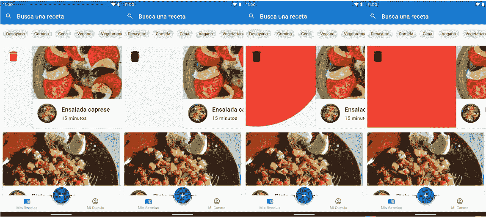
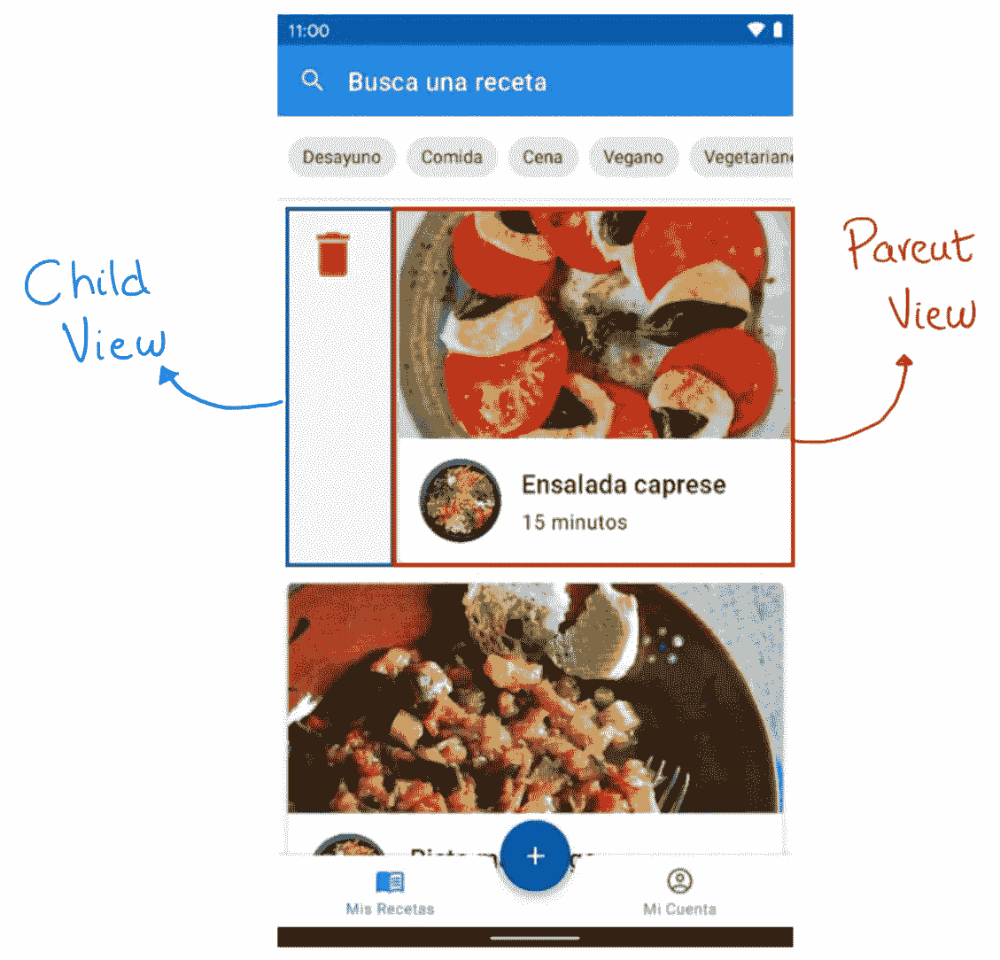

# 在 Android 中制作材质设计滑动手势的动画

> 原文：<https://levelup.gitconnected.com/animating-a-material-design-swipe-gesture-in-android-81db04bf569>

不同状态下的动画

> 今天我将分享我是如何在 Android 中实现滑动来移除列表项目上的动画的。

作为一名应用程序开发人员，在专注于动画和美学之前，我一直倾向于优先考虑拥有一个工作稳定的应用程序。但是最近我了解到，这两者同等重要，应该有或多或少的优先权。我从 splash 动画开始，现在我正在制作单个 UI 组件的动画。

 [## 在 Android 上用核心闪屏 API 实现闪屏动画

### 在这篇文章中，你将学习如何用 Google 为……提出的原生解决方案实现一个飞溅动画

medium.com](https://medium.com/@molidev8/implementing-a-splash-animation-with-the-core-splashscreen-api-on-android-ec3fe00d105a) 

UI 设计中通常被搁置的一个方面是动画。这实际上是非常可悲的，因为任何适时实现的动画都会给一个应用带来专业的外观，并使其与众不同。这就是为什么今天我要分享我如何实现一个动画来删除 RecyclerView 中的一个元素，就像你在文章开头看到的那样。

# 让我们从一些理论开始

第一步是理解动画是如何工作的。当一个 RecyclerView 项目被滑动时，框架显示一个视图，该视图具有水平平移，另一个视图是静态的。在本教程中，我们将它们称为父视图(移动的视图)和子视图(静态的视图)，如下面的截图所示。

RecyclerView 项目中的子视图和父视图

> 请记住，在 Android 中,( 0，0) [坐标](https://stackoverflow.com/questions/11483345/how-do-android-screen-coordinates-work)在屏幕的左上角。这对以后理解代码很重要。

我们将使用下一个算法，在每次检测到在我们的项目上滑动时触发动画:

1.  获得父视图坐标，以便也可以计算子视图坐标。
2.  当滑动被认为有效时，坐标被保存。
3.  基于这个项目在 X 轴上移动了多少，我们定义了图标的大小，它的颜色和在整个动画中将要调整大小的圆的半径。
4.  计算图标的中心，这也是圆的中心，并且定义图标将要显示的空间。
5.  图标和圆是使用之前完成的计算在子视图中绘制的。

# 现在用一些代码

为了开发这个动画，我们需要覆盖 [SimpleCallback](https://developer.android.com/reference/androidx/recyclerview/widget/ItemTouchHelper.SimpleCallback) 类，特别要注意 *onChildDraw* 方法*，*，它将在每次屏幕更新时被调用，这意味着在 60 Hz 刷新率的显示器中，该函数每 16 毫秒被调用一次。该方法将包含之前解释的所有逻辑。

我们将使用的另一个方法是 o *nSwiped，*这是我们定义的一个动作，当在特定方向上滑动时触发(例如，删除应用数据库中的一行)。在这种情况下，滑动将在 X 轴的正方向，所以我们需要检查方向是否是`ItemTouchHelper.RIGHT`。

在这里，您可以看到实现了之前解释的算法，并添加了一些注释来进一步阐明正在发生的事情:

最后一步是将回调添加到 RecyclerView。

# 就这样

动画实际上很难做，需要花很多时间去学习，但是结果是值得的。我希望你明白这个动画是如何工作的，如果你需要检查更多的代码，我把 GitHub 库留在了文章的底部。

如果你想了解更多关于 Android 开发的知识并支持我，别忘了查看我的个人资料，或者给 Medium 一个成为会员的机会来访问你想要的所有故事。这只是 5 美元一个月，如果你使用这个链接，我会得到一小笔佣金。

 [## GitHub - molidev8/Recipe-Vault:一个存储、共享和备份食谱的 Android 应用程序

### 安卓系统在 TFM 的应用和服务开发中的应用…

github.com](https://github.com/molidev8/Recipe-Vault) 

# 分级编码

感谢您成为我们社区的一员！更多内容见[升级编码出版物](https://levelup.gitconnected.com/)。
跟随:[推特](https://twitter.com/gitconnected)，[领英](https://www.linkedin.com/company/gitconnected)，[通迅](https://newsletter.levelup.dev/)
**升一级正在改造理工大招聘➡️** [**加入我们的人才集体**](https://jobs.levelup.dev/talent/welcome?referral=true)