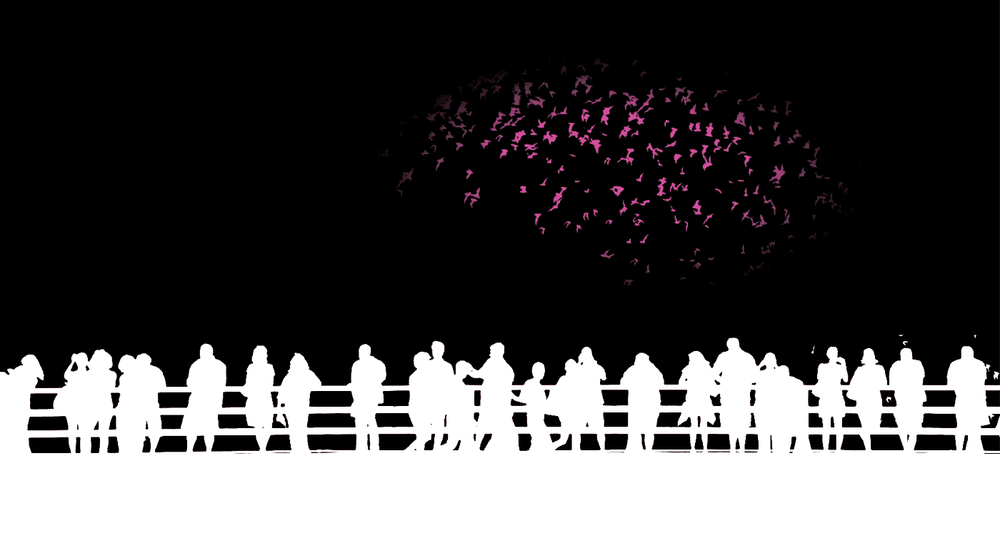
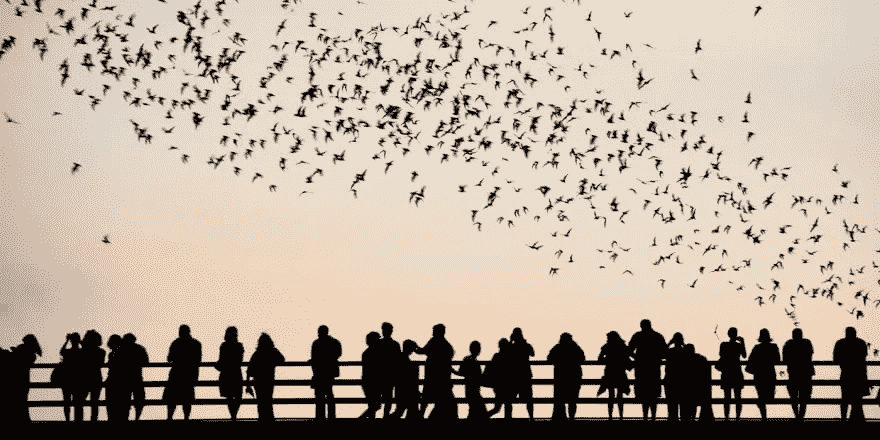

# 用 CSS 制作静态图像动画

> 原文：<https://levelup.gitconnected.com/animating-a-static-image-with-css-270d796e2ff2>

## 如何创建一个动画版本的 JPEG 图像…只用几行 CSS



我制作了一个[小动画，蝙蝠飞过人们](https://codepen.io/alvaromontoro/pen/exYOwd)从桥上看 [CodePen 编程挑战](https://codepen.io/challenges/2019/january/3)。这听起来没什么，但是如果我提到它是 JPEG 格式的静态图像，没有任何透明度或矢量值，那就更有趣了。

那么，我们怎么可能从这样一个静态图像:



来源:[batsinaustin.com](https://www.batsinaustin.com/)

…变成下图这样的动画？所有这些都不需要在浏览器之外编辑图像，也不需要改变格式或原始图像内容？

我们如何只用一个 HTML 元素和几行 CSS 就完成所有这些呢？我们一步一步来查。

# HTML

首先，HTML:我们需要一个元素来包含图像:

```
<div><div>
```

就是这样！这就是我们在这个演示中需要的所有 HTML。剩下的代码是 CSS 样式。

# CSS

## 初始样式

`div`必须与图像具有相同的比例(相同的纵横比),因为我们将使用它作为背景，并希望它占据整个容器。在这种情况下，照片的宽度大于高度，长宽比为 2:1。

> 作者注:本文最初发表于 2019 年，当时`aspect-ratio`属性没有得到很好的支持。我更新了部分代码，仍然没有使用`aspect-ratio`。尽管如此，对代码进行现代化仍然是一个有趣的特性。

初始 CSS 将决定`div`的大小及其在屏幕中的绝对位置:

```
div {
  /* the width and height have a 2:1 proportion */
  width: 100vw;
  height: 50vw;
  /* center the element vertically and horizontally */
  position: absolute;
  top: 50%;
  left: 50%;
  transform: translate(-50%, -50%);
}
```

我们很快就会回到这个`div`。让我们把它放在一边，而把重点放在生成动画的伪元素上。

## 图像

应用以下样式后，我们将使`::after`伪元素占据其祖先的整个宽度，将目标图像作为背景，并适合可用的大小:

```
div::after {
  content: "";
  position: absolute;
  width: 100%;
  height: 100%;
  background: url("https://i.stack.imgur.com/w8noS.jpg");
  background-position: top left;
  background-size: 100% 100%;
}
```

有了这个，我们在屏幕上显示图像；让我们进入有趣的部分:应用 CSS 滤镜！

## 过滤器

到目前为止，我们有没有任何修改的原始图像:一群人在一座桥上，看着蝙蝠飞过他们。

让我们回顾一下我们可以应用的一些[滤镜](https://developer.mozilla.org/en-US/docs/Web/CSS/filter)，这样看起来更像一幅漫画:

*   这将从图像中移除亮度，将其转换为灰度版本，使一些颜色混合并融合成相同的灰度。
*   `contrast(400%)`:通过具有高对比度值，灰度图像变成黑色和白色(仅仅是黑色和白色)，留下原始图像的轮廓。
*   `invert(1)`:反转颜色:黑色现在是白色，反之亦然。这就增加了一些“戏剧性”:蝙蝠夜间飞行，现在天空是暗的而不是白的。

在 CSS 中，我们需要将这个属性添加到`::after`:

```
filter: saturate(0) contrast(400%) invert(1);
```

应用这些过滤器后，我们的图像变成了一个轮廓鲜明的边缘。它看起来更像一部卡通片而不是一幅画。是时候开始了…

## 混合

`mix-blend-mode`属性允许开发者指定元素如何与背景融合。通过增加`multiply`的值，白色将变成“透明的”，其背后的细节将可见。

只需将该属性添加到伪元素中:

```
mix-blend-mode: multiply
```

> 作者注:当我最初写这篇文章时，只有少数浏览器支持`mix-blend-mode`。[那个属性现在得到了很好的支持](https://caniuse.com/css-mixblendmode)，应该不成问题，至少对于`multiply`值来说是这样。

## 动画

完成我们的动画只缺少两个步骤；一个是添加 [CSS 动画](https://developer.mozilla.org/en-US/docs/Web/CSS/animation)本身。我们将创建一个从屏幕右下角移动到左上角的阴影。

> 作者注:原始动画效率不高(它移动了用`box-shadow`创建的插入阴影)。对于这篇文章，我们更新了动画以使其个性化，它更好(动画`transform`更高效)，更流畅(你的电脑迷稍后会感谢你)。

为了达到这个效果，我们将使用`::before`伪元素(默认情况下在`::after`下面)来创建一个圆形的粉红色背景。然后我们将使用一个`keyframes`规则来定义一个简单的动画，它使用`transform`和`transate()`在屏幕上移动元素:

```
/* the animation moves the element diagonally from right to left*/
@keyframes moverSombraRosa {
  0% { transform: translate(80vw, 0vw); }
  100% { transform: translate(-80vw, -30vw);}
}

/* the ::before pseudo-element will move with the animation */
div::before {
  content: "";
  position: absolute;
  width: 100%;
  height: 100%;
  /* a pink ellipse to transparent background */
  background: radial-gradient(farthest-side, #FF1EAD 35%, #FF1EAD00 70%);
  /* the animation */
  animation: moverSombraRosa 6s infinite;
}
```

这种效果就像蝙蝠被对角着色(透明，然后是粉红色，最后又是透明)，但实际上，它们总是“透明的”，粉红色的阴影在它们后面移动。

我们可以稍微改变一下动画值，使它们不那么“神奇”，但是我们也冒着把人涂成粉红色的风险。我们可以使用`mix-blend-mode: lighten`来避免这种意想不到的着色，但是选择保持文章的演示简单。

最后的润色与页面的背景有关。如果我们让它一半黑(在顶部)，一半白(在底部)，图像会看起来更好，在页面内流动更自然。

经过所有这些变化，结果是一个动画看起来很卡通，但它是用一个静态的 JPG 图像创建的:

# 结论

多亏了这个编码挑战，我开始玩和练习 CSS 滤镜和混合模式(尤其是后者，我没怎么用过)。这让我读了很多书，学到了很多东西。

最初的版本看起来还可以，但是随着过去 3-4 年的变化，它变得很慢而且过时了。这个新版本保持了原来的精神，但效率更高(从不更新阴影)。

我从研究 CSS 属性的信息和完成这个编码挑战中获得了很多乐趣；期待下一个。

> 本文更新自 2019 年 1 月 27 日发表在 Codepen (和[作者网站](https://alvaromontoro.com/blog/67832/cartoonifying-and-animating-a-still-photograph))上的一篇[原创。](https://codepen.io/alvaromontoro/post/cartoonify-and-animate-a-photo)