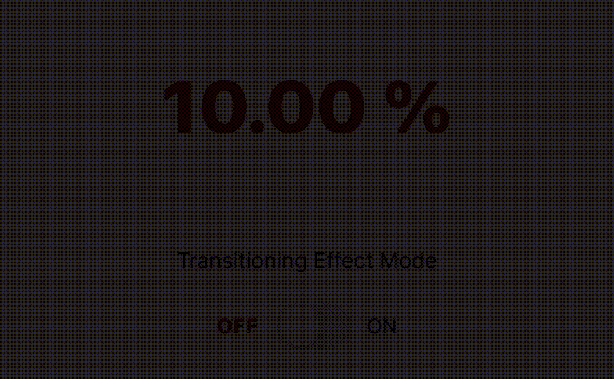
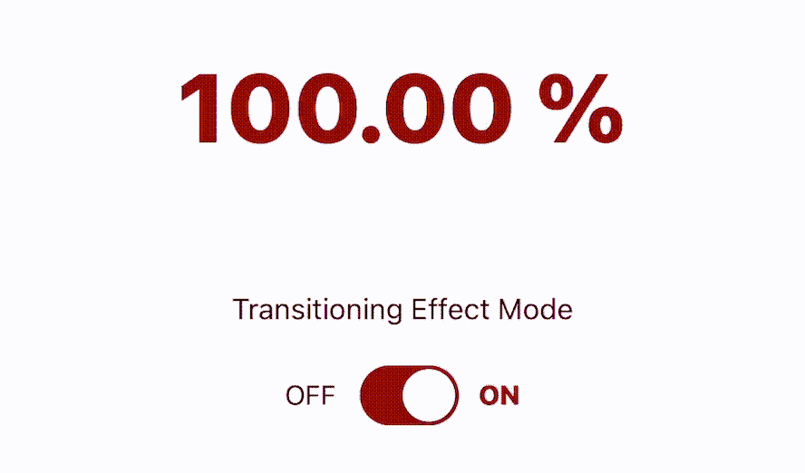

# iOS 中的亮度调整动画

> 原文：<https://levelup.gitconnected.com/animating-brightness-adjustment-in-ios-e56d1bff5a9f>

在 iOS 应用程序开发中，通过过渡动画以编程方式将屏幕亮度调整到特定值从来都不容易实现，因为苹果没有提供直观的 API。

> ***开发者*** *:我想用过渡效果调整屏幕亮度。你能告诉我怎么做吗？🧐*
> 
> ***苹果*** *:好吧，好吧！代码已经在那里了。给你。我相信这就是你想要的。😀*

```
// From 10% 
UIScreen.main.brightness = 0.1

// To 100% 
UIScreen.main.brightness = 1
```



无过渡效果的亮度调节

在这篇文章中，我将向您展示如何实现带有过渡效果的亮度调整，以及 ***代码片段、解释和结果*** 。

# 🧑‍💻代码片段:

```
func adjustScreenBrightness(to value: CGFloat, animationDuration: CGFloat = 1) {
    var currentBrightness: CGFloat = UIScreen.main.brightness

    // MARK: 1) Determine the direction of the adjustment; Increase / Decrease
    let isIncreasing: Bool = currentBrightness < value

    // MARK: 2) Determine the animation speed
    let incrementalStep: CGFloat = 1 / (animationDuration * 1000)

    // MARK: 3) Execute the iteration operation in a separate thread
    DispatchQueue.global(qos: .userInteractive).async {
        while (isIncreasing && currentBrightness <= value) || (!isIncreasing && currentBrightness >= value) {
            DispatchQueue.main.async {
                currentBrightness += isIncreasing ? incrementalStep : -incrementalStep
                UIScreen.main.brightness = currentBrightness
            }

            // MARK: 4) Set 1 milisecond interval to the while-loop
            Thread.sleep(forTimeInterval: 1 / 1000)
        }
    }
}
```

# **📝解释:**

## 1.确定调整的方向；增加/减少

这非常简单。通过比较屏幕亮度的当前值和我们想要将亮度调到的值，我们可以考虑动画操作是应该 ***增加*** 还是 ***降低*** 屏幕的亮度。

## 2.确定动画速度

该函数期望 ***持续时间*** 参数确定增量值，以增加或减少屏幕亮度。

## 3.在单独的线程中执行迭代操作

为了使亮度调整看起来具有稳定和舒缓的过渡动画，我们可以利用一个名为 ***的迭代操作，同时循环*** 来执行屏幕亮度值的连续增加或减少。

我还要强调使用[](http://shorturl.at/HIJXZ)**来执行循环。**

> *****用户交互*** *服务质量:***
> 
> **用户交互任务的服务质量类别，如动画、事件处理或应用程序用户界面的更新—苹果开发者文档**

**根据定义，用户交互 QoS 是用于对界面或动画执行交互更新的最合适的队列。更重要的是，将执行设置到单独的操作队列，而不是**主**队列，可以防止与应用程序滞后或冻结相关的常见用户界面问题，因为如果动画速度较慢或者***animation duration***参数(在我们的例子中)设置为较高的值，循环操作的执行时间将需要较长的时间才能完成。**

## **4.为执行创建一个动画效果**

**迭代操作 ***while-loop*** ，从其鲜明的性质来看，根本没有耐心。我们无法控制它的速度。CPU 性能越高，执行速度越快。因此，我们需要在每次增量迭代中引入一毫秒(1ms)的时间间隔，以产生动画效果。**

# **🏆结果:**

****

**具有过渡效果的亮度调节**

# **🎁奖金:**

**为了使上面代码片段中的函数可以从任何地方访问，我们可以在 UIScreen 类上创建一个扩展，并将该函数放在那里。**

```
**extension UIScreen {

  func adjustScreenBrightness(to value: CGFloat, animationDuration: CGFloat = 1) {
      var currentBrightness: CGFloat = UIScreen.main.brightness

      // MARK: 1) Determine the direction of the adjustment; Increase / Decrease
      let isIncreasing: Bool = currentBrightness < value

      // MARK: 2) Determine the animation speed
      let incrementalStep: CGFloat = 1 / (animationDuration * 1000)

      // MARK: 3) Execute the iteration operation in a separate thread
      DispatchQueue.global(qos: .userInteractive).async {
          while (isIncreasing && currentBrightness <= value) || (!isIncreasing && currentBrightness >= value) {
              DispatchQueue.main.async {
                  currentBrightness += isIncreasing ? incrementalStep : -incrementalStep
                  UIScreen.main.brightness = currentBrightness
              }

              // MARK: 4) Set 1 milisecond interval to the while-loop
              Thread.sleep(forTimeInterval: 1 / 1000)
          }
      }
  }

}**
```

**🇰🇭就是这样。如果你有更好的解决方案、编码风格甚至建议，请随意发表你的想法。**