# 在 Unity 中用精灵表制作精灵动画

> 原文：<https://levelup.gitconnected.com/animating-sprites-with-a-sprite-sheet-in-unity-920ce21af865>

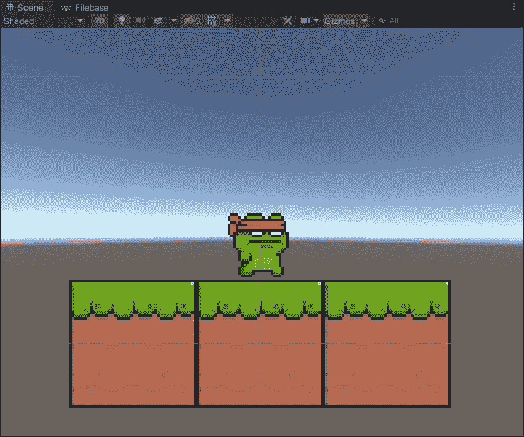

我将经历用精灵表制作精灵动画的过程。在 unity 内部超级容易。

**概述:**

精灵动画是为 2D 资源创建的动画剪辑。创建精灵动画有多种方法。今天我们将讨论精灵图片动画。精灵动画也可以通过动画窗口使用 Unity 中的关键帧动画来创建。

**雪碧单:**

子画面是排列在网格中的子画面的集合。精灵然后被编译成动画剪辑，播放每个精灵以创建动画，就像动画书一样。

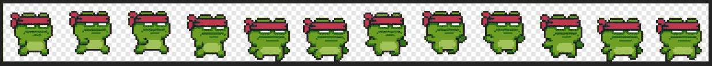

**雪碧张青蛙角色奔跑**

**导入精灵表:**

当你导入一个 sprite 工作表时，你需要做一些改变来使它正常工作。在项目中，窗口点击导入的精灵，看看里面的检查，并做以下工作。

第一步。将纹理类型更改为精灵(2D 和用户界面)

第二步。将精灵模式从单一改为多重。

完成后，确保单击“应用”。

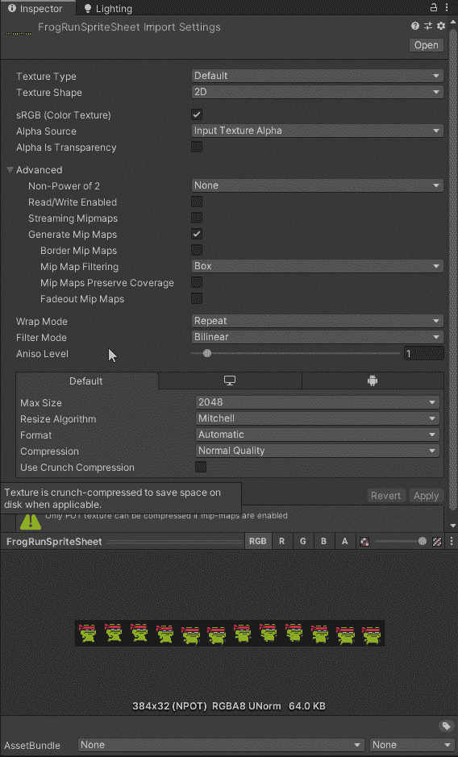

接下来，你需要将精灵分割成单独的精灵，而不是一个整体。要做到这一点，我们需要打开包管理器并安装精灵编辑器，如果你还没有的话。为此，我们需要单击窗口选项卡。然后点击软件包管理器。它会弹出一个窗口，你可以停靠在你喜欢的地方。一旦你的软件包管理器，打开寻找 2D 精灵，并点击安装。

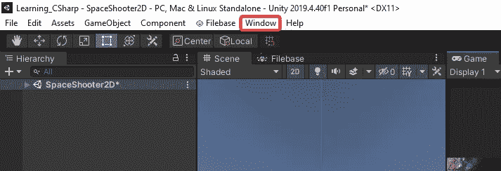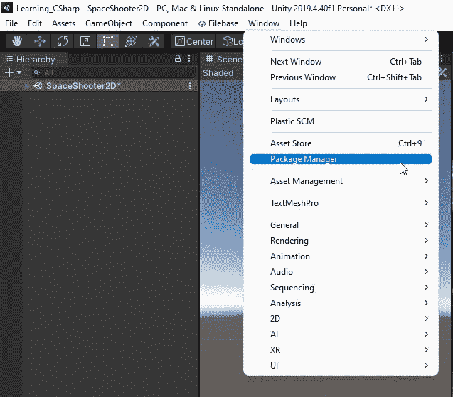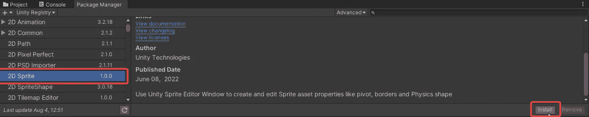

在软件包管理器中找到 2D 精灵，点击安装

现在让我们把这些精灵切片。为此，点击导入的精灵，看看里面的检查，并点击精灵编辑器按钮。一旦你这样做了，就会出现一个窗口，你可以停靠在你喜欢的地方。

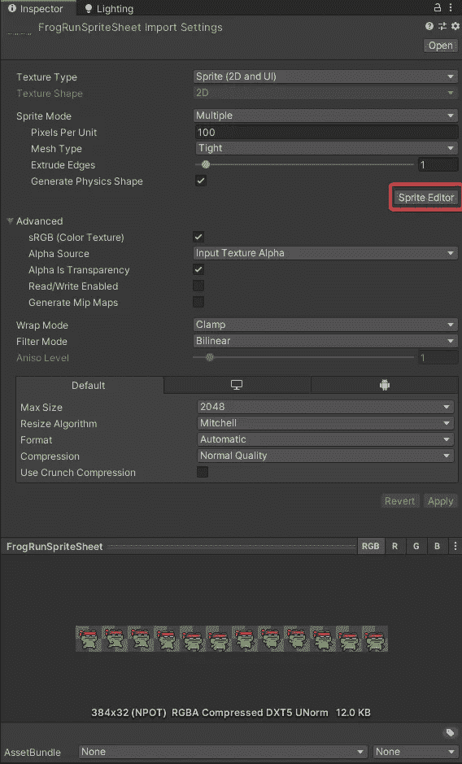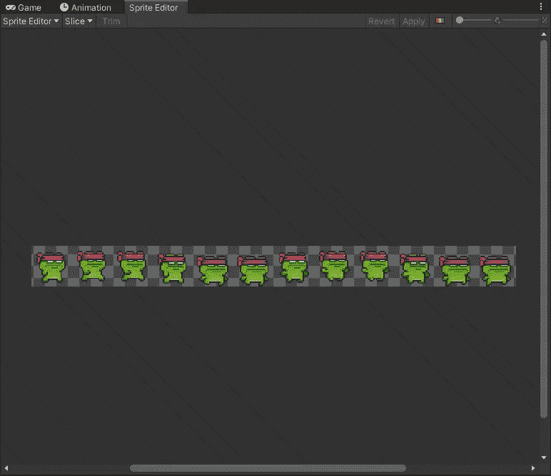

**精灵编辑窗口**

打开精灵编辑器窗口后，单击切片下拉菜单，单击切片，然后单击应用。您可以检查以确保所有内容都被正确切片。如果没有，您可以手动编辑形状，然后单击应用。

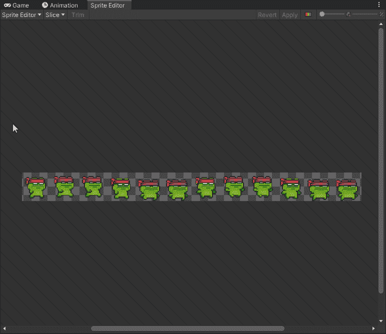

**制作精灵图片动画:**

现在我们有了一个雪碧表，它被切片了。让我们来制作动画。为此，我们将需要动画窗口。如果您还没有打开它，您可以右键单击游戏选项卡，选择添加选项卡，然后动画窗口。

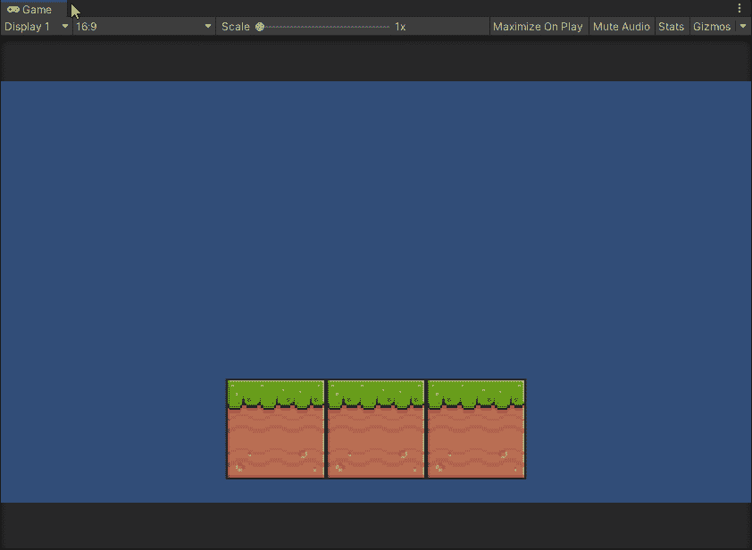

接下来在项目窗口中，选择新切片的精灵。现在它旁边应该有一个下拉菜单，点击这个下拉菜单，你应该会看到每个精灵。

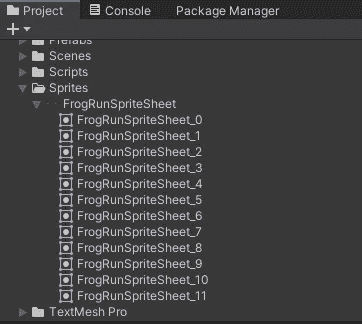

选择第一个精灵并将其拖动到场景中。

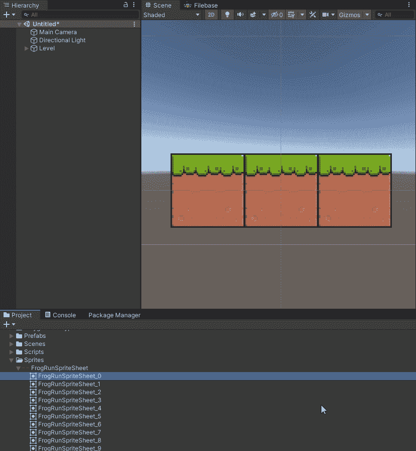

现在我们已经设置好了，让我们来制作动画。

**第一步。**从场景中选择精灵。选择精灵，转到动画窗口，点击创建，并给它一个名字。

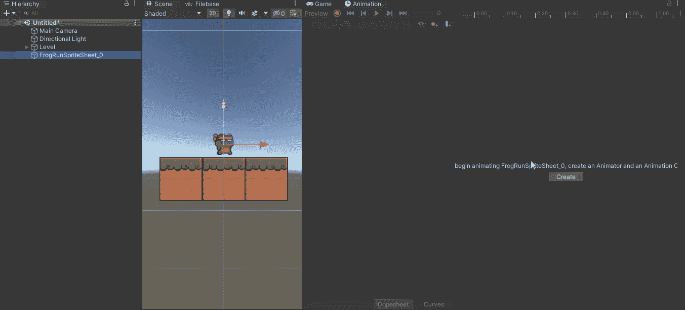

**第二步。一旦你完成了这个转换，点击你的精灵表中的每一个精灵。**

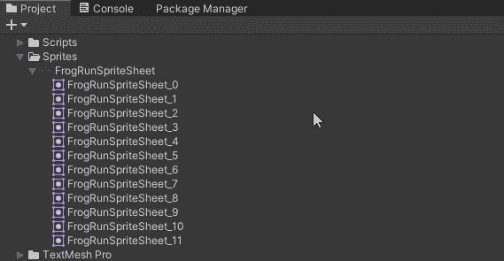

**第三步。选择所有精灵，将它们拖放到动画窗口，并根据需要缩放。**

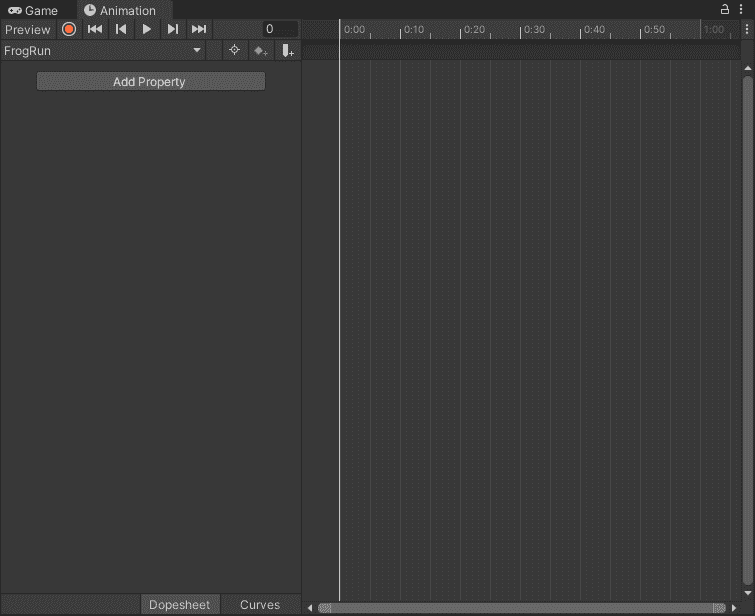

就这样，你完了。你的精灵现在应该是动画了。

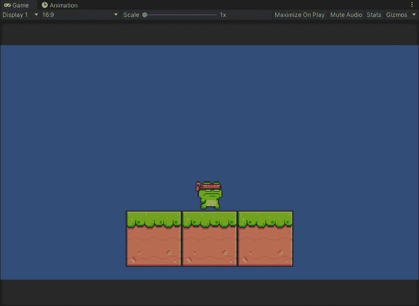

我希望你喜欢它，请继续关注。

感谢您的时间和关注。