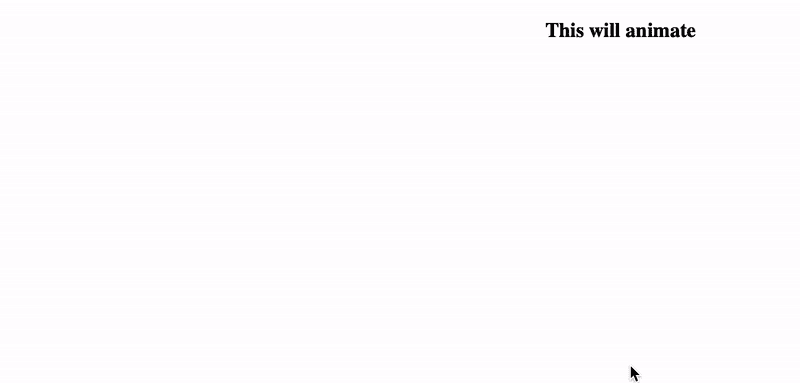
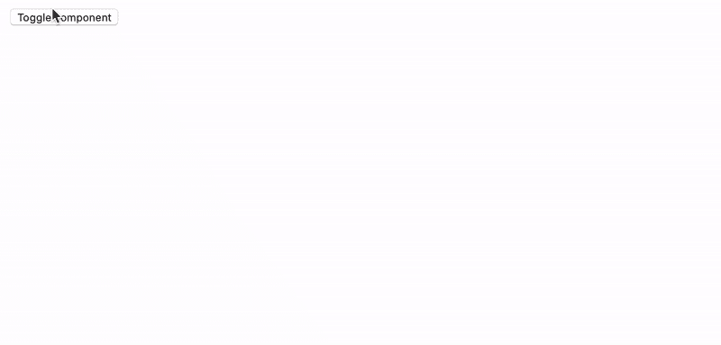
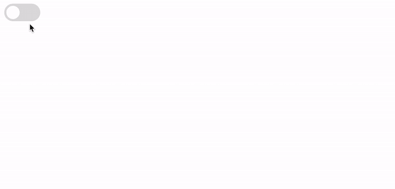
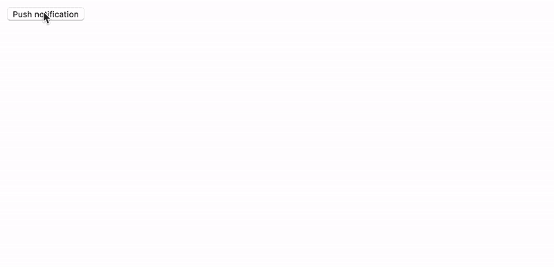

# 设置 React 组件的动画

> 原文：<https://levelup.gitconnected.com/animating-your-react-components-8af7615ea61f>

## 通过在 React 应用程序或组件库中制作组件动画，改善整体客户体验


图片来自 unsplash.com 的卡尔·约瑟夫

S o，你想让你的 React 组件更上一层楼？实现动画可以大大改善客户体验，让你的应用感觉更专业。动画是实现这一目标的众多方法之一。在这篇文章中，我想介绍如何使用[成帧器动作](http://framer.motion)轻松制作 React 组件的动画。

# 如何开始

要设置你的项目使用 framer-motion，你可以简单地通过使用你的 JavaScript 包管理器来安装它，比如 [NPM](http://npmjs.com/) 或 [Yarn](https://yarnpkg.com) 。在 React.js 项目中运行以下任何命令，就可以开始了。

```
$ npm install framer-motion$ yarn add framer-motion
```

# 不同类型的动画

因此，在 framer-motion 中有几种不同类型的动画，您可以将其用作制作组件动画的工具。以下是我们将在本文中涉及的内容。你也可以在官方成帧器运动文档网站[上找到更多信息。](https://www.framer.com/motion/)

*   制作单个组件的动画
*   动画组件安装和卸载
*   在组件状态之间制作动画
*   制作多个组件的动画

# 制作单个组件的动画

因此，在 React 中尝试动画的一个好地方就是简单地制作一个组件的动画。为此，我们将使用由 framer-motion 包提供的 motion 组件。这让我们可以用 motion.div 替换默认的 html divs，因此可以轻松地将它们制作成动画。要在 x 轴上制作一个组件的动画，我们可以写下面的代码。

```
import React from 'react'
import { motion }from 'framer-motion'const MyComponent = ({ children }) => (
  <**motion.div animate={{ x: 500 }}**>
    {children}
  </**motion.div**>
)
```

通过像这样使用我们的组件:

```
import MyComponent from "../components/component";export default function App() {
  return (
    <MyComponent>
      <h3>This will animate</h3>
    </MyComponent>
  );
}
```

输出将看起来像这样，它将直接动画时，它安装。



一个黑色的文本写着“这将是动画”从左边快速“跳跃”过渡出来

虽然这看起来不像是一个非常有用的动画，但这只是制作 React 组件动画的基本概念。现在，我们将使用我们的知识来进一步开发我们的 React 组件，以使用更复杂的动画来制作状态和挂载之间的动画。首先，让我们在可见和不可见之间制作一个组件的动画。

# 动画演示

可以用几种不同的方式制作存在动画。我们将通过稍微更新我们以前的组件来实现这一点，在我们的父组件中，我们将添加 framer-motion 提供的 AnimatePresence 组件，以在从 dom 安装和卸载之间制作动画。这最准确地代表了您目前最有可能使用 React 组件的方式。我们将更新组件，如下所示:

```
import { motion, AnimatePresence } from "framer-motion";export default function MyComponent({ children }) {
  return (
    <motion.div
 **initial={{ opacity: 0 }}
      animate={{ x: 250, opacity: 1 }}
      exit={{ opacity: 0, x: 500 }}**
    >
      {children}
    </motion.div>
  );
}
```

通过添加初始属性、更新 animate 和添加 exit 属性，我们将确保 AnimatePresence 组件确切地知道如何在装载和卸载 dom 时动画化该组件。如果我们不提供正确的值，动画可能无法工作。现在，为了在组件从 dom 中装载和卸载时制作动画，我们需要稍微更新一下我们的父组件。

```
import { useState } from "react";
import { AnimatePresence } from "framer-motion";
import MyComponent from "../components/component";export default function App() {
  const [isOpen, setIsOpen] = useState(); return (
    <div>
      <button onClick={() => setIsOpen(!isOpen)}>
        Toggle component
      </button> **<AnimatePresence>**
        {**isOpen** && (
          <MyComponent>
            <h3>This will animate</h3>
          </MyComponent>
        )}
      **</AnimatePresence>**
    </div>
  );
}
```

现在，这就是我们的组件应该看起来的样子。当第一次单击按钮时，组件将在页面上显示动画，当再次单击它时，它将在页面上显示动画。因为我们在组件上指定了初始、动画和退出属性，所以 framer-motion 现在知道如何在不同状态之间制作动画。



一个按钮被点击切换黑色文本说“这将动画”从左边出来，在一个快速的“反弹”过渡。再次单击该按钮时，它继续向右移动，然后消失。

# 在组件状态之间制作动画

现在，让我们假设你的组件本身有不同的本地状态——当它改变时，你想让你的元素活动起来。我们可以通过使用 motion 元素和 layout 属性来实现这一点。我们将通过创建一个相当普通但重要的组件——交换机来尝试这一点。

```
import { motion } from "framer-motion";export default function Switch({ isOn, onToggle }) {
  const styles = {
    wrapper: {
      display: "flex",
      **justifyContent: isOn ? "flex-end" : "flex-start",**
      borderRadius: 50,
      width: 60,
      padding: 4,
    },
    handle: {
      height: 25,
      width: 25,
      background: "#fff",
      borderRadius: "50%",
    },
  };return (
    <**motion.div**
      style={styles.wrapper}
      onClick={() => onToggle(!isOn)}
      **animate={{ background: isOn ? "#006aff" : "#ddd" }}**

    >
      **<motion.div** **layout** style={styles.handle} />
 **</motion.div>**
  );
}
```

通过在我们的父组件中这样使用它:

```
import { useState } from "react";
import Switch from "../components/switch";export default function App() {
  const [isOn, setIsOn] = useState(); return <Switch isOn={isOn} onToggle={() => setIsOn(!isOn)} />;
}
```



空白页上的一个开关组件，通过单击它可以在打开和关闭状态之间切换。当处于 on 状态时，开关具有蓝色背景，当处于 off 状态时，开关具有灰色背景。

# 制作多个组件的动画

因此，利用我们新收集的关于如何轻松制作 React 组件动画的知识，我们现在将把这些知识结合起来，制作一个具有多个组件的更真实的示例动画。Framer-motion 的功能肯定比我们在本文中要介绍的多得多，但是这些例子肯定会帮助您开始制作 React 组件动画的旅程。

## 示例:动画通知

我们将在项目中创建一个名为 Notification 的新组件，从这里开始，我们将结合我们所学的知识，以专业的方式在布局中制作几个通知的动画。

下面是新组件的代码。它将使用 motion 元素以及 initial、animate 和 exit 属性来完成在 dom 中装载和卸载时所需的转换。

我们还将应用 layout prop 来确保 AnimatePresence 知道每个组件应该知道它的兄弟组件，以便为包装器创建平滑的高度调整。

```
import { motion } from "framer-motion";export default function Notification({ title, description, onClose, id }) {
  const styles = {
    wrapper: {
      boxShadow: "0px 5px 30px 0px rgba(0,0,0,0.1)",
      borderRadius: 5,
      padding: 16,
      margin: "1rem 0",
    },
  }; return (
    <**motion.div
      layout
      initial={{ opacity: 0, x: 200 }}
      animate={{ opacity: 1, x: 0 }}
      exit={{ opacity: 0, x: 200 }}**
      style={styles.wrapper}
    >
      <h2>{title}</h2>
      <p>{description}</p>
      <button onClick={() => onClose(id)}>Close</button>
    **</motion.div>**
  );
}
```

为了使用该组件，我们将把它添加到父组件中:

```
import { useState } from "react";
import { AnimatePresence } from "framer-motion";
import Notification from "../components/notification";export default function App() {
  const [notifications, setNotifications] = useState([]); const pushNotification = (notification) => {
    setNotifications([...notifications, notification]);
  }; const styles = {
    notifications: {
      top: 0,
      right: 0,
      position: "fixed",
    },
  }; return (
    <div>
      <button
        onClick={() =>
          pushNotification({
            title: "Test notification",
            description:
              "This is a test notification that is being animated using framer-motion",
            id: Math.random(),
            onClose: (id) => {
              setNotifications((currentNotifications) =>
                currentNotifications.filter(
                  (notification) => notification.id !== id
                )
              );
            },
          })
        }
      >
        Push notification
      </button> <div style={styles.notifications}>
        **<AnimatePresence>**
          {notifications.map((notification) => (
            <Notification {...notification} **key={notification.id}** />
          ))}
        **</AnimatePresence>**
      </div>
    </div>
  );
}
```



瞧啊。我们现在已经建立了一种方法来动画显示页面上的通知。与没有任何转换的通知在页面上出现和消失相比，这极大地增强了用户的体验。仅仅通过提供一些道具和用动画包装我们的组件，我们就做到了这一点。这只是像 framer-motion 这样的动画库的皮毛。

# 下一步是什么？

根据你在行业中的地位，动画可能不是你产品中最重要的部分。例如，如果你正在启动一个创业公司或者构建一个非常公司化的软件，动画化每一个 React 组件可能不是一个很好的投资回报(ROI)。但是，如果你在一家非常重视客户体验的大公司工作，或者你正在建立自己的初创公司，并且非常专注于设计，那么制作组件动画肯定可以增强客户体验和应用程序的总体感觉。

动画真的要看观众。如果你正在为孩子开发一个应用程序，那么这或多或少是必要的。另一方面——如果你正在为老年人或某些残疾人建造一些东西，你应该考虑减少你的应用程序的运动量。网上有很多很棒的资源，教你如何管理它，并确保每个用户都能获得最愉快的体验。感谢您的阅读，并祝您的 React 组件动画之旅好运！