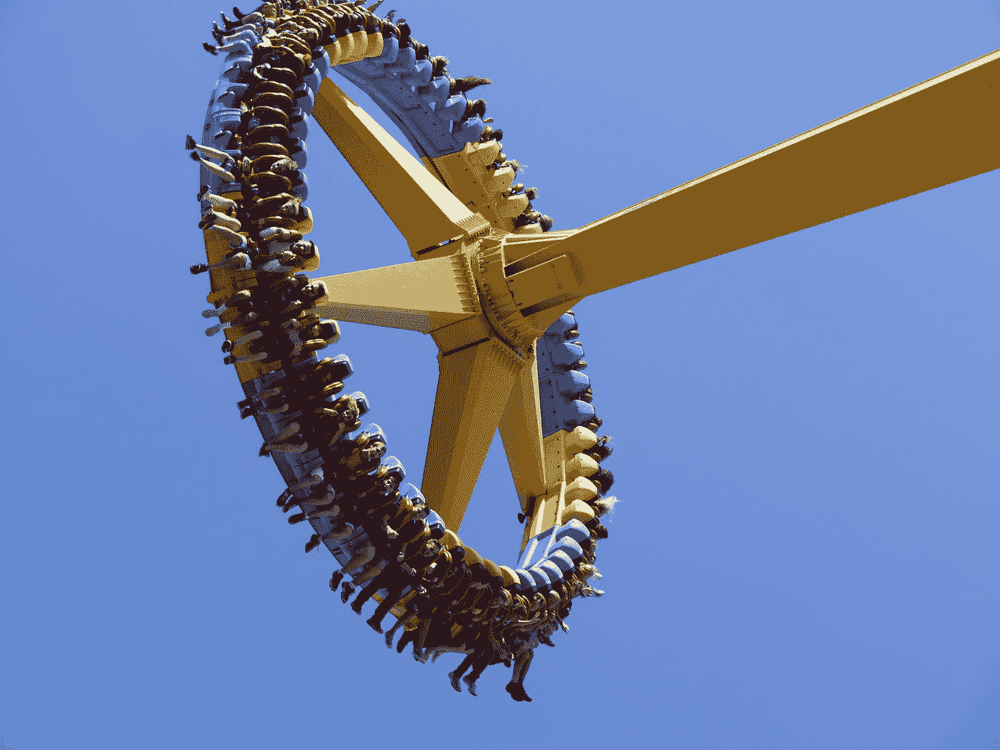

# 动画与 JavaScript，反应和 GSAP

> 原文：<https://levelup.gitconnected.com/animations-with-gsap-javascript-and-react-82903487f0f1>



照片由[亚伦·伯顿](https://unsplash.com/@aaronburden?utm_source=medium&utm_medium=referral)在 [Unsplash](https://unsplash.com?utm_source=medium&utm_medium=referral) 上拍摄

如果说我在向非技术类的朋友和家人展示我的网站时学到了什么，那就是:他们从来不会对 WebSockets 或 Ruby Gems 或你刚刚学到的任何新技术留下深刻印象——他们只是喜欢你主页上花哨的 JavaScript 动画。老实说，我明白为什么。没有什么比点击一个网站，在你与它互动的时候，看着令人满意的动画出现在页面上更好的了。它可以在改善用户体验方面做很多事情，并且它是一种给你的网站添加一些铃铛和口哨的非常有趣的方式。因此，在本教程中，我将向你展示如何使用我最喜欢的 JavaScript 动画库之一: [GreenSock 动画平台](https://greensock.com/)(或 GSAP)。

GSAP 有大量有用的工具，它可以让你的网站变成动画天堂，让你的技术和非技术朋友们惊叹不已。GSAP 有如此多的功能，以至于开始可能会令人生畏，但是一旦你掌握了基础知识，你就很难阻止自己在你的网站上制作动画了！

# 安装 GSAP

我喜欢用 npm 安装 GSAP。如果你喜欢使用 yarn 或其他方法，查看 GSAP 文档中的[各种安装方法](https://greensock.com/docs/v3/Installation)。

```
$ npm install gsap
```

接下来，您将在要制作动画的文件的开头导入 GSAP:

```
import { gsap } from 'gsap'
```

现在你的文件可以调用 GSAP 方法了。

# 用 GSAP 制作动画

最容易上手的 GSAP 方法是`gsap.to()`。对于第一个示例，我们要做的就是将一个框向右滑动 300 像素:

这是使用 componentDidMount 中的以下代码创建的:

我将这段代码放在 componentDidMount 函数中，因为我希望动画在页面加载时立即触发，但是如果您希望它在单击时触发，您可以将`gsap.to()`函数绑定到一个带有事件侦听器的按钮上(我将在最后解释如何实现)。

`gsap.to()`函数有两个参数:**目标元素**和**变量**。首先，您要制作动画的元素是属性的目标。它可以是一个类名，id，标签，你能想到的。使`gsap.to()`函数如此强大的部分原因是它能够操纵几乎任何 DOM 元素。第二个参数描述了您想要创建的动画。在我的动画中，我将橙色框向右滑动 300 像素，所以我将“x”值设置为 300。第二个变量描述了我希望事件发生多长时间。您可以通过操作持续时间来使框在页面上缩放或爬行。

# 一些有用的变量

好了，现在我们已经有了一个简单的动画，我们可以检查几个变量了！

## 1.旋转

旋转变量是不言自明的。它接受您想要旋转元素的度数，并在持续时间中指定的秒数内完成旋转。

## 2.缓解

ease 变量影响每个动画的定时，它创建了一些非常惊人的效果。理解每个案例最简单的方法是使用文档中的 [GreenSock Ease Visualizer](https://greensock.com/docs/v3/Eases) 工具。我最喜欢的是弹跳和弹性。

## **3。重复**

如果你想让一个动画自己循环，重复变量是很好的。它可以作为一个变量使用，也可以在你想要循环的动画之后链接。如果您想无限循环，只需将其设置为-1。如果你想在动画中持续计时，不要忘记设置你的 ease 变量为“none”。

## **4。Yoyo**

溜溜球是持续运动的另一个重要变量。当与 repeat 变量结合使用时，您的动画将在每次重复迭代中来回循环，从而创建一个 yoyo 效果。YoyoEase 变量也可用于控制 yoyo 效果的计时。

## **5。延迟**

最后，delay 变量设置事件触发和动画播放之间的延迟秒数。

这是一个使用所有这些变量的动画:

# 播放、暂停、倒退和重启按钮

GSAP 给我们的最后一个方便的工具是播放、暂停、倒退和重启功能。这些可以在你的网站中使用，在点击时给用户反馈。我将向您展示如何使用按钮和 React 来实现它们。

首先，在构造函数中定义“box”和“boxAnimation”。

这些值最初被设置为 null，直到您的 render 和 componentDidMount 函数触发时它们才存在。接下来，在渲染块中创建将要制作动画的盒子和每个动作的按钮。

请注意，在 box-div 中，我们使用 ref 函数将“this.box”设置为等于刚刚创建的 div。我们还为每个按钮创建了 onClick 函数，调用动画所需的函数。

最后，我们将在 componentDidMount 函数中定义我们的 GSAP 动画:

在这里，我们设置“this.boxAnimation”等于我们的 GSAP 动画，默认为暂停。这是我们的结果:

感谢阅读！