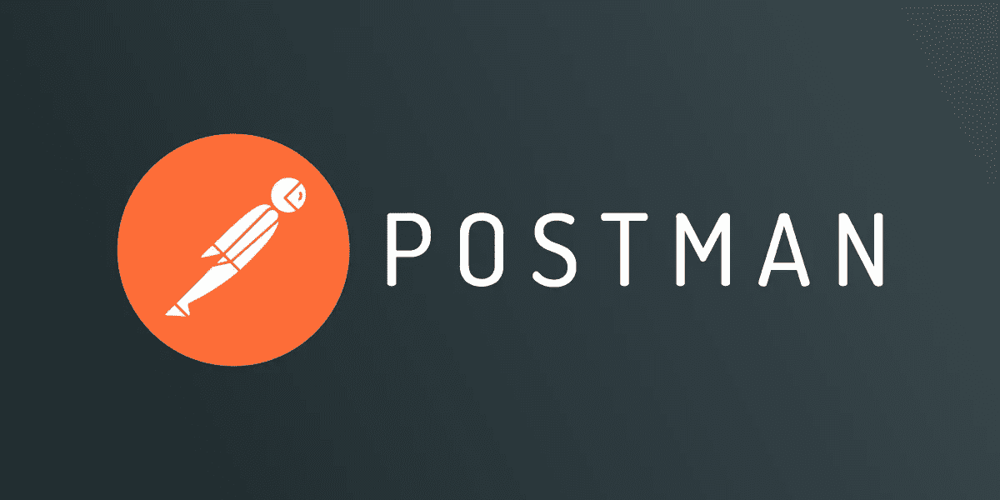
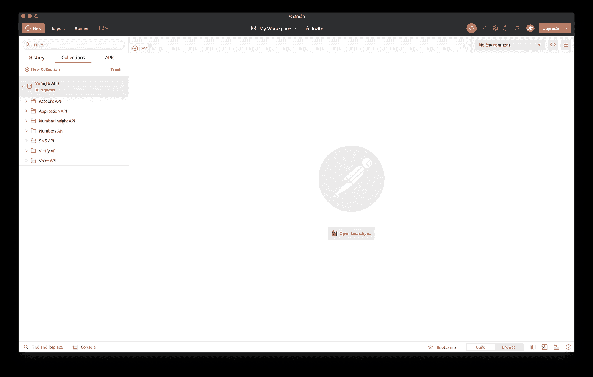
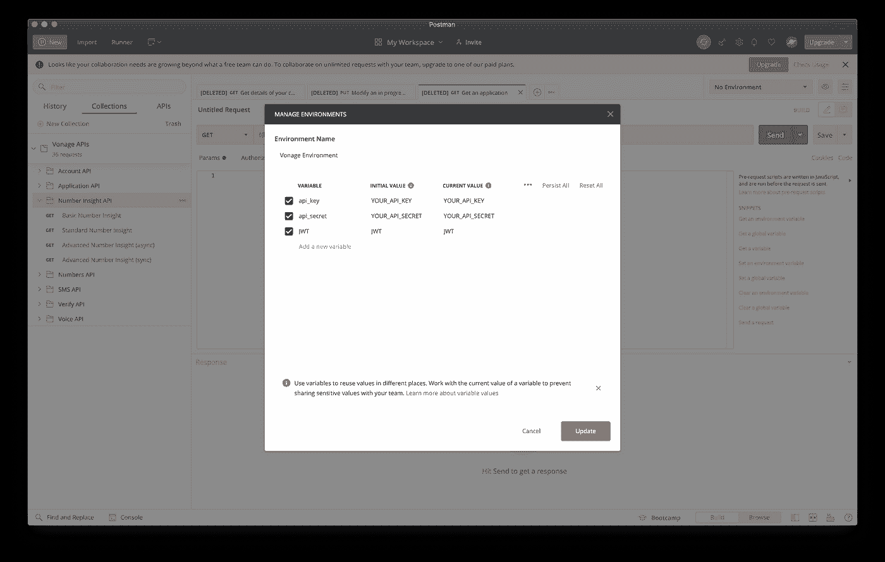
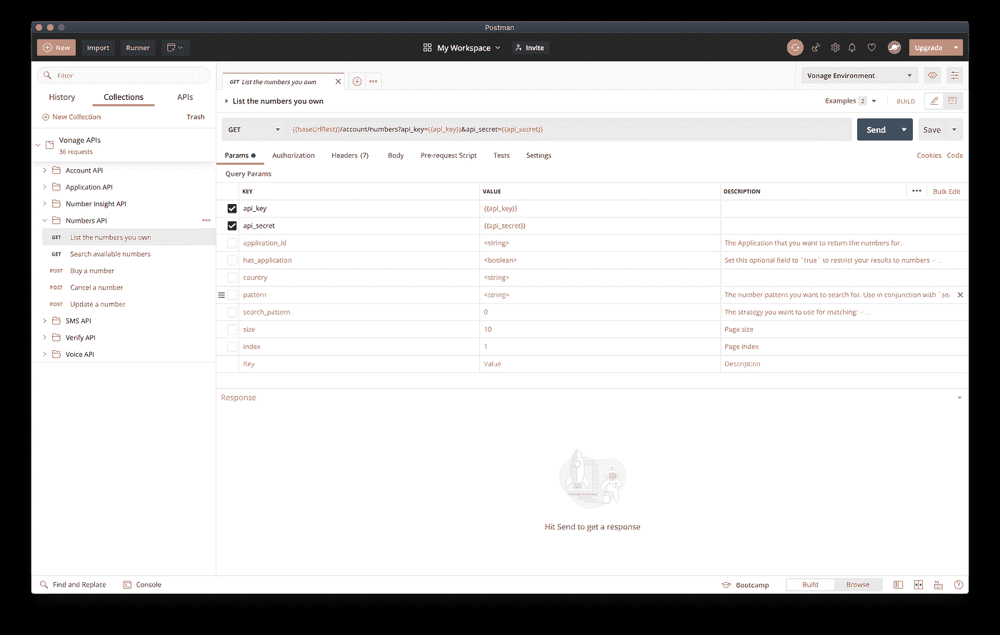
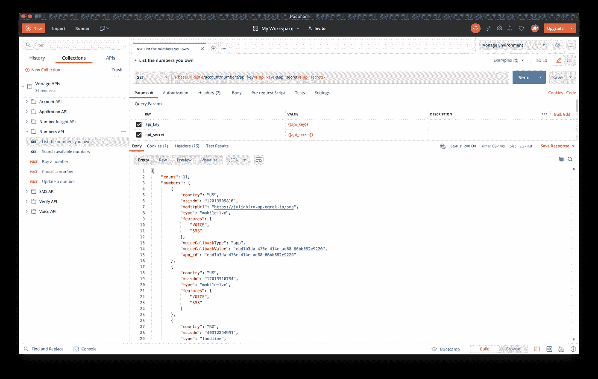

# 宣布 Vonage APIs Postman 系列

> 原文：<https://levelup.gitconnected.com/announcing-the-vonage-apis-postman-collection-81c75b2bde8f>

在 Vonage，我们为所有 API 发布 OpenAPI 规范。这些规范使我们的开发人员社区能够有效地探索、评估和集成 Vonage APIs。

正如 [Lorna](https://twitter.com/lornajane) 在她的关于[使用 OpenAPI](https://www.nexmo.com/blog/2019/09/13/evaluate-apis-quickly-and-easily-with-openapi-dr) 评估 API 的文章中提到的，下载一个 [OpenAPI 规范](https://developer.nexmo.com/concepts/guides/openapi)并在 [Postman](https://www.postman.com/) 中探索它是熟悉新 API 的一个很好的方式。

我完全同意！如果您还不熟悉 [Postman](https://www.postman.com/) ，它是一个强大的跨平台 HTTP 客户端的友好图形界面，我鼓励您尝试一下。

我们很高兴地宣布，探索 Vonage APIs 变得更快更容易了！我们在开发者门户的 [Postman 页面上添加了一个“Run in Postman”按钮，所以现在你只需点击几下鼠标就可以发出第一个请求。](https://developer.nexmo.com/tools/postman)

如果你想浏览的话，也可以在主邮差网上找到它。

一旦你点击 **Run in Postman** 按钮，你将被带到你选择的 Postman 实例，所有的 Vonage API 调用将等待你，很好地组织成一个集合。

使用 Postman 集合的一个好处是我们可以为您准备请求，因此进行 API 调用的工作量很小。

它还有一些很好的特性，比如配置环境变量的能力。这个集合附带了一个 **Vonage 环境**，它列出了 *API_KEY* 、 *API_SECRET* 和 *JWT* ，这是最常用的参数，但是您可以随意添加其他参数。您可以通过单击右上角的 cog 图标来找到环境。

要添加您的凭证，请使用在您的 [Vonage 仪表板](https://gist.github.com/DanyF-github/dashboard.nexmo.com/)中找到的 API 密钥和秘密更新 *API_KEY* 和 *API_SECRET* 的当前值(现在不需要设置 JWT)。

# 使用 Vonage APIs Postman 集合

接下来，让我们仔细看看如何使用 Vonage APIs Postman 集合来探索 [*数字 API*](https://developer.nexmo.com/numbers/overview) 。

展开收藏文件夹，找到里面的 *Numbers* 文件夹。

Vonage 的 Numbers API 允许您以编程方式管理您的虚拟号码清单。要了解更多关于可用操作的信息，请务必查看 [Numbers API 参考](https://developer.nexmo.com/api/numbers?theme=dark)。

对于这个例子，让我们试试你拥有的条目的*列表编号。*

您的`api_key`和`api_secret`将动态地从 Vonage 环境中获取，所以请仔细检查您是否已经在环境中设置了这些值，然后单击 send。

瞧啊！您已经使用我们的 Postman 集合成功地完成了您的第一个 Vonage API 请求！

试试吧，玩得开心，让我们知道你的想法！

# 接下来去哪里？

*   [Vonage API 邮递员集合](https://developer.nexmo.com/tools/postman)
*   [OpenAPI 简化集成](https://www.nexmo.com/blog/2020/06/03/openapi-makes-easier-integrations)
*   [使用 OpenAPI 快速轻松地评估 API](https://www.nexmo.com/blog/2019/09/13/evaluate-apis-quickly-and-easily-with-openapi-dr)
*   [邮递员文档](https://learning.postman.com/docs/getting-started/introduction/)

*原载于*[*https://www . NEX mo . com/blog/2020/09/16/announding-the-vonage-APIs-postman-collection*](https://www.nexmo.com/blog/2020/09/16/announcing-the-vonage-apis-postman-collection)