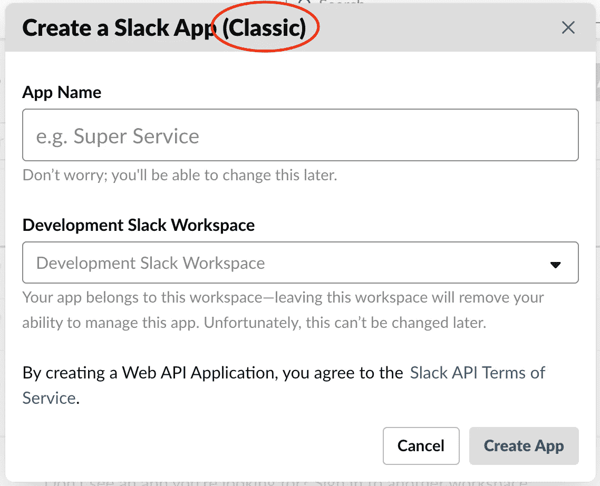
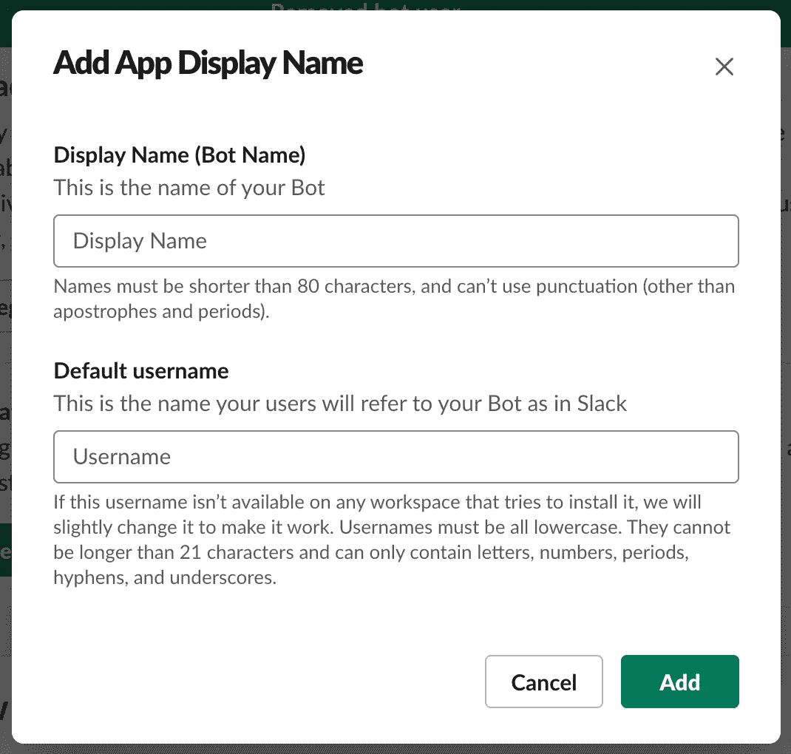
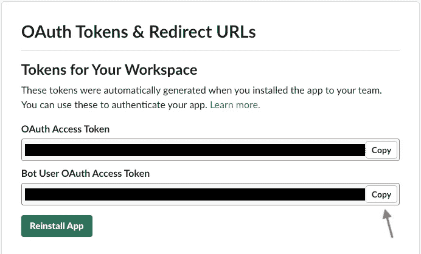
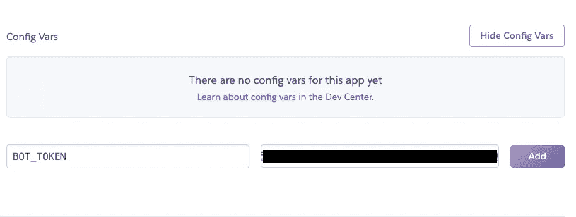
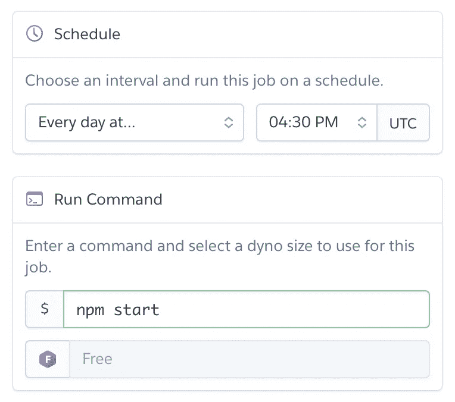
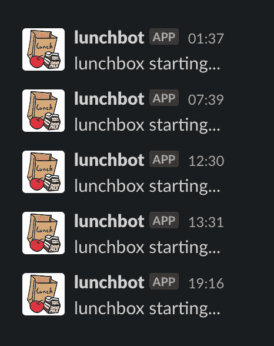
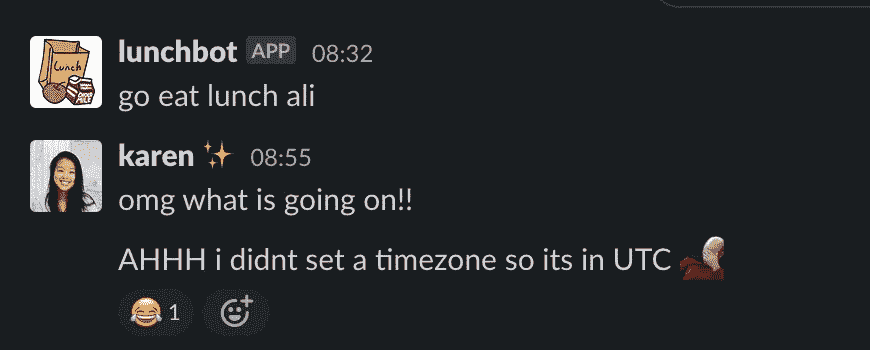

# 从头开始用一个 Slack Bot 惹恼(或打动)你的同事

> 原文：<https://levelup.gitconnected.com/annoy-or-impress-your-coworkers-with-a-slack-bot-made-from-scratch-43753e33e7cc>

*亦作* [*发表*](https://www.blog.karenying.com/posts/annoy-or-impress-your-coworkers-with-a-slack-bot-from-scratch)*[*【blog.karenying.com】*](https://www.blog.karenying.com/)*。**

**

*照片来自 [Unsplash](https://unsplash.com/photos/itSX0YT9TiU)*

*我的同事阿里总是在工作的时候忘记吃午饭。因为我们是远程工作，我想要某种自动提醒信息来联系他。我没有使用 Slack 的原生无代码解决方案 [Slack reminders](https://slack.com/help/articles/208423427-Set-a-reminder) ，而是决定从头构建并部署一个，因为# QuarantineBoredom。*

*像任何有理性的人一样，我在谷歌上搜索了“slack bot 教程”，“如何从头开始构建 slack bot”，并在深入研究之前阅读了大量教程。我对一个 **Node.js 实现**感兴趣，因为这是我最熟悉的。我还想要一个相对简单的配置，不需要我创建 10 个不同的帐户。*

*我最终选定了这个来自[自由代码营](https://www.freecodecamp.org/news/building-a-slackbot-with-node-js-and-slackbots-js/)的教程。这篇文章本质上是关于我如何利用 Bolaji Ayodeji 的实现并让它为我工作。我们将编写一个在预定时间发送消息的 slack 机器人。与 Ayodeji 的文章不同，**用户无法与这个 bot 进行交互。***

*这个帖子还会谈到我把它部署到 Heroku。大多数 Slack bot 教程都错过了这最后一步。他们表现得好像你每次想用它的时候都想在本地运行它🙄*

## *先决条件*

*本教程假设您对 Javascript、Node.js、npm 和 GitHub 有所了解。一切都好吗？我们开始吧👍🏼*

# *松弛配准*

*在我们开始编码之前，我们必须在 Slack 上注册我们的应用程序！*

**

*经典 Slack 应用*

*确保您已登录 Slack 并前往 [**创建 Slack 应用程序(经典)**](https://api.slack.com/apps?new_classic_app=1) 。**创建一个“经典”应用**至关重要，因为我们将要使用的 npm 包 [slackbots](https://www.npmjs.com/package/slackbots) 只能使用旧 Slack 应用 API 生成的令牌。如果你前往[https://api.slack.com/apps](https://api.slack.com/apps)并点击“创建新应用程序”，那么**将不会**工作。*

*输入你想要的应用程序名称(我称我的为“午餐机器人”)，然后选择你想要添加新应用程序的工作区。点击**创建应用**。*

*在**基本信息**页面，向下滚动到**显示信息。**这是好玩的部分！自定义你的机器人的外观。您也可以在以后执行/更改此操作。*

**

*机器人用户与您的工作空间进行交互*

*接下来，在**基本信息**页面的顶部，在**为 Slack 构建应用下，**展开**添加特性和功能**。选择**机器人**卡。我们希望我们的机器人能够发送消息，所以我们需要**添加传统机器人用户**。填写两个必填字段:**显示名称**和**默认用户名**。切换**总是显示我的机器人在线**为真。*

*回到**基本信息>构建应用**对于 Slack，展开**将应用安装到工作区**，点击**将应用安装到工作区**。点击**允许**。*

*现在转到你的 Slack workspace:[your-workspace-name]. Slack . com。在左侧面板，向下滚动直到你看到**应用**标题。点击右边的 **+** 图标，搜索刚刚创建的应用。点击你的应用程序，你应该看到它出现在**应用程序**标题下，显示在线状态！*

*太棒了，我们现在完成了这个松弛设置。到编码部分。*

# *编码*

## *正在设置*

*如前所述，我们将使用 Node.js 和 npm。我们稍后还希望集成 Heroku x GitHub，所以让我们从一个空目录开始*

```
*$ git init*
```

*接下来，我们必须初始化 npm:*

```
*$ npm init*
```

*继续按 enter 键，直到生成您的`package.json`。*

*我们将使用三个 npm 包: [slackbots](https://www.npmjs.com/package/slackbots) 、 [dotenv](https://www.npmjs.com/package/dotenv) 和 [node-cron](https://www.npmjs.com/package/node-cron) :*

```
*$ npm i slackbots
$ npm i dotenv
$ npm i node-cron*
```

**

*复制第二个令牌(不是第一个)*

*接下来，创建一个文件名`.env`。在这里，我们将存储 Slack 应用程序的授权令牌。返回到应用程序的配置页面。点击此[链接](https://api.slack.com/apps/)并找到您的应用。然后进入**功能> OAuth &权限**。我们想要复制 **Bot 用户 OAuth 访问令牌**。*

*在`.env`中，创建环境变量:*

*因为我们正在将这个项目推向 GitHub，所以保护您的授权令牌是一个很好的做法！dotenv npm 包允许我们使用我们的环境变量🙂*

*最后，让我们创建一个`index.js`并设置我们的包。这就是我们机器人所有逻辑的所在。*

*将启动脚本添加到`"scripts"`下的`package.json`:*

```
*"start": "node index.js"*
```

*这样就可以用`npm start`启动 bot 了。*

## *建造机器人*

*我们将使用 npm 软件包 slackbots。虽然你可以通过使用 [Slack API](https://api.slack.com/) 来构建一个 Slack bot，但是这个包会为我们处理所有的 API 调用。有了 slackbots，我们可以用不到 30 行代码编写我们的机器人。*

*要启动 bot，请执行以下操作:*

*确保名称属性**与您注册的应用名称**(不是 bot 用户名)完全匹配，包括大小写。*

*让机器人在启动时通知我们:*

*现在，如果你运行`npm start`，你应该得到通知，你的机器人正在启动！习惯这一点，因为你会经常看到这条消息😅*

**

*耶连接成功了！*

*现在，我们想安排我们的机器人在特定的时间发送消息。你可以在 slackbots 的 npm 页面查看所有 slack bots 的方法。具体我们要的是`postMessageToChannel`。我发现为了让`postMessageToUser`工作，用户必须将应用程序添加到他们的工作区(并让它显示在**应用程序**下)。因此，我们可以通过将你的同事添加到你的机器人发布的群中来给他们惊喜，而无需他们添加应用程序！*

*为了确保消息在正确的时间发送，我们将使用 node-cron npm 包。调度器语法可以在[这里](https://www.npmjs.com/package/node-cron)找到。我将这个逻辑模块化到另一个名为`createJob`的函数中。这是我最后为我的机器人添加的内容:*

*`'32 12 * * 1–5'`表示此消息将在每个工作日的下午 12:32 发送，正好赶上午餐时间！请确保添加您的时区，因为如果没有此配置，node-crone 将以 UTC 运行。[这个](https://raw.githubusercontent.com/node-cron/tz-offset/master/generated/offsets.json)是节点代码接受的所有有效时区字符串的列表。*

*最后一块是在 bot 启动时调用`createJob`:*

*就是这样！您刚刚用不到 30 行代码创建了自己的 slack bot🎉如果你愿意的话，你可以改变消息应该何时发送/发送给谁，以进行更多的测试和试验。当你准备好了，把你的代码推到 GitHub repo，让我们部署到 Heroku！*

# *部署*

## *赫罗库*

*登录或创建一个 [Heroku](https://www.heroku.com/) 账户(免费)。在仪表盘上，点击**新建>创建新应用**。给你的应用命名，选择一个地区，点击**创建应用**。在**部署方式**下，选择 **GitHub** 。如果您还没有链接您的 GitHub 帐户，请链接。搜索你的机器人的回购，点击**连接**。*

**

*Heroku 配置变量*

*然后在**设置>配置变量>显示配置变量**下，输入`BOT_TOKEN`作为**键**和来自`.env`文件的相同值作为**值**。点击**添加**保存。*

*前往**展开>手动展开**并点击**展开分支**。几秒钟内，你应该得到你的机器人告诉你，你的机器人正在启动 pinged！非常刺激。*

## *Heroku 调度程序*

*如果你以前用过 Heroku，你会知道他们的免费层有局限性:即你的应用程序在 [30 分钟不活动](https://devcenter.heroku.com/articles/free-dyno-hours)后“进入睡眠”。这将是很好的，除了我们的应用程序没有前端。除非您每次都手动部署应用程序，否则在最初的 30 分钟后，它将永远处于睡眠状态。这就是 Heroku 调度程序的用武之地。*

*在 lunchbot 的例子中，我们只希望 lunchbot 在每个工作日的中午 12:32 之前醒来，这样 cron 作业就可以开始工作并发送消息。*

**

*在你应用的 Heroku 仪表盘上，进入**资源>附加组件**，搜索并选择 **Heroku 调度器**。点击**供应**。*

*Heroku 调度程序应出现在**附加组件**下。单击名称，它应该会将您重定向到调度程序的仪表板。点击**创建工单**。输入您希望应用程序启动的频率。对我来说，选择每天下午 4:30 UTC 的**是有意义的。我们希望调度程序运行的命令是`npm start`,所以一定要输入它。点击**保存作业**，您就可以开始了！***

*有了 Heroku Scheduler，我们已经解决了应用程序休眠的自由层问题。警告是不能保证 Heroku 调度程序按时执行。创建作业时，有一个免责声明*作业在尽可能接近计划的时间窗口内运行*。在我使用 lunchbot 的经验中，有时作业直到 2 小时后才执行。然后，我们的 cron 作业不再工作，我们的机器人无法通知阿里吃午饭☹️不幸的是，这只是使用 Heroku 免费的后果。*

***另一个注意事项**:虽然 Heroku 声称你的应用程序在 30 分钟不活动后会进入睡眠状态，但 Heroku 也会相当频繁地随机启动你的应用程序:*

**

*这是怎么回事*

*如果你不想被你的机器人发送垃圾邮件，你应该删除给你自己的启动信息。*

*总之耶！你有一个功能正常的机器人。下面我列出了一些棘手的事情，如果你遇到了麻烦，可以检查一下。这也是我对午餐机器人的 GitHub 回购。*

# *解决纷争*

**

*我不知道 node-cron 默认是 UTC*

*对于这些问题，✅的答案应该是肯定的*

*   *你确定要打造一款[经典 Slack app](https://api.slack.com/apps?new_classic_app=1) 了吗？*
*   *你的机器人会出现在**应用**下吗？*
*   *你是否在`cron.schedule()`中设置了一个[时区](https://raw.githubusercontent.com/node-cron/tz-offset/master/generated/offsets.json)？*
*   *你在`new SlackBot()`中使用了你的应用的准确名称吗？*
*   *你配置你的 Heroku 变量了吗？*
*   *您是否为 Heroku 调度程序作业设置了正确的 UTC 时间？*

# *结论*

*在这篇文章中，我们使用了几个 npm 包，用不到 30 行代码拼凑了一个 Slack bot。我们将应用程序部署到 Heroku，并使用 Heroku Scheduler 及时唤醒机器人，以发送每日消息。我以此为基础的教程更加深入地讲述了如何让你的机器人具有交互性。如果你对此感兴趣，一定要去看看。*

*这是我能给你的全部。去惹恼(或打动)你的同事😛*

*感谢阅读。编码快乐！*