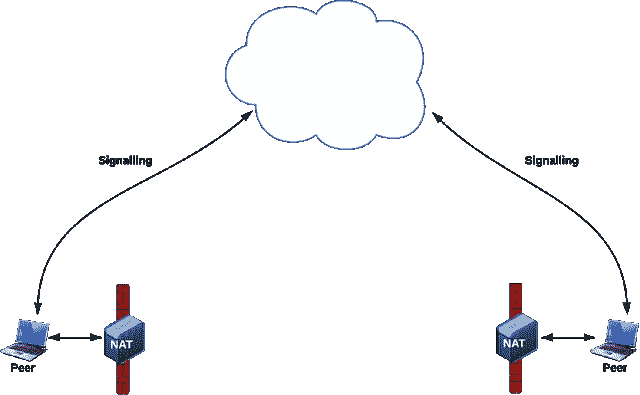
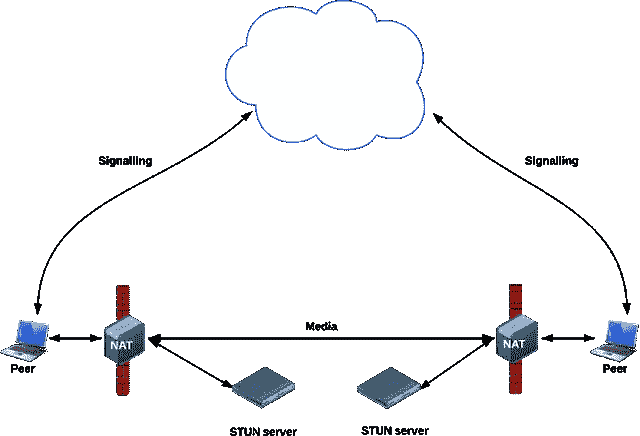
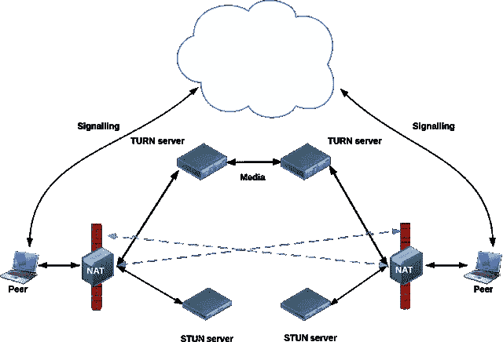

# 使用 WebRTC 进行匿名文件传输

> 原文：<https://levelup.gitconnected.com/anonymous-file-transfer-with-webrtc-f5e6d505770f>


WebRTC

# 介绍

回到 2016 年，我开发了一个名为 [ShareTC](https://github.com/Acrecio/sharetc) 的应用程序，它允许用户通过他们的网络浏览器使用 [WebRTC 技术](https://webrtc.org/)来**分享他们的文件。该应用程序运行良好，但承诺是能够在没有任何服务器的情况下共享文件。第一个版本使用了 [PeerJS](https://peerjs.com/) ，一个允许你实现 [WebRTC 数据通道](https://www.html5rocks.com/en/tutorials/webrtc/datachannels/)用于文件共享的库，但有一个缺点，它需要一个服务器用于所谓的[信令过程](https://www.html5rocks.com/en/tutorials/webrtc/infrastructure/)。因此，我对这个项目做了一些改进，允许用户共享他们的文件，甚至不需要使用信令服务器。**

对技术实现不感兴趣的可以直接看 GitHub 上的 [**演示。**](https://github.com/Acrecio/sharetc)

# 移民

最初，这个项目是原生 JavaScript 的准系统，但是我决定将它升级到 **Angular 8** ，因为交换信号配置有点复杂，我需要一些框架来方便 DOM 操作。

因为这是一个附带的项目，我不想重新创建一个组件库，所以我使用了 [@angular/material](https://material.angular.io/) 库作为表单和用户反馈。

我还使用了 [@angular/flex-layout](https://github.com/angular/flex-layout) 来轻松定义布局，因为我知道应用程序设计是非常基本的，因为它不是演示的主要目的。

# 它是如何工作的

现在，有趣的部分是，应用程序将尝试使用 WebRTC 在发送方和接收方之间创建一个数据通道。协议需要知道它应该向谁发送数据，这被称为[对等发现](https://developer.mozilla.org/en-US/docs/Web/API/WebRTC_API/Signaling_and_video_calling)，它可以通过所谓的 [**信令服务器**](https://github.com/peers/peerjs-server) 自动完成，在该服务器上，您可以交换您的配置以开始通信，这是我想要删除的组件。对于手动配置，我们使用[会话描述协议](https://en.wikipedia.org/wiki/Session_Description_Protocol)(或 SDP)。



会话描述协议

但是因为网络是复杂的，在某些情况下，你需要一个用于 NAT (或者 **STUN** ) **服务器**的[会话遍历工具。当你在一个](https://en.wikipedia.org/wiki/STUN)[网络地址转换](https://en.wikipedia.org/wiki/Network_address_translation)(或 **NAT** ) **防火墙**后面交换文件时，会用到这个。有一些公共服务器可以这样做:
—stun.services.mozilla.com
—stun.l.google.com:19302



NAT 的会话遍历实用程序

在其他一些情况下，通信信道将被防火墙阻断。在这种情况下，您最终可以使用 NAT (或 **TURN** ) **server** 周围的中继进行[遍历，这将作为您和对等方之间的数据中继。它们很贵，而且只有在您处于阻塞型防火墙之后时才有必要，所以我没有为此集成解决方案😊](https://en.wikipedia.org/wiki/Traversal_Using_Relays_around_NAT)



使用 NAT 周围的中继进行遍历

我们要做的是，生成发送方配置 SDP，需要与接收方共享。然后，接收方将能够生成他的 SDP 配置，发送方需要导入该配置以创建通信信道。然后，您将能够使用[数据报传输层安全性](https://en.wikipedia.org/wiki/Datagram_Transport_Layer_Security)(或 **DTLS** )发送文件，这是一个安全的通信通道。

# 如何让它发生

现在您已经有了 WebRTC 通信方案，让我们来看看项目中一些有趣的部分。你可能想打开代码来更好地理解这部分，通过访问项目库【https://github.com/Acrecio/sharetc。

首先，我选择使用伟大的[**feross/simple-peer**](https://github.com/feross/simple-peer)**库**作为 WebRTC 的通信通道。要使用该库，我们必须将一些 polyfills(检查 polyfills.ts)添加到项目中，用于全局、流程和缓冲区对象，如下所示:

```
**(**window as any**).**global **=** window**;**
**(**window as any**).**process **=** **{**
    nextTick**:** setImmediate**,**
    env**:** **{** DEBUG**:** **undefined** **},**
**};**
**(**window as any**).**global**.**Buffer **=** **(**window as any**).**global**.**Buffer **||** require**(**'buffer'**).**Buffer**;**
```

如果您使用的是 typescript，您可能还需要通过修改您的 *tsconfig.app.json* 文件来添加本机模块的节点声明:

```
"types"**:** **[**
  "node"
**],**
```

我还决定**使用[基于 LZ 的压缩](https://github.com/pieroxy/lz-string)来压缩 SDP 配置**，这样更容易共享。这就是配置看起来更像这样的原因:

```
N4IgLgngDgpiBcID2AzFMBOIA0IDOAJlAiAG4C8ADADobUB2S5AtkgF4CWANlwIYB0ggCoAJAJIBlAPqSpEgCIAFAIIAlIcoC0Adkr89ARgAEBgEwAWSuYCcZ7dZsAOc6e2Ptpo5SNiAcj8VzL30Qmjp6PHJNWgYwKi8Y**+**l5yPBh6AgwYAGNSROSUDnoAc0woDEKweDwAC15NUwBWADYjJuV4JoaO63gAZgAxeEcm**+**ABRAGF4bXN4W3h5Qf7JxvhzLoNBptGxyYbt0ZGG9tH5eGVtpp63eH7KVZ7lRzGDeHG769M7**+**Rf5O4AhUZ5chFDBIACuUHgfwAqr55AAZUYJcLJZh4DgETSpZi8ehgDhZeAAdQAshIjAAqRLMci8KBQLgE3j4pD0IwNRyOUwtaFKAD08iE8IkfIk4yEiiMAHcYAAjDBgLKaAjM3hZWr0egwLiJLLkPwBILWPTG**-**iNfgGXqOIFZXEEDHMmDwbzGXmS0xmUyNRrmXomPR6UwWhpGXraXq2IyQKBGapIPBgG12h1gJ1**+4**xCcbugyUBoNCzmez**+**kJBgwh6xR6Cx**+**NgKNZKDRmBGNX40gwJPpFNO4yupQmJrDXOmYZ**+02**m82WxzszncysxvAYFBcAAeRgwvAIGWLgeDa6gSAVofDtiBqXSmRyQLSmNQmltnZVqbwQIJME0UClBCm9m0TVzsosUwshgbRZRgdx7GaAhZQIT4slMFAAJfYDNDBFB1yKeAGmsD0DHA3ogWYDFnVPGAwAheAWygXg8GfFEUiyMAoHfA9KgaSgOMI3hl00ZgYFo3gSixDg2G7Shw2mAwuQI8IQAAXyAA
```

但是通过解压缩，你会得到一个有效的 SDP 信号消息。

最后，为了发送和下载文件，我们使用了 [JavaScript 文件 API](https://www.html5rocks.com/en/tutorials/file/dndfiles/) ，这样我们就可以通过数据通道发送它。事情是这样的，数据将被存储为一个 [**ArrayBuffer**](https://developer.mozilla.org/fr/docs/Web/JavaScript/Reference/Objets_globaux/ArrayBuffer) ，所以我们通过一个 Blob 为要下载的文件生成一个下载链接，文件名为 file.dat，正如你在` *download.component.ts`* 中看到的。

为了通过通信数据通道交换消息，我们还需要使用以下函数将 ArrayBuffer 转换为 string:

```
**function** ab2str**(**buf**:** ArrayBuffer**):** string **{**
  **return** String**.**fromCharCode**.**apply**(null,** **new** Uint16Array**(**buf**));**
**}**
```

可以在` *upload.component.ts`* 中查看如何使用。

# 演示

因为您必须在发送文件之前交换 **SDP 配置**并创建数据通道，所以应用程序要稍微复杂一些。因此，要使用演示应用程序，您需要:

1.发送您的发送者配置
2。接收者将进入您的配置并点击连接(它连接到发送者)
3。接收者将与发送者分享他生成的配置。然后发送者点击连接创建数据通道
5。双工流已启动并正在运行

# 结论

要得到我想要的应用程序，这是一条漫长的道路。允许用户在没有任何服务器的情况下安全地共享他们的文件，但除了网络复杂性之外，我真的很高兴实现了这一点。

如果您需要软件开发或教学，可以在 github 资源库 [acrecio/sharetc](https://github.com/Acrecio/sharetc) 和[保持联系](https://acrecio.com/contact)上查看项目源代码😊