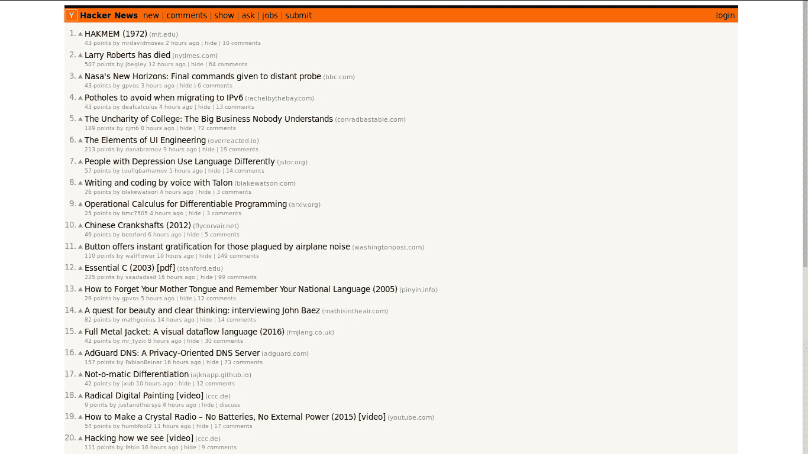

# 使用 Node.js、Tor、木偶师和 cheerio 进行匿名网络抓取

> 原文：<https://levelup.gitconnected.com/anonymous-web-scrapping-with-node-js-tor-apify-and-cheerio-3b36ec6a45dc>


拥抱 Tor 和 Node.js 的力量来匿名抓取网页。—[印度瑜伽士](https://unsplash.com/photos/S2eX-jJSiOM?utm_source=unsplash&utm_medium=referral&utm_content=creditCopyText)在 [Unsplash](https://unsplash.com/search/photos/calm?utm_source=unsplash&utm_medium=referral&utm_content=creditCopyText) 拍摄的照片

网络抓取是从网站中提取数据的技术。该术语通常用于自动数据提取。今天，我将向你展示如何匿名抓取网站。你想要隐藏你的身份的原因是由于许多网络服务器对网站应用规则，在一定数量的连续请求后禁止 IP。我们将使用[木偶师](https://github.com/puppeteer/puppeteer)访问网页，使用 [cheerio](https://github.com/cheeriojs/cheerio) 解析 HTML，使用 [Tor](https://www.torproject.org/) 从不同的 IP 地址运行每个请求。

> 虽然网页抓取的法律方面各不相同，有许多灰色地带，但请记住始终遵守您抓取的每个网页的服务条款。本·伯纳德写了一篇关于这些法律问题的好文章。

# 设置 Tor

首先，我们必须使用下面的命令安装 Tor 客户机。

```
sudo apt-get install tor
```

# 配置 Tor

接下来，我们将配置我们的 Tor 客户端。默认 Tor 配置使用一个 [SOCKS](https://en.wikipedia.org/wiki/SOCKS) 端口，为我们提供一个通往单个出口节点(即一个 IP 地址)的电路。这对于日常使用很方便，比如浏览，但对于我们的特定场景，我们需要多个 IP 地址，这样我们就可以在抓取时在它们之间切换。

为此，我们将简单地打开额外的端口来监听 [SOCKS](https://en.wikipedia.org/wiki/SOCKS) 连接。这是通过在主配置文件的`/etc/tor`下添加多个`SocksPort`选项来实现的。

用你喜欢的编辑器打开`/etc/tor/torrc`文件，并在文件末尾添加下一行。

这里有几点需要注意:

*   每个`SocksPort`的值是一个数字，Tor 将监听来自 SOCKS 应用程序(如浏览器)的连接。
*   因为`SocksPort`值是一个要打开的端口，该端口一定没有被另一个进程使用。
*   初始端口以值`9050`开始。这是 Tor 客户端的默认 SOCKS。
*   **我们绕过**值`**9051**`。Tor 使用此端口来允许连接到此端口的外部应用程序控制 Tor 进程。
*   作为一个简单的约定，为了打开更多的端口，我们在`9051`后面的每个值加 1。

重启 tor 客户端以应用新的更改。

```
sudo /etc/init.d/tor restart
```

# 创建新的节点项目

为你的项目创建一个新目录，我称之为`superWebScraping`。

```
mkdir superWebScraping
```

导航到`superWebScraping`并初始化一个空节点项目。

```
cd superWebScraping && npm init -y
```

安装所需的依赖项。

```
npm i --save puppeteer cheerio
```

# 使用木偶师浏览

[木偶师](https://github.com/puppeteer/puppeteer)是一个[无头浏览器](https://developers.google.com/web/updates/2017/04/headless-chrome)，它使用 [DevTools 协议](https://chromedevtools.github.io/devtools-protocol/)与 [Chrome](https://www.google.com/chrome/) 或[Chrome](https://www.chromium.org/)进行通信。我们之所以不使用请求库，比如 [tor-request](https://www.npmjs.com/package/tor-request) ，是因为请求库无法处理动态加载内容的 SPA 网站。

创建一个`index.js`文件并添加下面的脚本。语句被内联记录。

使用运行脚本

```
node index.js
```

您应该会看到 Chromium 浏览器导航到[https://api.ipify.org](https://api.ipify.org)，如下图所示


我在示例中选择特定的 web 页面是有原因的。https://api.ipify.org 能够把我们的公共 IP 地址发给我们。这是你正在浏览网页的 IP，没有使用 Tor。

通过在`puppeteer.launch`语句中添加以下键来更改上述代码:

我们为浏览器提供了 `--proxy-server`参数。这个参数的值告诉浏览器在我们本地机器的端口`9050`上使用 socks5 代理。端口的值是我们之前在`torrc`文件中提供的值之一。

现在再次运行脚本。

```
node index.js
```

这一次，您应该会看到一个不同的 IP 地址。这是 Tor 电路自带的 IP。


我的是`144.217.7.33`，但你可能有一个不同的。请注意，如果您在同一个端口`9050`上再次运行该脚本，您将获得与之前相同的 IP 地址。


这就是我们在 Tor 配置中开放许多端口的原因。尝试使用另一个端口，比如`9053`。IP 将不会相同。

# 勉强满足于麦片

现在我们有了一个很好的方法来获取我们的页面，是时候刮它们了。我们将使用 cheerio 库。Cheerio 是一个 HTML 解析器，设计用来使用与 jQuery 相同的 API。我们的任务是刮掉[黑客新闻](https://news.ycombinator.com/)的最后 5 个帖子标题。

让我们导航到[黑客新闻](https://news.ycombinator.com/)。



我们想刮前 5 个标题(“哈克姆(1972)，“拉里·罗伯茨已经去世”，等等)。使用我的浏览器的 DevTools 检查一篇文章的标题，我可以看到每篇文章都用一个 HTML link 元素包装，这个元素有`storylink`类。


我们要遵循的程序可以用下面的列表来表示:

*   使用 Tor 代理以无头模式启动浏览器实例
*   创建新页面
*   导航到[https://news.ycombinator.com/](https://news.ycombinator.com/)
*   获取页面 HTML 内容
*   在 Cheerio 中加载 HTML 内容
*   创建一个数组来保存文章标题。
*   访问所有拥有`storylink`类的元素
*   使用 Cherrio 的 [slice()](https://cheerio.js.org/#slice-start-end-) 方法，只获得前 5 个这样的元素。
*   使用 Cherrio 的 [each()](https://cheerio.js.org/#each-functionindex-element-) 方法迭代这 5 个元素。
*   在数组中添加每篇文章的标题。

这是上面代码的输出。


# 不同 IP 的连续刮擦

最后要考虑的是利用我们在 torrc 文件中定义的所有 SOCKS 端口。这很容易。我们将定义一个数组，每一项都是不同的端口号。然后我们将把`main()`重命名为`scrape()`,我们将定义一个新的`main()`函数，每次用不同的端口调用`scrape()`。

这是完整的代码。

# 结论

这篇文章旨在为你提供一个温和的网络抓取的介绍。谢谢你花时间阅读它。🙏