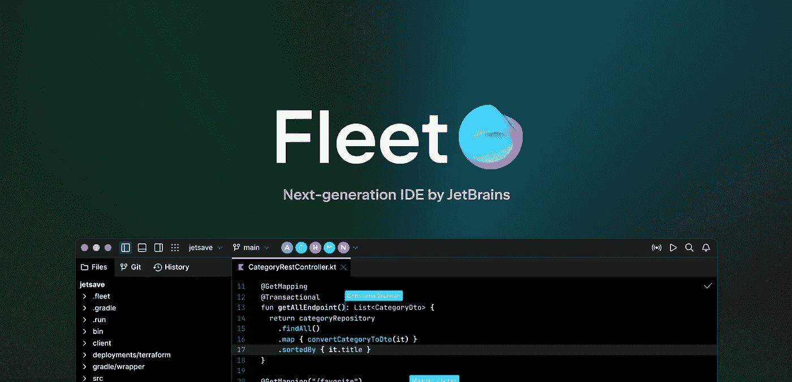

# 推翻 VS 代码的又一次尝试:JetBrains Fleet

> 原文：<https://levelup.gitconnected.com/another-attempt-to-overthrow-vs-code-jetbrains-fleet-6d96bd835b89>

## Web 开发技巧

## VS Code 的市场份额正以闪电般的速度增长。JetBrains 能够阻止它并主导市场吗？

Fleet 是 JetBrains 开发的下一代、轻量级、初学者和专家友好的 IDE。

JetBrains 是一家为开发者提供各种集成开发环境(IDE)和工具长达 20 多年的公司。它有一个专门的 IDE，用于这个领域中几乎所有主要的编程语言。无论您的目标平台是什么，这些 ide 都使开发过程完美无瑕。ide 提供了代码重构和完成、强大的调试和测试工具、语法突出显示以及更多的特性…

有一段时间，JetBrains IDEs 是所有级别程序员的首选工具。他们向最终用户提供了所有需要的功能。然而，丰富的特性导致了长时间的启动。基于项目的复杂性，有时你不得不连续等上 5 分钟，这很烦人。

然而，2016 年，一个新玩家进来了:Visual Studio Code。它是微软的文本编辑器，而不是 IDE。那么类似记事本的简单文本编辑器是如何占领市场的呢？答案是插件。VS Code 的方法是向用户提供最简单的文本编辑器，如果用户需要任何功能，可以通过插件添加该功能。因此，举例来说，一个甚至不知道什么是测试的初学者，不会处理测试工具和它们复杂的 UI。

相比之下，由于这种方法，VS 代码的启动时间非常短，UI 也更加直观。尽管如此，VS 代码提供的特性和 JetBrains IDEs 一样丰富。最重要的是，与 JetBrains IDES 不同，VS 代码是开源和免费的。这就是为什么开发人员逐渐开始采用 VS 代码而不是 JetBrains IDEs。然而，JetBrains 并不愿意退却。这里有一个全新的 VS 代码竞争者:Fleet。

# 什么是舰队？

Fleet，发音为/fliːt/，是 JetBrains 针对 VS 代码提供的开发者工具。借助这个工具，JetBrains 试图重新获得近年来对微软失去的兴趣。Fleet 既不是文本编辑器，也不是 IDE，而是两者同时存在。Fleet 采用的方法是替换 IDE 的所有弱点，并采用其强大的方面。

正如我提到的，Fleet 是 VS 代码的竞争者，它是一个文本编辑器。所以，它必须和 VS 代码一样快。Fleet 处理这种情况的方法相当聪明。它有两种模式:一种用于文件中的快速编辑(编辑器模式)，另一种用于高级用例(智能模式)。

## 编辑模式🖋

这是舰队下水时的模式。它非常简约，没有语言引擎在后台工作，但它提供了基本的语法高亮显示。这使得它可以立即启动，这样您就可以开始处理您的项目，而无需等待其他服务启动。此外，轻模式舰队的能力可以使用插件来增强。

编辑器模式的极简结构使得 Fleet 具有难以置信的响应能力和速度。

## 智能模式🧠

在 Fleet 上启用智能模式就像给文本编辑器添加了大脑和推理能力。它使用传统的 ide 引擎来提供像自动完成、代码重构和其他需要强大功能的特性。一旦你启用了它，在后台运行代码引擎需要一段时间，但是一旦它运行了，你的文本编辑器就会变成一个强大的 JetBrains IDE。

智能模式在用户需要时为 Fleet 添加了完整的 IDE 功能。

与传统的 IDE 不同，它将文本编辑器和 IDE 引擎分开，由用户决定何时启动代码引擎。因此，对于快速编辑，没有必要等待几分钟。

# 会不会是 VS 代码的终结？

这是一个不可避免的问题。答案有点模糊，因为舰队提供的是两个世界的最佳选择。这意味着它的目标群体比 VS 代码更大，如果它成功地交付了它所介绍的内容，那么它有很小的机会成为大多数人的首选工具。然而，就目前而言，它仍处于早期阶段。VS 代码背后的社区非常庞大，每天都有新的插件来简化工作流程。我知道这种丰富有时意味着垃圾，但垃圾中仍有钻石。这就是为什么我不认为 Fleet 会很快取代 VS 代码，但如果它玩得有策略，并利用背后的力量，JetBrains 这是一个强有力的候选。

一旦我在我的电脑上体验了 Fleet 的全部潜力，我将会对此有更好的理解并据此写作。所以，等续集吧。如果你喜欢这篇文章，一定要鼓掌，并在回复部分让我知道你对舰队的看法。下一个故事再见。

## 更新

大家好，我终于尝试了新的 JetBrains IDE，Fleet。以下是我对此的见解。确保你检查过了。

 [## JetBrains 的新 IDE: Fleet 上的真实体验

### JetBrains 试图通过 Fleet 保持与 VS 代码的竞争。它会成功还是会被遗忘在…

medium.com](https://medium.com/fractions/real-life-experience-on-jetbrains-new-ide-fleet-5dde41b90a75) 

订阅获得你的**免费*订户专属*** 故事。

喜欢看这样的故事，想支持我当作家？考虑[报名成为媒介会员](https://candurmuss.medium.com/membership)。每月 5 美元，你可以无限制地阅读媒体上的故事。如果你用我的链接注册，我会赚一点佣金。

 [## 通过我的推荐链接加入 Medium-Can dur mus

### 作为一个媒体会员，你的会员费的一部分会给你阅读的作家，你可以完全接触到每一个故事…

candurmuss.medium.com](https://candurmuss.medium.com/membership) 

## 进一步阅读

 [## 3 个 Visual Studio 代码提示来改进您的工作流程

### VS 代码是一个万能的工具，只要你知道如何使用它。

medium.com](https://medium.com/fractions/3-visual-studio-code-tips-to-boost-your-workflow-b107ec573d75)  [## 如何用 JSX 创建 Web 服务器

### 让我们把纯 JSX 和 Express 结合起来。你不会相信开发者的体验

better 编程. pub](https://betterprogramming.pub/how-to-create-a-web-server-with-jsx-1b3da3704502)  [## 7 个必须知道的网站来提升你的前端

### 简单而有用的网站，你会每天使用

better 编程. pub](https://betterprogramming.pub/7-must-know-websites-to-boost-your-frontends-b3ea0bb282e6)